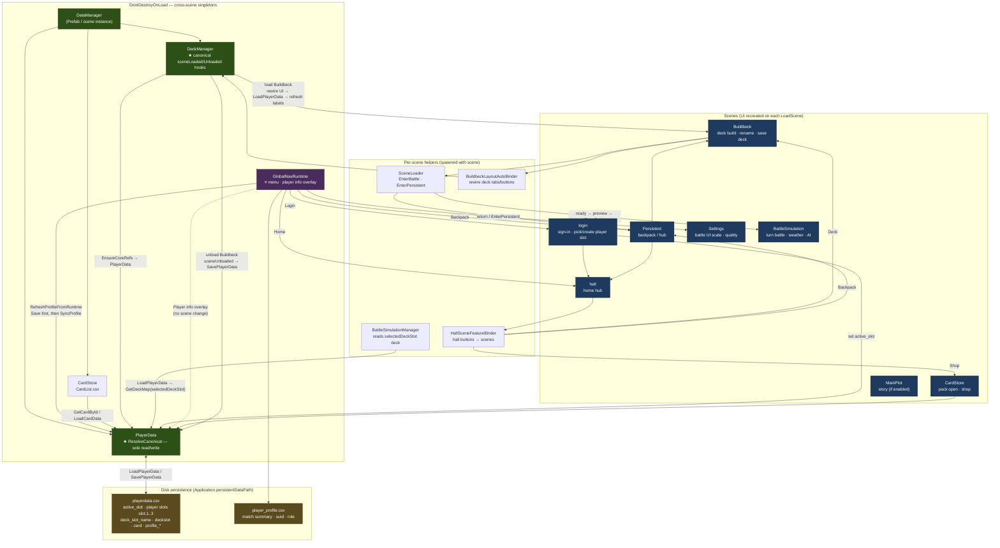

# Project Architecture Overview

> **DataManager / PlayerData / scene flow** (single-page overview)  
> Implementation anchors: `PlayerData.ResolveCanonical()`, canonical `DeckManager`, `SceneLoader`, `GlobalNavRuntime`, `HallSceneFeatureBinder`

---

## Legend

| Block | Meaning |
|-------|---------|
| **DDOL** | `DataManager` survives scene loads; `PlayerData` owns save data; only the canonical `DeckManager` registers global scene callbacks |
| **Scenes** | Scene UI is destroyed on switch; entering Buildbeck requires `BuildbeckLayoutAutoBinder` + `CoReloadBuildbeckDeckUi` to rebind controls |
| **playerdata.csv** | Deck display names (`deck_slot_name`), five deck slots (`deckslot`), coins, collection, etc. See [DECK_SAVE_IMPLEMENTATION.md](./DECK_SAVE_IMPLEMENTATION.md) |

## Main scene routes

| From | Action | To |
|------|--------|-----|
| login | Sign-in success | hall |
| hall | Deck | Buildbeck |
| hall | Backpack | Persistent |
| hall | Shop | CardStore |
| Buildbeck | Back | Persistent (`SceneLoader.EnterPersistent`) |
| Buildbeck | Battle ready | BattleSimulation (via preview modal) |
| Any (≡ menu) | Home / Settings / Login | hall / Settings / login |
| Any (≡ menu) | Player info | **Overlay** (same scene); triggers `SavePlayerData` |

## Save / load timing (summary)

- **Write**: save deck, switch deck slot, confirm rename, leave Buildbeck, open player info, `PlayerProfileCsvService.RefreshProfileFromRuntime`
- **Read**: `PlayerData.Awake`, Buildbeck UI reload, hall resource bar, `EnterBattle` (forces disk read before battle)
- **Avoid stale overwrite**: after rename / save deck, call `SceneLoader.RefreshEnterBattleState(false)`

## Related docs

- [DIFFICULTY_AND_AI_DESIGN.md](./DIFFICULTY_AND_AI_DESIGN.md) — battle difficulty tiers and enemy AI (report chapter)
- [ENEMY_AI_DECISION_TREE.md](./ENEMY_AI_DECISION_TREE.md) — detailed play decision tree
