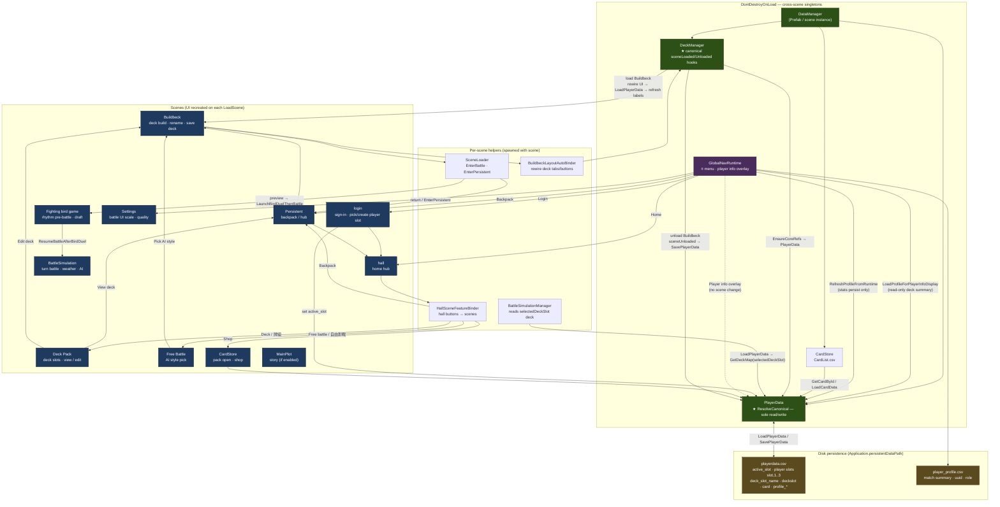

# Project Architecture Overview

> **DataManager / PlayerData / scene flow** (single-page overview)  
> Implementation anchors: `PlayerData.ResolveCanonical()`, canonical `DeckManager`, `SceneLoader`, `GlobalNavRuntime`, `HallSceneFeatureBinder`

```mermaid
flowchart TB
    subgraph PERSIST["Disk persistence (Application.persistentDataPath)"]
        PD_CSV["playerdata.csv<br/>active_slot · player slots slot,1..3<br/>deck_slot_name · deckslot · card · profile_*"]
        PROF_CSV["player_profile.csv<br/>match summary · uuid · role"]
    end

    subgraph DDOL["DontDestroyOnLoad — cross-scene singletons"]
        direction TB
        DM["DataManager<br/>(Prefab / scene instance)"]
        PD["PlayerData<br/>★ ResolveCanonical — sole read/write"]
        DMGR["DeckManager<br/>★ canonical sceneLoaded/Unloaded hooks"]
        CS["CardStore<br/>CardList.csv"]
        GNR["GlobalNavRuntime<br/>≡ menu · player info overlay"]

        DM --> PD
        DM --> DMGR
        DM --> CS
    end

    subgraph SCENES["Scenes (UI recreated on each LoadScene)"]
        LOGIN["login<br/>sign-in · pick/create player slot"]
        HALL["hall<br/>home hub"]
        DECKPACK["Deck Pack<br/>deck slots · view / edit"]
        FREEBATTLE["Free Battle<br/>AI style pick"]
        BUILD["Buildbeck<br/>deck build · rename · save deck"]
        PERS["Persistent<br/>backpack / hub"]
        STORE["CardStore<br/>pack open · shop"]
        SET["Settings<br/>battle UI scale · quality"]
        BIRD["Fighting bird game<br/>rhythm pre-battle · draft"]
        BATTLE["BattleSimulation<br/>turn battle · weather · AI"]
        PLOT["MainPlot<br/>story (if enabled)"]
    end

    subgraph HELPERS["Per-scene helpers (spawned with scene)"]
        SL["SceneLoader<br/>EnterBattle · EnterPersistent"]
        BINDER["HallSceneFeatureBinder<br/>hall buttons → scenes"]
        BBB["BuildbeckLayoutAutoBinder<br/>rewire deck tabs/buttons"]
        BSM["BattleSimulationManager<br/>reads selectedDeckSlot deck"]
    end

    %% --- Data flow ---
    PD <-->|"LoadPlayerData / SavePlayerData"| PD_CSV
    GNR -->|"LoadProfileForPlayerInfoDisplay<br/>(read-only deck summary)"| PD
    GNR -->|"RefreshProfileFromRuntime<br/>(stats persist only)"| PD
    GNR --> PROF_CSV

    CS -->|"GetCardById / LoadCardData"| PD
    DMGR -->|"EnsureCoreRefs → PlayerData"| PD
    BSM -->|"LoadPlayerData → GetDeckMap(selectedDeckSlot)"| PD

    %% --- Boot & navigation ---
    LOGIN -->|"set active_slot"| PD
    LOGIN --> HALL

    HALL --> BINDER
    BINDER -->|"Deck / 牌組"| DECKPACK
    BINDER -->|"Free battle / 自由對戰"| FREEBATTLE
    BINDER -->|"Backpack"| PERS
    BINDER -->|"Shop"| STORE
    DECKPACK -->|"View deck"| PERS
    DECKPACK -->|"Edit deck"| BUILD
    FREEBATTLE -->|"Pick AI style"| BUILD

    GNR -->|"Home"| HALL
    GNR -->|"Backpack"| PERS
    GNR -->|"Settings"| SET
    GNR -->|"Login"| LOGIN
    GNR -.->|"Player info overlay<br/>(no scene change)"| PD

    BUILD --> SL
    BUILD --> BBB
    BBB --> DMGR
    SL -->|"return / EnterPersistent"| PERS
    SL -->|"preview → LaunchBirdDuelThenBattle"| BIRD
    BIRD -->|"ResumeBattleAfterBirdDuel"| BATTLE

    PERS --> HALL
    PERS --> BUILD
    STORE --> PD

    %% --- Buildbeck lifecycle ---
    DMGR -->|"unload Buildbeck<br/>sceneUnloaded → SavePlayerData"| PD
    DMGR -->|"load Buildbeck<br/>rewire UI → LoadPlayerData → refresh labels"| BUILD

    %% Styles
    classDef core fill:#2d5016,stroke:#1a3009,color:#fff
    classDef scene fill:#1e3a5f,stroke:#0f1f33,color:#fff
    classDef disk fill:#5c4a1f,stroke:#3d3014,color:#fff
    classDef nav fill:#4a2c5c,stroke:#2e1a3a,color:#fff

    class PD,DM,DMGR core
    class LOGIN,HALL,DECKPACK,FREEBATTLE,BUILD,PERS,STORE,SET,BIRD,BATTLE,PLOT scene
    class PD_CSV,PROF_CSV disk
    class GNR nav
```

---

## Legend

| Block | Meaning |
|-------|---------|
| **DDOL** | `DataManager` survives scene loads; `PlayerData` owns save data; only the canonical `DeckManager` registers global scene callbacks |
| **Scenes** | Scene UI is destroyed on switch; entering Buildbeck requires `BuildbeckLayoutAutoBinder` + `CoReloadBuildbeckDeckUi` to rebind controls |
| **playerdata.csv** | Deck display names (`deck_slot_name`), five deck slots (`deckslot`), coins, collection, etc. See [DECK_SAVE_IMPLEMENTATION.md](./DECK_SAVE_IMPLEMENTATION.md) |

## Main scene routes

| From | Action | To |
|------|--------|-----|
| login | Sign-in success | hall |
| hall | Deck / 牌組 | **Deck Pack** |
| hall | Free battle / 自由對戰 | **Free Battle** |
| hall | Backpack | Persistent |
| hall | Shop | CardStore |
| Deck Pack | View deck | Persistent（`DeckPackViewSession`：背包僅顯示該槽牌組；空槽 toast） |
| Deck Pack | Edit deck | Buildbeck（焦點該槽；**隱藏**「準備好了／準備完成」進戰鈕） |
| Free Battle | Pick AI style | Buildbeck（`FreeBattleViewSession` 帶入 AI 風格） |
| Buildbeck | Back | Persistent (`SceneLoader.EnterPersistent`) |
| Buildbeck | Battle ready | Fighting bird game → BattleSimulation（戰前預覽→鬥鳥→開戰；見 `SceneLoader.BirdDuel`） |
| Buildbeck（自由對戰） | 準備完成 | 難度預覽 → **70%** 隨機鬥鳥暖身 overlay → 可選鬥鳥 → 對戰（`SceneLoader.FreeBattle`） |
| Any (≡ menu) | Home / Settings / Login | hall / Settings / login |
| Any (≡ menu) | Player info | **Overlay** (same scene); **read-only** `LoadProfileForPlayerInfoDisplay`（不寫 `playerdata.csv`） |
| **Hub 白名單** | Deck Pack、Free Battle 等 | 場景名含 `battle`／`deck` 仍顯示 ≡（`GlobalNavRuntime.ApplySceneState` + 各 hub `RefreshActiveSceneNav`） |

## Save / load timing (summary)

- **Write**: save deck, switch deck slot, confirm rename (`PlayerDeckSlotNameStorage`), leave Buildbeck, profile stats update via `RefreshProfileFromRuntime`
- **Read-only UI**: open player info → `LoadProfileForPlayerInfoDisplay`（Buildbeck 關閉後 `RefreshBuildbeckDeckNameDisplayFromMemory`）
- **Read**: `PlayerData.Awake`, Buildbeck UI reload, hall resource bar, `EnterBattle` (forces disk read before battle)
- **Avoid stale overwrite**: after rename / save deck, call `SceneLoader.RefreshEnterBattleState(false)`

## Related docs

- [PLANNING_DOCS_INDEX.md](./PLANNING_DOCS_INDEX.md) — planning / GDD index (Chinese)
- [PLANNING_MASTER_TABLE.md](./PLANNING_MASTER_TABLE.md) — planning overview by domain
- [PLANNING_OPEN_ITEMS.md](./PLANNING_OPEN_ITEMS.md) — open design questions
- [LEVEL_DESIGN_GDD.md](./LEVEL_DESIGN_GDD.md) — level design (chapter 1-1)
- [Docs/鬥鳥手勢小遊戲企劃.md](./Docs/鬥鳥手勢小遊戲企劃.md) — pre-battle rhythm minigame (replaces puzzle unlock)
- [DIFFICULTY_AND_AI_DESIGN.md](./DIFFICULTY_AND_AI_DESIGN.md) — battle difficulty tiers and enemy AI (report chapter)
- [ENEMY_AI_DECISION_TREE.md](./ENEMY_AI_DECISION_TREE.md) — detailed play decision tree
