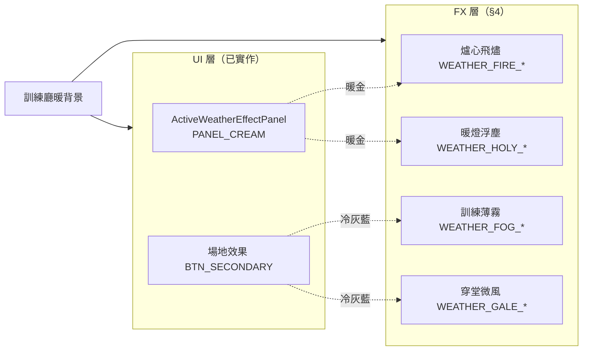

# 對戰場景特效配色規格（Battle Simulation FX）

| 項目 | 內容 |
|------|------|
| **狀態** | 已定案；**§3～§4** 所列 FX 均已實作（`BattleFxColors.cs`） |
| **場景** | `BattleSimulation`（`BattleSimulationDebugUI` 動態建立之全螢幕／暫態視覺） |
| **世界觀** | 學院魔法訓練廳（練習場對戰）— 與 `BATTLE_UI_COLOR_SPEC.md` 一致 |
| **關聯文件** | [`BATTLE_UI_COLOR_SPEC.md`](BATTLE_UI_COLOR_SPEC.md)（UI chrome，**已實作**） |
| **目標感受** | 特效「住在」暖木訓練廳裡：可感知魔法與天氣，但**不搶**背景、**不**像恐怖副本或霓虹街機 |
| **實作參考** | `BattleWeatherLabels.cs`、`BattleFxColors.cs`、`BattleSimulationDebugUI.cs`（`CreateWeatherScreenFx`） |

---

## 1. 範圍說明

### 1.1 為何另立特效規格

UI 規格（§1.2-B）刻意**排除**特效，以避免與面板改版互相牽制。實作 UI 後，全螢幕天氣 tint、純黑受傷暗角、螢光紅傷害閃光等**仍沿用舊調性**，與訓練廳暖背景與奶油 UI **色溫不一致**，造成「出戲」。

本規格專責：**動態、半透明、全螢幕或短暫覆蓋層**的配色與 alpha 預算。

### 1.2 背景錨點（與美術的關係）

| 項目 | 定案 |
|------|------|
| **場景背景 Sprite** | `戰鬥背景` 等美術資產**不在**本規格改色範圍 |
| **色溫錨點** | 以場景實際感受為準：**暖褐木質訓練廳、中低對比、偏黃環境光** |
| **程式錨點** | 特效 tint／暗角／閃光應向 UI 已採用之 **`DIM`（`#0A0305`）**、**`PANEL_MILK`**、**`DECK_TOP`**、**`BELL_GOLD`** 族靠拢，**禁止**預設 `RGB(0,0,0)` 或 `RGB(255,0,0)` 作大面積主色 |

### 1.3 本次包含（在範圍內）

| 類別 | 代表元件／方法 |
|------|----------------|
| **天氣全螢幕 FX** | `CreateWeatherScreenFx`、`CreateWeatherFxLayer`、`CreateHolyLightEdge`、`AddFogEdgeLayer`、`AddGaleNightLayer` 與各層粒子 Image |
| **英雄受傷回饋** | `EnsureHeroDamageMonochromeFlashOverlay`、`CoPlayHeroDamageMonochromeFlash`、`PlayDamageFlash`、`CoPlayPlayerHeroDamagedFeedback`、結算 `hurtColor` lerp |
| **法術演出遮罩** | `EnsureSpellCastOverlay` 全螢幕 dim（**面板字色**仍依 UI 規格，dim 屬 FX） |
| **開場骰子裝飾** | `CreateDicePipGrid`（點陣與骰面；**不含** `OpeningRollPanel` 面板底—屬 UI 規格） |
| **抽牌飛行** | `PlayDrawAnimationOnRight` 牌背幽靈 `Image` |
| **治療浮字** | 英雄治療 `+N` 浮動 TMP |
| **敵方凝視演出** | `GazeGlare`、眼球相關動態色（`BattleSimulationDebugUI` 內 gaze 區塊） |
| **場上戰鬥回饋（FX 層）** | `PlayDamageFlash` 用於場牌／英雄；**場牌 HP 數字變色**見 §1.4 |

### 1.4 邊界：與「卡牌區」的切分

| 項目 | 歸本規格 | 歸 UI 規格 | 備註 |
|------|----------|------------|------|
| 手牌／場牌 **本體** 美術、邊框、稀有度 | — | §1.2-A | 不改卡面插圖 |
| 場牌 **選取光暈**（`FieldCards.cs` halo） | **是** | — | 屬互動 FX，非靜態卡面 |
| 場牌 **HP 受傷數字色** | **是**（語意色） | — | 僅數字／閃爍，不改卡框 |
| 手牌 **長按棄牌 Fill** | — | §1.2-A | |
| `SpellCastPanel` 奶油底與標題字 | — | §1.3 | 面板 chrome 已用 `BattleUiColors` |
| `SpellCastOverlay` **全螢幕 dim** | **是** | — | 目前純黑，需改 |

### 1.5 明確排除（不適用本規格）

| 排除項目 | 說明 |
|----------|------|
| UI chrome | `BATTLE_UI_COLOR_SPEC.md` §1.3 已全部涵蓋 |
| 除錯／批次模擬 | `DebugBattlePanel`、`BattleAutoSimPlugin`、`fieldText` Rich 色 |
| 卡牌 prefab 預設 | `CardDisplay`、`battleCardPrefab` 靜態配色 |
| 場景背景圖 | 訓練廳 Sprite 本體 |
| 物理粒子系統 | 若未來改用 ParticleSystem，另開附錄 |

---

## 2. 設計原則（訓練廳融合）

### 2.1 三條硬規則

1. **暖色暗部取代純黑**  
   全螢幕暗角、受傷 vignette、法術 dim 使用 **`VIGNETTE_WARM` / `FX_DIM`**（基於 `#0A0305` 或 `#3D3835`），**不**使用 `alpha ≥ 0.75` 的 `(0,0,0)` 大面積色塊。

2. **低飽和、低 alpha 的天氣底**  
   全螢幕 weather base tint 維持 **α 0.03～0.11**；粒子／邊緣在 **α 0.08～0.22** 區間，**禁止**回到高飽和霓虹（現行火雨橘 `RGB(255,92,66)`、冷霧 `RGB(97,158,204)` 等）。

3. **傷害語意用「赭／珊瑚」不用「血紅」**  
   沿用 UI 規格 **`HURT_FLASH` `#C07060`** 與 **`FOE_HP` 語意**；**禁止** `RGB(255,38,38)`、`RGB(255,15,15)` 作 0.9 alpha 覆蓋層。

### 2.2 與 UI 色票共享

| 用途 | 優先引用 |
|------|----------|
| 奶油／金光 | `PANEL_MILK`、`BELL_GOLD`（`BattleUiColors`） |
| 我方／治療 | `ALLY_HP`、`ALLY_LABEL` |
| 敵方／警示語意 | `FOE_HP`、`FOE_LABEL`、`HURT_FLASH` |
| 冷色天氣／水霧 | `DECK_TOP`、`BTN_SECONDARY`、`BTN_SECONDARY_TEXT` |
| 深影／夜風 | `DECK_SHADOW`、`TURN_BG` |
| 全螢幕遮罩 | `DIM`、`DIM_HEAVY` |

程式實作時：`BattleFxColors` **可讀取** `BattleUiColors` 常數，僅為 FX 定義 **alpha 變體** 與 **混合色**，避免重複 hex。

### 2.3 天氣與 UI 的語意對齊

---

## 3. 特效 Design Tokens

> **命名**：`FX_` 前綴或 `WEATHER_` 前綴；實作類別建議 `BattleFxColors`。  
> **Unity**：表中 `Color` 為 **1.0 = 255** 之浮點 RGBA。

### 3.1 全域／受傷／遮罩

| 代號 | 名稱 | Hex（RGB） | 典型 Alpha | 語意 | 對應 UI Token |
|------|------|------------|------------|------|----------------|
| **FX_DIM** | 特效暖遮罩 | `#0A0305` | **0.50～0.55** | 法術全螢幕 dim 底色 | `DIM` |
| **VIGNETTE_WARM** | 暖色暗角 | `#1A1412` | **0.72～0.85** | 取代純黑 vignette 邊緣 | `DIM` 提亮 |
| **VIGNETTE_WARM_SOFT** | 暖角（側） | `#2A221E` | **0.65～0.78** | 左右暗角略淺 | 原創 |
| **HURT_FLASH** | 受傷閃色 | `#C07060` | **0.35～0.55** | HP 脈衝、短閃 | UI `HURT_FLASH` |
| **HURT_FLASH_PEAK** | 受傷覆蓋峰 | `#C07060` | **0.75～0.90** | `DamageFlashOverlay` 峰值 | 同上 |
| **HURT_MONO_PEAK** | 受傷去色閃 | `#3D3835` | **0.88～0.92** | 全螢幕「頓一下」；**非**純黑 | `TURN_BG` |
| **HEAL_FLOAT** | 治療浮字 | `#5F8F72` | **1.0**（字） | `+N` 浮動字 | `ALLY_HP` |
| **HEAL_GLOW_OUTER** | 治療外光暈 | `#5F8F72` | **0.18** | 初級治療場牌 FX | `HealGlowOuter` |
| **HEAL_GLOW_INNER** | 治療內光暈 | `#5F8F72` | **0.28** | 同上 | `HealGlowInner` |
| **FX_SHADOW** | 特效軟影 | `#000000` | **0.25～0.40** | 僅小元件；**不用**於全螢幕 | 低於 `SHADOW_UI` |

### 3.2 天氣全螢幕（base tint）

> **完整名稱、實作、色票對照表見 §4。** 下列為 Token 速查；程式 enum 仍為 `FireRain` 等，**規則不變**。

| 代號 | 室內名稱 | `BattleFxColors` 欄位 | Hex（RGB） | 程式 Base α |
|------|----------|----------------------|------------|-------------|
| **WEATHER_FIRE_BASE** | 爐心飛燼 | `WeatherFireBase` | `#E8BB6A` | **0.03** |
| **WEATHER_HOLY_BASE** | 暖燈浮塵 | `WeatherHolyBase` | `#FFF8E7`（`PANEL_MILK`） | **0.04** |
| **WEATHER_FOG_BASE** | 訓練薄霧 | `WeatherFogBase` | `#4A6B7C`（`DECK_TOP`） | **0.10** |
| **WEATHER_GALE_BASE** | 穿堂微風 | `WeatherGaleBase` | `#2E3542` | **0.09** |

### 3.3 天氣邊緣與粒子（Token 速查）

| 代號 | 用途 | Hex（RGB） | `BattleFxColors` | α 範圍 |
|------|------|------------|------------------|--------|
| **WEATHER_FIRE_DROP** | 飛燼粒 | `#D49458` | `WeatherFireDropRgb` → `RandomFireDrop()` | 0.17～0.32 |
| **WEATHER_HOLY_EDGE** | 暖燈邊緣帶 | `#FFF8E7` | `WeatherHolyEdgeRgb` → `HolyEdge(α)` | 0.015～0.11 |
| **WEATHER_HOLY_DUST** | 浮塵粒 | `#F8D878` / `#FFF8E7` | `RandomHolyDust()`（金 82%／米 18%） | 0.04～0.095 |
| **WEATHER_FOG_EDGE** | 薄霧邊緣 | `#5A7A8F` | `WeatherFogEdgeRgb` → `FogEdge(α)` | 0.075～0.18 |
| **WEATHER_FOG_WAVE** | 霧帶 | `#4A6B7C` | `RandomFogWave()` | 0.08～0.14 |
| **WEATHER_FOG_FOAM** | 霧點 | `#E8F2F6` | `RandomFogFoam()` | 0.08～0.16 |
| **WEATHER_FOG_SILHOUETTE** | 柱影 | `#2E3542` | `WeatherFogSilhouetteRgb` | **0.16～0.26**（靜態柱） |
| **WEATHER_GALE_NIGHT** | 穿堂暗角 | `#1F2824` | `WeatherGaleNightRgb` → `GaleNightEdge(α)` | 0.08～0.16 |
| **WEATHER_GALE_PAPER** | 紙屑 | 見 §4.4 | `RandomHallDraftPaper()` | 0.16～0.38 |
| **WEATHER_GALE_WIND** | 風線 | `#E8F2F6` | `RandomGaleWind()` | 0.08～0.16 |
| ~~WEATHER_FOG_SILHOUETTE（船）~~ | — | — | **已移除** | — |
| ~~WEATHER_GALE_LEAF_*~~ | — | — | **已廢**；勿用 `RandomGaleLeaf()` | — |

### 3.4 開場、抽牌、場上、凝視

| 代號 | 用途 | Hex | 備註 |
|------|------|-----|------|
| **DICE_FACE** | 骰面底 | `#FFF8E7` | `PANEL_MILK` |
| **DICE_PIP_OFF** | 點 off | `#8B7355` @ 0.35 | 軟木描邊色 |
| **DICE_PIP_ON** | 點 on | `#5C4033` | `INK` |
| **DRAW_GHOST_BACK** | 抽牌牌背 | `#4A6B7C` | `DECK_TOP` |
| **FIELD_HALO_OUTER** | 選取外光暈 | `#5A7A8F` | α **0.14～0.18** |
| **FIELD_HALO_INNER** | 選取內光暈 | `#A8CEC6` | α **0.20～0.26** |
| **FIELD_HALO_CORE** | 選取核心 | `#E8F2F6` | α **0.05～0.08** |
| **FIELD_HP_HURT** | 場牌 HP 受傷 | `#C07060` | 取代 `RGB(255,71,71)` |
| **GAZE_GLARE** | 凝視光暈 | `#8A7A9E` | 暖紫灰；峰值 α ≤ **0.45** |
| **GAZE_SCLERA** | 凝視眼白 | `#FFF8E7` | 峰值 α ≤ **0.96** |
| **GAZE_PUPIL** | 凝視瞳孔 | `#382624` | `OUTLINE_HP` 系 |

---

## 4. 四種場地效果完整規格（室內訓練廳）

本節為**單一權威來源**：對外名稱、遊戲規則、視覺語意、程式實作方式、色票與元件清單。名稱常數定義於 `Assets/Scripts/BattleWeatherLabels.cs`；FX 開關比對使用 `BattleWeatherKind`（與 `BattleSimulationManager` 內 `BattleWeatherType` 順序一致）。

### 4.0 總覽對照表

| 室內顯示名稱 | `BattleWeatherLabels` | 程式 enum / `BattleWeatherKind` | 根節點 GameObject | 遊戲規則（不變） |
|--------------|----------------------|--------------------------------|-------------------|------------------|
| **爐心飛燼** | `EmberHearth` | `FireRain` / `1` | `WeatherEmberHearthFx` | 回合結束：雙方場上怪獸各受 **5** 點傷害 |
| **暖燈浮塵** | `WarmLamplight` | `HolyLight` / `2` | `WeatherWarmLamplightFx` | 本回合所有**治療 +10** |
| **訓練薄霧** | `TrainingMist` | `Fog` / `3` | `WeatherTrainingMistFx` | 本回合**直接攻擊英雄**傷害 **−50%** |
| **穿堂微風** | `HallDraft` | `Gale` / `4` | `WeatherHallDraftFx` | 本回合**首張法術**效果 **+20%** |

**實作技術（四系共通）**

| 項目 | 定案 |
|------|------|
| 渲染方式 | **UI `Image` + `GetUnitWhiteSprite()`** 單色塊；**不使用** `ParticleSystem` |
| 建立時機 | `BattleSimulationDebugUI.CreateWeatherScreenFx()`，於對戰 UI 初始化時**建立一次** |
| 顯示開關 | 每幀 `UpdateWeatherScreenEffects()`：`battleManager.IsCurrentWeatherFxActive(BattleWeatherKind.*)` + 剩餘回合 > 0 |
| 動畫時間 | `Time.unscaledDeltaTime` / `Time.unscaledTime`（暫停時 FX 仍可動） |
| 父節點 | `WeatherScreenFxRoot`（全螢幕 `RectTransform`，`CanvasGroup.blocksRaycasts = false`） |
| 圖層結構 | 每系一個**全螢幕 tint 子層**（`CreateWeatherFxLayer`）+ 其下邊緣帶／粒子子物件 |

---

### 4.1 爐心飛燼（`FireRain`）

#### 名稱與語意

| 項目 | 內容 |
|------|------|
| **顯示名稱** | 爐心飛燼 |
| **室內語意** | 訓練廳壁爐或暖爐餘燼，短粒、慢速飄落；**非**戶外「火雨」長條暴雨 |
| **舊戶外名稱（廢）** | 緋焰時雨 |

#### 特效實現方式

| 層級 | GameObject 前綴 | 數量 | 幾何／動畫 | 方法 |
|------|-----------------|------|------------|------|
| Base tint | `WeatherEmberHearthFx` | 1 | 全螢幕 `Image`，固定色 | `CreateWeatherFxLayer(..., WeatherFireBase)` |
| 飛燼粒 | `HearthEmber_{i}` | **22** | 短矩形 **3～7 × 10～24 px**，旋轉 ±18°；速度 **95～185**；位移 **左 0.18×、下 0.72×** 速度 + 輕微 Sin 橫擺；出界自頂部重生 | `AnimateFireRainFx(dt)` |

#### 色票

| Token | Hex（RGB） | Alpha | `BattleFxColors` | UI 對應 |
|-------|------------|-------|------------------|---------|
| **WEATHER_FIRE_BASE** | `#E8BB6A` | **0.03** | `WeatherFireBase` | 暖金薄霧 |
| **WEATHER_FIRE_DROP** | `#D49458` | **0.17～0.32**（`RandomFireDrop`）；動畫中 α 脈動約 **0.12～0.28** | `WeatherFireDropRgb` | 暖琥珀燼粒 |

---

### 4.2 暖燈浮塵（`HolyLight`）

#### 名稱與語意

| 項目 | 內容 |
|------|------|
| **顯示名稱** | 暖燈浮塵 |
| **室內語意** | 枝形燈／暖色吊燈在畫面四邊的柔光帶 + 金米浮塵；**無**冷紫聖光塵 |
| **舊戶外名稱（廢）** | 月華聖祈 |

#### 特效實現方式

| 層級 | GameObject 前綴 | 數量 | 幾何／動畫 | 方法 |
|------|-----------------|------|------------|------|
| Base tint | `WeatherWarmLamplightFx` | 1 | 全螢幕暖白薄霧 | `WeatherHolyBase` |
| 邊緣帶 | `HolyLight*Edge*`（Outer/Mid/Inner × 四向） | **12** | 錨定四邊的細長 `Image`；α 隨 `edgePulseFactor` 脈動 | `CreateHolyLightEdge` + `AddHolyLightEdgeLayer`；`HolyEdge(α)` |
| 浮塵 | `LamplightMote_{i}` | **16** | 圓點 **4.5～10 px**；**向上**飄（13～25 px/s）+ Sin 橫擺；頂部重生；金米 shimmer + 縮放脈動 | `AnimateHolyLightFx()` |

邊緣帶預設 α（由內而外遞減）：外圈 Top **0.11**、Bottom **0.09**、左右 **0.08**；中圈 **0.06／0.05／0.043**；內圈 **0.02～0.016／0.015**。

#### 色票

| Token | Hex（RGB） | Alpha | `BattleFxColors` | UI 對應 |
|-------|------------|-------|------------------|---------|
| **WEATHER_HOLY_BASE** | `#FFF8E7` | **0.04** | `WeatherHolyBase` | `PANEL_MILK` |
| **WEATHER_HOLY_EDGE** | `#FFF8E7` | 見上表 × 脈動 **0.84～0.98** | `HolyEdge(α)` | `PANEL_MILK` |
| **WEATHER_HOLY_DUST·金** | `#F8D878` | **0.04～0.095** | `RandomHolyDust()` **82%** | `TURN_PLAYER` |
| **WEATHER_HOLY_DUST·米** | `#FFF8E7` | 同上 **18%** | 同上 | `PANEL_MILK` |
| Shimmer 疊色 | `#F8D878` | 疊加約 **14%** lerp | `WeatherHolyDustGoldRgb` | 動畫專用 |

---

### 4.3 訓練薄霧（`Fog`）

#### 名稱與語意

| 項目 | 內容 |
|------|------|
| **顯示名稱** | 訓練薄霧 |
| **室內語意** | 薰香／練習場薄霧帶、地面柱影；**已移除**戶外海啸船隻（`weatherFogBoatRt` 恆為 `null`） |
| **舊戶外名稱（廢）** | 蒼潮夜湧 |

#### 特效實現方式

| 層級 | GameObject 前綴 | 數量 | 幾何／動畫 | 方法 |
|------|-----------------|------|------------|------|
| Base tint | `WeatherTrainingMistFx` | 1 | 全螢幕藍灰薄霧 | `WeatherFogBase` |
| 邊緣帶 | `MistTopOuter`、`MistBottomOuter`… | **7** | 四向 + 底／側內層；`FogEdge(α)` + 脈動 | `AddFogEdgeLayer`（共用 `CreateHolyLightEdge` 排版） |
| 霧帶 | `TrainingMistWisp_{i}` | **7** | 寬帶 **560～980 × 70～140 px**；**向左** 30～56 px/s + 輕微上下 Sin | `AnimateFogFx` |
| 霧點 | `TrainingMistSpeck_{i}` | **18** | 小點 **3.5～8 px**；左移 36～78 px/s | 同上 |
| 柱影 | `TrainingHallPillar_{i}` | **5** | 細柱 **12～22 × 100～180 px**，錨點底中；**靜態**（無動畫） | 建立時 `WithAlpha(WeatherFogSilhouetteRgb, 0.16～0.26)` |

底邊外層 α **0.18** 略強，模擬地面濃霧。

#### 色票

| Token | Hex（RGB） | Alpha | `BattleFxColors` | UI 對應 |
|-------|------------|-------|------------------|---------|
| **WEATHER_FOG_BASE** | `#4A6B7C` | **0.10** | `WeatherFogBase` | `DECK_TOP` |
| **WEATHER_FOG_EDGE** | `#5A7A8F` | **0.075～0.18** × 脈動 | `FogEdge(α)` | `BTN_SECONDARY` |
| **WEATHER_FOG_WAVE** | `#4A6B7C` | **0.08～0.14**（帶上動畫約 **0.05～0.13**） | `RandomFogWave()` | `DECK_TOP` |
| **WEATHER_FOG_FOAM** | `#E8F2F6` | **0.08～0.16**（動畫約 **0.05～0.15**） | `RandomFogFoam()` | `BTN_SECONDARY_TEXT` |
| **WEATHER_FOG_SILHOUETTE** | `#2E3542` | **0.16～0.26**（柱） | `WeatherFogSilhouetteRgb` | `DECK_SHADOW` 系 |

---

### 4.4 穿堂微風（`Gale`）

#### 名稱與語意

| 項目 | 內容 |
|------|------|
| **顯示名稱** | 穿堂微風 |
| **室內語意** | 訓練廳穿堂風：迴廊暗角 + 橫向風線 + **紙屑／卷軸碎屑**；**無**戶外落葉（`RandomGaleLeaf()` 已廢止不用） |
| **舊戶外名稱（廢）** | 朔風森詠 |

#### 特效實現方式

| 層級 | GameObject 前綴 | 數量 | 幾何／動畫 | 方法 |
|------|-----------------|------|------------|------|
| Base tint | `WeatherHallDraftFx` | 1 | 全螢幕深藍灰薄暗 | `WeatherGaleBase` |
| 暗角帶 | `GaleNight*` | **8** | 四向 + 中層 + 左右 vignette；`GaleNightEdge(α)` + 脈動 | `AddGaleNightLayer` |
| 紙屑 | `HallDraftPaper_{i}` | **14** | 扁矩形 **(6～11)×1.85 × 0.5**；左移 **90～180** px/s + Sin 上下 + 旋轉 ±30° | `AnimateGaleFx` |
| 風線 | `HallDraftBreeze_{i}` | **11** | 細線 **90～170 × 2.4～4.2 px**，傾角 **−8°～6°**；左移 **130～240** px/s | 同上 |

#### 色票

| Token | Hex（RGB） | Alpha | `BattleFxColors` | 權重 |
|-------|------------|-------|------------------|------|
| **WEATHER_GALE_BASE** | `#2E3542` | **0.09** | `WeatherGaleBase` | — |
| **WEATHER_GALE_NIGHT** | `#1F2824` | **0.08～0.16** × 脈動 | `GaleNightEdge(α)` | — |
| **WEATHER_GALE_WIND** | `#E8F2F6` | **0.08～0.16** | `RandomGaleWind()` | `BTN_SECONDARY_TEXT` |
| **WEATHER_GALE_PAPER·奶** | `#FFF8E7` | **0.20～0.38** | `RandomHallDraftPaper()` | **45%** |
| **WEATHER_GALE_PAPER·奶油** | `#F5E6C8` | **0.18～0.34** | 同上 | **33%** |
| **WEATHER_GALE_PAPER·淺字** | `#FFF8E7` | **0.16～0.30** | 同上（`BtnPrimaryText`） | **22%** |

紙屑動畫中 α 約 **0.16～0.40**（Sin 脈動）。

---

### 4.5 程式索引（維護用）

| 職責 | 檔案 | 符號 |
|------|------|------|
| 顯示名稱 | `BattleWeatherLabels.cs` | `EmberHearth`、`WarmLamplight`、`TrainingMist`、`HallDraft` |
| FX 種類常數 | `BattleWeatherLabels.cs` | `BattleWeatherKind.FireRain` … `Gale` |
| 色票與隨機色 | `BattleFxColors.cs` | §3.2～3.3 欄位與 `Random*` |
| 建立／動畫 | `BattleSimulationDebugUI.cs` | `CreateWeatherScreenFx`、`UpdateWeatherScreenEffects`、`Animate*Fx` |
| 規則與標籤 | `BattleSimulationManager.cs` | `GetWeatherLabel`、`IsCurrentWeatherFxActive` |
| UI 說明面板 | `BattleSimulationDebugUI.cs` | `FormatWeatherLine` + `BattleWeatherLabels.*` |

**驗收**：修改 `CreateWeatherScreenFx` 後須**停止並重新 Play**（特效子物件僅建立一次）。四系應可從「場地效果」面板辨識名稱，且畫面不出現船、血紅葉、長條火雨。

---

## 5. 現況問題與定案對照（摘要）

> 下列「現況」為 2026-05 程式掃描；實作本規格後應消除「出戲」項。

| 系統 | 現況（問題） | 定案 Token | 出戲原因 |
|------|----------------|------------|----------|
| 受傷 Vignette 四邊 | `(0,0,0)` @ **0.78～0.85** | `VIGNETTE_WARM` / `VIGNETTE_WARM_SOFT` | 冷黑框壓住暖背景 |
| 受傷全螢幕閃 | `CanvasGroup` 峰值 **0.92** 黑 vignette | `HURT_MONO_PEAK` @ ≤0.92 | 與 UI `DIM` 不一致 |
| `PlayDamageFlash` | `(255,38,38)` @ **0.9** | `HURT_FLASH_PEAK` | 血紅高飽和 |
| 結算 HP 脈衝 | `(255,66,66)` lerp | `HURT_FLASH` | 同上 |
| 法術 dim | `(0,0,0)` + CG alpha | `FX_DIM` 暖色 Image | 死黑遮罩 |
| 火雨 base | 亮橘 tint | `WEATHER_FIRE_BASE` | 街機感 |
| 火雨條 | `(255,143,66)` | `WEATHER_FIRE_DROP` | 同上 |
| 海霧波 | `(97,158,204)` 高飽和 | `WEATHER_FOG_WAVE` | 與 `DECK_TOP` UI 脫節 |
| 烈風葉·紅 | `(142,51,51)` | `WEATHER_GALE_LEAF_RUST` | DANGEROUS 血紅語意 |
| 聖光塵·紫 | 薰衣草 `(235,230,250)` | `WEATHER_HOLY_DUST` 金米 | 冷紫跳色 |
| ~~治療浮字~~ | ~~螢光綠~~ | `HEAL_FLOAT` | **已實作** |
| ~~選取光暈~~ | ~~青藍霓虹~~ | `FIELD_HALO_*` | **已實作**（`FieldSelectHaloRoot`） |
| ~~抽牌牌背~~ | ~~舊藍~~ | `DRAW_GHOST_BACK` | **已實作** |
| ~~骰面／點~~ | ~~灰白底~~ | `DICE_FACE` / `DICE_PIP_*` | **已實作** |

---

## 6. 元件配色總表（實作對照）

> **欄位**：GameObject／方法 → 屬性 → 定案 Token → 備註  
> **α**：若為區間，程式內 `Random.Range` 須落在區間內。

### 6.1 英雄受傷

| 元件 | 屬性 | Token | α／備註 |
|------|------|-------|---------|
| `HeroDamageVignette` Top/Bottom | `Image.color` | `VIGNETTE_WARM` | 0.80～0.85 |
| `HeroDamageVignette` Left/Right | `Image.color` | `VIGNETTE_WARM_SOFT` | 0.72～0.78 |
| `HeroDamageVignetteFlash` | `CanvasGroup.alpha` 峰值 | `HURT_MONO_PEAK` | 峰值 ≤ **0.90**；恢復 0.12～0.4s |
| `DamageFlashOverlay` | `Image.color` | `HURT_FLASH_PEAK` | 覆蓋峰值 α **0.75**（現 0.9 須降） |
| `playerHeroHpText` 脈衝 | `Color.Lerp` | `ALLY_HP` → `HURT_FLASH` | 結算／受傷共用 |

### 6.2 天氣（`CreateWeatherScreenFx`）

> **完整規格見 §4。** 下表為 GameObject → Token 速查（現行室內命名）。

| 場地名稱 | 根 Layer | 子物件前綴 | Token |
|----------|----------|------------|-------|
| 爐心飛燼 | `WeatherEmberHearthFx` | `HearthEmber_*` | `WEATHER_FIRE_BASE`、`WEATHER_FIRE_DROP` |
| 暖燈浮塵 | `WeatherWarmLamplightFx` | `HolyLight*Edge*`、`LamplightMote_*` | `WEATHER_HOLY_BASE`、`WEATHER_HOLY_EDGE`、`WEATHER_HOLY_DUST` |
| 訓練薄霧 | `WeatherTrainingMistFx` | `Mist*`、`TrainingMistWisp_*`、`TrainingMistSpeck_*`、`TrainingHallPillar_*` | `WEATHER_FOG_*` |
| 穿堂微風 | `WeatherHallDraftFx` | `GaleNight*`、`HallDraftPaper_*`、`HallDraftBreeze_*` | `WEATHER_GALE_*`、`WEATHER_GALE_PAPER` |

### 6.3 其他戰鬥 FX

| 元件 | 屬性 | Token |
|------|------|-------|
| `SpellCastOverlay` | `Image.color` | `FX_DIM`（`CanvasGroup` 做淡入淡出） |
| `SpellCastPanel` | — | **不改**（UI 規格） |
| `Opening*Dice*` 面 | `Image.color` | `DICE_FACE` |
| `Pip_*` on | `Image.color` | `DICE_PIP_ON` |
| `Pip_*` off | enabled false | — |
| `*DrawGhostCard` | 牌背 `Image` | `DRAW_GHOST_BACK` |
| 治療 `floatTmp` | `TMP.color` | `HEAL_FLOAT` |
| `GazeGlare` | `Image.color` | `GAZE_GLARE` |
| `FieldCards` halo 三層 | `Image.color` | `FIELD_HALO_OUTER/INNER/CORE` |
| 場牌 `healthText` 受傷 | `color` | `FIELD_HP_HURT` |
| `FieldRestrictionBadge` | 徽章／邊框／字 | `RestrictionBadge*`（見 `FIELD_CARD_STATUS_INDEX.md` §3） |
| `FloatingDamageLabel` | 主標／邊框 | `DamageLabel*`、`CounterDamageLabel*` |
| `CounterAttackLabel` | 主標／邊框 | `CounterLabel*` |

---

## 7. 實作索引

| 檔案 | 方法／區塊 | 規格章節 |
|------|------------|----------|
| `BattleWeatherLabels.cs` | 四系顯示名稱、`ForecastRollPool` | **§4.0** |
| `BattleFxColors.cs` | 所有 §3 Token + `Random*` | **§3、§4** |
| `FIELD_CARD_STATUS_INDEX.md` | 場地狀態 S01～S12、徽章優先序 | 全文 |
| `FieldCardStatusIndex.cs` | 狀態 ID、徽章文案、UI 物件名 | 同上 |
| `BattleSimulationDebugUI.cs` | `CreateWeatherScreenFx`、`Animate*Fx`、`UpdateWeatherScreenEffects` | **§4** |
| | `EnsureHeroDamageMonochromeFlashOverlay`、`PlayDamageFlash` | §6.1 |
| | `EnsureSpellCastOverlay`（dim） | §6.3 |
| | `PlayDrawAnimationOnRight`、gaze、治療浮字 | §6.3 |
| `BattleSimulationDebugUI.OpeningRoll.cs` | `CreateDicePipGrid` | §6.3 |
| `BattleSimulationDebugUI.FieldCards.cs` | halo、`healthText` | §6.3 |
| `BattleSimulationDebugUI.Settlement.cs` | `hurtColor` lerp | §6.1 |
| `BattleSimulationManager.cs` | `GetWeatherLabel`、`IsCurrentWeatherFxActive` | **§4.0、§4.5** |

**§3.4 實作對照（已完成）**

| Token | 程式位置 |
|-------|----------|
| `DICE_*` | `CreateDicePipGrid` / `SetDicePips` |
| `DRAW_GHOST_BACK` | `PlayDrawAnimationOnRight` 牌背 `Image` |
| `FIELD_HALO_*` | `AttachFieldSelectHalo`；林可凝視盾 `AttachLinGazeShieldFieldVisual` 同色票 |
| `FIELD_HP_HURT` | `ApplyFieldDamageHealthColor`、`ApplyPreviewDamageToFieldCard` |
| `GAZE_*` | `PlayLinGazePeriodicEyeStrikeRoutine` |
| `HEAL_FLOAT` / 光暈 | `PlayLesserHealFieldFxRoutine`（`HealGlowOuter/Inner`） |

---

## 8. 驗收清單

在 **關閉 F3 除錯面板**、使用現行訓練廳背景下：

- [ ] 受傷時畫面**略暖暗**，無「相機蓋黑布」感  
- [ ] 傷害閃光為**赭珊瑚**，非血紅塊  
- [ ] 四種天氣啟動時，背景仍辨識為**同一間訓練廳**（色溫連續）  
- [ ] **爐心飛燼**為短粒慢飄，無長條火雨暴雨感  
- [ ] **穿堂微風**為紙屑＋風線，無血紅落葉  
- [ ] **暖燈浮塵**為金白薄霧，無冷紫塵  
- [ ] **訓練薄霧**有霧帶／柱影，**無船隻**  
- [ ] UI 與 §4.0 名稱一致（爐心飛燼／暖燈浮塵／訓練薄霧／穿堂微風）  
- [ ] 法術說明 dim 與 Pause／天氣預報遮罩**同系**（`DIM` 族）  
- [ ] UI chrome（`BattleUiColors`）**未被**本階段改動  

---

## 9. 與 UI 規格文件分工

| 文件 | 負責 |
|------|------|
| `BATTLE_UI_COLOR_SPEC.md` | 穩態 HUD、面板、按鈕（§1.3） |
| **`BATTLE_FX_COLOR_SPEC.md`（本文件）** | 動態 FX、全螢幕天氣、受傷、戰鬥演出遮罩 |

實作完成後，建議將 UI 規格 §1.2-B 表格加註：「見 `BATTLE_FX_COLOR_SPEC.md`」。

---

## 10. 版本紀錄

| 日期 | 版本 | 說明 |
|------|------|------|
| 2026-05-16 | 1.0 | 初版：訓練廳融合原則、§3 FX Token、現況對照、§6 元件表、實作索引 |
| 2026-05-16 | 1.1 | 四系場地效果改為室內名稱與視覺（`BattleWeatherLabels`）；薄霧去船、微風改紙屑、飛燼改短粒 |
| 2026-05-16 | 1.2 | 新增 **§4 四種場地效果完整規格**（名稱、實作方式、色票、元件表）；§3.2～3.3、§6.2 與程式對齊 |
| 2026-05-16 | 1.3 | §3.4 全數實作：骰子、抽牌幽靈、場上 halo、凝視、治療字／光暈 |

---

*天氣四系以 **§4** 為準；其餘 FX 依 §3.4、§6.3、§7 逐項替換硬編碼（**不**回改 UI 規格已交付之 chrome）。*
