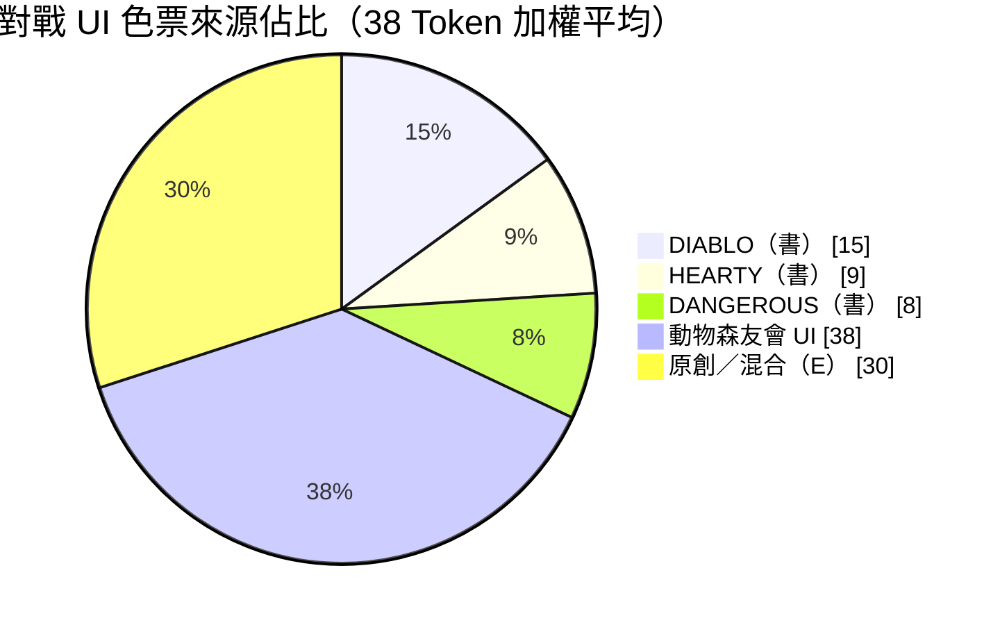
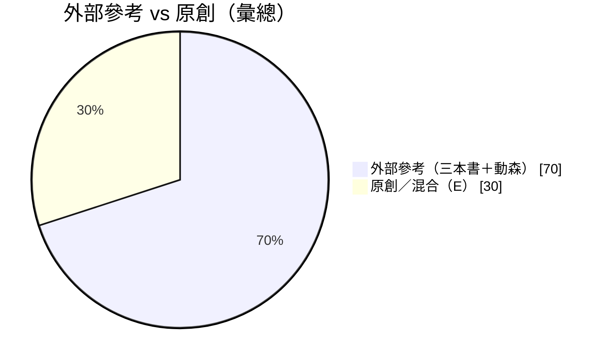
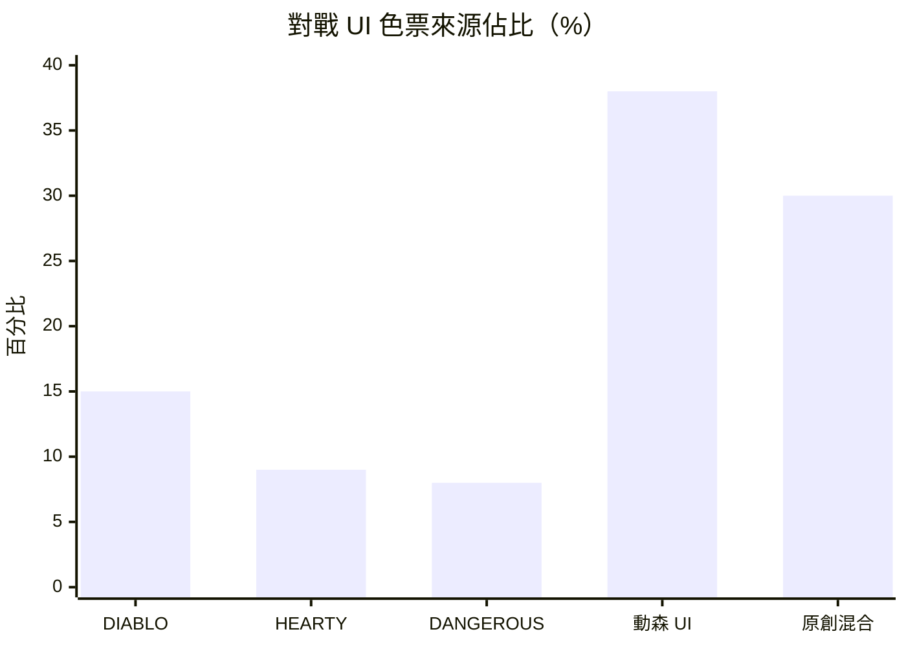
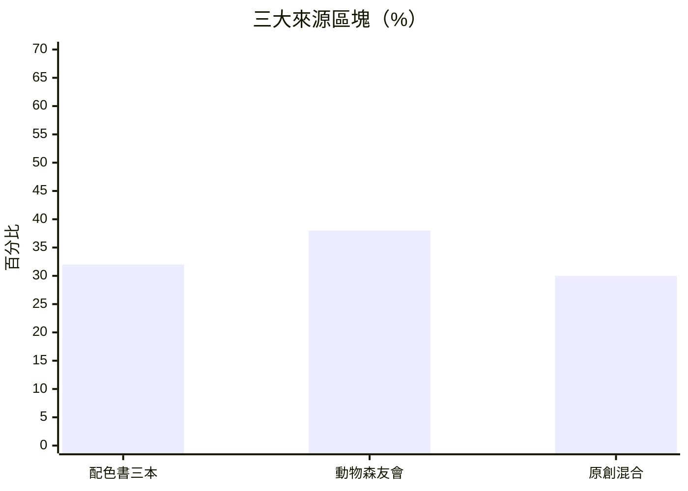

# 對戰場景 UI 配色規格（Battle Simulation）

| 項目 | 內容 |
|------|------|
| **狀態** | 已定案，待程式／場景實作 |
| **場景** | `BattleSimulation`（及 `BattleSimulationDebugUI` 動態建立之 UI） |
| **世界觀** | 學院魔法訓練廳（練習場對戰） |
| **方案** | 書稿 **#DIABLO**（骨幹）+ **#HEARTY**（紙感）+ **#DANGEROUS**（敵我點綴，淡化）+ **動物森友會 A 克制**（奶油面板、軟木按鈕、鈴錢金強調） |
| **目標感受** | 專注、可讀、偏暖；不過度柔和、不過度緊張 |
| **參考來源** | 見 **§2**（三本配色書 + 動物森友會 UI；量化比例與圖表） |
| **實作範圍** | 見 **§1**（玩家向 HUD／面板；**不含**除錯、卡牌區、特效） |
| **實作參考** | `Assets/Scripts/BattleSimulationDebugUI*.cs`、`Assets/Scenes/BattleSimulation.unity` |

---

## 1. 範圍說明

### 1.1 範圍原則（定案）

本規格書**只規範「學院練習場」對戰中、玩家會看到的 UI chrome 配色**。下列三大類**一律不列入**本書範圍，實作時**勿依本規格修改**其顏色：

| 類別 | 定義 | 代表內容 |
|------|------|----------|
| **A. 卡牌區** | 手牌、場上、牌背、與卡牌本體貼合的 UI | 見 §1.2 |
| **B. 特效** | 非穩態 UI 的動畫、粒子、閃爍、飛行、全螢幕色偏 | 見 §1.2 |
| **C. 除錯／批次模擬** | 開發者工具、F3 除錯面板、勝率批次模擬進度 UI | 見 §1.2 |

> `ShowBattleToast` 等訊息若僅顯示於除錯面板內文字，屬 **C 類**，不在本規格實作範圍。

### 1.2 明確排除（不適用本規格）

#### A. 卡牌區

| 排除項目 | 說明 |
|----------|------|
| 玩家手牌區 | `HandArea`、`BattleSimulationDebugUI.PlayerHand.cs`（`CardDisplay`、底圖、邊框、標籤） |
| 敵方手牌區 | `EnemyHandArea` 內卡牌視覺 |
| 場地牌區 | `PlayerFieldArea` / `EnemyFieldArea` / Spell 場區；含場上 HP／傷害色、`FieldCards.cs` 選取光暈 |
| 卡牌上互動 | `BattleHandDiscardDrag` 長按進度 Fill、拖曳高亮等 |
| 抽牌／出牌幽靈 | 飛行中的牌背、暫態 `Image`（`PlayDrawAnimation` 等） |

#### B. 特效

| 排除項目 | 說明 |
|----------|------|
| 天氣全螢幕 FX | `CreateWeatherScreenFx` 各層 tint、粒子、船／葉／雨等 |
| 英雄受傷回饋 FX | `HeroDamageVignette`、`HeroDamageMonochromeFlash`、HP 閃爍 lerp（`HURT_FLASH` 僅語意參考，**不實作**） |
| 法術／攻擊演出 | 出牌飛行、燃燒、震動等程式動態色 |
| 場景背景圖 | `戰鬥背景` 等 Sprite 美術本身（非 UI 色票） |

#### C. 除錯／批次模擬

| 排除項目 | 說明 |
|----------|------|
| 除錯面板全區 | `DebugBattlePanel`、`BattleDebugUIRoot`：`RoundText`、`FieldText`、`DeckText`、`StateText`、`BattleResultText`（除錯用小字）、`CloseDebugPanelButton` 等 |
| 除錯專用 Rich Text | `fieldText` 內 Toast／AI 行（`#AAFFCC`、`#FFD580` 等） |
| 批次勝率模擬 | `BattleAutoSimPlugin` 嵌入進度條、Win-rate 按鈕、批次結果面板 |
| 除錯可見性邏輯 | 開啟除錯時的 UI 顯色**維持現狀**，除非另開開發用規格 |

### 1.3 本次配色包含（在範圍內）

| 區塊 | 元件（摘要） |
|------|----------------|
| 英雄 HUD | `EnemyHeroHpHud`、`PlayerHeroHpHud` |
| 回合提示 | `BattleTurnBanner` |
| 主操作 | `結束回合`／`QuickEndTurnButton`、`PauseToggleButton`、`ActiveWeatherEffectButton` |
| 暫停 | `PausePanel`、`PauseCard`、Resume／Restart／Give up |
| 牌庫視覺 | `PlayerDeckPile`、`EnemyDeckPile`（右側堆疊，非卡牌本體） |
| 開場 | `OpeningRollPanel`、骰子文字（骰子 **點陣** Image 屬 §1.2-B 特效／裝飾，不實作） |
| 天氣 UI | 預報遮罩／卡片、進行中 `ActiveWeatherEffectPanel` |
| 棄牌流程 chrome | `DiscardDropZone`、`DiscardPromptPanel`（**不含**手牌本體） |
| 敵棄牌提示面板 | `EnemyDiscardToast` 底與文字（面板 chrome，**不含** mount 內卡牌） |
| 結算／戰報 | `EndBattlePanel`、對戰歷史對話框（`BattleHistoryOverlay`） |
| 場景靜態 UI | `結束回合` 等已列於 §4 者（待場景清查補齊） |

### 1.4 預設未在「1+A」細談之決策

| 項目 | 定案 |
|------|------|
| **結束回合按鈕** | **實心軟木褐**（`BTN_PRIMARY`），非奶油底描邊式 |
| **森友會程度** | **A 克制**：奶油面板 + 軟木主按鈕 + 鈴錢金回合字；我方 HP 用**壓暗綠**而非亮 `#88C9A0` |

---

## 2. 色票參考來源、量化比例與圖表

### 2.1 參考來源總覽

本規格之色票**不是單一作品複製**，而是以下四類來源加權融合，服務「學院練習場」：暖木背景上可讀、專注、不殺氣。

| 來源類別 | 書名／作品 | 擔當角色 | 取用原則 |
|----------|------------|----------|----------|
| **A** | 配色書 **#DIABLO**（金屬／機械／龐克／頹廢） | 結構骨幹 | 深藍灰、古銅、遮罩、牌堆陰影；提供「訓練廳庄重感」 |
| **B** | 配色書 **#HEARTY**（爽快／純真／輕鬆／舒暢） | 紙感與清新點綴 | 薄荷青標籤、淡金提示；**避免**整片高飽和黃粉 |
| **C** | 配色書 **#DANGEROUS**（恐怖／昏暗／危險／陰森） | 敵我與墨色（淡化） | 赭石敵方、深綠語意、軟墨副文；**禁用**血紅 9／12／15 作主色 |
| **D** | **動物森友會**（主要參考 *New Horizons* Nook 介面） | 練習場 UX 質感（A 克制） | 奶油面板、巧克力字、軟木按鈕、鈴錢金強調；**不**用亮果綠 `#88C9A0` 當 HP 主色 |
| **E** | **原創／專案混合** | 可讀性與銜接 | Hover／Pressed 運算色、除錯深褐底、與大廳一致之 `HALL_WINE`、α 與對比調整 |

> **動物森友會**色值為社群／官方 UI 常見參考（非任天堂資產）；實作僅借用**配色與層級**（紙感、圓潤、低壓迫），不複製介面圖形。

---

### 2.2 三本配色書：採用色票對照表

以下為本規格**有明確對應**之書稿色票（每本 20 色中擇用；未列出者代表本次**刻意不採**）。

#### #DIABLO（6 色）

| 書內分類 | 色票# | 書稿 RGB | 對應本規格代號 | 調整說明 |
|----------|-------|----------|----------------|----------|
| 金屬 | 1 | 206, 185, 143 | `BELL_GOLD`／`AI_HINT_GOLD` 鄰近 | 強調色以動森鈴金為準，書稿作暖金參考 |
| 金屬 | 3 | 13, 30, 53 | `DECK_TOP`（50%） | 與動森天空灰藍混合為 `#4A6B7C` |
| 機械 | 7 | 30, 44, 59 | `BTN_SECONDARY`（50%） | 與動森 `#7EA9BF` 混合為 `#5A7A8F` |
| 機械 | 10 | 137, 113, 73 | `BTN_PRIMARY`（40%） | 與動森軟木褐混合為 `#9A7A55` |
| 龐克 | 15 | 37, 35, 42 | `DECK_SHADOW` | 略提亮為 `#2E3542` 以配夜景背景 |
| 頹廢 | 20 | 10, 3, 5 | `DIM`／`DIM_HEAVY` | 僅調整 alpha（50%／66%） |

#### #HEARTY（5 色）

| 書內分類 | 色票# | 書稿 RGB | 對應本規格代號 | 調整說明 |
|----------|-------|----------|----------------|----------|
| 爽快 | 1 | 232, 187, 106 | `AI_HINT_GOLD` | 定案 `#E8BB6A`，略降飽和 |
| 爽快 | 2 | 244, 219, 214 | `PANEL_MILK`（30%） | 主體改動森對話米白 `#FFF8E7` |
| 純真 | 7 | 168, 206, 198 | `ALLY_LABEL`／`WeatherRemain` | **直接採用** |
| 純真 | 8 | 210, 229, 229 | `TOAST_MINT` | 定案 `#D2E5E5` |
| 舒暢 | 19 | 234, 215, 198 | `PANEL_CREAM` 鄰近 | 動森奶油 `#F5E6C8` 優先 |

#### #DANGEROUS（5 色；皆淡化）

| 書內分類 | 色票# | 書稿 RGB | 對應本規格代號 | 調整說明 |
|----------|-------|----------|----------------|----------|
| 危險 | 11 | 140, 118, 93 | `FOE_HP` 語意參考 | 定案偏暖 `#B8846E`，避免灰褐過冷 |
| 昏暗 | 8 | 138, 92, 93 | `TURN_ENEMY` 語意參考 | 定案改動森珊瑚 `#E0AA90` |
| 危險 | 13 | 56, 75, 56 | `ALLY_HP` 語意參考 | 定案用動森綠壓暗 `#5F8F72` |
| 陰森 | 19 | 73, 63, 59 | `INK_SOFT` | **直接採用** |
| 恐怖 | 5 | 23, 22, 43 | `DECK_TOP` 語意參考 | 併入 DIABLO 深藍系 |

**刻意不採用之書稿色（例）**：DANGEROUS 鮮紅 12 `139,32,54`、深血 9 `79,19,13`；HEARTY 純白 12、高飽和黃 9；DIABLO 頹廢血紅 17——避免「決鬥賽／恐怖副本」語意。

---

### 2.3 動物森友會 UI：採用對照表（A 克制）

| 動森 UI 元素 | 常見參考 RGB | Hex | 本規格代號 | 克制調整 |
|--------------|--------------|-----|------------|----------|
| Nook 介面奶油底 | 245, 230, 200 | `#F5E6C8` | `PANEL_CREAM` | 直接用於面板／暫停卡 |
| 對話框／確認鈕字 | 255, 248, 231 | `#FFF8E7` | `PANEL_MILK`、`BTN_PRIMARY_TEXT` | 取代純白按鈕 |
| 巧克力主文字 | 92, 64, 51 | `#5C4033` | `INK` | 主標題、天氣標題 |
| 軟木／木質按鈕 | 166, 124, 82 | `#A67C52` | `BTN_PRIMARY` | 與 DIABLO 10 混合為 `#9A7A55` |
| 鈴錢金強調 | 248, 216, 120 | `#F8D878` | `BELL_GOLD`、`TURN_PLAYER` | 回合提示，不用成功綠 |
| 柔和按鈕綠 | 136, 201, 160 | `#88C9A0` | `ALLY_HP` | **壓暗 30%** → `#5F8F72`，避免幼幼感 |
| 天空／次要藍 | 126, 169, 191 | `#7EA9BF` | `BTN_SECONDARY` | 與 DIABLO 7 混合為 `#5A7A8F` |
| 珊瑚褐（次要暖） | 224, 170, 144 | `#E0AA90` | `FOE_LABEL`、`TURN_ENEMY` | 敵方標籤，非警示紅 |

---

### 2.4 量化方法說明

| 項目 | 定義 |
|------|------|
| **統計單位** | §3 之 **38 個 Design Token**（`INK`～`HALL_WINE`） |
| **量化範圍** | 僅描述 Token **設計來源**；**不含** §1.2 排除之除錯／卡牌／特效實際像素面積 |
| **僅除錯用 Token** | `DEBUG_PANEL_BG`、`INK_MUTED`、`TOAST_MINT`、`AI_HINT_GOLD` 等保留定義，但標註 **§1.2-C 不實作** |
| **單色加權** | 每個 Token 將「創作貢獻」拆成五類比例，加總 **= 100%** |
| **五類** | DIABLO（A）、HEARTY（B）、DANGEROUS（C）、動物森友會（D）、原創／混合（E） |
| **原創／混合（E）** | 含：Hover／Pressed 推算色、專案大廳 `HALL_WINE`、除錯深褐底、陰影黑、受傷閃爍、多色線性混合、alpha 與對比調校 |
| **彙總** | 38 個 Token 之加權平均 → 全案比例（見 §2.5） |
| **「外部參考」** | A + B + C + D（三本書 + 動森） |
| **「原創」** | E |

**混合色範例**（歸屬拆分寫入 §2.6）：

- `BTN_PRIMARY` `#9A7A55` = 動森軟木 60% + DIABLO 機械 10 號 40%  
- `DECK_TOP` `#4A6B7C` = 動森天空灰藍 50% + DIABLO 金屬 3 號 50%  
- `FOE_HP` `#B8846E` = DANGEROUS 危險 11 號 50% + 動森珊瑚語意 30% + 原創暖化 20%  

---

### 2.5 量化結果（加權平均）

#### 圓餅圖：五類來源佔比



#### 圓餅圖：外部參考 vs 原創



| 彙總類別 | 佔比 | 說明 |
|----------|------|------|
| **三本書合計**（A+B+C） | **32%** | 結構、紙感、敵我語意之「書法」基礎 |
| **動物森友會 UI**（D） | **38%** | 練習場性格主來源（A 克制後） |
| **原創／混合**（E） | **30%** | 可讀性、狀態色、專案銜接、運算色 |
| **外部參考合計**（A+B+C+D） | **70%** | 皆有可追蹤之書稿或動森對照 |
| **原創合計**（E） | **30%** | 仍受學院場景與 WCAG 可讀性約束 |

#### 長條圖：五類來源佔比



#### 長條圖：三本書 vs 動森 vs 原創（三欄）



> 若 Markdown 預覽不支援 `xychart-beta`，請以 **§2.5 表格** 與 **圓餅圖** 為準；或於 [Mermaid Live Editor](https://mermaid.live) 貼上程式碼檢視。

---

### 2.6 各 Design Token 來源加權明細表

| 代號 | DIABLO | HEARTY | DANGEROUS | 動森 | 原創／混合 | 主要書稿／動森錨點 |
|------|--------|--------|-----------|------|------------|-------------------|
| INK | — | — | — | 100% | — | 巧克力字 |
| INK_SOFT | — | — | 100% | — | — | 陰森 19 |
| INK_MUTED | — | — | — | — | 100% | 除錯 meta |
| PANEL_CREAM | — | — | — | 100% | — | Nook 奶油 |
| PANEL_MILK | — | 30% | — | 70% | — | 動森米白 + 爽快 2 |
| PANEL_EDGE | 30% | — | 20% | 30% | 20% | 混合描邊 |
| BTN_PRIMARY | 40% | — | — | 60% | — | 機械 10 + 軟木褐 |
| BTN_PRIMARY_H | — | — | — | 20% | 80% | 提亮運算 |
| BTN_PRIMARY_P | 70% | — | — | — | 30% | 機械 10 加深 |
| BTN_PRIMARY_TEXT | — | — | — | 100% | — | 對話米白 |
| BTN_SECONDARY | 50% | — | — | 50% | — | 機械 7 + 天空藍 |
| BTN_SECONDARY_H | 15% | — | — | 15% | 70% | Hover 運算 |
| BTN_SECONDARY_P | 30% | — | — | — | 70% | Pressed 運算 |
| BTN_SECONDARY_TEXT | — | — | — | 40% | 60% | 冷色淺字 |
| BTN_DISABLED_BG | — | — | — | 100% | — | 同 PANEL_CREAM |
| BTN_DISABLED_TEXT | — | — | — | — | 100% | 同 INK_MUTED |
| ALLY_HP | — | — | — | 80% | 20% | 按鈕綠壓暗 |
| ALLY_LABEL | — | 100% | — | — | — | 純真 7 |
| FOE_HP | — | — | 50% | 30% | 20% | 危險 11 暖化 |
| FOE_LABEL | — | — | — | 100% | — | 珊瑚褐 |
| OUTLINE_HP | — | — | 40% | — | 60% | 陰森 19 + α |
| TURN_BG | — | — | 20% | — | 80% | 暖灰褐自訂 |
| TURN_PLAYER | — | 15% | — | 85% | — | 鈴金 + 爽快 1 |
| TURN_ENEMY | — | — | — | 100% | — | 珊瑚褐 |
| TURN_BANNER_TEXT | — | — | — | 100% | — | 對話米白 |
| BELL_GOLD | — | 15% | — | 85% | — | 鈴金 |
| DECK_TOP | 50% | — | — | 50% | — | 金屬 3 + 天空藍 |
| DECK_SHADOW | 90% | — | — | — | 10% | 龐克 15 |
| DIM | 100% | — | — | — | — | 頹廢 20（α 自訂） |
| DIM_HEAVY | 85% | — | — | — | 15% | 頹廢 20（α 自訂） |
| DEBUG_PANEL_BG | — | — | 30% | — | 70% | 除錯深褐 |
| SHADOW_UI | — | — | — | — | 100% | 通用陰影 |
| TOAST_MINT | — | 90% | — | 10% | — | 純真 8 |
| AI_HINT_GOLD | — | 85% | — | 15% | — | 爽快 1 |
| WARN_GOLD | — | 10% | — | 90% | — | 鈴金 |
| HURT_FLASH | — | — | 50% | — | 50% | 昏暗 8 語意 + 自訂 |
| VIGNETTE | — | — | — | — | 100% | 受傷暗角 |
| HALL_WINE | — | — | — | — | 100% | 專案大廳 `SceneLoader` |

**加權平均驗算**（38 Token）：DIABLO **15%** · HEARTY **9%** · DANGEROUS **8%** · 動森 **38%** · 原創 **30%**（合計 100%）。

---

## 3. 色票代號定義（Design Tokens）

### 3.1 主色票一覽

| 代號 | 名稱 | Hex | RGB | Unity `Color` (R,G,B,A) | 來源／語意 |
|------|------|-----|-----|------------------------|------------|
| **INK** | 巧克力字 | `#5C4033` | 92, 64, 51 | `(0.361, 0.251, 0.200, 1)` | 森友會主文字 |
| **INK_SOFT** | 軟墨字 | `#493F3B` | 73, 63, 59 | `(0.286, 0.247, 0.231, 1)` | 書 DANGEROUS 陰森 19、副文 |
| **INK_MUTED** | 淡墨字 | `#6B5F58` | 107, 95, 88 | `(0.420, 0.373, 0.345, 1)` | 除錯 meta；**§1.2-C 不實作** |
| **PANEL_CREAM** | Nook 奶油面板 | `#F5E6C8` | 245, 230, 200 | `(0.961, 0.902, 0.784, 1)` | 森友會面板底 |
| **PANEL_MILK** | 對話框米白 | `#FFF8E7` | 255, 248, 231 | `(1.000, 0.973, 0.906, 1)` | 天氣卡、開場骰子卡（可選更亮面板） |
| **PANEL_EDGE** | 軟木描邊 | `#8B7355` | 139, 115, 85 | `(0.545, 0.451, 0.333, 1)` | Outline／分隔線（常用 **40% alpha**） |
| **BTN_PRIMARY** | 軟木褐主按鈕 | `#9A7A55` | 154, 122, 85 | `(0.604, 0.478, 0.333, 1)` | 森軟木 + DIABLO 機械 10 |
| **BTN_PRIMARY_H** | 主按鈕 Hover | `#AE8E66` | 174, 142, 102 | `(0.682, 0.557, 0.400, 1)` | 略提亮 |
| **BTN_PRIMARY_P** | 主按鈕 Pressed | `#6F5A3A` | 111, 90, 58 | `(0.435, 0.353, 0.227, 1)` | DIABLO 加深 |
| **BTN_PRIMARY_TEXT** | 主按鈕字 | `#FFF8E7` | 255, 248, 231 | `(1.000, 0.973, 0.906, 1)` | 森對話框米白 |
| **BTN_SECONDARY** | 天空灰藍次按鈕 | `#5A7A8F` | 90, 122, 143 | `(0.353, 0.478, 0.561, 1)` | 森 + DIABLO 7 |
| **BTN_SECONDARY_H** | 次按鈕 Hover | `#6B8FA3` | 107, 143, 163 | `(0.420, 0.561, 0.639, 1)` | |
| **BTN_SECONDARY_P** | 次按鈕 Pressed | `#465F6F` | 70, 95, 111 | `(0.275, 0.373, 0.435, 1)` | |
| **BTN_SECONDARY_TEXT** | 次按鈕字 | `#E8F2F6` | 232, 242, 246 | `(0.910, 0.949, 0.965, 1)` | |
| **BTN_DISABLED_BG** | 停用按鈕底 | `#F5E6C8` | 245, 230, 200 | `(0.961, 0.902, 0.784, 0.5)` | alpha **0.5** |
| **BTN_DISABLED_TEXT** | 停用按鈕字 | `#6B5F58` | 107, 95, 88 | `(0.420, 0.373, 0.345, 0.7)` | alpha **0.7** |
| **ALLY_HP** | 我方 HP 數字 | `#5F8F72` | 95, 143, 114 | `(0.373, 0.561, 0.447, 1)` | 森綠壓暗（非 `#88C9A0`） |
| **ALLY_LABEL** | 我方標籤 | `#A8CEC6` | 168, 206, 198 | `(0.659, 0.808, 0.776, 1)` | 森／HEARTY 7 |
| **FOE_HP** | 敵方 HP 數字 | `#B8846E` | 184, 132, 110 | `(0.722, 0.518, 0.431, 1)` | 參考 DANGEROUS 11 + 暖化（§2.2） |
| **FOE_LABEL** | 敵方標籤 | `#E0AA90` | 224, 170, 144 | `(0.878, 0.667, 0.565, 1)` | 森珊瑚褐 |
| **OUTLINE_HP** | HP 描邊 | `#382624` | 56, 38, 36 | `(0.220, 0.149, 0.141, 0.55)` | alpha **0.55**，取代純黑 92% |
| **TURN_BG** | 回合橫幅底 | `#3D3835` | 61, 56, 53 | `(0.239, 0.220, 0.208, 0.85)` | alpha **0.85** |
| **TURN_PLAYER** | 你的回合字 | `#F8D878` | 248, 216, 120 | `(0.973, 0.847, 0.471, 1)` | 森鈴錢金 |
| **TURN_ENEMY** | 敵方操作字 | `#E0AA90` | 224, 170, 144 | `(0.878, 0.667, 0.565, 1)` | 同 FOE_LABEL |
| **TURN_BANNER_TEXT** | 橫幅預設字 | `#FFF8E7` | 255, 248, 231 | `(1.000, 0.973, 0.906, 1)` | 橫幅靜態底字（若需） |
| **BELL_GOLD** | 鈴錢金強調 | `#F8D878` | 248, 216, 120 | `(0.973, 0.847, 0.471, 1)` | 回合橫幅、開場先手（§1.3） |
| **DECK_TOP** | 牌堆上層 | `#4A6B7C` | 74, 107, 124 | `(0.290, 0.420, 0.486, 1)` | 森藍灰 + DIABLO 3 |
| **DECK_SHADOW** | 牌堆下層 | `#2E3542` | 46, 53, 66 | `(0.180, 0.208, 0.259, 0.92)` | 書 DIABLO 龐克 15 |
| **DIM** | 全螢幕遮罩 | `#0A0305` | 10, 3, 5 | `(0.039, 0.012, 0.020, 0.50)` | alpha **0.50**；暫停／天氣預報 |
| **DIM_HEAVY** | 深遮罩 | `#0A0305` | 10, 3, 5 | `(0.039, 0.012, 0.020, 0.66)` | 結算凍結、戰報對話 |
| **DEBUG_PANEL_BG** | 除錯面板底 | `#322C26` | 50, 44, 38 | `(0.196, 0.173, 0.149, 0.85)` | **§1.2-C 不實作**（保留定義供日後） |
| **SHADOW_UI** | UI 陰影 | `#000000` | 0, 0, 0 | `(0, 0, 0, 0.45)` | Shadow effectColor |
| **TOAST_MINT** | Toast／提示 | `#D2E5E5` | 210, 229, 229 | `(0.824, 0.898, 0.898, 1)` | **§1.2-C 不實作** |
| **AI_HINT_GOLD** | AI 量化提示 | `#E8BB6A` | 232, 187, 106 | `(0.910, 0.733, 0.416, 1)` | **§1.2-C 不實作** |
| **WARN_GOLD** | 鈴錢金強調 | `#F8D878` | 248, 216, 120 | `(0.973, 0.847, 0.471, 1)` | 開場先手、戰報標題強調（非除錯 `BattleResultText`） |
| **HURT_FLASH** | 受傷閃爍 | `#C07060` | 192, 112, 96 | `(0.753, 0.439, 0.376, 1)` | **§1.2-B 不實作**（語意參考） |
| **VIGNETTE** | 受傷暗角 | `#000000` | 0, 0, 0 | `(0, 0, 0, 0.75)` | **§1.2-B 不實作** |
| **HALL_WINE** | 大廳酒紅按鈕 | `#714847` | 113, 72, 71 | `(0.443, 0.282, 0.247, 0.96)` | 結算關閉、戰報（與 Buildbeck 一致） |

### 3.2 TMP Rich Text 用 Hex（程式內嵌字串）

**§1 範圍內**（實作）：

| 用途 | Rich Text |
|------|-----------|
| 我方英雄標籤（`RefreshHeroHpHud`） | `<color=#A8CEC6>我方英雄</color>` |
| 敵方英雄標籤 | `<color=#E0AA90>敵方英雄</color>` |

**§1.2 範圍外**（本規格不修改）：`fieldText` Toast／AI 行等除錯用色。

### 3.3 面板底色選用（`PANEL_CREAM` vs `PANEL_MILK`）

| 用途 | 定案 Token |
|------|------------|
| 大張說明／預報卡、戰報對話、開場骰子面板 | `PANEL_MILK` |
| 暫停卡、結算 `EndBattlePanel`、棄牌提示、進行中天氣側欄 | `PANEL_CREAM` |

---

## 4. UI 元件配色總表（實作對照）

> **僅列 §1.3 範圍內元件**（共 **63** 列）。除錯／卡牌／特效見 §1.2，不在此表實作。  
> **欄位**：元件 → 屬性 → 色票（§3）→ Hex  

| # | 分類 | 元件 | 屬性 | 色票 | Hex | 備註 |
|---|------|------|------|------|-----|------|
| **英雄 HP HUD** |
| 1 | 英雄 | `EnemyHeroHpHud` | TMP 主體（數字 `<b>`） | FOE_HP | `#B8846E` | `enemyHeroHpText.color` |
| 2 | 英雄 | `EnemyHeroHpHud` | Rich Text「敵方英雄」 | FOE_LABEL | `#E0AA90` | 見 §3.2 |
| 3 | 英雄 | `EnemyHeroHpHud` | Outline | OUTLINE_HP | `#382624` @55% | `effectDistance` 建議 `(2, -2)` |
| 4 | 英雄 | `PlayerHeroHpHud` | TMP 主體（數字） | ALLY_HP | `#5F8F72` | `playerHeroHpText.color` |
| 5 | 英雄 | `PlayerHeroHpHud` | Rich Text「我方英雄」 | ALLY_LABEL | `#A8CEC6` | |
| 6 | 英雄 | `PlayerHeroHpHud` | Outline | OUTLINE_HP | `#382624` @55% | |
| **回合橫幅** |
| 7 | 回合 | `BattleTurnBanner` | Image 底 | TURN_BG | `#3D3835` @85% | `bg.color` |
| 8 | 回合 | `BattleTurnBanner` | Shadow | SHADOW_UI | `#000` @45% | |
| 9 | 回合 | `TurnBannerText` | 預設／靜態 | TURN_BANNER_TEXT | `#FFF8E7` | 建立時 |
| 10 | 回合 | `TurnBannerText` | 你的回合 | TURN_PLAYER | `#F8D878` | `ShowTurnBanner(PlayerTurn)` |
| 11 | 回合 | `TurnBannerText` | 敵方操作中 | TURN_ENEMY | `#E0AA90` | `ShowTurnBanner(EnemyTurn)` |
| 12 | 回合 | `TurnBannerText` | Outline | OUTLINE_HP | `#382624` @55% | |
| **主操作按鈕** |
| 13 | 按鈕 | `結束回合`（場景） | Image 底 | BTN_PRIMARY | `#9A7A55` | `BattleSimulation.unity` + `sceneEndTurnButton` |
| 14 | 按鈕 | `結束回合` | Label TMP/Text | BTN_PRIMARY_TEXT | `#FFF8E7` | 子物件 Label |
| 15 | 按鈕 | `結束回合` | ColorBlock Normal | BTN_PRIMARY | | |
| 16 | 按鈕 | `結束回合` | Highlighted | BTN_PRIMARY_H | | |
| 17 | 按鈕 | `結束回合` | Pressed | BTN_PRIMARY_P | | |
| 18 | 按鈕 | `結束回合` | Disabled | BTN_DISABLED_BG / TEXT | | |
| 19 | 按鈕 | `QuickEndTurnButton`（fallback） | 同 #13–18 | 同上 | | `CreateButton` 若場景無按鈕 |
| 20 | 按鈕 | `PauseToggleButton` | Image 底 | BTN_SECONDARY | `#5A7A8F` | `CreatePauseUI` |
| 21 | 按鈕 | `PauseToggleButton` | Label | BTN_SECONDARY_TEXT | `#E8F2F6` | Legacy `Text` |
| 22 | 按鈕 | `ActiveWeatherEffectButton` | 同 #20–21 | BTN_SECONDARY | | 顯示時；TMP 標籤同色 |
| 23 | 按鈕 | `CreateButton`（範圍內） | 依 name 分流 | 主／次 | | `EndTurn`／`結束`／`Resume`→Primary；Pause／場地效果→Secondary |
| **暫停選單** |
| 24 | 暫停 | `PausePanel` | Image 遮罩 | DIM | `#0A0305` @50% | |
| 25 | 暫停 | `PauseCard` | Image 底 | PANEL_CREAM | `#F5E6C8` @96% | |
| 26 | 暫停 | `PauseTitle` | TMP | INK | `#5C4033` | |
| 27 | 暫停 | `ResumeButton` | Image | BTN_PRIMARY | | |
| 28 | 暫停 | `ResumeButton` | Label | BTN_PRIMARY_TEXT | | |
| 29 | 暫停 | `PauseRestartButton` | Image | BTN_SECONDARY | | |
| 30 | 暫停 | `PauseGiveUpButton` | Image | BTN_SECONDARY | | |
| 31 | 暫停 | Restart / Give up | Label | BTN_SECONDARY_TEXT | | |
| **牌庫視覺** |
| 32 | 牌堆 | `PlayerDeckPile` / `EnemyDeckPile` `PileLayer_2` | Image | DECK_TOP | `#4A6B7C` | 最上層 |
| 33 | 牌堆 | `PileLayer_0/1` | Image | DECK_SHADOW | `#2E3542` @92% | |
| **開場骰子** |
| 34 | 開場 | `OpeningRollPanel` | Image 底 | PANEL_MILK | `#FFF8E7` | §3.3 |
| 35 | 開場 | `OpeningRollDiceText` | TMP | INK | `#5C4033` | |
| 36 | 開場 | `OpeningRollFirstText` | TMP | BELL_GOLD | `#F8D878` | 先手提示 |
| **天氣** |
| 37 | 天氣 | `WeatherForecastOverlay` | Image 遮罩 | DIM | `#0A0305` @50% | |
| 38 | 天氣 | `WeatherForecastCard` | Image 底 | PANEL_MILK | `#FFF8E7` @98.5% | |
| 39 | 天氣 | `WeatherForecastTitle` | TMP | INK | `#5C4033` | |
| 40 | 天氣 | `WeatherForecastBody` | TMP | INK_SOFT | `#493F3B` | |
| 41 | 天氣 | `ActiveWeatherEffectPanel` | Image 底 | PANEL_CREAM | `#F5E6C8` @96% | |
| 42 | 天氣 | `ActiveWeatherEffectPanel` | Outline | PANEL_EDGE | `#8B7355` @35% | |
| 43 | 天氣 | `ActiveWeatherDivider` | Image | PANEL_EDGE | `#8B7355` @35% | |
| 44 | 天氣 | `ActiveWeatherSummaryText` | TMP | INK_SOFT | `#493F3B` | |
| 45 | 天氣 | `ActiveWeatherEffectPanelText` | TMP | INK_SOFT | `#493F3B` | |
| **棄牌流程 UI（非手牌本體）** |
| 46 | 棄牌 | `DiscardDropZone` | Image 底 | BTN_PRIMARY_P | `#6F5A3A` @90% | 左側棄牌區 |
| 47 | 棄牌 | `DiscardDropZone` Label | TMP | BTN_PRIMARY_TEXT | `#FFF8E7` | |
| 48 | 棄牌 | `DiscardPromptPanel` | Image | PANEL_CREAM | `#F5E6C8` @96% | |
| 49 | 棄牌 | `DiscardPromptPanel` Text | TMP | INK | `#5C4033` | |
| 50 | 棄牌 | `EnemyDiscardToast` | Image 底 | PANEL_CREAM | `#F5E6C8` @96% | 不含 mount 內卡牌 |
| 51 | 棄牌 | `EnemyDiscardToast` Title | TMP | INK | `#5C4033` | |
| 52 | 棄牌 | `EnemyDiscardToast` Meta / Skill | TMP | INK_SOFT | `#493F3B` | |
| **結算／戰報** |
| 53 | 結算 | `EndBattlePanel` | Image 底 | PANEL_CREAM | `#F5E6C8` @96% | |
| 54 | 結算 | `EndBattleTitleText` | Text | INK | `#5C4033` | Victory／Defeat 等 |
| 55 | 結算 | `BattleHistoryButton` 等三鈕 | Image | HALL_WINE | `#714847` @96% | `CreateEndBattleButton` |
| 56 | 結算 | 三鈕 Label | Text | BTN_PRIMARY_TEXT | `#FFF8E7` | |
| 57 | 結算 | `SettlementFreeze` dim | Image | DIM_HEAVY | `#0A0305` @66% | |
| 58 | 結算 | 戰報 `rootDim` | Image | DIM_HEAVY | | |
| 59 | 結算 | 戰報 `dlgBg` | Image | PANEL_MILK | `#FFF8E7` | |
| 60 | 結算 | 戰報 `titleTmp` | TMP | INK | `#5C4033` | |
| 61 | 結算 | 戰報 `closeBtn` | Image | HALL_WINE | `#714847` @96% | |
| 62 | 結算 | 戰報 `closeTxt` | TMP/Text | BTN_PRIMARY_TEXT | `#FFF8E7` | |
| 63 | 結算 | 戰報 scroll 底 | Image | `PANEL_SCROLL` | `#E0D4C4` | `PANEL_CREAM`×0.92；建議實作時升格 Token |
| 64 | 結算 | 戰報歷史行 TMP | TMP | INK_SOFT | `#493F3B` | 內文預設色 |
| 65 | 結算 | 戰報天氣行底 | Image | HALL_WINE | `#714847` @28% | |

---

## 5. 依腳本檔案之修改索引（僅 §1.3 範圍）

| 檔案 | 主要方法／區塊 | 對應 §4 列 # | 備註 |
|------|----------------|-------------|------|
| `BattleSimulationDebugUI.cs` | `CreateHeroHpHud`, `RefreshHeroHpHud` | 1–6 | |
| | `CreateBattleTurnBanner`, `ShowTurnBanner` | 7–12 | |
| | `CreateButton`, `BindSceneEndTurnButton` | 13–23 | **勿**改 `CloseDebugPanelButton` |
| | `CreatePauseUI` | 24–31 | |
| | `CreateDeckPileVisual` | 32–33 | |
| | `OpeningRollPanel` 區塊 | 34–36 | 骰子 **點陣** Image 屬 §1.2-B，可不改 |
| | `WeatherForecastOverlay`, `ActiveWeatherEffectPanel` | 37–45 | |
| `BattleSimulationDebugUI.Settlement.cs` | `EnsureEndBattlePanel`, `CreateEndBattleButton` | 53–56 | |
| | `EnsureBattleHistoryOverlay`, `BuildBattleHistoryRows` | 57–65 | 歷史 Rich 語意色另見 §6 備註 |
| `BattleSimulationDebugUI.Discard.cs` | `EnsureDiscardSelectionUi` | 46–49 | |
| `BattleSimulationDebugUI.DiscardPopup.cs` | `EnsureEnemyDiscardToastUi` | 50–52 | |
| `Assets/Scenes/BattleSimulation.unity` | `結束回合` Button | 13–18 | |
| **不修改** | `CreateDebugPanel` 全區 | — | §1.2-C |
| **不修改** | `BattleAutoSimPlugin` | — | §1.2-C |
| **不修改** | `PlayerHand` / `FieldCards` / `BattleHandDiscardDrag` | — | §1.2-A |
| **不修改** | `CreateWeatherScreenFx`、受傷 Vignette／Flash | — | §1.2-B |

---

## 6. 實作備註（定案共識）

1. **集中常數**：`static class BattleUiColors`（或 partial）僅供 **§1.3** 元件引用 §3 代號。  
2. **`CreateButton` 分流**（範圍內）：`EndTurn`／`結束`／`Resume` → Primary；`Pause`／`場地效果` → Secondary；**除錯 Close 鈕不在此列**。  
3. **禁止使用**（範圍內）：大面積純白按鈕、螢光紅 HP、高飽和成功綠回合字、DANGEROUS 血紅作主色。  
4. **質感（Phase 2）**：圓角、`PANEL_EDGE` 描邊、按鈕陰影；Phase 1 只做顏色。  
5. **戰報 Rich 語意色**：`FormatBattleHistoryRichText` 內怪物／法術／傷害／治療／勝敗五色**尚未**納入本規格 Token；實作 v1 可維持現行 hex，或另開 §3.4 擴充。  
6. **驗收**（關閉除錯面板下）：英雄 HP、回合橫幅、結束回合、Pause、牌堆、暫停、天氣 UI、棄牌提示、結算／戰報；確認**手牌／場牌／FX 顏色與改版前相同**。  

---

## 7. 版本紀錄

| 日期 | 版本 | 說明 |
|------|------|------|
| 2026-05-16 | 1.0 | 初版：融合書稿 + 森友會 A 克制；§4 總表 79 列 |
| 2026-05-16 | 1.1 | 新增 §2：三本書／動森對照表、38 Token 加權量化、圓餅圖／長條圖 |
| 2026-05-16 | 1.2 | §1 重訂：明確排除卡牌區、特效、除錯／批次模擬；§4 縮為 65 列實作範圍 |
| 2026-05-16 | 1.2.1 | 新增 §8 列印說明；`tools/Export-BattleUiColorSpecPrint.ps1` → `Docs/BATTLE_UI_COLOR_SPEC.print.html` |

---

## 8. 列印本規格書

### 方式 A：瀏覽器列印（建議，含完整表格）

1. 在專案根目錄以 PowerShell 執行：
   ```powershell
   .\tools\Export-BattleUiColorSpecPrint.ps1
   ```
2. 開啟產生的 `Docs\BATTLE_UI_COLOR_SPEC.print.html`（雙擊或用 Chrome / Edge）。
3. `Ctrl+P` → 目的地選印表機或 **另存為 PDF**。
4. 建議：**A4**、直向、邊界預設；勾選 **背景圖形**（表格底色較完整）。
5. §2 的 Mermaid 圖在列印版會改為**數字表格**（內容同 §2.5）。

### 方式 B：Cursor / VS Code 預覽

1. 開啟 `BATTLE_UI_COLOR_SPEC.md` → `Ctrl+Shift+V` 預覽。
2. `Ctrl+P` 列印。  
   **注意**：Mermaid 圖表可能無法顯示；§4 大表可能換頁較難讀 → 優先用法 A。

### 方式 C：另存 PDF 後列印

用法 A 步驟 3 選「Microsoft Print to PDF」或「另存 PDF」，再將 PDF 送去列印或裝訂。

---

*確認本文件後，下一階段依 §5 索引進行程式與 `BattleSimulation.unity` 實作（**不含** §1.2）。*
