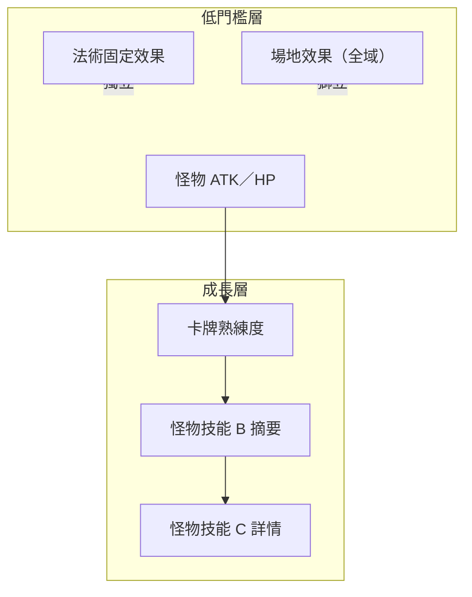

# 卡牌熟練度與怪物技能解鎖（企劃／GDD）

| 項目 | 內容 |
|------|------|
| **文件類型** | 企劃提案／遊戲設計文件（GDD） |
| **狀態** | 門檻已定案；**勝場累計與 A/B/C 判定已實作**（`CardSkillProficiencyService`／`PlayerData`） |
| **關聯文件** | [`PLANNING_DOCS_INDEX.md`](PLANNING_DOCS_INDEX.md) · [`PLANNING_OPEN_ITEMS.md`](PLANNING_OPEN_ITEMS.md) §PROF · [`GAMEPLAY_AND_RULES.md`](GAMEPLAY_AND_RULES.md) · [`卡牌技能階段式揭露.md`](卡牌技能階段式揭露.md)（單卡 A/B/C 文案與範例）· [`MARKET_ANALYSIS_SOURCES.md`](MARKET_ANALYSIS_SOURCES.md) · [`MARKET_ANALYSIS_FIVE_GAMES.md`](MARKET_ANALYSIS_FIVE_GAMES.md) |
| **最後更新** | 2026-05-16 |

---

## 1. 設計背景

集換式卡牌遊戲（TCG）常見痛點是**規則與關鍵字複雜**，新手在首局就要同時理解「出牌節奏、場上互動、單卡異能、全域效果」，學習曲線陡峭。

本作刻意**降低上手門檻**：現階段**怪物牌不設計任何技能**，玩家先以 **ATK／HP、出牌、攻擊、場地效果** 建立對戰直覺。在此基礎上，以**卡牌熟練度**作為長期成長軸：玩家對某張怪物牌累積使用與理解後，依階段**解鎖該卡的技能說明與實際效果**，在「簡單入門」與「深度精通」之間取得平衡。

---

## 2. 設計意圖

| 痛點 | 本作對策 |
|------|----------|
| 規則複雜、關鍵字多 | 初期怪物牌**無技能**，專注基礎對戰 |
| 進階內容缺乏動機 | **卡牌熟練度**達標 → 解鎖技能階段 |
| 一次揭露過多資訊 | **A → B → C** 分層揭露，避免長文嚇退新手 |

### 2.1 設計目標（可驗收）

1. **首局可玩**：不閱讀技能長文即可完成一場對戰。
2. **中期有發現感**：玩家能察覺「這張牌還有未解放的能力」。
3. **長期有精通感**：願意鑽研的玩家可解鎖完整規則說明與實際異能。
4. **與稀有度解耦**：熟練度門檻不應變成「強卡還要雙重刷關」的懲罰。

---

## 3. 怪物技能三階段（A／B／C）

每張**怪物牌**各自擁有一條熟練度進度，對應下列三階段。法術牌、場地效果、英雄技能**不在**本系統範圍內（除非日後另立附錄）。

| 階段 | 名稱（工作用） | 玩家看到的內容 | 設計目的 |
|------|----------------|----------------|----------|
| **A** | 未解放 | 卡面**無技能區**（或灰鎖＋極短提示，如「熟練後解鎖戰技」）。圖鑑／收藏可標示「尚有未解放能力」。 | 降低首局認知負荷；保留**發現感**（「這張牌還有東西」）。 |
| **B** | 基礎解放 | **簡短技能一句話**（效果摘要；少或無關鍵字）。達成**進階解鎖條件**後可進入 C。 | 能玩、能記；進階玩家仍感到「尚未讀完規則」。 |
| **C** | 完整解放 | **完整技能說明**（觸發時機、對象、數值、與場地／法術／其他卡互動等）。 | 服務願意鑽規則的玩家；適合圖鑑詳情、長按說明、教學關卡後查閱。 |

### 3.1 階段與 UI 呈現原則（建議）

| 階段 | 卡面（對戰中） | 圖鑑／收藏 | 備註 |
|------|----------------|------------|------|
| A | 不顯示技能正文；可選：鎖頭圖示 + 一句話 | 顯示「未解放」與**模糊提示**（不寫具體數值） | 避免剧透具體效果 |
| B | 顯示**一行摘要** | 摘要 + 「詳情未解放」標記 | 預設戰鬥 HUD 可讀性優先 |
| C | 摘要可保留；詳情入口開放 | 完整條文、範例、互動註記 | 長按／「？」開詳情 |

**B 與 C 的介面分工（建議定案）**

- **B**：戰鬥中預設可見的「一句話效果」。
- **C**：圖鑑詳情頁、長按說明、教學關卡結算後解鎖的完整條文。

---

## 4. 卡牌熟練度與解鎖條件

### 4.1 兩道門檻（已定案）

| 門檻 | 階段轉換 | 條件（程式） |
|------|----------|----------------|
| **基礎解鎖** | A → B | 該怪物牌在**目前牌組**中，累計 toward-B 進度 **2.0**（**不限難度**）；每場依結局累加（見下表）。 |
| **進階解鎖** | B → C | 同上牌，累計 **10 場「普通以上」難度勝利**（普通／困難／魔王；僅**勝利**時 +1）；每場每種怪物 id 最多 +1。 |
| **單局進度** | 結算播報 | **勝** +1/2；**平** +1/2×2/3；**敗** +1/2×1/3（御三家不累加；約 **10 場勝**到 B，試玩向）。 |
| **御三家** | 預設 C | **國王（13）／王后（12）／民兵（4）** 無需累計，詳情與戰技視為 **C · 完整**。 |
| **熟練度條** | 全怪物牌 | 背包詳情中**所有怪物牌**顯示勝場進度條（尚無戰技表者仍累計勝場，戰技文案待擴充）。 |

### 4.2 熟練度資料（概念欄位）

每張怪物牌可共用一組**帳號級（或存檔級）**進度欄位，企劃表再掛上各卡的 B／C 門檻數值：

| 欄位（概念） | 說明 |
|--------------|------|
| 累計加入牌組次數 | 是否曾納入有效牌組 |
| 累計打出次數 | 從手牌成功置場或依規則計入 |
| 累計造成／承受傷害 | 可選；用於「坦克型」「輸出型」分流 |
| `wins_any` | toward-B 進度（滿 **2.0** → B；存檔欄位 `progressAny`） |
| `wins_normal` | 「普通以上」難度勝場數（達 10 → C） |
| 當前階段 | 由勝場推算 `A` / `B` / `C`（御三家固定 C） |

### 4.3 解鎖條件類型（範例，數值 TBD）

以下為**條件類型範本**，實作前由企劃逐卡填表；同一張卡可組合多條件（AND／OR 需明訂）。

**A → B（基礎解鎖）範例**

| 類型 | 範例敘述 |
|------|----------|
| 使用次數 | 該卡累計**打出 N 次**（建議 N = 3～10，依卡稀有度調整） |
| 對戰參與 | 該卡曾在牌組中完成 **M 場**對戰 |
| 教學引導 | 完成指定**單人教學關卡**後直接升至 B（僅少數起始卡） |

**B → C（進階解鎖）範例**

| 類型 | 範例敘述 |
|------|----------|
| 勝場貢獻 | 該卡進場的對戰中累計**獲勝 K 次** |
| 情境觸發 | 在特定**場地效果**生效的回合內打出該卡 L 次 |
| 搭配行為 | 與指定**法術類型**同回合或同局內共同出現 |
| 傷害里程碑 | 該卡累計造成／承受傷害達閾值（進階玩家向） |

### 4.4 單卡文案與範例（另冊）

怪物牌 **A／B／C 具體戰技文案**、填表模板與**國王**完整範例，統一維護於：

**[`卡牌技能階段式揭露.md`](卡牌技能階段式揭露.md)**

| 卡名 | id | 狀態 |
|------|-----|------|
| 國王 | 13 | ✅ 已定案（見該文件 §4） |
| 其餘怪物 | — | 待擴充 |

---

## 5. 與現行版本的關係

| 現況（程式／內容） | 企劃對應 |
|--------------------|----------|
| 怪物牌**無技能**欄位與結算 | 全玩家預設視為階段 **A**（或尚未達 B 門檻） |
| 法術牌已有固定效果 | **不納入**本熟練度系統 |
| 場地效果四系（室內名稱：爐心飛燼／暖燈浮塵／訓練薄霧／穿堂微風） | **全域規則**；與單卡技能分層，首日不搶注意力 |
| 對戰場景為學院訓練廳 | 敘事可包裝為：「基礎演練僅開放體質（ATK／HP），熟練後開放個人戰技」 |

**過渡原則**：實作本系統前，現有對戰平衡以「無技能怪物」為準；實作後宜提供**舊存檔預設 A** 或依歷史對戰次數**追溯 B** 與否（待技術評估）。

---

## 6. 與其他系統的分工

| 系統 | 與熟練度關係 |
|------|----------------|
| 組牌／持有張數 | 熟練度不取代「是否擁有卡」，僅影響技能揭露與異能開關 |
| 稀有度 N／R／SR… | 建議**不綁定**熟練度門檻高低，避免雙重門檻 |
| 對戰 AI | 需決策：敵方怪物是否也分 A/B/C（見 §7） |
| 成就／任務 | 可引用「首次 C 階解鎖」「全圖鑑 B 達成」等 |

---

## 7. 企劃待決事項（TBD）

> 彙總索引與優先級見 [`PLANNING_OPEN_ITEMS.md`](PLANNING_OPEN_ITEMS.md) §PROF；全專案待定見同文件。

實作前建議逐條定案並寫入本節：

| # | 議題 | 選項／備註 |
|---|------|------------|
| 1 | **熟練度綁定範圍** | 帳號全域 vs 單一存檔槽 vs 角色 |
| 2 | **解鎖是否可逆** | 建議**不可逆**（避免玩家刻意不升 C） |
| 3 | **對戰中對手是否可見** | B 階段摘要是否公開；公開用圖示還是文字 |
| 4 | **敵方／AI 怪物** | 僅玩家牌成長 vs 敵方同步階段（影響 PVE 難度） |
| 5 | **B 階段是否啟用異能** | B 僅文案 vs B 已啟用簡化版效果（影響開發量） |
| 6 | **追溯舊存檔** | 是否依歷史戰績自動補 B／C |
| 7 | **教學關卡** | 是否強制若干張起始卡直升 B |
| 8 | **數值表維護** | 由 `CardList.csv` 擴欄或獨立 `Proficiency.csv` |

---

## 8. 玩家向說明（草案，可貼圖鑑）

> 學院的新進練習生會先以怪獸的**攻擊力與生命力**完成基礎對戰。當你與某張怪獸牌越來越熟練，將逐步**解鎖戰技說明**；持續精進後，還能閱讀**完整戰技規則**。  
> 這不代表其他牌變弱——只是你與這張牌之間的默契，被訓練廳記錄下來了。

---

## 9. 實作狀態與範圍

| 項目 | 狀態 |
|------|------|
| 本文件（企劃／GDD） | **已建立** |
| 程式：熟練度存檔、解鎖判定 | **已實作**（`playerdata.csv` → `proficiency,m,{id},{any},{normal}`） |
| 程式：代表卡戰技結算（v1） | **已實作**（`MonsterSkillRegistry`、國王／王后／民兵） |
| UI：A／B／C 卡面與圖鑑 | **未實作**（v1 場上卡一律顯示 B 行） |
| `CardList.csv` 技能欄 | **未實作**（技能文案在 `MonsterSkillRegistry`） |

**可玩 v1 產品決策（2026-05-16）**：§7 暫採 — (1) 熟練度綁帳號存檔（日後）；(2) 解鎖不可逆；(3) 對戰 B 摘要公開；(4) **AI 與玩家同規則**（敵方亦觸發同戰技）；(5) **B 即生效**；(6) 舊存檔不追溯；(7) 教學關不強制；(8) 技能表獨立於 CSV 直至欄位定案。

---

## 10. 版本紀錄

| 日期 | 版本 | 說明 |
|------|------|------|
| 2026-05-16 | 0.1 | 初版：整合企劃提案與 GDD 結構；A/B/C 三階段、熟練度門檻、待決事項、與現行玩法關係 |
| 2026-05-16 | 0.2 | 國王 A/B/C 範例移至 [`卡牌技能階段式揭露.md`](卡牌技能階段式揭露.md) |

---

*本文件為**設計提案**；若與 `GAMEPLAY_AND_RULES.md` 中「現行可玩內容」衝突，以後者描述**目前已實作**之行為為準，本文件描述**目標體驗**。*
