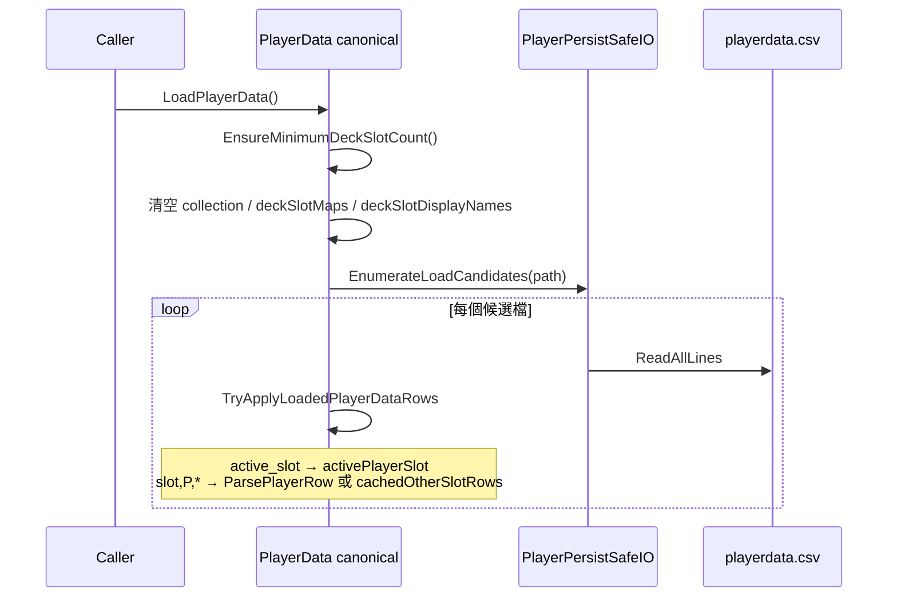
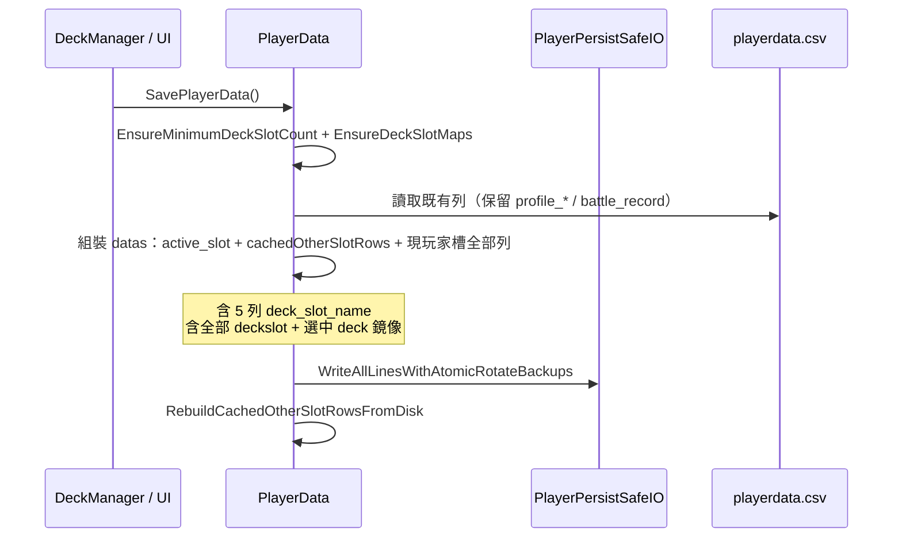
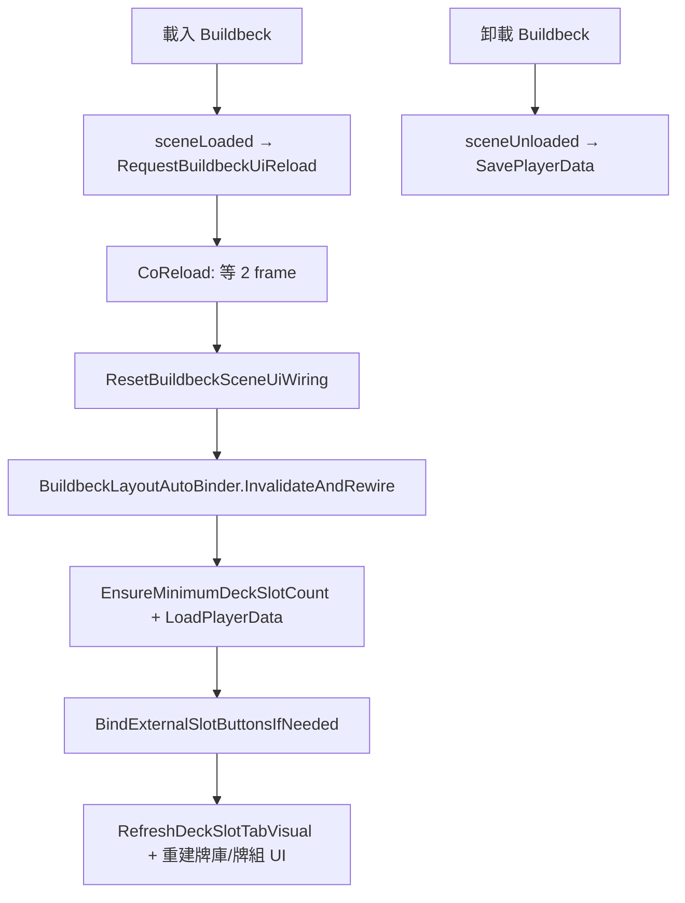

# 牌組名稱與牌組資料存檔實作說明

本文描述目前專案中 **Buildbeck（構建牌組）** 場景下，牌組**顯示名稱**與牌組**卡牌內容**如何寫入記憶體、如何序列化到磁碟，以及與玩家資訊、場景切換的互動。實作以 `PlayerData` 為唯一權威資料來源。

---

## 1. 總覽

| 項目 | 說明 |
|------|------|
| 主存檔 | `{persistentDataPath}/playerdata.csv` |
| 玩家資訊摘要 | `{persistentDataPath}/player_profile.csv`（戰績等；牌組名稱摘要來自 runtime） |
| 專案快照（開發用） | `Assets/PlayerDataSnapshots/playerdata.profile_mirror.csv` |
| 執行期單例 | `DataManager`（DontDestroyOnLoad）上的 `PlayerData` + `DeckManager` |
| 牌組槽數 | 固定至少 **5** 槽（`PlayerData.MinDeckSlotCount`），對應 UI 五個分頁 |

牌組相關資料分兩類：

1. **牌組名稱**（每槽顯示用字串）→ `deckSlotDisplayNames[]`，CSV 列 `deck_slot_name`
2. **牌組卡牌**（每槽有哪些卡、幾張）→ `deckSlotMaps[]`，CSV 列 `deckslot`；目前選中槽另有一份鏡像列 `deck`（相容舊版）

---

## 2. 核心類別與職責

```
┌─────────────────────────────────────────────────────────────┐
│  DataManager (DontDestroyOnLoad)                            │
│  ├── PlayerData  ← 唯一應讀寫存檔 (ResolveCanonical)        │
│  └── DeckManager ← Buildbeck UI、改名對話框、場景存檔鉤子   │
└─────────────────────────────────────────────────────────────┘
         ▲                              │
         │ SavePlayerData / Load        │ Bind 場景按鈕、Refresh UI
         │                              ▼
┌─────────────────┐            ┌──────────────────────┐
│ playerdata.csv  │            │ Buildbeck 場景 UI     │
└─────────────────┘            │ (每場載入重新綁定)    │
         ▲                       └──────────────────────┘
         │ SyncProfileIntoActiveSlotRows (玩家資訊)
┌─────────────────┐
│ PlayerProfile   │
│ CsvService      │
└─────────────────┘
```

| 檔案 | 職責 |
|------|------|
| `Assets/Scripts/PlayerData.cs` | 記憶體模型、CSV 讀寫、`deck_slot_name` / `deckslot` 解析 |
| `Assets/Scripts/DeckManager.cs` | 分頁切換、改名 UI、保存牌組按鈕、Buildbeck 進出場景 |
| `Assets/Scripts/BuildbeckLayoutAutoBinder.cs` | 依場景節點名稱自動綁定五個牌組按鈕與名稱文字 |
| `Assets/Scripts/PlayerProfileCsvService.cs` | 玩家資訊；`RefreshProfileFromRuntime` 會觸發存檔與 profile 列合併 |
| `Assets/Scripts/SceneLoader.cs` | 進戰鬥前可 `LoadPlayerData`；改名後應傳 `reloadFromDisk: false` |
| `Assets/Scripts/PlayerPersistSafeIO.cs` | 原子寫入與備份輪替讀取 |
| `Assets/prefabs/DataManager.prefab` | `deckSlotCount` 應為 **5**（與 UI 一致） |

**`PlayerData.ResolveCanonical()`**：所有存檔 API 若在非 canonical 實例上呼叫，會轉發到 `GameObject.Find("DataManager")` 上的那一個 `PlayerData`。

---

## 3. 記憶體資料模型

### 3.1 牌組槽（0～4）

- `deckSlotCount`：槽位數量，執行期強制 `>= MinDeckSlotCount (5)`（`EnsureMinimumDeckSlotCount()`）
- `selectedDeckSlot`：目前編輯中的槽索引（0 起算）
- `deckSlotMaps[slot]`：`Dictionary<int,int>`，key 為 runtime 卡牌 id，value 為張數
- `deckSlotDisplayNames[slot]`：該槽顯示名稱；空字串時 UI 顯示預設「牌組{n}」（n = slot + 1）

### 3.2 多玩家槽（1～3）

- `activePlayerSlot`：目前操作的角色存檔槽（CSV 第一列 `active_slot`）
- `cachedOtherSlotRows`：載入時**非** `activePlayerSlot` 的 `slot,...` 列原樣保留，存檔時寫回，避免覆蓋其他角色

### 3.3 UI 索引對照（重要）

Buildbeck 場景五個按鈕與程式索引對應如下（`DeckManager.BindExternalSlotButtonsIfNeeded`）：

| UI 按鈕欄位 | 場景常見名稱 | `onClick` 選中索引 | 預設顯示名 |
|-------------|--------------|-------------------|------------|
| `deckSlotButton1` | 牌組1 | **0** | 牌組1 |
| `deckSlotButton2` | 牌組2 | **1** | 牌組2 |
| `deckSlotButton3` | 牌組3 | **2** | 牌組3 |
| `deckSlotButton4` | 牌組4 | **3** | 牌組4 |
| `deckSlotButton5` | 牌組5 | **4** | 牌組5 |

使用者口頭「槽位 3」通常指**第三個分頁**（索引 **2**）或 CSV 中的 `deck_slot_name,2,...`；若 `deckSlotCount` 小於 5，索引 3、4 會被 `Clamp` 到錯誤槽位，造成無法保存（已透過 `MinDeckSlotCount` 防護）。

---

## 4. CSV 格式（`playerdata.csv`）

### 4.1 列結構慣例

- 第一列：`active_slot,{1|2|3}`
- 角色資料：`slot,{玩家槽},{欄位},...`
- 僅作用於**目前玩家槽**的列在載入時會拆成 `scoped` 再交給 `ParsePlayerRow`

範例（玩家槽 1、牌組槽 0～4）：

```csv
active_slot,1
slot,1,coins,500
slot,1,selected_deck_slot,2
slot,1,slot_name,玩家1
slot,1,deck_slot_name,0,肥鳥隊
slot,1,deck_slot_name,1,國王隊
slot,1,deck_slot_name,2,速攻
slot,1,deck_slot_name,3,控制
slot,1,deck_slot_name,4,實驗
slot,1,deckslot,0,m,13,2
slot,1,deckslot,2,m,22,1
slot,1,deck,m,13,2
slot,1,deck,m,22,1
```

### 4.2 牌組名稱列 `deck_slot_name`

| 欄位 | 意義 |
|------|------|
| `slot` | 固定字串 |
| 玩家槽 | `activePlayerSlot`（1～3） |
| `deck_slot_name` | 列類型 |
| 牌組槽索引 | **0～4**（非 UI 的 1～5） |
| 名稱 | 最多 24 字；逗號會被移除 |

載入時 scoped 為：`deck_slot_name,{索引},{名稱}`；名稱若含逗號，會自索引 2 起接回整段字串。

### 4.3 牌組卡牌列 `deckslot`

| 形式 | 說明 |
|------|------|
| `slot,P,deckslot,S,m,{monsterId},{count}` | 怪物 |
| `slot,P,deckslot,S,s,{spellOrdinal},{count}` | 法術（ordinal 經 `DeckCardId` 轉 key） |
| `slot,P,deck,S,m,...` | **僅** `selectedDeckSlot` 的鏡像（舊版相容）；若已有 `deckslot` 列則忽略 root `deck` |

存檔時：

- 會寫入**所有**槽的 `deckslot`（`deckSlotMaps[0..deckSlotCount-1]`）
- 另寫一份目前選中槽的 `deck` 列（與舊讀檔邏輯相容）

### 4.4 名稱清理 `SanitizeDeckSlotName`

- 去空白、換行
- **逗號替換為空格**（避免破壞 CSV）
- 最長 24 字元

---

## 5. 讀檔流程 `LoadPlayerData()`



**`TryApplyLoadedPlayerDataRows` 要點：**

1. 讀 `active_slot` 決定 `activePlayerSlot`
2. `slot,{其他玩家},...` → 加入 `cachedOtherSlotRows`，不解析進記憶體
3. `slot,{activePlayerSlot},{key},...` → 去掉前兩欄後 `ParsePlayerRow`
4. `deck_slot_name` → 寫入 `deckSlotDisplayNames[deckSlotIdx]`（會 clamp 到 `0..deckSlotCount-1`）
5. `deckslot` → 寫入對應 `deckSlotMaps[slot]`

**常見呼叫時機：**

| 時機 | 檔案 | 注意 |
|------|------|------|
| 遊戲啟動 | `PlayerData.Awake`（canonical） | 先 `EnsureMinimumDeckSlotCount` 再載入 |
| 進入 Buildbeck | `DeckManager.CoReloadBuildbeckDeckUiAfterSceneLoad` | 重綁 UI 後從磁碟重載 |
| 大廳資源列 | `HallSceneFeatureBinder.RefreshResourceDisplay` | 會重載 |
| 進入戰鬥預覽 | `SceneLoader.EnterBattle` | 總是重載 |
| 改名／存牌組後 | 應**避免**立刻重載 | 見 `RefreshEnterBattleState(false)` |

---

## 6. 存檔流程 `SavePlayerData()`



**組裝順序（現玩家槽 `current` 列表）：**

1. `coins`, `selected_deck_slot`, `slot_name`
2. **五筆** `deck_slot_name,0..4`（空名稱也會寫入，讀取時 fallback 為「牌組n」）
3. `card`（收藏）
4. `deckslot`（每槽所有卡牌）
5. `deck`（僅 `selectedDeckSlot`）
6. `proficiency`（若有）
7. 合併後附加既有的 `profile_*`、`battle_record` 列（避免洗掉戰績）

寫入使用 `PlayerPersistSafeIO.WriteAllLinesWithAtomicRotateBackups`，降低寫到一半損檔的風險。

---

## 7. 牌組名稱：UI 到磁碟

### 7.1 編輯與確認

| 步驟 | 方法 | 說明 |
|------|------|------|
| 開啟編輯 | `DeckManager.ShowDeckNameEditDialog` | 讀取 `GetDeckSlotDisplayName(selectedDeckSlot)` 填入輸入框 |
| 確認 | `DeckManager.ConfirmDeckNameEdit` | `ResolveCanonical()` → `EnsureMinimumDeckSlotCount()` → `SetDeckSlotDisplayName(nameSlot, text)` → `SavePlayerData()` |
| 刷新 UI | `RefreshDeckSlotTabVisual` | 更新五個分頁按鈕文字與中央牌組名稱 TMP |

`SetDeckSlotDisplayName` 僅改記憶體陣列；**必須**再呼叫 `SavePlayerData()` 才會進 CSV。

### 7.2 顯示

- 分頁按鈕：`SetSlotButtonLabel(button, indexOneBased)` → `GetDeckSlotDisplayName(slot0)`
- 中央標題：`RefreshCurrentDeckDisplayName` → 目前 `selectedDeckSlot` 的名稱

---

## 8. 牌組卡牌：編輯與保存

### 8.1 執行期修改

在 Buildbeck 拖放／點擊卡牌時，經 `DeckDataController` / `DeckManager` 更新：

- `PlayerData.SetDeckCount(selectedDeckSlot, cardId, count)` 或 `AddDeckCount` 等

此時資料只在記憶體，**尚未**寫入磁碟。

### 8.2 寫入磁碟的時機

| 操作 | 是否 `SavePlayerData` |
|------|----------------------|
| 按「保存牌組」 | 是（`OnClickSaveDeckButton`） |
| 切換牌組分頁 | 是（`SelectDeckSlot`） |
| 確認改名 | 是 |
| 解散牌組 | 是 |
| 離開 Buildbeck 場景 | 是（`OnSceneUnloadedFlushBuildbeckSave`） |
| 開啟玩家資訊浮層 | 是（經 `RefreshProfileFromRuntime`） |

### 8.3 進入戰鬥

`SceneLoader.EnterBattle()` 會先 `LoadPlayerData()`，確保使用磁碟上最新牌組；與 Buildbeck 內剛存完尚未離場的流程不同。

---

## 9. 玩家資訊與 `PlayerProfileCsvService`

開啟 GlobalNav「玩家資訊」時：

```
RefreshPlayerInfoOverlayContent()
  → PlayerProfileCsvService.RefreshProfileFromRuntime()
       → playerData.SavePlayerData()     // 完整寫入含 deck_slot_name
       → BuildDeckSummary(playerData)    // 摘要字串給 profile_decks
       → Save(player_profile.csv)
       → SyncProfileIntoActiveSlotRows()
```

**`SyncProfileIntoActiveSlotRows` 行為：**

1. 讀取現有 `playerdata.csv`
2. 刪除現玩家槽的 `profile_*`、`battle_record`、**以及舊的 `deck_slot_name` 列**
3. 若 runtime 有 `PlayerData`：依記憶體重新寫入 5 列 `deck_slot_name`
4. 若無 runtime：保留檔案內原本的 `deck_slot_name` 列
5. 寫回 `profile_*` 與戰績列

因此玩家資訊流程**依賴**前面先執行完整 `SavePlayerData()`，避免僅合併 profile 時把名稱洗回預設值。

關閉玩家資訊且仍在 Buildbeck 時，`GlobalNavRuntime` 會呼叫 `DeckManager.RefreshBuildbeckDeckNameLabelsIfActive()` 重綁 UI 並刷新標籤。

---

## 10. Buildbeck 場景生命週期

`DeckManager` 掛在 **DataManager**（跨場景存活），Buildbeck 場景內的 UI 物件每場重新載入，需重新綁定引用。



**注意：**

- 僅 **canonical** `DeckManager`（DataManager 上）註冊 `sceneLoaded` / `sceneUnloaded`；場景內重複元件被 `DestroyImmediate` 時不得解除訂閱（`IsCanonicalDeckManagerInstance()`）。
- `externalSlotButtonsBound` 在重綁前會被清空，避免指向已銷毀的按鈕卻以為已綁定。

---

## 11. 避免覆蓋記憶體的約定

剛在 Buildbeck 執行 `SavePlayerData()` 後，若立刻 `LoadPlayerData()`，可能從**備份候選檔**讀到略舊內容而蓋掉剛改的名稱。

**做法：** `SceneLoader.RefreshEnterBattleState(reloadFromDisk: false)`

已在以下流程使用 `false`：

- `ConfirmDeckNameEdit`
- `OnClickSaveDeckButton`
- `SelectDeckSlot`
- `CoReloadBuildbeckDeckUiAfterSceneLoad` 結尾

需要與磁碟強一致時（進戰鬥、大廳刷新）才使用 `true` 或預設重載。

---

## 12. 已知風險與除錯

| 現象 | 可能原因 | 檢查方式 |
|------|----------|----------|
| 第 4、5 槽無法改名 | `deckSlotCount < 5` 導致 clamp | 確認 prefab、`EnsureMinimumDeckSlotCount`、CSV 是否有 `deck_slot_name,3` / `,4` |
| 改名後切場景又變回預設 | 離開 Buildbeck 未存檔；或玩家資訊 Sync 覆寫 | 查 `playerdata.csv` 的 `deck_slot_name`；確認 `sceneUnloaded` 有觸發 |
| UI 顯示牌組1～5 但資料是別的名 | UI 未重綁，仍顯示場景預設文字 | 進 Buildbeck 後是否執行 `RefreshDeckSlotTabVisual` |
| 存檔有名稱但進戰鬥是舊牌 | 進戰鬥前未按保存／未切槽觸發存檔 | `EnterBattle` 會 `LoadPlayerData` 讀磁碟 |

**建議除錯路徑：**

1. 執行期：`%USERPROFILE%\AppData\LocalLow\<CompanyName>\<ProductName>\playerdata.csv`
2. 搜尋 `deck_slot_name` 與 `deckslot` 是否對應正確玩家槽、牌組槽索引
3. Unity Console：`Save path:` / `Load from persistent:` 日誌

---

## 13. 相關程式進入點速查

| 需求 | 方法 |
|------|------|
| 讀檔 | `PlayerData.LoadPlayerData()` |
| 存檔 | `PlayerData.SavePlayerData()` |
| 改某槽名稱 | `PlayerData.SetDeckSlotDisplayName(slot, name)` + `SavePlayerData()` |
| 讀某槽名稱 | `PlayerData.GetDeckSlotDisplayName(slot)` |
| 選中槽 | `PlayerData.SetSelectedDeckSlot` / `DeckManager.SelectDeckSlot` |
| 改某槽卡牌 | `PlayerData.SetDeckCount(slot, id, count)` 等 |
| 取得 canonical | `PlayerData.ResolveCanonical()` |

---

## 14. 版本與維護備註

- 牌組槽數以 **`PlayerData.MinDeckSlotCount = 5`** 為準；`DataManager.prefab` 的 `deckSlotCount` 應為 5。
- 舊存檔若僅 3 槽資料，升級後會在載入／存檔時擴充為 5 槽；第 4、5 槽名稱需使用者重新命名一次以寫入正確索引。
- 本文對應程式約 2025～2026 年 Buildbeck 存檔修正後行為；若調整 CSV 欄位請同步更新 `ParsePlayerRow` / `SavePlayerData` 與本文件。
