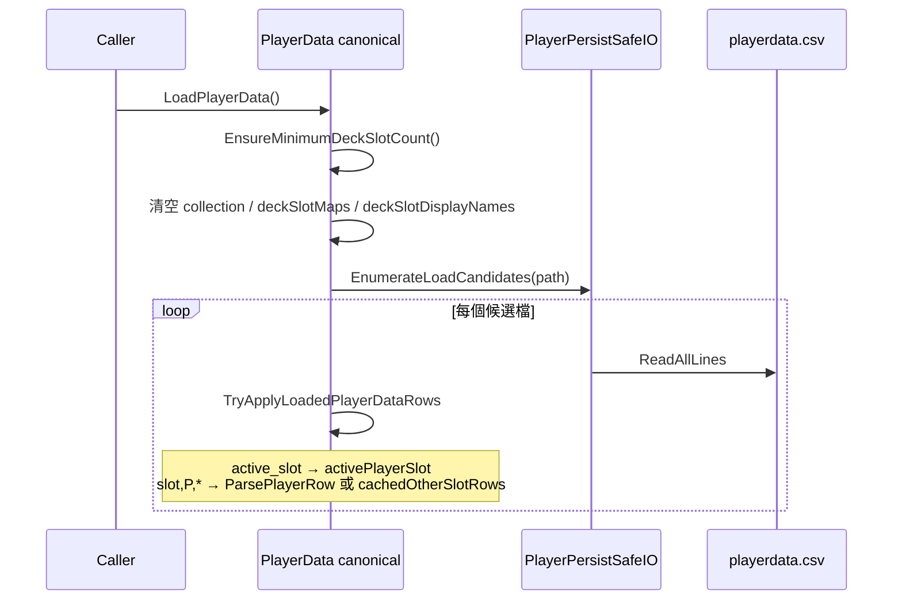
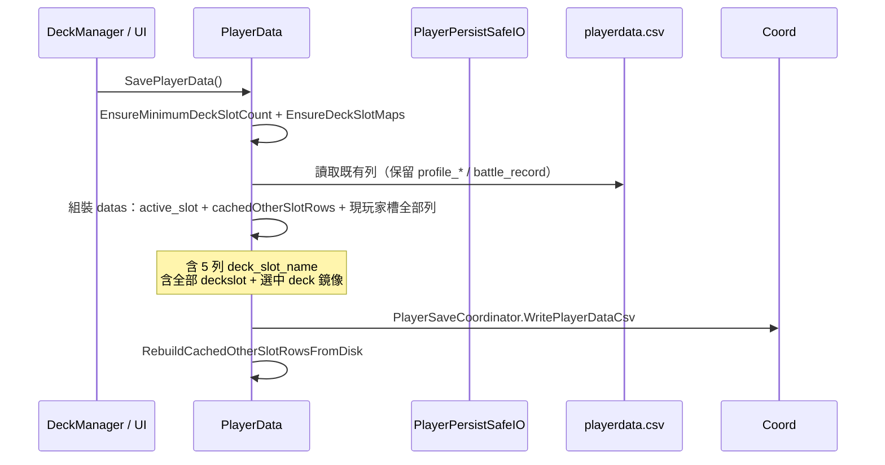
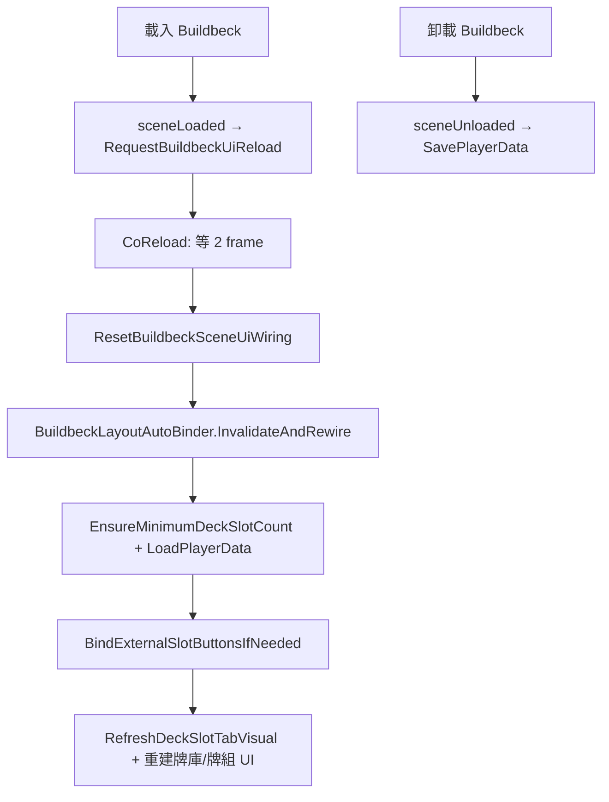

# 牌組名稱與牌組資料存檔實作說明

本文描述目前專案中 **Buildbeck（構建牌組）** 場景下，牌組**顯示名稱**與牌組**卡牌內容**如何寫入記憶體、如何序列化到磁碟，以及與玩家資訊、場景切換的互動。實作以 `PlayerData` 為唯一權威資料來源。

---

## 1. 總覽

| 項目 | 說明 |
|------|------|
| 主存檔 | `{persistentDataPath}/playerdata.csv` |
| 玩家資訊摘要 | `{persistentDataPath}/player_profile.csv`（戰績等；牌組名稱摘要來自 runtime） |
| 專案快照（開發用） | `Assets/PlayerDataSnapshots/playerdata.profile_mirror.csv` |
| 執行期單例 | `DataManager`（DontDestroyOnLoad）上的 `PlayerData` + `DeckManager` |
| 牌組槽數 | 固定至少 **5** 槽（`PlayerData.MinDeckSlotCount`），對應 UI 五個分頁 |

牌組相關資料分兩類：

1. **牌組名稱**（每槽顯示用字串）→ `deckSlotDisplayNames[]`，CSV 列 `deck_slot_name`
2. **牌組卡牌**（每槽有哪些卡、幾張）→ `deckSlotMaps[]`，CSV 列 `deckslot`；目前選中槽另有一份鏡像列 `deck`（相容舊版）

---

## 2. 核心類別與職責

```
┌─────────────────────────────────────────────────────────────┐
│  DataManager (DontDestroyOnLoad)                            │
│  ├── PlayerData  ← 唯一應讀寫存檔 (ResolveCanonical)        │
│  └── DeckManager ← Buildbeck UI、改名對話框、場景存檔鉤子   │
└─────────────────────────────────────────────────────────────┘
         ▲                              │
         │ SavePlayerData / Load        │ Bind 場景按鈕、Refresh UI
         │                              ▼
┌─────────────────┐            ┌──────────────────────┐
│ playerdata.csv  │            │ Buildbeck 場景 UI     │
└─────────────────┘            │ (每場載入重新綁定)    │
         ▲                       └──────────────────────┘
         │ SyncProfileIntoActiveSlotRows (玩家資訊)
┌─────────────────┐
│ PlayerProfile   │
│ CsvService      │
└─────────────────┘
```

| 檔案 | 職責 |
|------|------|
| `Assets/Scripts/PlayerDeckSlotNameStorage.cs` | **牌組顯示名稱**讀寫、CSV 列、Buildbeck 確定流程、存檔污染清理、profile 摘要橋接 |
| `Assets/Scripts/PlayerData.cs`（含 `Load`/`Save` partial） | 記憶體模型、`deckslot` / `card` 解析；名稱 API 轉接至 `PlayerDeckSlotNameStorage` |
| `Assets/Scripts/DeckManager.cs` | 分頁切換、改名 UI、保存牌組按鈕、Buildbeck 進出場景 |
| `Assets/Scripts/BuildbeckLayoutAutoBinder.cs` | 依場景節點名稱自動綁定五個牌組按鈕與名稱文字（優先 `EditDeckNameButton` 子節點） |
| `Assets/Scripts/PlayerProfileCsvService.cs` | 玩家資訊 profile；**開啟面板**用 `LoadProfileForPlayerInfoDisplay()`（不寫檔） |
| `Assets/Scripts/GlobalNavRuntime.cs` | 玩家資訊浮層；關閉後 `RefreshBuildbeckDeckNameDisplayFromMemory()` |
| `Assets/Scripts/PlayerSaveCoordinator.cs` | 唯一寫入 `playerdata.csv` 的協調器 |
| `Assets/Scripts/SceneLoader.cs` | 進戰鬥前可 `LoadPlayerData`；改名後應傳 `reloadFromDisk: false` |
| `Assets/Scripts/PlayerPersistSafeIO.cs` | 原子寫入與備份輪替讀取 |
| `Assets/Scripts/PlayerSaveDebouncer.cs` | Buildbeck 高頻編輯的延遲合併存檔 |
| `Assets/Scripts/ValuablesVaultState.cs` | 貴重品庫記憶體快取；完整存檔時由 `SavePlayerData` 一併寫入 |
| `Assets/prefabs/DataManager.prefab` | `deckSlotCount` 應為 **5**（與 UI 一致） |

**`PlayerData.ResolveCanonical()`**：所有存檔 API 若在非 canonical 實例上呼叫，會轉發到 `GameObject.Find("DataManager")` 上的那一個 `PlayerData`。

---

## 3. 記憶體資料模型

### 3.1 牌組槽（0～4）

- `deckSlotCount`：槽位數量，執行期強制 `>= MinDeckSlotCount (5)`（`EnsureMinimumDeckSlotCount()`）
- `selectedDeckSlot`：目前編輯中的槽索引（0 起算）
- `deckSlotMaps[slot]`：`Dictionary<int,int>`，key 為 runtime 卡牌 id，value 為張數
- `deckSlotDisplayNames[slot]`：該槽顯示名稱；空字串時 UI 顯示預設「牌組{n}」（n = slot + 1）

### 3.2 多玩家槽（1～3）

- `activePlayerSlot`：目前操作的角色存檔槽（CSV 第一列 `active_slot`）
- `cachedOtherSlotRows`：載入時**非** `activePlayerSlot` 的 `slot,...` 列原樣保留，存檔時寫回，避免覆蓋其他角色

### 3.3 UI 索引對照（重要）

Buildbeck 場景五個按鈕與程式索引對應如下（`DeckManager.BindExternalSlotButtonsIfNeeded`）：

| UI 按鈕欄位 | 場景常見名稱 | `onClick` 選中索引 | 預設顯示名 |
|-------------|--------------|-------------------|------------|
| `deckSlotButton1` | 牌組1 | **0** | 牌組1 |
| `deckSlotButton2` | 牌組2 | **1** | 牌組2 |
| `deckSlotButton3` | 牌組3 | **2** | 牌組3 |
| `deckSlotButton4` | 牌組4 | **3** | 牌組4 |
| `deckSlotButton5` | 牌組5 | **4** | 牌組5 |

使用者口頭「槽位 3」通常指**第三個分頁**（索引 **2**）或 CSV 中的 `deck_slot_name,2,...`；若 `deckSlotCount` 小於 5，索引 3、4 會被 `Clamp` 到錯誤槽位，造成無法保存（已透過 `MinDeckSlotCount` 防護）。

---

## 4. CSV 格式（`playerdata.csv`）

### 4.1 列結構慣例

- 第一列：`active_slot,{1|2|3}`
- 角色資料：`slot,{玩家槽},{欄位},...`
- 僅作用於**目前玩家槽**的列在載入時會拆成 `scoped` 再交給 `ParsePlayerRow`

範例（玩家槽 1、牌組槽 0～4）：

```csv
active_slot,1
slot,1,coins,500
slot,1,selected_deck_slot,2
slot,1,slot_name,玩家1
slot,1,deck_slot_name,0,肥鳥隊
slot,1,deck_slot_name,1,國王隊
slot,1,deck_slot_name,2,速攻
slot,1,deck_slot_name,3,控制
slot,1,deck_slot_name,4,實驗
slot,1,deckslot,0,m,13,2
slot,1,deckslot,2,m,22,1
slot,1,deck,m,13,2
slot,1,deck,m,22,1
```

### 4.2 牌組名稱列 `deck_slot_name`

| 欄位 | 意義 |
|------|------|
| `slot` | 固定字串 |
| 玩家槽 | `activePlayerSlot`（1～3） |
| `deck_slot_name` | 列類型 |
| 牌組槽索引 | **0～4**（非 UI 的 1～5） |
| 名稱 | 最多 24 字；逗號會被移除 |

載入時 scoped 為：`deck_slot_name,{索引},{名稱}`；名稱若含逗號，會自索引 2 起接回整段字串。

### 4.3 牌組卡牌列 `deckslot`

| 形式 | 說明 |
|------|------|
| `slot,P,deckslot,S,m,{monsterId},{count}` | 怪物 |
| `slot,P,deckslot,S,s,{spellOrdinal},{count}` | 法術（ordinal 經 `DeckCardId` 轉 key） |
| `slot,P,deck,S,m,...` | **僅** `selectedDeckSlot` 的鏡像（舊版相容）；若已有 `deckslot` 列則忽略 root `deck` |

存檔時：

- 會寫入**所有**槽的 `deckslot`（`deckSlotMaps[0..deckSlotCount-1]`）
- 另寫一份目前選中槽的 `deck` 列（與舊讀檔邏輯相容）

### 4.4 名稱清理 `SanitizeDeckSlotName`

- 去空白、換行
- **逗號替換為空格**（避免破壞 CSV）
- 最長 24 字元

---

## 5. 讀檔流程 `LoadPlayerData()`


```mermaid
sequenceDiagram
    participant Caller
    participant PD as PlayerData canonical
    participant IO as PlayerPersistSafeIO
    participant CSV as playerdata.csv

    Caller->>PD: LoadPlayerData()
    PD->>PD: EnsureMinimumDeckSlotCount()
    PD->>PD: 清空 collection / deckSlotMaps / deckSlotDisplayNames
    PD->>IO: EnumerateLoadCandidates(path)
    loop 每個候選檔
        IO->>CSV: ReadAllLines
        PD->>PD: TryApplyLoadedPlayerDataRows
        Note over PD: active_slot → activePlayerSlot<br/>slot,P,* → ParsePlayerRow 或 cachedOtherSlotRows
    end
```

**`TryApplyLoadedPlayerDataRows` 要點：**

1. 讀 `active_slot` 決定 `activePlayerSlot`
2. `slot,{其他玩家},...` → 加入 `cachedOtherSlotRows`，不解析進記憶體
3. `slot,{activePlayerSlot},{key},...` → 去掉前兩欄後 `ParsePlayerRow`
4. `deck_slot_name` → 寫入 `deckSlotDisplayNames[deckSlotIdx]`（會 clamp 到 `0..deckSlotCount-1`）
5. `deckslot` → 寫入對應 `deckSlotMaps[slot]`

**常見呼叫時機：**

| 時機 | 檔案 | 注意 |
|------|------|------|
| 遊戲啟動 | `PlayerData.Awake`（canonical） | 先 `EnsureMinimumDeckSlotCount` 再載入 |
| 進入 Buildbeck | `DeckManager.CoReloadBuildbeckDeckUiAfterSceneLoad` | 重綁 UI 後從磁碟重載 |
| 大廳資源列 | `HallSceneFeatureBinder.RefreshResourceDisplay` | 會重載 |
| 進入戰鬥預覽 | `SceneLoader.EnterBattle` | 總是重載 |
| 改名／存牌組後 | 應**避免**立刻重載 | 見 `RefreshEnterBattleState(false)` |

---

## 6. 存檔流程 `SavePlayerData()`


```mermaid
sequenceDiagram
    participant DM as DeckManager / UI
    participant PD as PlayerData
    participant IO as PlayerPersistSafeIO
    participant CSV as playerdata.csv

    DM->>PD: SavePlayerData()
    PD->>PD: EnsureMinimumDeckSlotCount + EnsureDeckSlotMaps
    PD->>CSV: 讀取既有列（保留 profile_* / battle_record）
    PD->>PD: 組裝 datas：active_slot + cachedOtherSlotRows + 現玩家槽全部列
    Note over PD: 含 5 列 deck_slot_name<br/>含全部 deckslot + 選中 deck 鏡像
    PD->>Coord: PlayerSaveCoordinator.WritePlayerDataCsv
    PD->>PD: RebuildCachedOtherSlotRowsFromDisk
```

**組裝順序（現玩家槽 `current` 列表）：**

1. `coins`, `selected_deck_slot`, `slot_name`
2. **五筆** `deck_slot_name,0..4`（**僅寫 raw 自訂名**；未自訂時為**空白**，UI 顯示 fallback「牌組n」）
3. `card`（收藏）
4. `deckslot`（每槽所有卡牌）
5. `deck`（僅 `selectedDeckSlot`）
6. `proficiency`（若有）
7. 合併後附加既有的 `profile_*`、`battle_record`、教學／港灣旗標等 **preserve** 列（避免洗掉戰績與進度）
8. `ValuablesVaultState.AppendAllSlotsSerializedRows`：三個角色槽的 `valuable` 列（記憶體快取為準）

寫入經 `PlayerSaveCoordinator` → `PlayerPersistSafeIO.WriteAllLinesWithAtomicRotateBackups`，降低寫到一半損檔與多模組互相覆蓋的風險。

**新功能約定：** 請勿對 `playerdata.csv` 直接呼叫 `PlayerPersistSafeIO.Write…`；旗標類小改可用 `PlayerSaveCoordinator.UpsertSlotKeyedRow`。

---

## 7. 牌組名稱：UI 到磁碟

### 7.1 編輯與確認

| 步驟 | 方法 | 說明 |
|------|------|------|
| 開啟編輯 | `DeckManager.ShowDeckNameEditDialog` | 讀取 `GetDeckSlotDisplayName(selectedDeckSlot)` 填入輸入框 |
| 確認 | `DeckManager.ConfirmDeckNameEdit` | `PlayerDeckSlotNameStorage.ConfirmBuildbeckRename` → 記憶體 + `SavePlayerData` + `SyncDeckSummaryFromRuntime` + UI 刷新 |
| 解散牌組 | `DeckManager.PerformResetDeckForRebuild` | 清空該槽卡牌並 `ResetSelectedDeckSlotNameToDefault` + 存檔 |
| 刷新 UI | `RefreshDeckSlotTabVisual` | 更新五個分頁按鈕文字與中央牌組名稱 TMP |

`SetDeckSlotDisplayName` 僅改記憶體陣列；**必須**再呼叫 `SavePlayerData()` 才會進 CSV。

### 7.2 顯示

- 分頁按鈕：`SetSlotButtonLabel(button, indexOneBased)` → `GetDeckSlotDisplayName(slot0)`
- 中央標題：`RefreshCurrentDeckDisplayName` → 目前 `selectedDeckSlot` 的名稱

---

## 8. 牌組卡牌：編輯與保存

### 8.1 執行期修改

在 Buildbeck 拖放／點擊卡牌時，經 `DeckDataController` / `DeckManager` 更新：

- `PlayerData.SetDeckCount(selectedDeckSlot, cardId, count)` 或 `AddDeckCount` 等

此時資料只在記憶體，**尚未**寫入磁碟。

### 8.2 寫入磁碟的時機

| 操作 | 存檔 API | 說明 |
|------|----------|------|
| 拖放／點擊調整牌組 | `SavePlayerDataDebounced()` | 約 0.75s 內合併多次寫入 |
| 切換牌組分頁 | `SavePlayerDataDebounced()` | 同上 |
| 按「保存牌組」 | `SavePlayerData()` | 立即寫入 |
| 確認改名 | `SavePlayerData()` | 立即寫入 |
| 解散牌組 | `SavePlayerData()` + profile sync | 立即寫入；名稱還原預設 |
| 離開 Buildbeck 場景 | `FlushDebouncedThenSavePlayerData()` | 先取消延遲再完整存檔 |
| 進入戰鬥預覽 | `FlushDebouncedThenSavePlayerData()` + `LoadPlayerData()` | 避免延遲存檔尚未落盤 |
| **開啟玩家資訊浮層** | `LoadProfileForPlayerInfoDisplay()` | **僅讀** runtime 組摘要，**不** `RefreshProfileFromRuntime` |
| **關閉玩家資訊（Buildbeck）** | `RefreshBuildbeckDeckNameDisplayFromMemory()` | 只刷新 UI，不重綁場景、不 Load |
| 需寫入 profile 戰績等 | `RefreshProfileFromRuntime()` | 完整存檔 + `SyncProfileIntoActiveSlotRows` |

### 8.3 進入戰鬥

`SceneLoader.EnterBattle()` 會先 `FlushDebouncedThenSavePlayerData()`，再 `LoadPlayerData()`，確保使用磁碟上最新牌組；與 Buildbeck 內剛編輯、僅記憶體尚未延遲落盤的流程不同。

---

## 9. 玩家資訊與 `PlayerProfileCsvService`

### 9.1 開啟玩家資訊（顯示用，2026-06 定案）

```
RefreshPlayerInfoOverlayContent()
  → PlayerProfileCsvService.LoadProfileForPlayerInfoDisplay()
       → 合併 profile 列（讀取）
       → p.decks = BuildDeckSummaryLine(runtime)   // 不寫 playerdata.csv
  → 更新浮層 UI
  → RefreshBuildbeckDeckNameDisplayFromMemory()   // Buildbeck 僅刷新標籤
```

**不得**在開啟面板時呼叫 `RefreshProfileFromRuntime()`，否則 `SavePlayerData` / profile merge 可能觸發 `LoadPlayerData()`，覆寫剛改好的牌組名稱。

### 9.2 需持久化 profile 時（戰績更新、SetRole 等）

```
RefreshProfileFromRuntime()
  → BuildDeckSummaryLine(runtime)
  → playerData.SavePlayerData()
  → Save(player_profile.csv)
  → SyncProfileIntoActiveSlotRows()
```

**`SyncProfileIntoActiveSlotRows` 行為：**

1. 讀取現有 `playerdata.csv`
2. 刪除現玩家槽的 `profile_*`、`battle_record`、**以及舊的 `deck_slot_name` 列**
3. 若 runtime 有 `PlayerData`：依**記憶體**重新寫入 5 列 `deck_slot_name`（**不在 merge 內 LoadPlayerData**）
4. 若無 runtime：保留檔案內原本的 `deck_slot_name` 列
5. 寫回 `profile_*` 與戰績列

改名確認後請用 `SyncDeckSummaryFromRuntime()` 更新 `profile_decks` 摘要。

關閉玩家資訊且仍在 Buildbeck 時，`GlobalNavRuntime` 呼叫 `DeckManager.RefreshBuildbeckDeckNameDisplayFromMemory()`（非 `InvalidateAndRewire`）。

---

## 10. Buildbeck 場景生命週期

`DeckManager` 掛在 **DataManager**（跨場景存活），Buildbeck 場景內的 UI 物件每場重新載入，需重新綁定引用。


```mermaid
flowchart TD
    A[載入 Buildbeck] --> B[sceneLoaded → RequestBuildbeckUiReload]
    B --> C[CoReload: 等 2 frame]
    C --> D[ResetBuildbeckSceneUiWiring]
    D --> E[BuildbeckLayoutAutoBinder.InvalidateAndRewire]
    E --> F[EnsureMinimumDeckSlotCount + LoadPlayerData]
    F --> G[BindExternalSlotButtonsIfNeeded]
    G --> H[RefreshDeckSlotTabVisual + 重建牌庫/牌組 UI]

    I[卸載 Buildbeck] --> J[sceneUnloaded → SavePlayerData]
```

**注意：**

- 僅 **canonical** `DeckManager`（DataManager 上）註冊 `sceneLoaded` / `sceneUnloaded`；場景內重複元件被 `DestroyImmediate` 時不得解除訂閱（`IsCanonicalDeckManagerInstance()`）。
- `externalSlotButtonsBound` 在重綁前會被清空，避免指向已銷毀的按鈕卻以為已綁定。

---

## 11. 避免覆蓋記憶體的約定

剛在 Buildbeck 執行 `SavePlayerData()` 後，若立刻 `LoadPlayerData()`，可能從**備份候選檔**讀到略舊內容而蓋掉剛改的名稱。

**做法：** `SceneLoader.RefreshEnterBattleState(reloadFromDisk: false)`

已在以下流程使用 `false`：

- `ConfirmDeckNameEdit`
- `OnClickSaveDeckButton`
- `SelectDeckSlot`
- `CoReloadBuildbeckDeckUiAfterSceneLoad` 結尾

需要與磁碟強一致時（進戰鬥、大廳刷新）才使用 `true` 或預設重載。

---

## 12. 已知風險與除錯

| 現象 | 可能原因 | 檢查方式 |
|------|----------|----------|
| 第 4、5 槽無法改名 | `deckSlotCount < 5` 導致 clamp | 確認 prefab、`EnsureMinimumDeckSlotCount`、CSV 是否有 `deck_slot_name,3` / `,4` |
| 改名後切場景又變回預設 | 離開 Buildbeck 未存檔；或開玩家資訊曾用 `RefreshProfileFromRuntime` | 查 CSV；確認 §9.1 路徑；`P0_MANUAL_REGRESSION` §C |
| 開玩家資訊後名稱回溯 | 面板開啟觸發 Save+Load | 應為 `LoadProfileForPlayerInfoDisplay`（2026-06 已修） |
| CSV 亂碼／`deck_slot_na` 污染 | 舊版錯誤寫入 | `RepairPersistedDeckSlotNamePollutionIfNeeded` 於 `LoadPlayerData` 前；見 `Docs/DECK_SLOT_NAME_BUG_CHECKLIST.md` |
| UI 顯示牌組1～5 但資料是別的名 | UI 未重綁，仍顯示場景預設文字 | 進 Buildbeck 後是否執行 `RefreshDeckSlotTabVisual` |
| 存檔有名稱但進戰鬥是舊牌 | 進戰鬥前未按保存／未切槽觸發存檔 | `EnterBattle` 會 `LoadPlayerData` 讀磁碟 |

**建議除錯路徑：**

1. 執行期：`%USERPROFILE%\AppData\LocalLow\<CompanyName>\<ProductName>\playerdata.csv`
2. 搜尋 `deck_slot_name` 與 `deckslot` 是否對應正確玩家槽、牌組槽索引
3. Unity Console：`Save path:` / `Load from persistent:` 日誌

---

## 13. 相關程式進入點速查

| 需求 | 方法 |
|------|------|
| 讀檔 | `PlayerData.LoadPlayerData()` |
| 存檔 | `PlayerData.SavePlayerData()` |
| 改某槽名稱 | `PlayerDeckSlotNameStorage.ConfirmRenameAndPersist` 或 `SetCustomName` + `SavePlayerData()` |
| 讀某槽 raw 名稱 | `PlayerDeckSlotNameStorage.GetRawName` / `PlayerData.GetDeckSlotDisplayNameRaw` |
| 讀某槽顯示名稱 | `PlayerData.GetDeckSlotDisplayName(slot)`（含「牌組n」fallback） |
| 選中槽 | `PlayerData.SetSelectedDeckSlot` / `DeckManager.SelectDeckSlot` |
| 改某槽卡牌 | `PlayerData.SetDeckCount(slot, id, count)` 等 |
| 取得 canonical | `PlayerData.ResolveCanonical()` |

---

## 14. 版本與維護備註

- 牌組槽數以 **`PlayerData.MinDeckSlotCount = 5`** 為準；`DataManager.prefab` 的 `deckSlotCount` 應為 5。
- 舊存檔若僅 3 槽資料，升級後會在載入／存檔時擴充為 5 槽；第 4、5 槽名稱需使用者重新命名一次以寫入正確索引。
- 本文對應程式約 2025～2026 年 Buildbeck 存檔修正後行為；若調整 CSV 欄位請同步更新 `ParsePlayerRow` / `SavePlayerData` 與本文件。
- **2026-06 牌組名稱定案**：驗收清單 [`Docs/DECK_SLOT_NAME_BUG_CHECKLIST.md`](Docs/DECK_SLOT_NAME_BUG_CHECKLIST.md)；手動回歸 [`P0_MANUAL_REGRESSION.md`](P0_MANUAL_REGRESSION.md) §C；Bug 場景 `Bug handling scenarios` + `BugHandlingDeckSlotNameScenario.cs`。

## 15. 貴重品庫與協調器（2026-05）

- **`valuable` 列**（6 欄）不再由各功能各自整檔覆寫；`ValuablesVaultState` 僅更新記憶體快取，`SavePlayerData` 結尾呼叫 `AppendAllSlotsSerializedRows` 一次寫入三槽。
- **教學／港灣旗標** 的即時小改走 `PlayerSaveCoordinator.UpsertSlotKeyedRow`；完整存檔仍透過 `ShouldPreserveActiveSlotRowOnPlayerSave` 保留未重建的 4 欄旗標列。
- **`player_profile.csv`** 仍可直接使用 `PlayerPersistSafeIO`（與主檔分離）。

## 16. 手機／切背景落盤（2026-05）

`PlayerData`（canonical / `DataManager`）在 **`OnApplicationPause(true)`** 與 **`OnApplicationQuit`** 呼叫 `PlayerSaveCoordinator.FlushPendingPlayerDataIfNeeded()`：

- 僅在 **延遲存檔尚未執行**（`PlayerSaveDebouncer.HasPendingDebouncedSave`）或 **貴重品庫有未寫入變更** 時才 `SavePlayerData`，避免每次切 App 都整檔重寫。
- Android / iOS 與 Editor 行為一致；正式路徑仍為 `Application.persistentDataPath`。

**建置啟動**：`EditorBuildSettings` 第 0 場景為 `login`（非 `hall`），與 APK 首次安裝流程一致。

## 17. Deck Pack 導流（2026-07）

hall「牌組」進 **`Deck Pack`** 場景（非直連 Buildbeck）。`DeckPackViewSession` 在跨場景時帶入下列語意：

| 玩家操作 | 目標場景 | Session 旗標 | 資料／UI 行為 |
|----------|----------|----------------|---------------|
| **查看牌組** | `Persistent` | `RestrictBackpackToSelectedDeck = true` | 背包館藏格只顯示**該槽牌組內卡牌**（`ResolveLibraryDisplayCount`）；空槽 toast「該牌組為空」，不進場 |
| **編輯牌組** | `Buildbeck` | `ShouldPreserveSelectedDeckSlotInBuildbeck`、`HideReadyBattleButtonInBuildbeck` | `DeckManager` 焦點該槽；**隱藏**「準備好了／準備完成」進戰鈕（`BuildbeckLayoutAutoBinder`） |
| 離開 Persistent（hall 背包等） | — | `DeckPackViewSession.Clear()` | 重置限制與 Buildbeck 進戰隱藏 |

程式錨點：`DeckPackSceneController`、`HallSceneFeatureBinder`（`牌組` → `Deck Pack`）。
