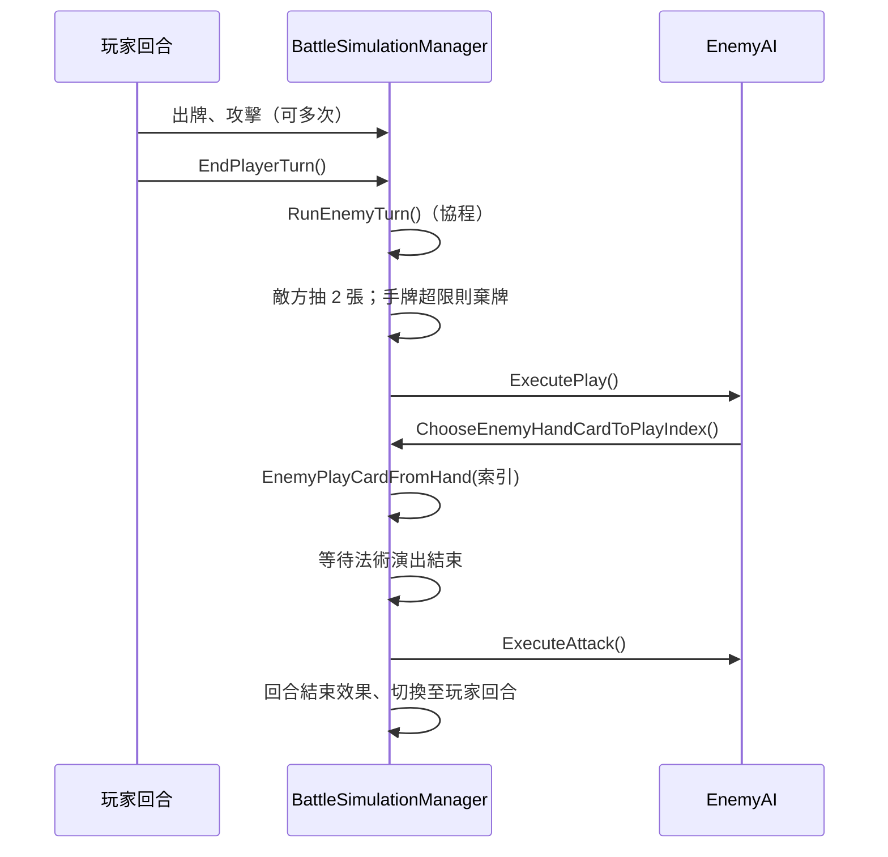

# 對戰難易度與敵方 AI 決策設計說明

> **文件用途**：畢業專題報告書「系統設計／對戰模組」章節之技術說明。  
> **程式對照**：`SceneLoader.cs` · `BattleSimulationManager.cs` · `EnemyAI.cs` · `EnemyAiPlayStyle.cs`  
> **延伸文件**：[ENEMY_AI_DECISION_TREE.md](./ENEMY_AI_DECISION_TREE.md)（出牌決策樹細節）· [ARCHITECTURE_OVERVIEW.md](./ARCHITECTURE_OVERVIEW.md) · [BALANCE_AND_AI_BIBLIOGRAPHY.md](./BALANCE_AND_AI_BIBLIOGRAPHY.md)（外部文獻與網路資源）

---

## 1. 設計前提（回覆口試常見誤解）

本專案對戰難易度與敵方 AI 具備下列特性，宜在報告中先界定範圍：

| 項目 | 本專案作法 | 非本專案作法 |
|------|------------|--------------|
| 難易度調整 | 開戰前由玩家**手動選擇五檔**（入門～魔王） | 依玩家勝率即時動態調檔（Adaptive Difficulty） |
| AI 反應時機 | **回合制**：玩家回合結束後，敵方回合內決策 | 玩家每出一張牌即即時反制（Interrupt） |
| 決策方法 | **規則 + 評分函數 + 決策樹**（Heuristic） | 機器學習、蒙地卡羅樹搜尋（MCTS）等 |

因此，口試時「AI 如何根據玩家出牌做決策」的準確表述為：**根據玩家整回合結束後的盤面狀態，在敵方回合以固定規則選出要出的手牌並執行攻擊**。

---

## 2. 難易度如何定義？分界在哪裡？

### 2.1 分界：五個離散檔位

程式以列舉型別 `BattleDifficultyTier` 定義五檔：`Intro`（入門）、`Easy`（簡單）、`Normal`（普通）、`Hard`（困難）、`Boss`（魔王）。  
**檔位分界 = 玩家在戰前預覽介面（Battle Preview Modal）所按的難度按鈕**；系統不會依玩家表現自動升／降難度。

玩家按下「開始對戰」後，`SceneLoader.OnBattlePreviewStartClicked()` 將所選檔位轉成兩類執行期設定：

1. **牌組與數值難度**（敵方牌庫、容錯、分數倍率等）  
2. **AI 出牌風格**（Greedy 或 Scheming）

### 2.2 設計指數（Designer Index, 0～100）

每檔對應一組 `DifficultyDesignProfile`（可在 Unity Inspector 的 `SceneLoader` 上調整），主要欄位如下：

| 欄位 | 意義 |
|------|------|
| `deckStrengthIndex` | 敵方牌組整體強度指數 |
| `spellRatioIndex` | 敵方牌組中法術比例傾向 |
| `overLimitToleranceIndex` | 允許超過 30 張上限的容錯程度 |
| `revealRatio` | 對戰中資訊揭露比例（教學／壓力調節） |
| `scoreMultiplier` | 敵方選牌構築時的分數倍率 |
| `overLimitBias` / `minSpellsBias` | 微調用整數偏移 |
| `useFixedDeck` / `fixedDeckOverride` | 是否使用固定牌組（魔王檔有專用 20 張） |

**內建預設值（摘要）**：

| 檔位 | 牌組強度 | 法術比例 | 超牌容許 | 分數倍率 | 資訊揭露 |
|------|:--------:|:--------:|:--------:|:--------:|:--------:|
| 入門 | 8 | 8 | 5 | 0.72 | 100% |
| 簡單 | 24 | 18 | 20 | 0.82 | 68% |
| 普通 | 50 | 45 | 45 | 1.00 | 50% |
| 困難 | 70 | 65 | 70 | 1.14 | 42% |
| 魔王 | 92 | 85 | 96 | 1.38 | 28% |

魔王檔另以 `fixedDeckOverride` 指定固定 20 張卡牌 ID，確保高強度牌組可重現。

### 2.3 指數到實際參數的映射公式

`SceneLoader.BuildDifficultyConfig()` 將 0～100 的設計指數**線性映射**為對戰用數值，例如：

- **超過 30 張容許張數**  
  `overLimit = Round(Lerp(1, 12, overLimitToleranceIndex / 100)) + overLimitBias`，再限制於 0～30。  
- **牌組最少法術張數**  
  `minSpells = Round(Lerp(1, 4, spellRatioIndex / 100)) + minSpellsBias`。  
- **敵方構築分數倍率**  
  `scoreMul = Clamp(scoreMultiplier × Lerp(0.78, 1.22, deckStrengthIndex / 100), 0.6, 1.45)`。

亦即：**檔位決定「哪一組 profile」；profile 內指數決定具體數值**。企劃或開發可在不修改 AI 程式的前提下，於 Inspector 調整各檔手感。

### 2.4 AI 行為的分界（與牌組難度獨立）

牌組強度與 AI 風格透過 `MapDifficultyToEnemyAiPlayStyle()` 分開設定：

| UI 難度 | `EnemyAiPlayStyle` | 行為摘要 |
|---------|-------------------|----------|
| 入門、簡單、普通 | `Greedy` | 每回合在可出牌中選**評分最高**者立即打出 |
| 困難 | `SchemingHard` | 在 Greedy 基礎上，**SR 以上**高稀有卡可暫緩出牌，等待時機 |
| 魔王 | `SchemingBoss` | 囤牌門檻更高（**R 以上**即可能暫緩），連續囤牌上限 4 回合，出手條件更嚴 |

執行期標籤（供玩家資訊／戰績紀錄）寫入 `BattleDifficultyRuntime` 與 `BattleLaunchContext`（例如「入門」「困難」「魔王」）。

---

## 3. 敵方 AI 如何依盤面決策？

### 3.1 決策時序（回合制）

敵方 AI **不在玩家出牌當下**運算，而在**玩家按下結束回合**後進入敵方回合。流程如下：



演出用延遲（約 0.2～0.4 秒）由 `EnemyAI.playDelay`、`attackDelay` 及 `RunEnemyTurn` 內 `WaitForSeconds` 控制，目的為**可讀性**，非運算瓶頸。

### 3.2 程式呼叫鏈

| 步驟 | 類別／方法 |
|------|------------|
| 敵方出牌 | `EnemyAI.ExecutePlay()` → `BattleSimulationManager.ChooseEnemyHandCardToPlayIndex()` → `EnemyPlayCardFromHand(index)` |
| 敵方攻擊 | `EnemyAI.ExecuteAttack()` → `BattleSimulationManager.EnemyAttack()` |

### 3.3 出牌決策樹（摘要）

完整流程見 [ENEMY_AI_DECISION_TREE.md](./ENEMY_AI_DECISION_TREE.md)。`ChooseEnemyHandCardToPlayIndex()` 依序：

1. **斬殺優先**  
   敵方場上無怪、我方場上有「脆怪」（攻擊力 > 卡面生命上限）、手牌存在可一擊致死的怪物 → 打出該怪（**不受囤牌邏輯影響**）。  
2. **敵方場空**  
   僅在怪物牌中選評分最高者（先排除本回合暫緩的高稀卡，必要時再強制出牌）。  
3. **一般情況**  
   在當下**可合法打出**的手牌中選評分最高；困難／魔王先排除 `ShouldDeferSchemingCard == true` 的牌。  
4. **避免空過**  
   若高稀卡全被暫緩，改從全手牌再選一次最高評分。

### 3.4 出牌優先度評分

`EvaluateEnemyCardPlayPriority(card)` 數值愈高愈優先打出。

**稀有度加權（全難度共用）**：

```
rarityBonus = (int)rarity × 25
```

| 稀有度 | 加權 |
|--------|------|
| N | +0 |
| R | +25 |
| SR | +50 |
| SSR | +75 |
| UR | +100 |

魔王 AI 另將稀有度加權 ×1.35。

**怪物**：`attack × 2 + healthPointMax + rarityBonus`  

**法術（依當下場面動態調整）**：例如火球在敵場無怪時分數較高、治療在己方場怪受傷時分數較高、林可的凝視依是否可施放調整；並受開局禁火球等規則約束。

評分函數讀取的是**玩家回合結束當下**的 `playerField`、`enemyField`、`playerHp`、`enemyHp` 等，因此能反映玩家該回合的佈局結果，但**不模擬玩家下一回合的意圖**。

### 3.5 困難／魔王「囤牌」邏輯

`ShouldDeferSchemingCard(card)` 在下列條件成立時，本回合暫不出該牌：

- AI 風格為 `SchemingHard` 或 `SchemingBoss`；  
- 卡牌稀有度 ≥ 門檻（困難：SR；魔王：R）；  
- 尚未達連續囤牌上限（困難 3 回合、魔王 4 回合）；  
- `IsSchemingPremiumTimingReady(card)` 為 false（時機未到）。

「時機已到」範例（程式內門檻）：

- 怪物：敵場已有怪、或我方場有怪、或雙方英雄血線進入設定百分比、或手牌將滿；  
- 火球：敵場有怪可打、或玩家血線偏低；  
- 治療：敵方場怪血量低於 maxHp 一定比例。

囤牌與出牌後透過 `NoteEnemySchemingCardPlayed` 更新 `enemySchemingHoldStreak` 計數。

### 3.6 攻擊決策

出牌階段結束且法術演出完成後，獨立執行 `EnemyAttack()`：若敵方場上有怪且未被「林可的凝視」等狀態阻擋，則對玩家場怪或英雄攻擊（含開局禁攻、反擊次數等規則，見 `BattleSimulationManager`）。

---

## 4. 與玩家資訊／戰績的銜接

對戰結束後，難度標籤由 `BattleDifficultyRuntime.ResolveForBattleRecord()` 解析，寫入玩家 profile 的對戰紀錄（難度維度統計）。標籤來源優先順序為：當場 `BattleSimulationManager` 記錄 → `BattleLaunchContext` → 靜態快取。

---

## 5. 設計限制與未來工作

報告中可誠實列出下列**尚未實作**、可作為後續研究或改版方向：

| 方向 | 說明 |
|------|------|
| 動態難度 | 依玩家勝率或遊戲時間自動選檔 |
| 深度搜尋 | 模擬未來 2～3 回合再出牌（Minimax / MCTS） |
| 即時反制 | 玩家出牌當下觸發敵方反應卡 |
| 數據驅動調參 | 以 `BattleAutoSimPlugin` 批次對戰結果回饋調整 `DifficultyDesignProfile` |

---

## 6. 口試用一句話總結

> 本專題難易度為開戰前五檔離散設定，每檔以設計指數映射敵方牌組強度與容錯；困難與魔王另啟用「高稀有卡囤牌待機」AI。敵方於玩家結束回合後，依當前盤面以規則化評分與決策樹選牌並攻擊，屬回合制啟發式 AI，而非即時跟招或學習型 AI。

---

## 7. 參考程式進入點

| 主題 | 檔案／符號 |
|------|------------|
| 難度 Profile 與映射 | `SceneLoader.DifficultyDesignProfile`、`BuildDifficultyConfig` |
| 開戰注入 | `SceneLoader.OnBattlePreviewStartClicked` |
| AI 風格列舉 | `EnemyAiPlayStyle` |
| 敵方回合 | `BattleSimulationManager.RunEnemyTurn` |
| 出牌決策 | `BattleSimulationManager.ChooseEnemyHandCardToPlayIndex` |
| 囤牌判定 | `ShouldDeferSchemingCard`、`IsSchemingPremiumTimingReady` |
| AI 薄包裝 | `EnemyAI.ExecutePlay` / `ExecuteAttack` |
