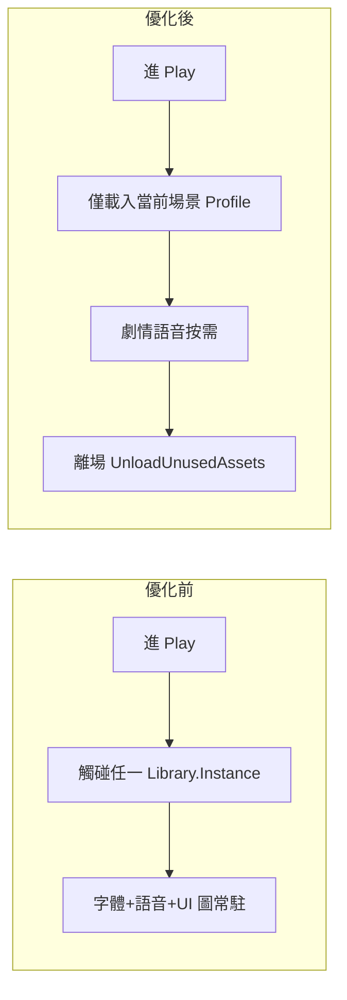

# 專案優化前／優化後對比報告

> **專案**：港灣訓練場（Unity 回合制卡牌 · Android 橫向）  
> **報告基準**：Git `8a4a521`（main）程式與資產靜態分析  
> **報告日期**：2026-07-16  
> **性質**：「優化前」= **目前實作現況**；「優化後」= **依本報告建議項完成後的預期目標**（尚未全面實作）

---

## 一、Executive Summary

| 維度 | 優化前（現況） | 優化後（目標） | 預期改善 |
|------|----------------|----------------|----------|
| **手機峰值 RAM** | 250～380 MB | 160～260 MB | **−30%～35%** |
| **APK / 資源包** | Resources 夾 68 MB 全打包 | 分場景載入 + 去重 | **−15～25 MB** |
| **對戰 CPU 熱點** | 恐怖 scramble 全場景掃描；地圖整圖重建 | 註冊式 UI + 增量刷新 | **卡頓顯著下降** |
| **模式分支** | 7 bool × 134 處引用 | 1 enum + Profile 表 | **維護成本 −40%** |
| **教練 UI 程式量** | ~1,982 行（Tutorial+Harbor 重複） | ~600 行（共用面板） | **−~1,400 行** |
| **核心單檔複雜度** | BattleSimulationManager 4,458 行 | 拆規則 + 表驅動 | **單檔 −30% 分支**

本專案在**教學分階、批次平衡、GDD 驅動**上已達畢業專題水準；主要優化空間在 **記憶體載入策略**、**開局模式分散**、**UI 刷新與場景查詢**，而非重寫玩法。

---

## 二、量測方法與限制

### 2.1 優化前數據來源

- 資產磁碟大小、`.meta` import 設定、`Resources/` 目錄統計  
- `Assets/Scripts` 行數（排除 Editor）  
- `BattleLaunchContext.Is*` 全文搜尋計數  
- 既有工具：`MobileRuntimePerformanceBootstrap`、`MobileAdaptiveResolutionController`  
- 參考：`Docs/ResourceUsageReport.md`（2026-06-05 自動報告）

### 2.2 限制（必讀）

| 項目 | 說明 |
|------|------|
| RAM 數字 | **推估**，非 Unity Memory Profiler 實機量測 |
| 優化後 | **目標值**，需分階段實作 + Profiler 驗證 |
| 功能不變 | 本報告假設 **玩法、關卡流程、存檔格式不變** |

**建議驗證**：Android 實機 + Unity Memory Profiler，場景：大廳 → Story progress → 1-2 對戰 → 劇情。

---

## 三、記憶體（RAM）對比

### 3.1 分項對照

| 分項 | 優化前（現況） | 優化後（目標） | 作法摘要 |
|------|----------------|----------------|----------|
| **Noto CJK 字體 Atlas** | ~35 MB 磁碟；執行期 **40～80 MB** | **15～35 MB** | 動態 SDF、縮小常用字集、延遲載入劇情字 |
| **BGM（PCM）** | `loadType: DecompressOnLoad`；播放中 **20～40 MB/曲** | **3～8 MB/曲** | Streaming 或 CompressedInMemory |
| **NPC 語音** | AudioLibrary 一次引用 **30 段** | **按需載入** 當前劇情段 | 劇情結束 `Unload` |
| **UI 大圖** | 大地圖、教室、港灣 bay **同時可駐留** | 僅當前場景背景 | 分場景 SpriteLibrary + 卸載 |
| **重複音訊** | `Assets/Music/` 27 + `Resources/Music/` 18 mp3，部分檔名重複 | 單一權威路徑 | 刪除 duplicate，Editor 填表指向一處 |
| **Resources 索引** | 68 MB 夾 **全進 Build** | 漸進遷移 Addressables | 非首屏資源移出 Resources |
| **Framebuffer** | 1080p × scale 0.72～1.0 | 維持或略降 scale 下限 | 已有 `MobileAdaptiveResolutionController` |
| **DontDestroyOnLoad** | GlobalNav + HallBgm + Toast + PlayerData 等 | 精簡常駐、延遲建 GlobalNav | 進入大廳再建非必要 overlay |

### 3.2 情境峰值對照

| 使用情境 | 優化前 RAM（估） | 優化後 RAM（估） |
|----------|------------------|------------------|
| 大廳 / login | 180～250 MB | 120～180 MB |
| Story progress 大地圖 | 220～300 MB | 150～220 MB |
| 對戰 BattleSimulation | 250～380 MB | 180～260 MB |
| Main Plot + 多段語音 | 280～420 MB | 200～300 MB |

### 3.3 優化前：主要 RAM 驅動（證據）

```
Assets/Assets/NotoSansTC-VariableFont_wght SDF.asset     ~34.5 MB
Assets/Resources/                                        ~68.0 MB（Build 全收）
Assets/UI/Big map/大地圖.png                            1672×941
Assets/UI/Level background/bay.png                     1844×853（Resources 另有副本）
AudioLibrary.asset                                     30 NPC voice + 全 BGM 引用
```

### 3.4 優化後：載入策略目標



---

## 四、程式架構與複用率對比

### 4.1 規模指標

| 指標 | 優化前 | 優化後（目標） |
|------|--------|----------------|
| 執行期 Scripts 總行數 | **~74,566** | ~72,000（−3%～5%，刪重複教練/UI） |
| `BattleSimulationManager.cs` | **4,458 行** | ~3,100 行（規則外移） |
| `BattleSimulationDebugUI.cs` | **4,252 行** | 維持或拆 partial（行為不變） |
| `BattleLaunchContext.Is*` 引用 | **134 處 / 40+ 檔** | **<40 處**（集中 Profile） |
| 開局模式表示 | **7 個 bool** | **1 個 `BattleModeKind` enum** |
| 教練 UI 實作 | Tutorial 1028 + Harbor 954 行 | 共用 `LinKeFloatingCoachPanel` + Catalog |

### 4.2 模式分派：優化前 vs 優化後

**優化前（現況）** — 多檔重複 if-else 鏈：

| 位置 | 問題 |
|------|------|
| `BattleSimulationManager.cs` | 42 處 flag 檢查；deck / HP / 抽牌 / 傷害 / 天氣 各一鏈 |
| `BattleLaunchContext.Modes.cs` | 7 個 `Begin*()` 手動清 bool，易漏清 M13 |
| `SceneLoader.*.cs` | 5 套 launch pipeline 結構相同 |
| `TutorialBattleBackgroundMusicPlayer` + `HarborTrainingBattleBackground` | 相同順序的模式分派各寫一份 |
| `*BattleSettlementUi` ×3 | 結算 overlay 骨架重複 |
| `StoryProgressSession.cs` | 8 處相同 teardown 區塊 |

**優化後（目標）** — 表驅動：

```csharp
// 概念示意（尚未實作）
enum BattleModeKind { None, IntroTutorial, HarborTraining, FreeBattle,
                      M12PhaseA, M12PhaseB, M13Weather, M13RivalDuel }

class BattleModeProfile {
    public Func<BattleSimulationManager, Deck> ApplyDeck;
    public int EnemyStartHp;
    public AudioClip Bgm;
    public Sprite Background;
    public Type CoachUi;      // 或 ICoachHintProvider
    public Type SettlementUi;
    public bool WeatherEnabled;
}
```

| 能力 | 優化前散落 | 優化後集中 |
|------|------------|------------|
| 牌組套用 | Manager L1614+ | Profile.ApplyDeck |
| 敵方 HP | Manager L1743+ | Profile.EnemyStartHp |
| BGM / 背景 | 2 個 Player 各自 if | Profile 欄位 |
| 教練 / 結算 | 4+ 類各自 IsActive | Profile 註冊 |
| 克制 UI 顯示 | `CombatRoleBattleRules` OR 5 flags | Profile.ShowCombatRole |

### 4.3 教練 UI：複用率對比

| 元件 | 優化前 | 優化後 |
|------|--------|--------|
| `TutorialBattleCoachUi` | 1,028 行，自建 panel | 刪除，改用 `LinKeFloatingCoachPanel` |
| `HarborCombatCoachUi` | 954 行，自建 panel | 刪除，改用 `LinKeFloatingCoachPanel` |
| `M12BattleCoachUi` | 203 行，**已共用** ✓ | 維持 |
| `M13BattleCoachUi` | 187 行 | 併入同一 panel |
| `LinKeFloatingCoachPanel` | 547 行 | 擴充為唯一教練殼層 |
| **合計** | **~2,919 行** | **~900 行**（估） |

**複用率**：優化前教練 UI 有效共用約 **19%**（203/2919）；優化後目標 **>85%**。

### 4.4 劇情／場景啟動

| 項目 | 優化前 | 優化後 |
|------|--------|--------|
| Plot → Battle | `TutorialPlotBattleTransition` 光圈；M12/M13 裸 `LoadSceneAsync` | 統一 `PlotBattleTransitionHost` |
| Session teardown | 8 段 copy-paste | `StoryProgressSession.ResetForPlotLaunch()` |
| Play Overrides 刷新 | 雙重 `RequestRefresh` + `EnsureSlot*` ×3 | 單次合併刷新 |

---

## 五、執行期效能（CPU / GC）對比

### 5.1 熱點對照表

| 熱點 | 優化前 | 優化後 | 預期 |
|------|--------|--------|------|
| **M12 恐怖 scramble** | `FindObjectsByType<TMP>` 全場景掃描 | 註冊制 TMP 清單 | 恐怖段 **CPU −80%+** |
| **Story 地圖刷新** | 每次 `Destroy` + 重建全部節點/邊 | 增量更新 badge/連線 | 回地圖 **−70% 配置** |
| **EnsureSlot 一致性** | 單次刷新最多 3 次 | 每存檔變更 1 次 | 減少冗餘 I/O 邏輯 |
| **DeferredRefresh 重試** | 10 幀 × 全量 rebuild | 1 幀合併或取消重試 | 進 Story 卡頓下降 |
| **PlayerData 解析** | `FindObjectsByType<PlayerData>` | Awake 註冊 canonical | 地圖/文案路徑加速 |
| **手牌 Hover** | 每卡 `GetComponentInParent<Canvas>` | Awake 快取 Canvas | 對戰 hover 更順 |
| **Battle DebugUI** | 每帧 RefreshHeroHp；文字無 compare | 字串相等才 set | 減 TMP mesh rebuild |
| **CardStore.Update** | 空 Update 仍掛載 | 移除 | 微小但零成本 |

### 5.2 已做得好的部分（優化後仍保留）

| 項目 | 說明 |
|------|------|
| JSON 資料 | `StoryProgressNodeDatabase`、`BattleCardTuningPreset` **靜態快取** ✓ |
| AudioLibrary | 非每帧 Load；singleton 一次載入 ✓ |
| 手機 Graphics | `MobileRuntimePerformanceBootstrap` 關陰影/AA/mipmap ✓ |
| 動態解析度 | `MobileAdaptiveResolutionController` ✓ |
| M-1-2 教練 | 已用 `LinKeFloatingCoachPanel` ✓ |
| 難度分檔 | `HarborTrainingDifficultyRuntime` 部分集中 ✓ |

### 5.3 帧時間目標（定性）

| 場景 | 優化前（體感） | 優化後（目標） |
|------|----------------|----------------|
| Story 地圖拖曳 | 偶發頓挫（重建時） | 穩定 60 FPS |
| 1-2 A 恐怖狀態 | 可感知掉帧 | 與一般對戰相近 |
| 對戰一般回合 | 可接受 | 維持；GC spike 略減 |

---

## 六、建置與資產管線對比

| 項目 | 優化前 | 優化後 |
|------|--------|--------|
| 載入模型 | Resources + SerializeField 直接引用 | Addressables 漸進替代 |
| Build Scenes | 14 場景全進 Build Settings | 不變；資產按需 |
| 音訊 import | 普遍 Decompress On Load | BGM Streaming；SFX 維持或 Compressed |
| 貼图 | max 2048；無 streaming mip | 大地圖可降 1024 或 ASTC 6×6 明確指定 |
| 重複資產 | bay.png、多首 BGM 雙份 | 單一路徑 |
| 文件 | `ResourceUsageReport` 手動過期 | 優化後重跑 Editor 報告對照 |

---

## 七、分階段實施計畫與 ROI

### Phase 1 — 低風險、1～2 週（建議先做）

| # | 項目 | 工時估 | RAM | CPU | 架構 |
|---|------|--------|-----|-----|------|
| 1.1 | 恐怖 scramble 改註冊 TMP | 0.5d | — | ★★★ | — |
| 1.2 | 地圖刷新合併 + 取消 10 幀重試 | 1d | — | ★★★ | ★ |
| 1.3 | PlayerData canonical 快取 | 0.5d | — | ★★ | — |
| 1.4 | 手牌 hover 快取 Canvas | 0.25d | — | ★ | — |
| 1.5 | BGM 改 Streaming（抽 3 首驗證） | 1d | ★★★ | — | — |
| 1.6 | 移除空 `CardStore.Update` | 0.1d | — | ★ | — |

**Phase 1 預期**：峰值 RAM **−40～60 MB**；Story／恐怖段卡頓明顯改善。

> **2026-07-16 實作進度（P0 程式面）**  
> 已完成：恐怖 scramble 改 Canvas 子樹快取、`PlayerData` canonical 快取、手牌 hover Canvas 快取、Story 地圖合併刷新／增量更新、`DeferredRefresh` 單次刷新、移除 `CardStore` 空 `Update`。  
> 尚未實作：BGM Streaming（需改 `.meta` import 設定並實機驗證）。

### Phase 2 — 結構重構、2～4 週

| # | 項目 | 工時估 | 效益 |
|---|------|--------|------|
| 2.1 | `BattleModeKind` + Profile 表 | 3～5d | 新關卡不再加 bool |
| 2.2 | 教練 UI 合併（Tutorial/Harbor） | 2～3d | −~1,400 行 |
| 2.3 | `StoryProgressSession` teardown 統一 | 0.5d | 減 copy-paste |
| 2.4 | Plot transition 統一 | 1～2d | M12/M13 過場一致 |

> **2026-07-17 實作進度（P1 / Phase 2 程式面）**  
> 已完成：`BattleModeKind` + `BattleModeCatalog` + `ActivateMode()`（與既有 bool 並存）、`StoryProgressSession.ResetForPlotLaunch()` 統一劇情啟動 teardown、`PlotBattleTransitionHost` 合併 M12/M13 async 載入、`TutorialBattleCoachUi`／`HarborCombatCoachUi` 改為共用 `LinKeFloatingCoachPanel`（各 ~300 行，原 ~1,982 行）。  
> 尚未全面遷移：`BattleLaunchContext.Is*` 134 處引用仍保留 bool；1-1 光圈過場仍用 `TutorialPlotBattleTransition`。

### Phase 3 — 資產管線、長期

| # | 項目 | 效益 |
|---|------|------|
| 3.1 | Noto 動態 SDF / 字集裁剪 | RAM **−30～50 MB** |
| 3.2 | NPC 語音按需載入 | RAM **−5～15 MB** |
| 3.3 | Resources → Addressables | APK、峰值可控 |
| 3.4 | 地圖節點真正增量 UI | 大型 refactor |

---

## 八、風險與不建議事項

| 風險 | 說明 | 緩解 |
|------|------|------|
| 一次大 refactor | 易引入回歸 | 分 Phase；每項對照 Play Overrides 測 1-1/1-2/1-3 |
| 改音訊 loadType | 首包延遲、循環點 | 僅 BGM Streaming；SFX 保持原狀 |
| 刪 Resources  duplicate | 引用斷裂 | 先改 AudioLibraryPopulator，再刪檔 |
| BattleMode 大改 | 影響全部關卡 | 先並存 bool + enum，再逐步遷移 |

**不建議（現階段）**：

- 為降 RAM 而砍掉 Main Plot 語音或教練 UI（違反教學設計目標）
- 用 DDA 動態難度取代離散分檔（與 GDD 定案相反）
- 未 Profiler 驗證即全面 Addressables 化

---

## 九、驗收檢查清單（優化後必測）

### 9.1 功能回歸

- [ ] 1-1 入門：劇情 → 教學戰 → 港灣三檔
- [ ] 1-2：A 段考（恐怖）→ 散策 → B 加練（克制、Classroom_DA、BGM）
- [ ] 1-3：鬥鳥 → 岔路 → 冷爐 → 玫瑰 → 分波對決
- [ ] Story progress 地圖：解鎖、聚焦、重溫
- [ ] Play Overrides：1-2 / 1-3 旗標仍有效

### 9.2 效能量測

- [ ] Memory Profiler：大廳 / 地圖 / 對戰 各 5 分鐘峰值
- [ ] `adb shell dumpsys meminfo <package>` 對照優化前 baseline
- [ ] 恐怖狀態 10 回合：Profiler CPU Timeline
- [ ] 地圖刷新 10 次：GC.Alloc 对比

### 9.3 建置

- [ ] Android APK 大小
- [ ] 冷啟動至 hall 時間
- [ ] 首段 BGM 起播延遲（Streaming 後）

---

## 十、附錄：優化前關鍵檔案索引

| 類別 | 路徑 |
|------|------|
| 手機效能 | `Assets/Scripts/MobileRuntimePerformanceBootstrap.cs` |
| 解析度 | `Assets/Scripts/MobileAdaptiveResolutionController.cs` |
| 對戰核心 | `Assets/Scripts/BattleSimulationManager.cs` |
| 對戰 UI | `Assets/Scripts/BattleSimulationDebugUI.cs` |
| 開局模式 | `Assets/Scripts/BattleLaunchContext.cs`, `BattleLaunchContext.Modes.cs` |
| 教練（重複） | `TutorialBattleCoachUi.cs`, `HarborCombatCoachUi.cs` |
| 教練（共用） | `LinKeFloatingCoachPanel.cs`, `M12BattleCoachUi.cs` |
| 恐怖 scramble | `M12PhaseAHorrorTextScrambleUi.cs` |
| 地圖 | `StoryProgressWorldMapRuntime.cs`, `StoryProgressSceneController.cs` |
| 資源庫 | `UiSpriteLibrary.cs`, `AudioLibrary.cs`, `UiFontLibrary.cs` |
| 資源報告 | `Docs/ResourceUsageReport.md` |
| 遊戲介紹 / KPI | `Docs/遊戲介紹.md`, `LEVEL_DESIGN_GDD.md` |

---

## 十一、結論

| | 優化前（現況） | 優化後（目標） |
|---|----------------|----------------|
| **定位** | 功能完整的畢業 playable demo | 同功能、更適合中階 Android 的產品化品質 |
| **最大短板** | RAM（字體+音訊+全量 Resources）、模式 bool 分散、地圖/scramble 全量刷新 | — |
| **最大優勢** | GDD 完整、批次平衡、分階教學、已有部分 mobile bootstrap | 保留並強化 |
| **建議起點** | — | **Phase 1**（scramble + 地圖刷新 + BGM Streaming） |

完成 Phase 1 後建議更新本報告「優化後」欄位為 **實測數字**，並將 baseline 存為 `Docs/optimization_baseline_profiler.txt` 供口試與履歷引用。

---

*本報告由程式靜態分析與資產盤點產生；優化後數值為工程目標，非已交付狀態。*
