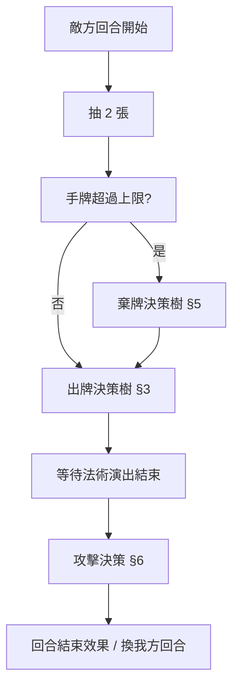
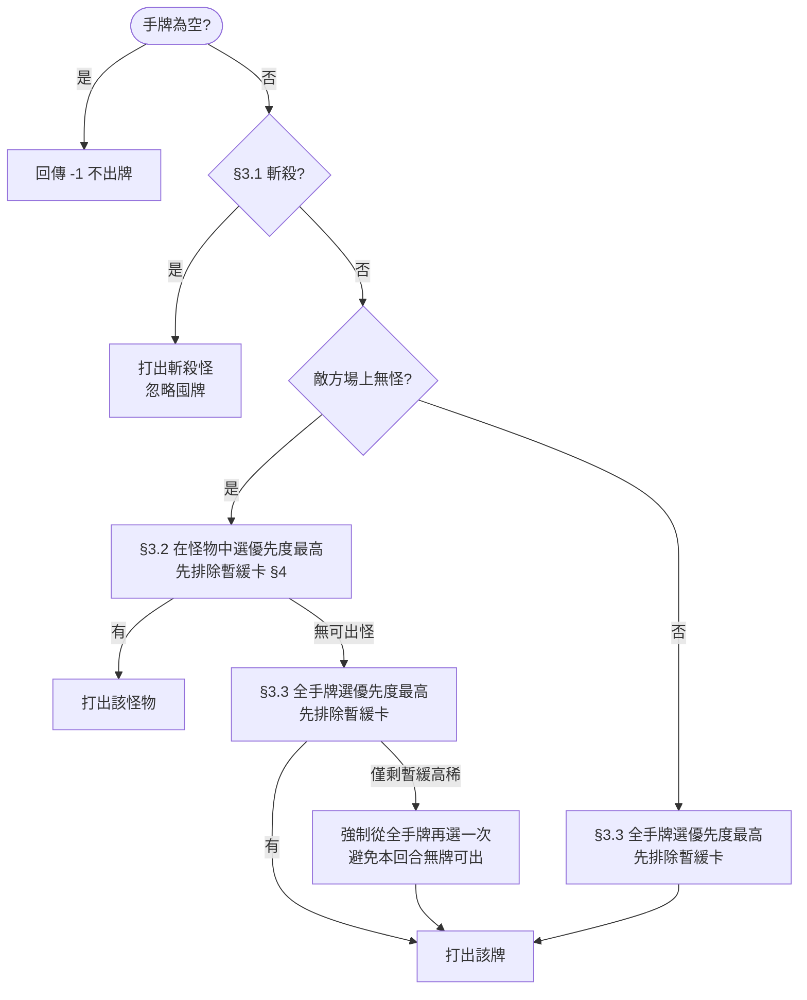
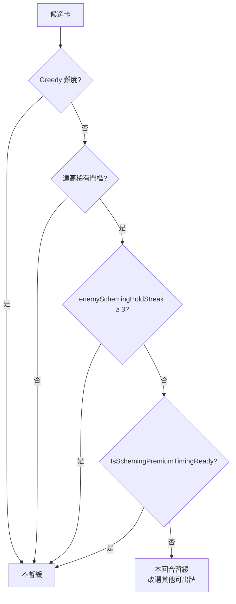
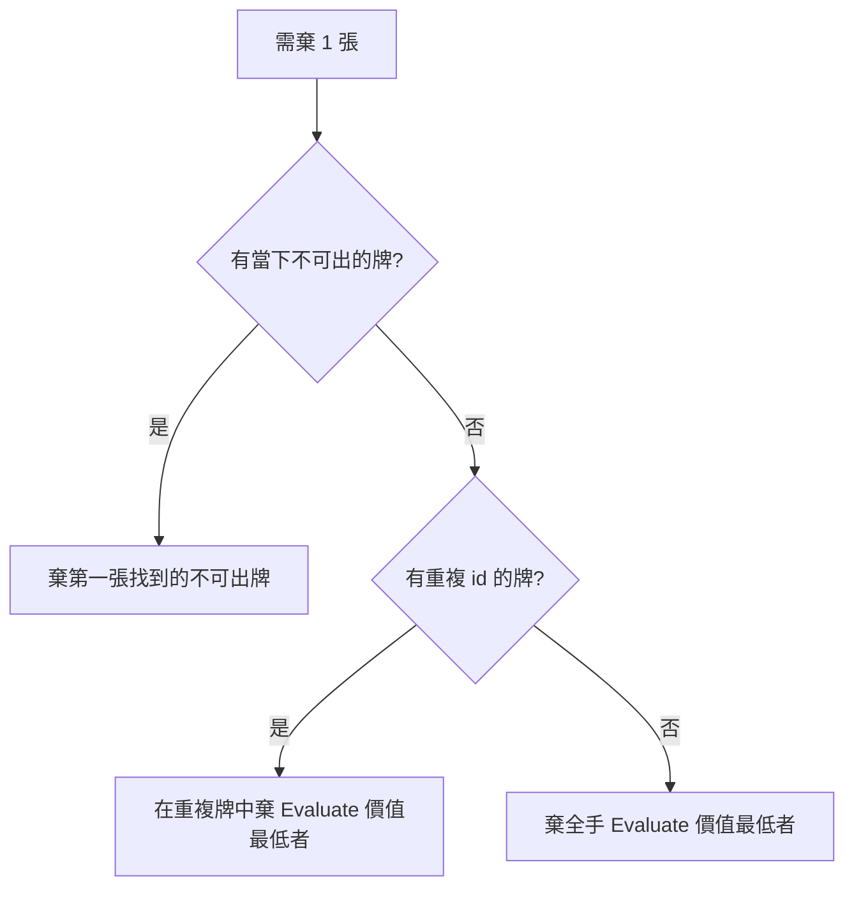
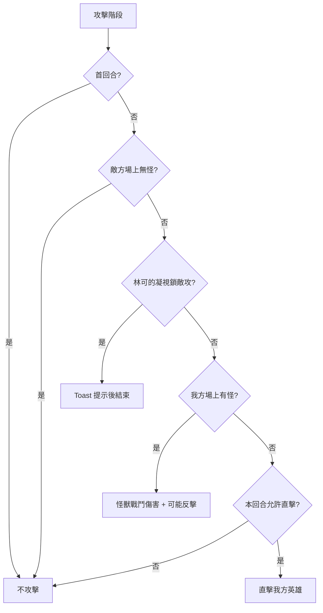
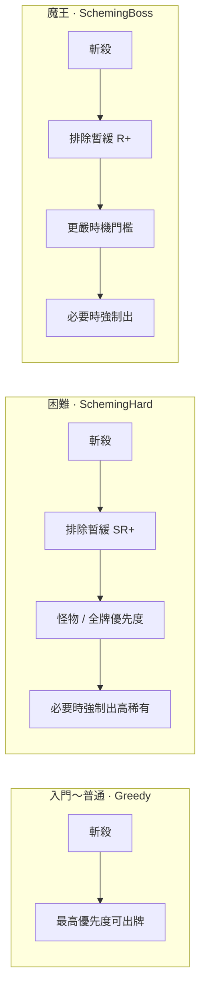

# 敵方 AI 出牌決策樹

| 項目 | 內容 |
| -------- | -------- |
| **文件類型** | 程式行為說明（對戰敵方 AI） |
| **程式入口** | `EnemyAI.ExecutePlay` → `BattleSimulationManager.ChooseEnemyHandCardToPlayIndex` |
| **難度注入** | `SceneLoader.MapDifficultyToEnemyAiPlayStyle` → `QueueRuntimeDifficultyConfig` |
| **關聯程式** | `EnemyAiPlayStyle.cs` · `CardRarityUtility` · `BattleSimulationManager.cs` |
| **最後更新** | 2026-05-16 |

---

## 1. 難度與 AI 風格對照

開戰預覽介面選擇的「敵方難度」會同時影響**牌組強度**（牌庫、超面板容許、法術比例等）與**出牌 AI 風格**（本文件主題）。

| 難度（UI） | `BattleDifficultyTier` | `EnemyAiPlayStyle` | 出牌策略摘要 |
| ---------- | ---------------------- | ------------------ | ------------ |
| 入門 | Intro | **Greedy** | 每回合依優先度立即打出最佳可出牌 |
| 簡單 | Easy | **Greedy** | 同上 |
| 普通 | Normal | **Greedy** | 同上 |
| 困難 | Hard | **SchemingHard** | Greedy 基礎上，**SR／SSR／UR** 可囤牌待時機 |
| 魔王 | Boss | **SchemingBoss** | 囤牌門檻更高（**R 以上**），出手條件更嚴 |

> 牌組參數（`deckStrengthIndex`、`overLimitAllowance` 等）見 `SceneLoader` 的 `DifficultyDesignProfile`，不在本決策樹展開。

---

## 2. 敵方回合流程（決策發生時機）

出牌決策樹僅在**敵方回合·出牌階段**執行一次；攻擊與棄牌為獨立邏輯。



---

## 3. 出牌總決策樹（`ChooseEnemyHandCardToPlayIndex`）

所有難度共用同一棵樹；**困難／魔王**在「選最高優先度」前多一層**是否暫緩高稀有卡**（§4）。



### 3.1 斬殺（全難度、優先於囤牌）

**條件（同時成立）**

1. 敵方場上**無**怪物  
2. 我方場上有怪物，且為「脆怪」：`攻擊力 > 卡面生命值上限`（以 `MonsterCard.healthPoint` 判斷）  
3. 手牌中有怪物滿足：`攻擊力 ≥ 我方該怪生命值上限`（可一擊致死）

**若多張可斬殺**：稀有度 rank 最高者 → 同稀有則攻擊力最高。

> 斬殺**不**受 `ShouldDeferSchemingCard` 影響。

### 3.2 空場優先出怪（全難度）

敵方場上無怪時，**只在怪物牌**中選優先度（§3.4）；不會在有空位時先打火球。

1. 先從「未暫緩」的怪物中選最高優先度  
2. 若全部被暫緩，再從**所有**怪物中選最高優先度（強制出牌）

### 3.3 法術／場上有怪時

在**當下可合法打出**的手牌中選最高優先度（先排除暫緩卡，必要時再強制選一次）。

**可出性**（`IsEnemyCardUnplayableNow`）摘要：

| 牌種 | 不可出條件 |
| ---- | ---------- |
| 怪物 | 敵方場上已有怪（只能 1 隻） |
| 火球（ordinal 0） | 首回合禁火球 |
| 初級治療（ordinal 1） | 敵方場上無怪 |
| 林可的凝視（ordinal 2） | 無法滿足施放條件（例如我方場上有怪） |
| 其他法術 | 敵方場上有怪時僅治療可出 |

### 3.4 出牌優先度公式（Greedy 核心）

`EvaluateEnemyCardPlayPriority(card)` — 數值**愈大愈想打**。

**稀有度加權**（全難度、出牌／棄牌共用）：

```
rarityBonus = CardRarityUtility.GetPlayAndKeepBonus(rarity)
            = (int)rarity × 25
```

| 稀有度 | rank | 加權 |
| ------ | ---- | ---- |
| N | 0 | +0 |
| R | 1 | +25 |
| SR | 2 | +50 |
| SSR | 3 | +75 |
| UR | 4 | +100 |

**怪物**

```
priority = 攻擊力 × 2 + 生命值上限 + rarityBonus
```

**法術**（基礎分 + rarityBonus；隨場況變化）

| ordinal | 法術 | 敵方場上無怪 | 敵方場上有怪 |
| ------- | ---- | ------------ | ------------ |
| 0 | 火球 | 75 | 55 |
| 1 | 初級治療 | 8（通常不可出） | 90 |
| 2 | 林可的凝視 | 62 或 10（看能否施放） | 通常不可出 |

首回合火球若被規則封鎖，該牌優先度視為極低。

---

## 4. 耍心機分支（僅困難／魔王）

### 4.1 何時啟用

```
UsesSchemingEnemyAi = (runtimeEnemyAiPlayStyle != Greedy)
```

### 4.2 哪些牌會被視為「高稀有待囤」

| 風格 | 門檻 |
| ---- | ---- |
| SchemingHard（困難） | `rarity` rank ≥ **SR**（2） |
| SchemingBoss（魔王） | `rarity` rank ≥ **R**（1） |

### 4.3 暫緩判定



**囤牌 streak**：若本回合打出的是**非**高稀有卡，且手牌中仍有「應暫緩」的高稀有卡 → `enemySchemingHoldStreak++`；打出高稀有卡或手牌已無需暫緩的卡 → 歸零。連續囤 **3 回合**後不再暫緩，強制進入正常優先度選牌。

### 4.4 高稀有·怪物：何時算「時機成熟」（空場上怪）

`IsSchemingMonsterSummonReady(strict)` — `strict = true` 為魔王。

| 結果 | 條件 |
| ---- | ---- |
| **立即出** | 敵方場上已有怪；或我方場上有怪；或我方 HP ≤ 門檻；或敵方 HP ≤ 門檻；或手牌 ≥ 7 張 |
| **繼續囤** | 雙方場上皆空，且雙方 HP 都還高（開局慫出王牌） |

**HP 門檻**（以 `startHealth` 為基準）：

| 檢查 | 困難 | 魔王（更嚴） |
| ---- | ---- | ------------ |
| 我方英雄 HP 夠低 → 出 | ≤ 65% | ≤ 55% |
| 敵方英雄 HP 夠低 → 出 | ≤ 35% | ≤ 40% |
| 雙空場且雙方都「很健康」→ 囤 | 我方 > 70% 且 敵方 > 65% | 我方 > 70% 且 敵方 > 75% |

### 4.5 高稀有·法術：何時算「時機成熟」

`IsSchemingSpellReady(spell, strict)`

**火球（ordinal 0）**

| 結果 | 條件 |
| ---- | ---- |
| 不出 | 首回合禁火球 |
| 出 | 敵方場上有怪（打場怪）；或我方場上有怪；或我方英雄 HP 夠低 |
| 囤 | 我方場空且我方英雄 HP 仍高（困難 > 72%；魔王 > 65%） |

**初級治療（ordinal 1）**

| 結果 | 條件 |
| ---- | ---- |
| 不出 | 敵方場上無怪 |
| 出 | 場上怪 `currentHp < maxHp × 比例`（困難 78%；魔王 88%） |
| 囤 | 怪血量夠滿 |

**林可的凝視（ordinal 2）**

| 結果 | 條件 |
| ---- | ---- |
| 不出 | 無法施放（例如我方場上有怪） |
| 出 | 我方英雄 HP 夠低（困難 ≤ 45%；魔王 ≤ 50%） |
| 囤 | 我方場空且我方 HP 仍高（困難 > 55%；魔王 > 60%） |

---

## 5. 棄牌決策樹（全難度相同）

手牌數 > `maxHandSize` 時，敵方回合抽牌後反覆執行 `ChooseEnemyDiscardIndex`，直到不超過上限。



`EvaluateEnemyCardKeepValue` = `EvaluateEnemyCardPlayPriority`（含稀有度加權）→ **優先度低的先丟**，高稀有、高效用牌較易留在手牌（利於困難／魔王囤牌）。

---

## 6. 攻擊階段（全難度相同）

出牌後執行 `EnemyAttackIfPossible`（`EnemyAI.ExecuteAttack` 呼叫）。**不**再跑出牌決策樹。



傷害結算會套用戰技（王后減傷、國王減傷等），與難度 AI 風格無關。

---

## 7. 難度差異一覽（僅 AI 決策）



| 行為 | Greedy | 困難 | 魔王 |
| ---- | ------ | ---- | ---- |
| 斬殺優先 | ✓ | ✓ | ✓ |
| 空場先出怪 | ✓ | ✓ | ✓ |
| 稀有度影響選牌 | 加權 only | 加權 + 可囤 SR+ | 加權 + 可囤 R+ |
| 開局雙空場囤王牌 | ✗ | ✓（條件較鬆） | ✓（條件較嚴） |
| 最多連囤 | — | 3 回合 | 3 回合 |

---

## 8. 程式索引（維護用）

| 行為 | 方法 | 檔案 |
| ---- | ---- | ---- |
| 難度 → AI 風格 | `MapDifficultyToEnemyAiPlayStyle` | `SceneLoader.cs` |
| 注入戰鬥 | `QueueRuntimeDifficultyConfig(..., aiPlayStyle)` | `BattleSimulationManager.cs` |
| 出牌入口 | `EnemyAI.ExecutePlay` | `EnemyAI.cs` |
| 出牌決策 | `ChooseEnemyHandCardToPlayIndex` | `BattleSimulationManager.cs` |
| 優先度 | `EvaluateEnemyCardPlayPriority` | 同上 |
| 暫緩 | `ShouldDeferSchemingCard` | 同上 |
| 囤牌 streak | `NoteEnemySchemingCardPlayed` | 同上（`EnemyPlayCardFromHand` 成功後） |
| 棄牌 | `ChooseEnemyDiscardIndex` | 同上 |
| 攻擊 | `EnemyAttackIfPossible` | 同上 |

---

## 9. 版本紀錄

| 日期 | 說明 |
| ---- | ---- |
| 2026-05-16 | 初版：五階難度對照、出牌／囤牌／棄牌／攻擊決策樹，對齊 `EnemyAiPlayStyle` 實作 |

---

*數值門檻（HP ％、囤牌 3 回合）若調整程式，請同步更新本文件 §4。*
