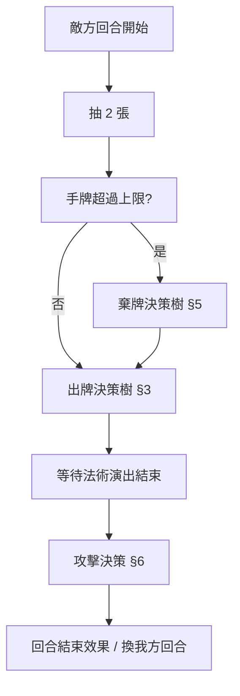
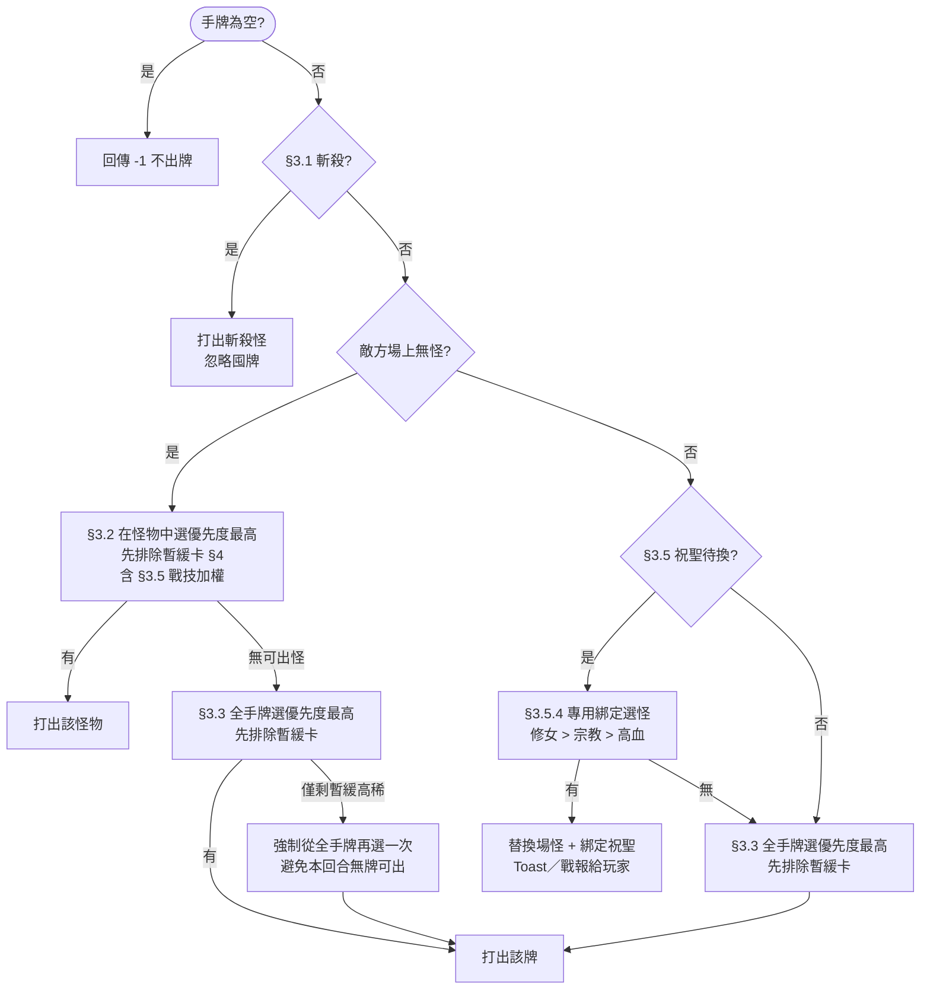
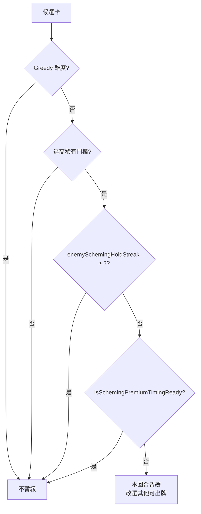
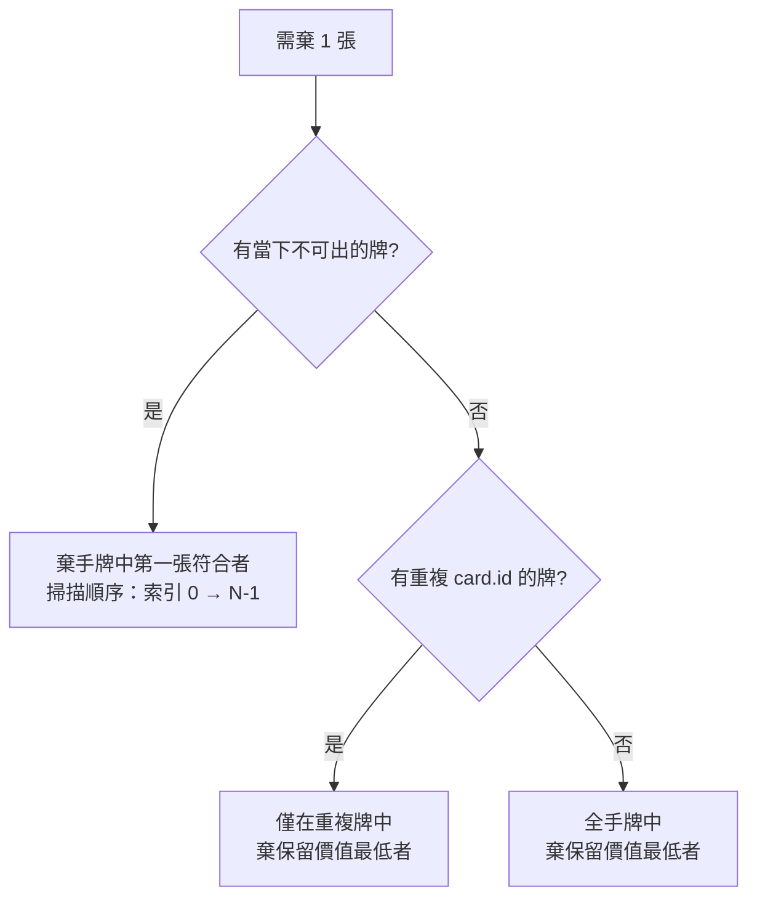
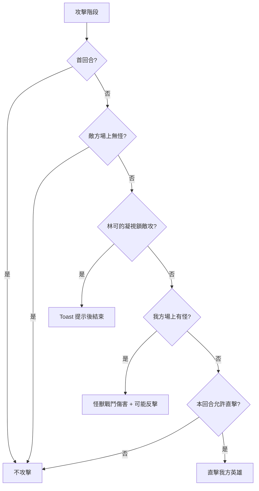
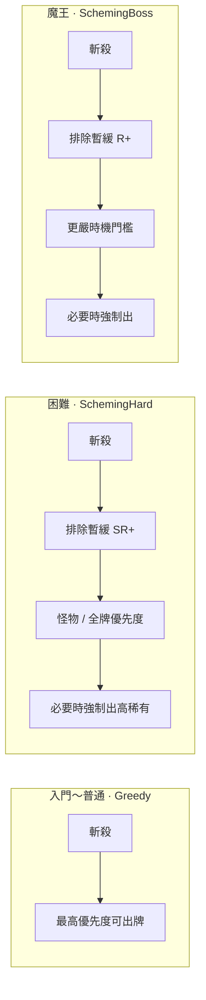

# 敵方 AI 出牌決策樹

| 項目 | 內容 |
| -------- | -------- |
| **文件類型** | 程式行為說明（對戰敵方 AI） |
| **程式入口** | `EnemyAI.ExecutePlay` → `BattleSimulationManager.ChooseEnemyHandCardToPlayIndex` |
| **難度注入** | `SceneLoader.MapDifficultyToEnemyAiPlayStyle` → `QueueRuntimeDifficultyConfig` |
| **關聯程式** | `EnemyAiPlayStyle.cs` · `CardRarityUtility` · `BattleSimulationManager.cs` |
| **最後更新** | 2026-05-30（§3.5 六張戰技怪） |

---

## 1. 難度與 AI 風格對照

開戰預覽介面選擇的「敵方難度」會同時影響**牌組強度**（牌庫、超面板容許、法術比例等）與**出牌 AI 風格**（本文件主題）。

| 難度（UI） | `BattleDifficultyTier` | `EnemyAiPlayStyle` | 出牌策略摘要 |
| ---------- | ---------------------- | ------------------ | ------------ |
| 入門 | Intro | **IntroGreedy** | Greedy 基礎，法術出牌評分降低，較常先出怪 |
| 簡單 | Easy | **EasySpellLean** | Greedy 基礎，法術出牌評分提高，較常施法 |
| 普通 | Normal | **Greedy** | 每回合依優先度立即打出最佳可出牌 |
| 困難 | Hard | **SchemingHard** | Greedy 基礎上，**SR／SSR／UR** 可囤牌待時機 |
| 魔王 | Boss | **SchemingBoss** | 囤牌門檻更高（**R 以上**），出手條件更嚴 |

> 牌組參數（`deckStrengthIndex`、`overLimitAllowance` 等）見 `SceneLoader` 的 `DifficultyDesignProfile`，不在本決策樹展開。

---

## 2. 敵方回合流程（決策發生時機）

出牌決策樹僅在**敵方回合·出牌階段**執行一次；攻擊與棄牌為獨立邏輯。


```mermaid
flowchart TD
    A[敵方回合開始] --> B[抽 2 張]
    B --> C[手牌超過上限?]
    C -->|是| D[棄牌決策樹 §5]
    C -->|否| E[出牌決策樹 §3]
    D --> E
    E --> F[等待法術演出結束]
    F --> G[攻擊決策 §6]
    G --> H[回合結束效果 / 換我方回合]
```

---

## 3. 出牌總決策樹（`ChooseEnemyHandCardToPlayIndex`）

所有難度共用同一棵樹；**困難／魔王**在「選最高優先度」前多一層**是否暫緩高稀有卡**（§4）。


```mermaid
flowchart TD
    Start([手牌為空?]) -->|是| None[回傳 -1 不出牌]
    Start -->|否| Lethal{§3.1 斬殺?}
    Lethal -->|是| PlayLethal[打出斬殺怪<br/>忽略囤牌]
    Lethal -->|否| FieldEmpty{敵方場上無怪?}
    FieldEmpty -->|是| MonPick[§3.2 在怪物中選優先度最高<br/>先排除暫緩卡 §4<br/>含 §3.5 戰技加權]
    MonPick -->|有| PlayMon[打出該怪物]
    MonPick -->|無可出怪| SpellPick[§3.3 全手牌選優先度最高<br/>先排除暫緩卡]
    FieldEmpty -->|否| Consec{§3.5 祝聖待換?}
    Consec -->|是| BindPick[§3.5.4 專用綁定選怪<br/>修女 &gt; 宗教 &gt; 高血]
    BindPick -->|有| PlayBind[替換場怪 + 綁定祝聖<br/>Toast／戰報給玩家]
    BindPick -->|無| SpellPick2
    Consec -->|否| SpellPick2[§3.3 全手牌選優先度最高<br/>先排除暫緩卡]
    SpellPick -->|有| PlaySpell[打出該牌]
    SpellPick -->|僅剩暫緩高稀| ForcePlay[強制從全手牌再選一次<br/>避免本回合無牌可出]
    SpellPick2 --> PlaySpell
    ForcePlay --> PlaySpell
```

### 3.1 斬殺（全難度、優先於囤牌）

**條件（同時成立）**

1. 敵方場上**無**怪物  
2. 我方場上有怪物，且為「脆怪」：`攻擊力 > 卡面生命值上限`（以 `MonsterCard.healthPoint` 判斷）  
3. 手牌中有怪物滿足：`攻擊力 ≥ 我方該怪生命值上限`（可一擊致死）

**若多張可斬殺**：稀有度 rank 最高者 → 同稀有則攻擊力最高。

> 斬殺**不**受 `ShouldDeferSchemingCard` 影響。

### 3.2 空場優先出怪（全難度）

敵方場上無怪時，**只在怪物牌**中選優先度（§3.4）；不會在有空位時先打火球。

1. 先從「未暫緩」的怪物中選最高優先度  
2. 若全部被暫緩，再從**所有**怪物中選最高優先度（強制出牌）

### 3.3 法術／場上有怪時

在**當下可合法打出**的手牌中選最高優先度（先排除暫緩卡，必要時再強制選一次）。

**可出性**（`IsEnemyCardUnplayableNow`）摘要：

| 牌種 | 不可出條件 |
| ---- | ---------- |
| 怪物 | 敵方場上已有怪時**不可出**，**例外**：`CanReplaceFieldMonsterForConsecration`（主教·祝聖待換）時可用手牌怪**替換**場怪（§3.5.4） |
| 火球（ordinal 0） | 首回合禁火球 |
| 初級治療（ordinal 1） | 敵方場上無怪 |
| 林可的凝視（ordinal 2） | 無法滿足施放條件（例如我方場上有怪） |
| 其他法術 | 敵方場上有怪時僅治療可出 |

### 3.4 出牌優先度公式（Greedy 核心）

`EvaluateEnemyCardPlayPriority(card)` — 數值**愈大愈想打**。

**稀有度加權**（全難度、出牌／棄牌共用）：

```
rarityBonus = CardRarityUtility.GetPlayAndKeepBonus(rarity)
            = (int)rarity × 25
```

| 稀有度 | rank | 加權 |
| ------ | ---- | ---- |
| N | 0 | +0 |
| R | 1 | +25 |
| SR | 2 | +50 |
| SSR | 3 | +75 |
| UR | 4 | +100 |

**怪物**

```
priority = 攻擊力 × 2 + 生命值上限 + rarityBonus
```

**法術**（基礎分 + rarityBonus；隨場況變化）

| ordinal | 法術 | 敵方場上無怪 | 敵方場上有怪 |
| ------- | ---- | ------------ | ------------ |
| 0 | 火球 | 75 | 55 |
| 1 | 初級治療 | 8（通常不可出） | 90 |
| 2 | 林可的凝視 | 62 或 10（看能否施放） | 通常不可出 |

首回合火球若被規則封鎖，該牌優先度視為極低。

**戰技加權**（§3.5）疊加於上式之後、難度風格微調（`ApplyIntroEasyPriorityTweak`）之前。

---

## 3.5 戰技怪獸出牌決策（6 張）

戰技**結算規則**見 [`卡牌技能階段式揭露.md`](卡牌技能階段式揭露.md)（§4 國王、§5 王后、§6 民兵、§7 修女、§8 主教、§9 城堡）。本節僅描述**敵方 AI 如何因戰技調整出牌優先度與合法出牌**。

| 分類 | id | 卡名 | 戰技 | 程式加權 |
| ---- | -- | ---- | ---- | -------- |
| 御三家 | 4 | 民兵 | 列陣 | `EvaluateEnemyStarterTrioMonsterPlayBonus` |
| 御三家 | 12 | 王后 | 王室庇護 | 同上 |
| 御三家 | 13 | 國王 | 庭訓號令 | 同上 |
| 宗教線 | 14 | 主教 | 祝聖預留 | `EvaluateEnemyReligiousMonsterPlayBonus` |
| 宗教線 | 7 | 城堡 | 堅城駐守 | 同上 |
| 宗教線 | 17 | 修女 | 聖療共鳴 | 同上 |

> **敵方示範對戰**：主教／城堡戰技在 AI 局內視為**一律可觸發**（`IsEnemyBishopSkillActiveForBattle`／`IsEnemyCastleSkillActiveForBattle`）。御三家依 `CardSkillProficiencyService.IsStarterTrio`。玩家方仍受熟練度 B／牌組等條件約束。

### 3.5.1 優先度疊加順序

```
EvaluateEnemyCardPlayPriority(card)
  → 基礎分（§3.4：攻×2+血 或 法術場況分 + rarityBonus）
  → ApplyEnemyReligiousLineSkillPlayBonus   // 修女／主教／城堡
  → ApplyEnemyStarterTrioSkillPlayBonus     // 國王／王后／民兵
  → ApplyIntroEasyPriorityTweak             // 入門／快攻／法術偏好
```

法術牌僅在 `EvaluateEnemyReligiousSpellPlayBonus`／`EvaluateEnemyStarterTrioSpellPlayBonus` 有額外加權（多為**初級治療**）。

### 3.5.2 御三家加權（怪物牌）

條件欄中的「空場」= `enemyField == null`；「我方有場怪」= `playerField != null`；「我方可能直擊敵英雄」= `playerField == null` 且我方無林可凝視鎖攻。

| 卡 | 戰技狀態 | 加權（疊加，愈大愈想打） |
| -- | -------- | ------------------------ |
| **民兵** | 本局未觸發列陣且空場 | **+34** |
| 民兵 | 上列 + 我方有場怪 | **+18** |
| 民兵 | 上列 + 我方可能直擊 | **+14** |
| **王后** | 王室庇護未用且空場 + 我方有場怪 | **+44** |
| 王后 | 庇護未用且空場（我方無場怪） | **+12** |
| 王后 | 場上已是王后且庇護未用 | **+8** |
| **國王** | 庭訓次數 > 0 且空場 + 我方可能直擊 | **+38** |
| 國王 | 上列改為我方有場怪 | **+22** |
| 國王 | 庭訓次數 > 0 且空場（其餘） | **+14** |
| 國王 | 上列 + 敵英雄 HP ≤ 62% `startHealth` | **+12** |
| 國王 | 場上已是國王且庭訓尚有次數 | **+10** |
| 國王 | 本局曾出過國王、庭訓尚有次數、我方可能直擊（場上非國王） | **+6** |

**初級治療（法術）加權**（`EvaluateEnemyStarterTrioSpellPlayBonus`，僅 ordinal 1 且敵方場上有怪）：

| 場上怪 | 加權 |
| ------ | ---- |
| 王后且庇護未用 | +14 |
| 國王且庭訓次數 > 0 | +8 |
| 民兵且列陣未用 | +6 |

### 3.5.3 宗教線加權（怪物牌）

| 卡 | 戰技狀態 | 加權 |
| -- | -------- | ---- |
| **主教** | 空場且本局未授予祝聖預留 | **+52** |
| 主教 | 場上是主教且祝聖待換（`awaitingNextSummon`） | **−18**（避免重複出主教） |
| **城堡** | 空場 + 我方有場怪 | **+44** |
| 城堡 | 空場 + 我方英雄 HP ≤ 55% `startHealth` | **+22** |
| 城堡 | 場上已是城堡且堅城駐守未用 | **+12** |
| **修女** | 祝聖待換中 | **+58**（聖療連攜綁定首選） |
| 修女 | 空場且手牌有初級治療 | **+14** |
| **其他宗教怪**（`MonsterSkillReligion` 名單，非主教） | 祝聖待換中 | **+30** |
| 任意怪 | 祝聖待換可替換場怪時 | 另加 **§3.5.4 綁定分**（與下表） |

**初級治療加權**（`EvaluateEnemyReligiousSpellPlayBonus`）：

| 條件 | 加權 |
| ---- | ---- |
| 場上怪 HP < 88% maxHp | +12（滿血約 +7） |
| 場上為修女 | +28 |
| 修女且聖療共鳴未用 | +18 |
| 修女且已聖療連攜（祝聖綁修女） | +22 |
| 場上為城堡且堅城未用 | +10 |
| 場上為主教且祝聖待換 | **−8** |

### 3.5.4 主教·祝聖待換（出牌樹分支）

**觸發**：敵方首次置場主教且授予祝聖後，`enemyConsecration.awaitingNextSummon == true`（敵方**不**彈玩家選擇 UI，程式預設「下一張場怪」）。

**決策**（在 §3 斬殺之後、一般法術選牌之前）：

1. `CanReplaceFieldMonsterForConsecration(false)` 為真  
2. `PickBestEnemyConsecrationBindHandIndex()`：只在手牌**怪物**中選，分數 = 綁定分 + 稀有度加權（**不用**完整 `EvaluateEnemyCardPlayPriority`）  
3. 打出該怪 → `EnemyPlayCardFromHand` 走**替換場怪**路徑 → `ApplySummonMonsterSkills` 綁定祝聖  

**綁定分**（`EvaluateEnemyConsecrationBindMonsterBonus`）：

| 候選怪 | 分數 |
| ------ | ---- |
| 修女（17） | 62 |
| 其他宗教派系怪 | 40 |
| 其餘 | 12 + min(生命值上限, 16) |

**玩家播報**：`LogBattleHistory` + `ShowBattleToast`（`敵方以 … 替換場上 …（祝聖轉移）`）；綁定時 Toast 前綴 **敵方**。

**玩家 UI**：無選擇面板；我方仍須在己方回合自行選擇（見技能 GDD §8）。

### 3.5.5 困難／魔王·治療囤牌與戰技

`IsSchemingSpellReady`（ordinal 1）在一般 HP 比例之外，下列情況視為**時機成熟、可出治療**：

| 場上怪 | 條件 |
| ------ | ---- |
| 修女 | 聖療連攜中，或聖療共鳴本局未用 |
| 王后 | 王室庇護未用且**我方場上有怪**（預期將挨打） |

---

## 4. 耍心機分支（僅困難／魔王）

### 4.1 何時啟用

```
UsesSchemingEnemyAi = (runtimeEnemyAiPlayStyle != Greedy)
```

### 4.2 哪些牌會被視為「高稀有待囤」

| 風格 | 門檻 |
| ---- | ---- |
| SchemingHard（困難） | `rarity` rank ≥ **SR**（2） |
| SchemingBoss（魔王） | `rarity` rank ≥ **R**（1） |

### 4.3 暫緩判定


```mermaid
flowchart TD
    A[候選卡] --> B{Greedy 難度?}
    B -->|是| Play[不暫緩]
    B -->|否| C{達高稀有門檻?}
    C -->|否| Play
    C -->|是| D{enemySchemingHoldStreak ≥ 3?}
    D -->|是| Play
    D -->|否| E{IsSchemingPremiumTimingReady?}
    E -->|是| Play
    E -->|否| Hold[本回合暫緩<br/>改選其他可出牌]
```

**囤牌 streak**：若本回合打出的是**非**高稀有卡，且手牌中仍有「應暫緩」的高稀有卡 → `enemySchemingHoldStreak++`；打出高稀有卡或手牌已無需暫緩的卡 → 歸零。連續囤 **3 回合**後不再暫緩，強制進入正常優先度選牌。

### 4.4 高稀有·怪物：何時算「時機成熟」（空場上怪）

`IsSchemingMonsterSummonReady(strict)` — `strict = true` 為魔王。

| 結果 | 條件 |
| ---- | ---- |
| **立即出** | 敵方場上已有怪；或我方場上有怪；或我方 HP ≤ 門檻；或敵方 HP ≤ 門檻；或手牌 ≥ 7 張 |
| **繼續囤** | 雙方場上皆空，且雙方 HP 都還高（開局慫出王牌） |

**HP 門檻**（以 `startHealth` 為基準）：

| 檢查 | 困難 | 魔王（更嚴） |
| ---- | ---- | ------------ |
| 我方英雄 HP 夠低 → 出 | ≤ 65% | ≤ 55% |
| 敵方英雄 HP 夠低 → 出 | ≤ 35% | ≤ 40% |
| 雙空場且雙方都「很健康」→ 囤 | 我方 > 70% 且 敵方 > 65% | 我方 > 70% 且 敵方 > 75% |

### 4.5 高稀有·法術：何時算「時機成熟」

`IsSchemingSpellReady(spell, strict)`

**火球（ordinal 0）**

| 結果 | 條件 |
| ---- | ---- |
| 不出 | 首回合禁火球 |
| 出 | 敵方場上有怪（打場怪）；或我方場上有怪；或我方英雄 HP 夠低 |
| 囤 | 我方場空且我方英雄 HP 仍高（困難 > 72%；魔王 > 65%） |

**初級治療（ordinal 1）**

| 結果 | 條件 |
| ---- | ---- |
| 不出 | 敵方場上無怪 |
| 出 | 場上怪 `currentHp < maxHp × 比例`（困難 78%；魔王 88%） |
| 出 | **或** 場上為**修女**（聖療連攜／共鳴未用）；**或** 場上為**王后**、庇護未用且我方有場怪（§3.5.5） |
| 囤 | 怪血量夠滿且不符合上列戰技例外 |

**林可的凝視（ordinal 2）**

| 結果 | 條件 |
| ---- | ---- |
| 不出 | 無法施放（例如我方場上有怪） |
| 出 | 我方英雄 HP 夠低（困難 ≤ 45%；魔王 ≤ 50%） |
| 囤 | 我方場空且我方 HP 仍高（困難 > 55%；魔王 > 60%） |

---

## 5. 棄牌決策樹（敵我共用流程、評分函式分開）

手牌數 > `maxHandSize`（預設 **7**）時進入棄牌：每輪只棄 **1** 張，重複直到手牌 ≤ 上限。敵方在抽牌後由 AI 自動棄；玩家需手動長按拖曳至棄牌區（`PlayerDiscardCardFromHand`），或使用 `AutoDiscardOneForPlayer`。

**決策流程（敵我相同的三階段）：**


```mermaid
flowchart TD
    A[需棄 1 張] --> B{有當下不可出的牌?}
    B -->|是| C[棄手牌中第一張符合者<br/>掃描順序：索引 0 → N-1]
    B -->|否| D{有重複 card.id 的牌?}
    D -->|是| E[僅在重複牌中<br/>棄保留價值最低者]
    D -->|否| F[全手牌中<br/>棄保留價值最低者]
```

### 5.1 敵方棄牌

| 項目 | 說明 |
| ---- | ---- |
| 入口 | `ChooseEnemyDiscardIndex`（`BattleSimulationManager.cs`） |
| 不可出判定 | `IsEnemyCardUnplayableNow` |
| 保留價值 | `EvaluateEnemyCardKeepValue` = `EvaluateEnemyCardPlayPriority`（含稀有度加權） |

**優先度低的先丟**；高稀有、高效用牌較易留在手牌（利於困難／魔王囤牌）。

### 5.2 玩家棄牌

| 項目 | 說明 |
| ---- | ---- |
| 入口 | `ChoosePlayerDiscardIndex` |
| 對外查詢 | `GetRecommendedPlayerDiscardHandIndex()`（與 `AutoDiscardOneForPlayer` 同一邏輯） |
| 不可出判定 | `IsPlayerCardUnplayableNow` |
| 保留價值 | `EvaluatePlayerCardKeepValue`（**不含**出牌決策樹的斬殺／開局囤牌等加權） |

#### 5.2.1 「當下打不出去」（`IsPlayerCardUnplayableNow`）

| 場上狀態 | 視為不可出（會優先被建議棄掉） |
| -------- | ------------------------------ |
| 我方場上**已有怪獸** | 所有**怪獸**；法術中僅 **初級治療**（`SpellOrdinal == 1`）仍可打出，其餘法術不可出 |
| 我方場上**無怪** | **初級治療**（ordinal 1）不可出；**林可的凝視**（ordinal 2）在 `CanPlayerCastLinGazeNow()` 為 false 時不可出 |

掃描時取**第一張**符合條件的手牌索引（由左至右）。

> **與出牌教學的差異**：`TutorialHandPlayAdvisor` 會把「第一回合火球封鎖」等納入**出牌**建議；**棄牌**邏輯**未**將開局火球封鎖算入「打不出去」。若場上空、手牌僅剩被封鎖的火球，會改走 §5.2.2 的保留價值比較（火球在空場時分值 75，通常不會成為首選棄牌）。

#### 5.2.2 保留價值（`EvaluatePlayerCardKeepValue`）

分數**越低越先棄**。無「打不出去」的牌、且無重複 `id` 時，棄全手最低分者。

| 牌種 | 計算方式 |
| ---- | -------- |
| 怪獸 | `attack × 2 + healthPointMax` |
| 火球術（ordinal 0） | 場上有己方怪：**55**；場上無怪：**75** |
| 初級治療（ordinal 1） | 場上有己方怪：**90**；場上無怪：**8** |
| 林可的凝視（ordinal 2） | 當下可施放：**62**；不可施放：**10** |
| 其他法術 | **20** |

**重複牌**：若多張手牌 `card.id` 相同，只在這些重複牌裡比較保留價值，棄**最低**者。

#### 5.2.3 教學戰 UI（1-1 入門課 · 學院內）

| 行為 | 程式 |
| ---- | ---- |
| 林可姐棄牌文案 | `TutorialBattleCoachUi`（`discard` 提示鍵） |
| 手牌高亮 | `TutorialHandDiscardAdvisor` → `RequestTutorialHandDiscardHighlights` |
| 高亮規則 | 每次只亮 **1** 張：即 `GetRecommendedPlayerDiscardHandIndex()` 的結果；玩家棄掉後會依新手牌重算 |

出牌建議（`TutorialHandPlayAdvisor`）與棄牌建議為**兩套評分**，勿混用。教戰文案見 [`TUTORIAL_PLOT_SCRIPT.md`](TUTORIAL_PLOT_SCRIPT.md) §五。

---

## 6. 攻擊階段（全難度相同）

出牌後執行 `EnemyAttackIfPossible`（`EnemyAI.ExecuteAttack` 呼叫）。**不**再跑出牌決策樹。


```mermaid
flowchart TD
    A[攻擊階段] --> B{首回合?}
    B -->|是| Skip[不攻擊]
    B -->|否| C{敵方場上無怪?}
    C -->|是| Skip
    C -->|否| D{林可的凝視鎖敵攻?}
    D -->|是| Block[Toast 提示後結束]
    D -->|否| E{我方場上有怪?}
    E -->|是| F[怪獸戰鬥傷害 + 可能反擊]
    E -->|否| G{本回合允許直擊?}
    G -->|否| Skip
    G -->|是| H[直擊我方英雄]
```

傷害結算會套用戰技（王后減傷、國王減傷等），與難度 AI 風格無關。

---

## 7. 難度差異一覽（僅 AI 決策）


```mermaid
flowchart LR
    subgraph Greedy["入門～普通 · Greedy"]
        G1[斬殺] --> G2[最高優先度可出牌]
    end
    subgraph Hard["困難 · SchemingHard"]
        H1[斬殺] --> H2[排除暫緩 SR+]
        H2 --> H3[怪物 / 全牌優先度]
        H3 --> H4[必要時強制出高稀有]
    end
    subgraph Boss["魔王 · SchemingBoss"]
        B1[斬殺] --> B2[排除暫緩 R+]
        B2 --> B3[更嚴時機門檻]
        B3 --> B4[必要時強制出]
    end
```

| 行為 | Greedy | 困難 | 魔王 |
| ---- | ------ | ---- | ---- |
| 斬殺優先 | ✓ | ✓ | ✓ |
| 空場先出怪 | ✓ | ✓ | ✓ |
| 稀有度影響選牌 | 加權 only | 加權 + 可囤 SR+ | 加權 + 可囤 R+ |
| 開局雙空場囤王牌 | ✗ | ✓（條件較鬆） | ✓（條件較嚴） |
| 最多連囤 | — | 3 回合 | 3 回合 |

---

## 8. 程式索引（維護用）

| 行為 | 方法 | 檔案 |
| ---- | ---- | ---- |
| 難度 → AI 風格 | `MapDifficultyToEnemyAiPlayStyle` | `SceneLoader.cs` |
| 注入戰鬥 | `QueueRuntimeDifficultyConfig(..., aiPlayStyle)` | `BattleSimulationManager.cs` |
| 出牌入口 | `EnemyAI.ExecutePlay` | `EnemyAI.cs` |
| 出牌決策 | `ChooseEnemyHandCardToPlayIndex` | `BattleSimulationManager.cs` |
| 優先度 | `EvaluateEnemyCardPlayPriority` | 同上 |
| 戰技加權·宗教線 | `ApplyEnemyReligiousLineSkillPlayBonus` · `EvaluateEnemyReligiousMonsterPlayBonus` · `EvaluateEnemyReligiousSpellPlayBonus` | 同上 |
| 戰技加權·御三家 | `ApplyEnemyStarterTrioSkillPlayBonus` · `EvaluateEnemyStarterTrioMonsterPlayBonus` · `EvaluateEnemyStarterTrioSpellPlayBonus` | 同上 |
| 祝聖綁定選牌 | `PickBestEnemyConsecrationBindHandIndex` · `EvaluateEnemyConsecrationBindMonsterBonus` | 同上 |
| 祝聖替換出牌 | `CanReplaceFieldMonsterForConsecration` · `EnemyPlayCardFromHand`（替換分支） | 同上 |
| 暫緩 | `ShouldDeferSchemingCard` | 同上 |
| 囤牌 streak | `NoteEnemySchemingCardPlayed` | 同上（`EnemyPlayCardFromHand` 成功後） |
| 敵棄牌 | `ChooseEnemyDiscardIndex` | 同上 |
| 玩家棄牌 | `ChoosePlayerDiscardIndex` · `GetRecommendedPlayerDiscardHandIndex` | 同上 |
| 教學棄牌高亮 | `TutorialHandDiscardAdvisor.TryGetRecommendedDiscardHandIndices` | `TutorialHandDiscardAdvisor.cs` |
| 攻擊 | `EnemyAttackIfPossible` | 同上 |

---

## 9. 版本紀錄

| 日期 | 說明 |
| ---- | ---- |
| 2026-05-16 | 初版：五階難度對照、出牌／囤牌／棄牌／攻擊決策樹，對齊 `EnemyAiPlayStyle` 實作 |
| 2026-05-30 | §5 擴充：玩家棄牌三階段、保留價值表、與教學出牌建議差異、教學戰棄牌高亮索引 |
| 2026-05-30 | **§3.5**：六張戰技怪（御三家 + 宗教線）出牌加權、祝聖待換替換分支、玩家播報、囤牌治療例外；§3／§4.5／§8 同步 |

---

*數值門檻（HP ％、囤牌 3 回合）若調整程式，請同步更新本文件 §4。棄牌保留價值若調整 `EvaluatePlayerCardKeepValue`，請同步更新 §5.2.2。戰技加權分數若調整 `EvaluateEnemy*PlayBonus`，請同步更新 §3.5。*
