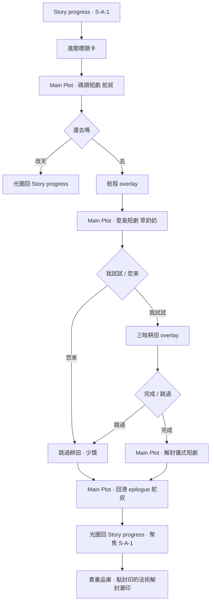

# 關卡設計企劃：A-1 潮間島（S-A-1）

> **狀態**：MVP 定案（2026-07-31）  
> **用途**：支線 A-1 流程、解鎖、獎勵、Main Plot 劇情與耕田 overlay 實作對照。  
> **體驗發想**（角色／隱喻／文案草案）：[`企劃發想.md`](企劃發想.md) §十二  
> **關聯**：[`LEVEL_DESIGN_M-1-2.md`](LEVEL_DESIGN_M-1-2.md) §3.3.3（封印法術伏筆）· [`PLANNING_OPEN_ITEMS.md`](PLANNING_OPEN_ITEMS.md) **L1-2-013** · `StoryProgressNodeDatabase.json`（`S-A-1`）

---

## 一、關卡定位

| 項目 | 內容 |
|------|------|
| **章節代碼** | A-1 |
| **大地圖節點** | `S-A-1`（潮間島 / Tide Island） |
| **關卡類型** | 支線 · **非戰鬥** · Main Plot 短劇 ＋ **航程／耕田 overlay** |
| **預估時間** | 首次通關約 3～5 分鐘（含三畦；可跳過摘要） |
| **核心 NPC** | **舵叔**（碼頭舢板）· **草奶奶**（蒲三畦，島上耕作者） |
| **禁止出場** | 林可姐、導師、阿潮、燈守·賽爾（頂多背景提及） |

**設計目標**

1. 以**三畦輪作**隱喻 M-1-2 封印法術（**潮印**）的解封條件：「還地後再揭」。
2. 提供**低專注、可跳過**的探索支線，呼應 M-1-2 海牆散策「點物件拿台詞」節奏。
3. **潮印解封**不在支線結束時自動完成，改由玩家至**貴重品庫**點選「封印的法術」——強化「發現／儀式」感。

---

## 二、解鎖與節點

| 條件 | 旗標／邏輯 |
|------|------------|
| **M-1-2 通關** | `TutorialProgressState.IsM12TrioMasteryCleared` |
| **已取得封印法術** | `m12_sealed_spell_found`（海牆散策拾取） |
| **Story progress 節點** | `S-A-1`；`unlockRequiresAllOf: ["M-1-2"]`（資料庫） |
| **鎖定提示** | 未通關 M-1-2 →「需先通關 M-1-2 海牆巡邏。」；未拾封印 →「需先在 M-1-2 海牆散策取得封印的法術。」 |

**重訪**：節點 Clear 後按鈕改為「重訪潮間島」；三畦可重玩，**潮印解封僅首次**（`a1_tide_mark_unsealed`）。

---

## 三、流程（定案）

| 步驟 | 場景／載體 | 內容 |
|------|-----------|------|
| 0 | Story progress | 標題「潮間島」＋達成目標卡（`StoryLevelEntryTransition.PlayToA1TideIsland`） |
| 1 | **Main Plot** | 幕 1：碼頭舵叔 3 句 ＋ 去／改天 |
| 2 | **Overlay** | 航程字幕（無台詞語音） |
| 3 | **Main Plot** | 幕 2：登島旁白／草奶奶 ＋ 我試試／您來；若有封印則多一句提示 |
| 4 | **Overlay** | 幕 3：三畦耕田 mini-game（穿插 `SideQuestA1PlotCopy.FarmInterject` 字幕） |
| 5 | **Main Plot** | 幕 4：解封儀式（**僅耕田完成**；不自動解封道具） |
| 6 | **Main Plot** | 幕 5：回港舵叔 1～2 句 |
| 7 | Story progress | 光圈過場；地圖聚焦 `S-A-1` |
| 8 | 全域 UI | 貴重品庫點「封印的法術」→ 解封動效 → **潮印**入收藏 |

**與舊草案差異（2026-07-31）**

| 項目 | 舊草案 | 現行定案 |
|------|--------|----------|
| 劇情載體 | 建議全 Overlay | **Main Plot** 播幕 1／2／4／5；航程＋耕田仍 Overlay |
| 潮印解封 | 幕 4 結束自動解封 | **節點 Clear 後**，玩家至**貴重品庫**手動點選 |
| 解鎖文案 | 港灣 Clear ＋封印 | **M-1-2 通關** ＋封印（見 §二） |

---

## 四、劇情分幕與台詞

**權威文案**：[`Assets/Scripts/SideQuestA1PlotCopy.cs`](Assets/Scripts/SideQuestA1PlotCopy.cs)  
**Main Plot 步驟**：`TutorialPlotScriptFactory.BuildA1HarborPlotSteps` · `BuildA1IslandIntroPlotSteps` · `BuildA1UnsealPlotSteps` · `BuildA1ReturnPlotSteps`

| 幕 | 說話者 | 語音 ID | 備註 |
|----|--------|---------|------|
| 1 碼頭 | 舵叔 | `A-1_V0`～`V2` | 選「改天」直接回地圖 |
| 2 登島 | 旁白／草奶奶 | `A-1_V3`～`V6` | `V6` 僅當 `m12_sealed_spell_found` |
| 3 耕種穿插 | 草奶奶（字幕） | — | 農事步驟觸發，見 `FarmInterject` |
| 4 解封 | 草奶奶／旁白 | `A-1_V7`～`V9` | 完成三畦後 |
| 5 回港 | 舵叔 | `A-1_V10` | 留種分支多一句 |

---

## 五、三畦耕田（A-1.1／A-1.2 實装）

**順序（固定）**：上畦 **海風黑麥** → 中畦 **燈芯海蓬（休耕）** → 下畦 **潮根豆**

| 畦 | 作物 | 核心操作（MVP） |
|----|------|-----------------|
| 上 | 海風黑麥 | 拖曳犁溝 · 點播 · 節拍壓土 · 手摘收割 |
| 中 | 燈芯海蓬 | 松土點選 · 拖曳鹽網 · 手摘 · **留種／全交**二選一 |
| 下 | 潮根豆 | 泡種盆長按 · 點種 · 引水拖曳 · 除藤 · 收莢 |

**設計約束**

- 單次 overlay、**不持久化**田狀態；每次進入重置。
- 「過夜／過季」＝短動畫，無 real-time 等待。
- **可跳過**：Overlay 內跳過或登島選「您來」→ 少獎、**不解封**。
- **點位隨機**：每次進入 overlay 打亂松土／採收／點種等熱區位置；**作物順序固定**。
- 失敗僅重試當步，不扣命、不開戰鬥。

**程式**：`SideQuestA1TideIslandFarmOverlay.cs` · `SideQuestA1FarmUiDrag.cs`

---

## 六、獎勵與進度旗標

| 完成度 | 金幣 | 節點 Clear | 潮印解封 | 其他 |
|--------|------|------------|----------|------|
| **三畦全完成** | 80（全交海蓬 +15 → 95） | ✅ `a1_tide_island_cleared` | 待貴重品庫手動 | 留種 → `a1_sea_purslane_seed_kept` |
| **跳過／您來** | 20 | ❌ | ❌ | 提示「草奶奶代勞…不解封潮印」 |

**潮印解封（貴重品庫）**

- 條件：`a1_tide_island_cleared` 且尚未 `a1_tide_mark_unsealed`
- 操作：點選關鍵道具「封印的法術」→ 金閃效果 → `TryUnsealTideMarkSpell` → **潮印**（spell ordinal 3）入收藏
- 程式：`GlobalNavValuablesVaultOverlay` · `ValuablesVaultCatalog`

**存檔鍵**（`TutorialProgressState`）

| 鍵 | 用途 |
|----|------|
| `a1_tide_island_cleared` | 節點通關 |
| `a1_tide_mark_unsealed` | 潮印已解封 |
| `a1_sea_purslane_seed_kept` | 海蓬留種分支 |

---

## 七、程式錨點

| 職責 | 類別 |
|------|------|
| Story progress 進關 | `SideQuestA1Flow.LaunchFromStoryProgress` |
| 進關標題卡 | `StoryLevelEntryTransition.PlayToA1TideIsland` |
| Session／Main Plot 銜接 | `StoryProgressSession.LaunchA1HarborPlotScene` · `LaunchA1*PlotInPlace` |
| 劇情步驟 | `TutorialPlotScriptFactory.BuildA1*PlotSteps` |
| 劇情結束分支 | `MainPlotSceneController.FinishPlotAndReturn`（A-1 四段） |
| 回地圖過場 | `StoryProgressSession.LoadStoryProgressWithIrisTransition` |
| 進度／解鎖 | `SideQuestA1ProgressState` |
| 獎勵 | `SideQuestA1TideMarkRewardService` |
| 地圖文案 | `StoryProgressLevelCopyA1` |
| 測試覆寫 | `StoryProgressPlayOverrides`（A-1 section） |

**已棄用（主流程不再呼叫）**：`SideQuestA1HarborOverlay` · `SideQuestA1IslandIntroOverlay` · `SideQuestA1UnsealRitualOverlay`（劇情已遷至 Main Plot；檔案保留供對照）。

---

## 八、待定／後續

| 項目 | 優先 | 備註 |
|------|------|------|
| 語音 mp3 `A-1_V0`～`V10` | P2 | ID 已接 `PlotNpcVoicePlayer`；檔案待錄 |
| A-1 專用 BGM | P3 | 現沿用 Main Plot 預設／無專曲 |
| 草奶奶手記（圖鑑） | P3 | 發想 §A-1.0 豐富報酬；MVP 未發 |
| 立繪／三畦美術 | P2 | MVP 為 UI 面板＋拖曳熱區 |
| `S-A-2` 後續支線 | P3 | 資料庫已占位，內容未定 |

---

## 九、體驗檢查清單（QA）

- [ ] 未通關 M-1-2 或未取得封印法術時，節點不可進／提示正確  
- [ ] 碼頭「改天」光圈回 Story progress，無進度變更  
- [ ] 登島「您來」→ 20 金幣、不解封、仍可回港劇情  
- [ ] 三畦完成 → 80（或 95）金幣、Clear 旗標、toast 提示去貴重品庫  
- [ ] 貴重品庫解封僅在 Clear 後可用；解封後潮印入收藏、不可重複  
- [ ] 重訪可重玩農事；潮印解封不重發  
- [ ] 回港最後一句後光圈回地圖並聚焦 S-A-1  
