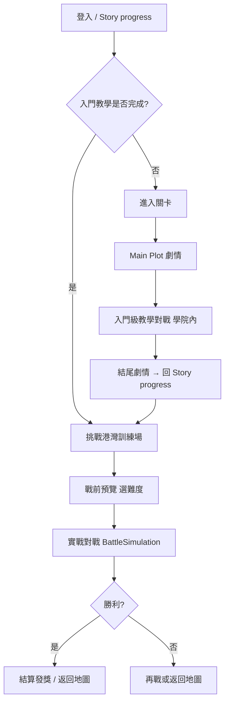

# 關卡設計企劃：1-1 港灣訓練場

> **狀態**：定案（2026-05-30）  
> **用途**：企劃／程式／文案對照用——關卡目標、流程、獎勵、地圖解鎖與難度設計。  
> **世界觀**：見 `STORY_PROGRESS_WORLDVIEW.md`（空間與敘事分層，本文件不重複圓法）。  
> **相關文件**：[`PLANNING_DOCS_INDEX.md`](PLANNING_DOCS_INDEX.md) · [`PLANNING_MASTER_TABLE.md`](PLANNING_MASTER_TABLE.md) · [`PLANNING_OPEN_ITEMS.md`](PLANNING_OPEN_ITEMS.md) · [`STORY_PROGRESS_WORLDVIEW.md`](STORY_PROGRESS_WORLDVIEW.md) · [`TUTORIAL_PLOT_SCRIPT.md`](TUTORIAL_PLOT_SCRIPT.md) · [`BATTLE_PREVIEW_PUZZLE_INDEX.md`](BATTLE_PREVIEW_PUZZLE_INDEX.md) · [`DIFFICULTY_AND_AI_DESIGN.md`](DIFFICULTY_AND_AI_DESIGN.md) · `Assets/Resources/StoryProgressNodeDatabase.json`

---

## 一、關卡定位

| 項目 | 內容 |
|------|------|
| **章節代碼** | 1-1 |
| **顯示名稱** | 港灣訓練場 |
| **大地圖節點** | `M-1-1`（`Harbor Training Yard` / `southwest_port`） |
| **關卡類型** | 教學章節 ＋ 畢業後自主實戰練習場 |
| **預估時間** | 入門流程約 5～8 分鐘；港灣單局約 5～10 分鐘（依難度） |

**設計目標**

1. 讓新玩家在學院內**學會規則**（劇情、選項、入門對戰、基礎牌組）。
2. 入門畢業後，在同一章節節點上提供**可重複的實戰練習**（簡單／普通／困難），練習防守與法術應對快攻。
3. 以**首次實戰通關**推進大地圖（解鎖 `M-1-2`），以**困難首通**發放象徵性畢業獎勵。

---

## 二、流程分為兩階段（不可混為一談）

### 2.1 階段 A：學院入門（教師帶領）

| 項目 | 設計 |
|------|------|
| **入口** | Story progress「進入關卡」 |
| **場景** | Main Plot → 學院舊校舍對戰館 |
| **對戰** | 入門級；**無天氣**；林可姐教學教練 UI |
| **牌組** | 劇情至「基礎牌組」步驟後發放 30 張入門牌組（牌組槽為空時才寫入；**僅首次**彈「獲得基礎牌組」） |
| **通關條件** | 完成入門劇情 ＋ 贏得入門教學戰 |
| **通關獎勵** | 收藏各 +1：**UR 國王、SR 王后、N 民兵**（僅**首次**入門戰勝利；**重溫入門課**再勝不重複發） |
| **地圖節點** | **不**因入門 alone 將 `M-1-1` 標為實戰 Clear；節點狀態為 **實戰區**（可挑戰港灣） |

詳細劇情步數見 `TUTORIAL_PLOT_SCRIPT.md`。

### 2.2 階段 B：港灣訓練場實戰（自主練習）

| 項目 | 設計 |
|------|------|
| **解鎖條件** | 入門劇情與入門教學戰皆完成（`TutorialProgressState` 雙旗標） |
| **入口** | Story progress「挑戰港灣訓練場」→ 戰前預覽 |
| **難度** | 簡單級、普通級、困難級（三選一，可重複挑戰） |
| **敵方 AI** | 快攻型（`EnemyAiPlayStyle.FastAttack`） |
| **練習目標** | 運用**防守牌**與**法術**擊敗對手；應對早出怪與直傷壓迫 |
| **對戰場景** | `BattleSimulation`（與 Buildbeck 一般對戰相同結算 UI） |
| **結束後** | 「返回地圖」回 Story progress |
| **對戰 BGM** | `Ziv Moran - Shades - Mysterious`（簡單／普通／困難共用）；`TutorialBattleBackgroundMusicPlayer` · `Assets/Resources/Music/` |
| **對戰背景** | `bay.png`（港灣黃昏訓練場）；美術 `Assets/UI/Level background/bay.png` · 執行時 `Assets/Resources/UI/Level background/bay.png` · `HarborTrainingBattleBackground` 套用至場景 `戰鬥背景` |
| **Story progress BGM** | `Master Minded - Amazonian Grounding`；`StoryProgressBackgroundMusicPlayer` · `Assets/Resources/Music/` |

戰前預覽文案見 `HarborTrainingBattleCopy.cs`；版面見 `BATTLE_PREVIEW_PUZZLE_INDEX.md`（`HARBOR_M11`）。  
港灣實戰**戰術教練**（關鍵時刻提示，非入門全程帶做）見 [`HARBOR_COMBAT_COACH_GDD.md`](HARBOR_COMBAT_COACH_GDD.md)。

---

## 三、通關獎勵與進度（定案）

### 3.1 獎勵總表

| 觸發條件 | 獎勵內容 | 是否可重複 | 備註 |
|----------|----------|------------|------|
| 入門教學戰**首次勝利** | UR 國王、SR 王后、N 民兵 各 1 | 否 | `tutorial_intro_trio_reward` · `TutorialBattleRewardService.TryGrantIntroTrioReward` |
| 重溫入門課再勝 | 無卡牌；結算僅提示已於首次通關發放 | — | 同上旗標 |
| 港灣**任一難度首次勝利** | 大地圖 **M-1-1 實戰 Clear**；解鎖 **M-1-2 海牆巡邏** | 否 | `harbor_combat_clear` |
| 港灣**困難級首次勝利** | **SR 聖院騎士** ×1（港灣畢業證） | 否 | `harbor_hard_reward`；CardList id `18` |
| 港灣任一難度**再次勝利** | 無額外卡牌／解鎖 | — | 僅熟練度與戰績 |
| 港灣戰敗 | 無懲罰性扣資源 | — | 可再戰 |

### 3.2 與入門獎勵的關係

- 入門三張（國王／王后／民兵）＝ **畢業禮**，在學院內發放。
- 港灣畢業證（聖院騎士）＝ **實戰畢業**，僅困難首通一次。
- 兩者**互不取代**；Story progress「通關獎勵」區文案會依進度切換（見 §五）。

### 3.3 結算介面提示（港灣勝利）

| 情況 | 副標題範例 |
|------|------------|
| 首次通關任一難度 | 港灣實戰通關 · 海牆巡邏已解鎖 |
| 首次通關困難（含上列） | 同上 ＋ 港灣畢業證 聖院騎士 已入收藏 |
| 僅重複通關 | 熟練度與戰績已記錄 |

---

## 四、難度設計（港灣訓練場）

| 難度 | 顯示名 | 企劃定位 | 敵方 AI | 備註 |
|------|--------|----------|---------|------|
| 簡單 | 簡單級 | 熟悉快攻節奏、容錯較高 | 快攻型（前段減壓） | 建議首次實戰優先；**KPI 首通約 70%、平均約 10 回合** |
| 普通 | 普通級 | 標準實戰壓力；**可練可過** | 快攻型 | **KPI 首通約 60%**（入門預設牌組）；回合數不限；見 `HarborTrainingNormalBattleRules` |
| 困難 | 困難級 | 畢業門檻；發放畢業證 | 快攻型 | **僅首次勝利**發 SR |

**簡單檔專用規則**（`HarborTrainingEasyBattleRules.cs`，與 Buildbeck 一般 `Easy` 分離）：

| 項目 | 簡單實戰 |
|------|----------|
| 局長 | 第 10 回合後下一輪推進時判定玩家獲勝（與入門限時類似，拉齊平均局長） |
| 敵起始 HP | 17 |
| 敵傷害倍率 | 0.78 |
| 敵抽牌 | 第 1～4 回合每回合 1 張，之後 2 張 |
| 快攻 AI | 前 4 回合出怪評分 +6（之後 +16）；法術評分略降 |
| 敵牌組 | 固定弱牌組（入門基礎 + 1 張火球），非通用 Easy 隨機構築 |

**普通檔專用規則**（`HarborTrainingNormalBattleRules.cs`，與 Buildbeck 一般 `Normal` 分離）：

| 項目 | 普通實戰 |
|------|----------|
| 局長 | **不限回合**（無第 10 回合強制勝利） |
| 敵起始 HP | 15 |
| 敵傷害倍率 | 0.66（簡單 0.78；無第 10 回合必勝故更寬鬆） |
| 敵抽牌 | 第 1～5 回合每回合 1 張，之後 2 張 |
| 快攻 AI | 前 5 回合出怪 +3、之後 +6 |
| 敵牌組 | 簡單弱牌組 + 主教／騎兵，**無 SSR**；超牌容許 2 |
| KPI 驗證 | **真人**首通約 60%；`Tools/Harbor/Win Rate Sim` 自動 AI 僅作回歸（約 15～25%，不可直接當 KPI） |

困難仍沿用 `BuildDifficultyConfig` + 全場 `FastAttack`。細節見 `DIFFICULTY_AND_AI_DESIGN.md`。

**不包含**：魔王級、戰前謎題解鎖（PZ01／PZ02 僅 Buildbeck 隨機預覽用）。

---

## 五、UI 與文案錨點

### 5.1 Story progress 右側面板

| 區塊 | 入門中 | 入門畢業後 |
|------|--------|------------|
| 關卡說明 | 學院、對戰館、今日入門試煉 | 港灣已解鎖、三難度、快攻與防守提示 |
| 通關獎勵 | UR 國王、SR 王后、N 民兵（入門試煉首通） | **實戰區**：首通任一難度解鎖海牆巡邏 ＋ 困難首通 SR 聖院騎士；**已實戰 Clear**：僅剩困難畢業證；**已領畢業證**：標示已取得（`StoryProgressLevelCopy.BuildScenarioRewards`） |
| 底欄佈告 | 今日學院入門 · 按進入關卡 | 港灣訓練場已解鎖 · 按挑戰港灣訓練場 |
| 按鈕列 | 進入關卡（單顆，右下） | 重溫入門課、前往大廳、挑戰港灣訓練場 |

文案來源：`StoryProgressLevelCopy.cs`。

### 5.2 大地圖節點 M-1-1

| 狀態 | 顯示 | 條件 |
|------|------|------|
| NEW | NEW | 入門未完成 |
| 進行中 | 進行中 | 僅完成部分入門 |
| 實戰區 | 實戰區 | 入門畢業，尚未港灣實戰通關 |
| Clear | Clear | `harbor_combat_clear` |

副標（節點下）：入門中「入門課 · 學院內」；畢業後「簡單・普通・困難」。

### 5.2.1 節點 Icon 尺寸（地圖本地 UI 單位）

| 類型 | 邊長 | 美術 @2× 出圖 | 程式常數 |
|------|------|---------------|----------|
| 入門主節點（M-1-1） | 48 | 96×96 | `TutorialNodeSize` |
| 一般實戰節點 | 40 | 80×80 | `NodeSize` |
| 魔王節點 | 44 | 88×88 | `BossNodeSize` |

錨點：`StoryProgressWorldMapRuntime.cs`。地圖底圖 `大地圖.png` 1672×941；節點座標見 `StoryProgressNodeDatabase.json` 之 `x` / `y`（0～1）。

**預設視野**：進入／聚焦模式對焦時套用 **`[` 最小縮放**（`minZoom`，預設 0.75）；可用 `[` `]` 在 `minZoom`～`maxZoom` 間調整。

### 5.3 地圖連線

| 節點 | 解鎖條件（資料庫） |
|------|-------------------|
| M-1-1 | 預設可見（教程起點） |
| M-1-2 海牆巡邏 | `unlockRequiresAllOf: ["M-1-1"]` → 需 **港灣實戰 Clear**（非僅入門畢業） |

---

## 六、程式實作對照（供驗收）

| 企劃項 | 程式位置 |
|--------|----------|
| 入門雙旗標 | `TutorialProgressState`（`tutorial_plot`、`tutorial_battle`） |
| 入門御三家僅一次 | `tutorial_intro_trio_reward`（舊存檔：已完成 `tutorial_battle` 視為已領） |
| 港灣實戰 Clear | `HarborTrainingProgressState` → `harbor_combat_clear` |
| 困難畢業證 | `HarborTrainingProgressState` → `harbor_hard_reward` |
| 發獎邏輯 | `HarborTrainingRewardService.ProcessVictory` |
| 地圖 Clear / M-1-2 | `StoryProgressWorldMapRuntime.LoadClearedNodeProgress` |
| 戰前預覽 | `SceneLoader.HarborTraining.cs`、`HarborTrainingBattleCopy.cs` |
| 結算副標題 | `BattleSimulationDebugUI.Settlement` |
| 基礎牌組僅首次通知 | `tutorial_starter_deck_notify` + `MainPlotSceneController` |

存檔格式：`playerdata.csv` 內 `slot,{槽位},{旗標名},{0|1}` 列。

---

## 七、體驗檢查清單（企劃驗收）

- [ ] 新帳號：入門完成前看不到「挑戰港灣訓練場」三按鈕列。
- [ ] 入門完成後：可開戰前預覽，三難度拱門與「開始對戰」正常。
- [ ] 首次贏簡單或普通：地圖 M-1-1 變 Clear，M-1-2 可點（Available）。
- [ ] 首次贏困難：收藏多出 1 張 SR 聖院騎士；再贏困難不再增加。
- [ ] 入門獎勵三張與港灣畢業證不互相覆蓋、不重複發放入門牌組彈窗（重溫入門課）。
- [ ] 重溫入門課再勝：不增加御三家收藏；結算無三卡展示。
- [ ] 戰敗可再戰；返回地圖不誤發首次通關獎勵。

---

## 八、後續擴充備註（非本次範圍）

| 方向 | 說明 |
|------|------|
| M-1-1 二階段 | 港灣碼頭外景、獨立 BG 與副本規則（見世界觀文件 §八） |
| M-1-2 內容 | 海牆巡邏關卡敘事、獎勵表、首通條件待另案 |
| 經濟獎勵 | 港灣重複通關金幣／熟練度加成尚未實裝 |
| 困難以上 | 魔王級、天氣等留待後續章節 |

---

## 九、修訂紀錄

| 日期 | 變更 |
|------|------|
| 2026-05-30 | 初版：釐清入門／港灣兩階段；定案實戰 Clear → M-1-2、困難首通 SR 聖院騎士畢業證；對照現行程式。 |
| 2026-05-30 | 入門御三家改為僅首次發放；重溫入門不可重複領（`tutorial_intro_trio_reward`）。 |
| 2026-05-31 | 大地圖節點 icon 小幅調整：入門 48、一般 40、魔王 44（§5.2.1）。 |
| 2026-05-31 | 地圖預設視野改為 `minZoom`（與 `[` 縮到最小相同）。 |
