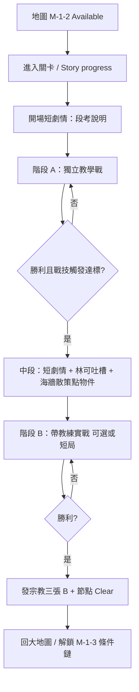

# 關卡設計企劃：1-2 海牆巡邏（M-1-2）

> **狀態**：定案（2026-05-30）  
> **用途**：M-1-2 流程、雙戰鬥、御三家戰技段考、宗教線畢業獎勵。  
> **關聯**：[`LEVEL_DESIGN_GDD.md`](LEVEL_DESIGN_GDD.md)（M-1-1 港灣）· [`CARD_PROFICIENCY_GDD.md`](CARD_PROFICIENCY_GDD.md) · [`卡牌技能階段式揭露.md`](卡牌技能階段式揭露.md) · [`HARBOR_COMBAT_COACH_GDD.md`](HARBOR_COMBAT_COACH_GDD.md) · `StoryProgressNodeDatabase.json`（`M-1-2`）

---

## 一、關卡定位

| 項目 | 內容 |
|------|------|
| **章節代碼** | 1-2 |
| **大地圖節點** | `M-1-2`（Seawall Patrol / 海牆巡邏） |
| **解鎖條件** | **M-1-1 港灣實戰首通**（`harbor_combat_clear`）；**不**在港灣首通發宗教三張 |
| **關卡類型** | 劇情 ＋ **獨立教學戰** ＋ **中段喘息（散策／點物件）** ＋ **帶教練實戰**（無戰鬥中場） |

**設計目標**

1. 在玩家已用過 30 張入門牌組、港灣實戰過後，**集中教御三家戰技**（國王／王后／民兵）。
2. 通關條件強調**觸發過**戰技，**不必**打得漂亮或限回合必勝。
3. 首通發放 **修女、主教、城堡** 各 1 張收藏，戰技熟練度 **B 階**（非 C）；重溫不重發。
4. 與 M-1-1 獎勵梯次區隔：入門 **御三家 C** → 港灣 **解鎖地圖** → 1-2 **宗教／防守線 B** → 港灣困難 **SR 聖院騎士**。

---

## 二、與 M-1-1 的獎勵分界（定案）

| 時機 | 發什麼 | 不發什麼 |
|------|--------|----------|
| **M-1-1 入門教學戰勝** | 御三家各 +1 收藏，熟練度視為 **C** | — |
| **M-1-1 港灣任一難度首通** | `harbor_combat_clear`、**解鎖 M-1-2** | **修女／主教／城堡**（明確不發） |
| **M-1-1 港灣困難首通** | SR 聖院騎士 ×1（畢業證） | 宗教三張 |
| **M-1-2 段考首通** | 修女、主教、城堡各 +1；熟練度 **B** | 御三家（已在入門發過） |

---

## 三、流程（兩段戰鬥）

> **節奏定案**：中段**無戰鬥**，用來降低「連打兩場」的疲勞；不另開 PZ 解謎或小遊戲系統。

### 3.1 階段 A：獨立教學戰（`IsM12TrioTutorialBattle`）

| 項目 | 設計 |
|------|------|
| **類比** | 入門教學戰（學院內、無天氣、專用規則） |
| **牌組** | 入門 30 張或段考專用子集（企劃可再縮：必含御三家各至少 1 張） |
| **敵方** | 溫和 AI；壓力低於港灣普通 |
| **教練** | **全程**提示：何時上國王／王后／民兵、何時會觸發戰技（可沿用 `TutorialBattleCoachUi` 擴充或專用 `M12` 台詞表） |
| **勝利** | 打贏 **且** 本局御三家戰技各至少觸發 1 次（見 §四） |

### 3.2 階段 B：帶教練的實戰（`IsM12CoachPracticeBattle`）

| 項目 | 設計 |
|------|------|
| **類比** | 港灣實戰 + **戰術教練**（`HarborCombatCoach` 或 M-1-2 專用提示表） |
| **難度** | 建議固定 **簡單** 或專用 `M12Practice` 規則（敵 HP／傷害略低於港灣簡單） |
| **背景／BGM** | 可沿用港灣 `bay.png` 或 1-2 專用美術（待美術） |
| **勝利** | 打贏 **且** 再次確認御三家戰技觸發（可與階段 A 共用本節對局計數，或要求階段 B 至少再觸發各 1 次——**定案：兩階段合計各觸發 ≥1 即可**，避免重複折磨） |

**備註**：若工期緊，可先上「階段 A 必過 ＋ 階段 B 只須勝利」，戰技觸發僅在 A 強制；文件保留 B 亦建議觸發供驗收升級。

### 3.3 中段喘息：短劇情 + 林可吐槽 + 海牆散策（無戰鬥）

| 項目 | 定案 |
|------|------|
| **位置** | 階段 A 勝利且戰技達標後 → 階段 B 開戰前 |
| **目的** | 節奏換氣；呼應節點名「海牆巡邏」；用林可人設緩衝段考壓力 |
| **不做** | 戰鬥、PZ01／PZ02 式解謎、新規則小遊戲 |

#### 3.3.1 短劇情 + 林可台詞（約 30～60 秒）

| 要素 | 說明 |
|------|------|
| **形式** | 沿用 **Main Plot** 逐句／選項（或 Story progress 全屏對話框）；可 1～2 屏 |
| **內容** | 肯定段考結果（列陣／庇護／庭訓已觸發）；預告「接下來是加練，也可先回港灣」 |
| **林可吐槽** | 輕鬆、不破壞世界觀：例如「剛剛那場比入門試煉還像考試」「海風比館內悶」「別在堤防上睡著」——**吐槽對象是流程／天氣，不嘲諷玩家操作** |
| **語氣** | 與入門劇情一致：帶教、嘴硬心軟；**不**強迫玩家記新規則 |

**建議不寫進戰鬥規則**：此段僅敘事，不發牌、不改 HP。

#### 3.3.2 海牆散策：走點／點物件拿台詞（約 2～3 分鐘）

| 要素 | 說明 |
|------|------|
| **形式** | 單屏或短卷軸**海牆場景**（可疊 `bay.png` 變體／堤防前景）；**3 個熱區**（建議固定，免隨機） |
| **操作** | 點選熱區 → 彈 1 段旁白或林可語音字幕；全部點過後解鎖「繼續加練」按鈕 |
| **戰鬥** | **無**；不進 `BattleSimulation` |

**建議熱區（企劃占位）**

| 熱區 | 物件 | 台詞方向 |
|------|------|----------|
| 1 | 海牆燈塔／號燈 | 巡邏任務、遠望港灣訓練場 |
| 2 | 纜繩／系船柱 | 林可吐槽學生別把繩結當卡牌打出 |
| 3 | 木樁／假人 | 呼應御三家段考；可選連到「宗教線畢業禮在加練後」 |

| 驗收 | 玩家可不點滿 3 個也繼續（**建議**：點滿 1 個即可繼續，其餘獎勵式台詞）——避免變成拖時間的收集 |
| 與獎勵 | **中段不發**修女／主教／城堡；發獎仍在 B 勝利後（或另議 A 後發，見 §五備註） |

#### 3.3.3 為何合理（設計對照）

| 對照 | 說明 |
|------|------|
| **世界觀** | 1-1 在學院；1-2 在**西南海岸／海牆**——散策比再開一場卡戰更像「巡邏」 |
| **認知負荷** | 段考後大腦需要**低專注**區間；點物件 = 探索，不是新系統教學 |
| **現有資產** | Main Plot、點擊繼續、港灣 BG；不必先做 PZ 拱門級謎題 |
| **林可定位** | 港灣教練／戰術提示與劇情導師同一角色；中段吐槽銜接 B 的教練語氣 |

#### 3.3.4 程式占位（待實裝）

| 項目 | 方向 |
|------|------|
| 場景 | `M12SeawallPatrolScene` 或 Main Plot 子流程 `BuildM12PatrolSteps()` |
| 旗標 | `m12_patrol_beat_seen`（可選，防重播強制看） |
| 跳過 | 提供「前往加練」；散策**非**全收集硬門檻 |

---

## 四、關卡目標：御三家戰技「觸發過」

| 戰技 | 觸發判定（程式） | 教練／劇情提示 |
|------|------------------|----------------|
| **民兵·列陣** | 本局 `playerMilitiaFormationUsed` 曾為 true | 首次上場民兵 |
| **王后·王室庇護** | 本局 `playerQueenShelterUsed` 曾觸發減傷 | 王后第一次挨打 |
| **國王·庭訓號令** | 本局 `playerKingTrainingCharges` 由 3 減少至少 1 | 直擊英雄或國王在場減傷 |

**通關邏輯（定案）**

- **不必**剩餘 HP 門檻、不必回合上限內絢麗擊殺。
- **必須**：階段 A 或 B 的合計對局中，上表三項**皆至少觸發 1 次**（玩家側；敵方不計）。
- 落敗可重試；重試不消耗獎勵次數（獎勵仍僅首通一次）。

**建議旗標**

| 旗標 | 說明 |
|------|------|
| `m12_trio_mastery_cleared` | 段考兩階段完成且戰技達標 |
| `m12_religious_line_reward` | 宗教三張已發放（重溫不重發） |

---

## 五、通關獎勵（定案）

| 卡名 | id | 收藏 | 熟練度 |
|------|-----|------|--------|
| 修女 | 17 | +1 | **B**（`progressAny = 2.0`，`winsNormal = 0`） |
| 主教 | 14 | +1 | **B** |
| 城堡 | 7 | +1 | **B**（**堅城駐守**；見 `卡牌技能階段式揭露.md` §9） |

**與御三家差異**

| 群組 | 熟練度 | 戰技 UI |
|------|--------|---------|
| 御三家（入門） | **C**（`IsStarterTrio`） | 全文 + 全效果 |
| 宗教／防守線（1-2） | **B** | 一行摘要 + **效果生效**；C 仍須 toward-C 勝場 |

**重溫**：已完成 `m12_trio_mastery_cleared` 後再玩，**不**重發三張、不補 B 進度。

---

## 六、UI／文案錨點（待接）

| 位置 | 文案方向 |
|------|----------|
| Story progress · M-1-2 | 御三家戰技段考；通關獎勵：修女、主教、城堡（戰技基礎解放） |
| 地圖節點 | 需 `harbor_combat_clear` 後 Available |
| 結算 | 首通三卡展示（類入門御三家）；副標「海牆巡邏段考通過」 |

---

## 七、程式對照（實作／待接）

| 企劃項 | 程式 |
|--------|------|
| 港灣首通不發宗教三張 | `HarborTrainingRewardService`（僅 Clear + 困難 SR） |
| 1-2 宗教三張 + B | `M12ReligiousLineRewardService.TryGrantReligiousLineReward` |
| 熟練度 B | `PlayerData.SetCardProficiencyWins(id, 2f, 0)` |
| 開戰類型 | `BattleLaunchContext.BeginM12TrioTutorialBattleLaunch` / `BeginM12CoachPracticeBattleLaunch` |
| 戰技觸發達標 | `M12TrioMasteryBattleTracker`（對局結束查詢） |
| 旗標 | `TutorialProgressState` · `m12_religious_line_reward`、`m12_trio_mastery_cleared` |

**未實裝（本定案後開發）**：Main Plot 1-2 劇情、地圖點擊進關、兩場戰鬥場景串接、結算三卡展示 UI。

---

## 八、體驗檢查清單

- [ ] 僅港灣首通：M-1-2 可進，**收藏無**修女／主教／城堡新增（若入門牌組已有不算收藏則以收藏計數為準）。
- [ ] 1-2 首通：三張入收藏，背包戰技為 **B**（修女／主教／城堡戰技可對戰觸發）。
- [ ] 1-2 重溫：無三卡、旗標不重設。
- [ ] 段考落敗：不發獎、不 Clear。
- [ ] 段考勝利但未觸發三戰技：不發獎（或提示「再試一次以觸發戰技」）。
- [ ] A 與 B 之間：可完成散策（至少 1 熱區）且無戰鬥；林可台詞可跳過或快轉。
- [ ] 散策不發宗教三張、不替代 B 勝利條件。

---

## 九、修訂紀錄

| 日期 | 變更 |
|------|------|
| 2026-05-30 | 初版：港灣首通只解鎖；1-2 雙戰鬥 + 宗教三張 B + 御三家戰技觸發通關 |
| 2026-05-30 | §3.3 中段定案：短劇情 + 林可吐槽 + 海牆點物件散策（無戰鬥、無 PZ） |
