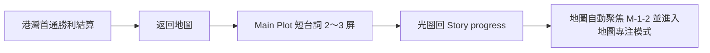
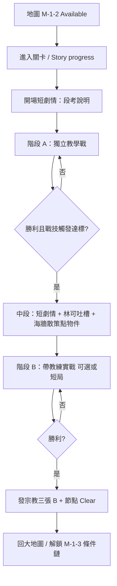

# 關卡設計企劃：1-2 海牆巡邏（M-1-2）

> **狀態**：定案（2026-05-30）  
> **用途**：M-1-2 流程、雙戰鬥、御三家戰技段考、宗教線畢業獎勵。  
> **關聯**：[`LEVEL_DESIGN_GDD.md`](LEVEL_DESIGN_GDD.md)（M-1-1 港灣）· [`CARD_PROFICIENCY_GDD.md`](CARD_PROFICIENCY_GDD.md) · [`卡牌技能階段式揭露.md`](卡牌技能階段式揭露.md) · [`HARBOR_COMBAT_COACH_GDD.md`](HARBOR_COMBAT_COACH_GDD.md) · `StoryProgressNodeDatabase.json`（`M-1-2`）

---

## 一、關卡定位

| 項目 | 內容 |
|------|------|
| **章節代碼** | 1-2 |
| **大地圖節點** | `M-1-2`（Seawall Patrol / 海牆巡邏） |
| **解鎖條件** | **M-1-1 港灣實戰首通**（`harbor_combat_clear`）；**不**在港灣首通發宗教三張 |
| **關卡類型** | 劇情 ＋ **獨立教學戰** ＋ **中段喘息（散策／點物件）** ＋ **帶教練實戰**（無戰鬥中場） |

**設計目標**

1. 在玩家已用過 30 張入門牌組、港灣實戰過後，**集中教御三家戰技**（國王／王后／民兵）。
2. 通關條件強調**觸發過**戰技，**不必**打得漂亮或限回合必勝。
3. 首通發放 **修女、主教、城堡** 各 1 張收藏，戰技熟練度 **B 階**（非 C）；重溫不重發。
4. 與 M-1-1 獎勵梯次區隔：入門 **御三家 C** → 港灣 **解鎖地圖** → 1-2 **宗教／防守線 B** → 港灣困難 **SR 聖院騎士**。

---

## 二、與 M-1-1 的獎勵分界（定案）

| 時機 | 發什麼 | 不發什麼 |
|------|--------|----------|
| **M-1-1 入門教學戰勝** | 御三家各 +1 收藏，熟練度視為 **C** | — |
| **M-1-1 港灣任一難度首通** | `harbor_combat_clear`、**解鎖 M-1-2** | **修女／主教／城堡**（明確不發） |
| **M-1-1 港灣困難首通** | SR 聖院騎士 ×1（畢業證） | 宗教三張 |
| **M-1-2 首通** | 修女、主教、城堡各 +1；熟練度 **B** | 御三家（已在入門發過） |

---

## 2.5 港灣實戰 Clear → M-1-2 銜接（L1-2-002 定案）

**觸發**：港灣**任一難度首次勝利**（`harbor_combat_clear` 由 false→true）且結算按 **返回地圖**。重複通關、平手、戰敗**不**播放。

**流程**



| 步驟 | 內容 |
|------|------|
| 1 | 結算已顯示「港灣實戰通關 · 海牆巡邏已解鎖」 |
| 2 | **Main Plot** 林可短台詞（**詳見 [`TUTORIAL_PLOT_SCRIPT.md`](TUTORIAL_PLOT_SCRIPT.md) §8.2**） |
| 3 | 回 **Story progress**；大地圖 **平移聚焦 `M-1-2`**（`EnterMapFocusMode`） |
| 4 | 玩家可關閉地圖專注或點節點（進關流程見 MAP-002b，待接） |

**台詞表**：併入 [`TUTORIAL_PLOT_SCRIPT.md`](TUTORIAL_PLOT_SCRIPT.md) **§8.2**（`BuildHarborCombatClearBridgeSteps`）。

**程式錨點**：`StoryProgressSession.LaunchHarborCombatClearBridgeAfterFirstVictory` · `StoryProgressBattleReturn.CompleteReturnFromHarborTraining(firstCombatClear)` · `StoryProgressWorldMapRuntime.ReapplyMapFocusOnPreferredNode`

**不做**：全屏佈告替換、強制自動進 M-1-2 戰鬥、重複首通時再播。

---

## 三、流程（兩段戰鬥）



> **節奏定案**：中段**無戰鬥**，用來降低「連打兩場」的疲勞；不另開 PZ 解謎或小遊戲系統。

### 3.0 任務欄（定案，兩階段共用 UI 模式）

| 階段 | 關卡目標（標題） | 任務欄條件 | 落敗 |
|------|------------------|------------|------|
| **A** | **御三家應用** | **須勝利** 且 **本局**御三家戰技各觸發 ≥1 | 重打 A |
| **B** | **教會三張搭配**（修女／主教／城堡） | **須勝利**；戰技列顯示 **A+B 合計**御三家各觸發 ≥1（A 已觸發者帶入合計） | 重打 B |

- 牌組：**關卡內鎖定**，不可換 Buildbeck 牌組；清單見 §3.1／§3.2 **定案牌表**。
- 階段 B 難度：**港灣簡單**（`HarborTrainingEasyBattleRules`，非專用 `M12Practice`）。

### 3.1 階段 A：獨立教學戰（`IsM12TrioTutorialBattle`）

| 項目 | 定案 |
|------|------|
| **關卡目標** | **御三家應用** — 在實戰節奏中用上國王／王后／民兵戰技 |
| **任務欄** | **須勝利** 且 **本局**三戰技（列陣／王室庇護／庭訓號令）**各觸發 ≥1** |
| **牌組** | **關卡內鎖定 15 張**（見下表）；**不含**修女／主教／城堡，專注御三家 |
| **類比** | 入門教學戰（學院內、無天氣、專用規則） |
| **敵方** | **鏡像對局**：敵方牌表與玩家 15 張定案表**完全相同**；敵 HP 15、傷害 ×0.85、每回合抽 1、上限 12 回合、Balanced AI；壓力低於港灣普通 |
| **教練** | **無提示**（定案變更）：A 段林可不做任何提示，棄牌時也不提示；教練僅 B 段出場（`M12BattleCoachUi` 僅於 `IsM12CoachPracticeBattle` 啟用） |
| **通過** | 任務欄全綠 → 進入 §3.3 中段；未達標 → 重打 A（不發獎） |
| **段考备忘** | **第 2 次** A 段未通過落敗後解鎖靜態 overlay（觸發條件备忘；**非**戰中教練） |

#### 定案牌表（15 張）

卡牌 id 見 `Assets/Assets/Datas/CardList.csv`。法術 Key：`-1` 火球術、`-2` 初級治療。

| id | 卡名 | 張數 | 教學用途 |
|----|------|------|----------|
| 13 | 國王 | 2 | **庭訓號令**：上場後敵直擊英雄／國王在場減傷 |
| 12 | 王后 | 2 | **王室庇護**：上場後吃第一刀 |
| 4 | 民兵 | 4 | **列陣**：主要攻擊手 |
| 5 | 長弓兵 | 2 | 低費鋪場 |
| 22 | 教徒 | 2 | 便宜填場，製造「王后會被打到」 |
| -2 | 初級治療 | 2 | 保命（不引入修女連技） |
| -1 | 火球術 | 1 | 偶發解場 |

**合計**：怪物 12 ＋ 法術 3 ＝ **15**。御三家各 ≥1。

**敵方牌表**：與上表**一模一樣**（鏡像對局），差異只在敵方參數（HP 15、傷害 ×0.85）。

**刻意不放**：修女、主教、城堡、騎兵、護林鹿（避免與 B 段教會線混淆）。

**程式對應**（已實裝）：玩家 `M12PhaseDeckCatalog.PhaseADeckCardIds`；敵方 `M12PhaseABattleRules.EnemyDeckCardIds`（複製玩家表）；敵方參數 `M12PhaseABattleRules`。

### 3.2 階段 B：帶教練的實戰（`IsM12CoachPracticeBattle`）

| 項目 | 定案 |
|------|------|
| **關卡目標** | **教會三張搭配** — 教會玩家在實戰中運用 **修女／主教／城堡**（搭配與時機，非僅打出） |
| **任務欄** | **須勝利**；戰技列：**A+B 合計**御三家各觸發 ≥1（A 段已觸發者計入，B 本局不必重複） |
| **牌組** | **關卡內鎖定 20 張**（見下表）；教會三張為核心，御三家少量保留 |
| **類比** | 港灣實戰 + **戰術教練**（`HarborCombatCoach` 或 M-1-2 專用提示表） |
| **難度** | **港灣簡單**（`HarborTrainingEasyBattleRules`：敵 HP 17、傷害 ×0.78、第 10 回合必勝等，與 M-1-1 簡單檔一致） |
| **背景／BGM** | 可沿用港灣 `bay.png` 或 1-2 專用美術（待美術 L1-2-ART-001） |
| **通過** | **須勝利**；落敗 → **重打 B**（不消耗首通獎勵次數） |
| **通關獎** | B 勝利且 A+B 戰技合計達標 → 發宗教三張 B + 節點 Clear（見 §五） |

#### 定案牌表（20 張）

| id | 卡名 | 張數 | 教學用途 |
|----|------|------|----------|
| 17 | 修女 | 2 | **聖療共鳴** ＋ 初級治療 |
| 14 | 主教 | 2 | **祝聖預留** → 綁修女（聖療連攜） |
| 7 | 城堡 | 1 | **堅城駐守** 擋第一刀 |
| 22 | 教徒 | 3 | 主教宗教連攜接棒 |
| -2 | 初級治療 | 3 | 修女主線資源（對齊入門牌組比例） |
| 13 | 國王 | 1 | A+B 御三家合計用 |
| 12 | 王后 | 1 | 與城堡／祝聖減傷順序示範 |
| 4 | 民兵 | 2 | 低費攻勢 |
| 5 | 長弓兵 | 2 | 遠程壓力 |
| 6 | 王國騎兵 | 1 | 祝聖「下一張場怪」示範 |
| -1 | 火球術 | 1 | 解場保節奏 |

**合計**：怪物 14 ＋ 法術 6 ＝ **20**。

**教練提示順序（建議）**：主教上場 → 祝聖（綁下一張 **修女**）→ 修女上場 → 初級治療（**聖療共鳴**）→ 必要時 **城堡** 擋刀（**堅城駐守**；可順帶提庇護／祝聖減傷順序）。

**戰技結算**：本局牌組含修女／主教／城堡時，戰技可結算（`playerBattleSkillRosterIds`）；首通獎仍於 B 勝後發 **B** 熟練度。

**與入門 30 張**：B 為入門宗教線精簡子集 ＋ 少量御三家，非全新牌池。

**程式對應**（已實裝）：`M12PhaseDeckCatalog.PhaseBDeckCardIds`（對照上表順序）。

> **L1-2-008 定案**：維持 **A+B 合計**御三家各 ≥1；B 任務欄不強制「本局再觸發三戰技」。工期緊時**不降級**為「B 只須勝利」。

### 3.3 中段喘息：短劇情 + 林可吐槽 + 海牆散策（無戰鬥）

| 項目 | 定案 |
|------|------|
| **位置** | 階段 A 勝利且戰技達標後 → 階段 B 開戰前 |
| **目的** | 節奏換氣；呼應節點名「海牆巡邏」；用林可人設緩衝段考壓力 |
| **不做** | 戰鬥、PZ01／PZ02 式解謎、新規則小遊戲 |

#### 3.3.1 短劇情 + 林可台詞（約 30～60 秒）

> **台詞表（權威）**：[`TUTORIAL_PLOT_SCRIPT.md`](TUTORIAL_PLOT_SCRIPT.md) **§8.4**（`BuildM12MidPatrolPlotSteps`）。

| 要素 | 定案 |
|------|------|
| **形式** | 沿用 **Main Plot** 逐句／選項（或 Story progress 全屏對話框）；可 1～2 屏 |
| **角色** | **林可**（主導）＋ 可增 **一位熱血觀戰同學**（加油／誇張反應，不搶教學戲份） |
| **內容** | 林可注意到玩家**臉色蒼白**，詢問是考試壓力還是教室異狀（**玩家三選一**）；再肯定 A 段御三家戰技已觸發，預告 B「教會三張搭配」加練 |
| **林可吐槽** | 輕鬆、不破壞世界觀（流程／天氣，不嘲諷玩家操作） |
| **語氣** | 帶教、嘴硬心軟；**不**強迫玩家記新規則 |

**建議不寫進戰鬥規則**：此段僅敘事，不發牌、不改 HP。

#### 3.3.2 海牆散策：走點／點物件拿台詞（約 2～3 分鐘）— **暫定玩法**

> **台詞表（權威）**：[`TUTORIAL_PLOT_SCRIPT.md`](TUTORIAL_PLOT_SCRIPT.md) **§8.5**（`M12SeawallStrollOverlay`）。

| 要素 | 定案 |
|------|------|
| **狀態** | **暫定**：若試玩體感**不好玩**，可整段改為另一種中段玩法（仍須**無戰鬥**、仍銜接 B） |
| **形式** | 單屏或短卷軸海牆場景；**3 個固定熱區** |
| **操作** | 點熱區 → 旁白或林可／同學字幕；解鎖「繼續加練」進 B |
| **戰鬥** | **無**；不進 `BattleSimulation` |

**建議熱區（企劃占位）**

| 熱區 | 物件 | 台詞方向 |
|------|------|----------|
| 1 | 海牆燈塔／號燈 | 巡邏任務、遠望港灣訓練場 |
| 2 | 纜繩／系船柱 | 林可吐槽學生別把繩結當卡牌打出 |
| 3 | 木樁／假人 | 呼應御三家段考；可選連到「宗教線畢業禮在加練後」 |
| **（伏筆）** | **封印法術殘頁／蠟封卷軸** | 見 §3.3.3；**1 個熱區專用**（可併入熱區 1 或 3，或獨立第 4 點——實裝時三選一） |

| 驗收 | 玩家可不點滿 3 個也繼續（**建議**：點滿 1 個即可繼續，其餘獎勵式台詞）——避免變成拖時間的收集 |
| 與獎勵 | **中段不發**修女／主教／城堡（仍僅 B 勝後 §五）；可拾取 **封印法術**（§3.3.3），**非**本關通關獎、**不可**在 B 段使用 |

#### 3.3.3 封印法術伏筆（定案 · 企劃發想）

> **來源**：[`企劃發想.md`](企劃發想.md) — 1-2 中段探索獎不採「公開新法術」，改為**支線關卡伏筆**。

| 項目 | 定案 |
|------|------|
| **取得** | 海牆散策（或等同中段事件）拾取 **1 張封印法術** |
| **玩家認知** | **不知道**這是什麼法術：卡面／圖鑑為**封印态**（蠟封、鎖链、空白符文等）；**無**名稱、**無**效果說明、**不可**加入 B 段鎖牌 20 張 |
| **系統定位** | 入**貴重品／關鍵道具**（或收藏「？？？」槽），**非**即時戰鬥資源；**不**影響 1-2 段考通關條件 |
| **敘事** | 林可／同學可一句帶過：「別亂拆，學院還沒核准這種東西」；呼應海牆舊戰術殘留 |
| **後續** | **支線關卡**（節點待定，非 M-1-2 主線 Clear 條件）解封 → 揭示真名、效果、入收藏／可編牌 |
| **主線邊界** | 1-2 首通獎**仍僅**修女／主教／城堡 **B**；封印法術**不算**第四張通關獎 |

**UI 占位**

| 狀態 | 顯示 |
|------|------|
| 拾取後 | 「封印的法術」「效果：未知」「解封條件：？？？」 |
| 圖鑑 | 佔位剪影 + 🔒；不寫入 `CardList` 公開欄直到支線解封 |
| 重溫 1-2 | 已拾取則不重發；未拾取可再拿（或改為劇情必給，待 L1-2-011） |

**建議旗標**

| 旗標 | 說明 |
|------|------|
| `m12_sealed_spell_found` | 1-2 中段已取得封印法術（支線前置） |
| `side_xx_spell_unsealed` | 支線解封後（`xx`＝支線節點代碼，待定） |

**開放企劃（寫入支線 GDD 時定案）**：~~真身是哪一張法術~~、支線節點 id、解封是否需小謎題／鬥鳥／對戰。

#### 3.3.3a 封印法術真身（定案 · L1-2-013 方向）

> **定位**：補齊法術池「**英雄向減傷**」空白；不與火球（解場直傷）、初級治療（場怪回血）、林可的凝視（空場控）重疊。  
> **解封前**：玩家僅知「封印的法術」；**解封後**才寫入 `CardList.csv` 與圖鑑。

| 項目 | 定案 |
|------|------|
| **卡名** | **潮印**（圖鑑副標／敘事：**海牻小祝禱**） |
| **英文名（占位）** | Tide Mark / Petite Benediction |
| **稀有度** | **N**（支線解封入收藏；低門檻補港灣後「防守咒」） |
| **程式 Key（占位）** | 法術 ordinal **3** · `DeckCardId.SpellKeyFromOrdinal(3)` · CSV `spell,003` |
| **類型缺口** | **英雄向減傷／護盾咒**（怪物線已有國王庭訓、王后庇護、城堡堅城） |

**效果（v1 企劃草案 · 待程式與試玩）**

| 項目 | 內容 |
|------|------|
| **打出** | 手牌點擊消耗（**定案方向**：**場上有怪時也可打出**——與初級治療並列第二種「防守咒」例外，待實作時寫入 `GAMEPLAY_AND_RULES`） |
| **效果** | 本局**下一次**對我方英雄結算的**直擊傷害**（怪攻英雄、火球直擊等；**不含**僅對場怪的傷害）**−5**，最少仍為 **1** |
| **次數** | 每張牌打出 **1 次**；單局可帶多張則各算各次 |
| **疊加** | 在**天氣蒼潮**（直傷減半）之後、**國王庭訓**（−5／次）等既有減傷**之前或之後**需試玩定序；**不**取代王后首傷庇護 |

**與主線／支線**

| 時機 | 行為 |
|------|------|
| 1-2 中段 | 僅得**封印态**道具；不可打、不可編入 B 段 20 張 |
| 支線解封 | 揭示「潮印」、入收藏、可組牌 |
| 教學鉤子 | 港灣教練「致死預警」類提示可於解封後擴充：「有潮印可先減直傷」（非 1-2 必做） |

**敘事**

- 海牆殘頁上的教會短咒，學院尚未歸檔；解封支線可接「海牻修女／燈塔檔案」一类 side 節點（**節點 id 仍待 L1-2-013**）。

**CardList 占位（解封後寫入）**

```text
spell,003,潮印,Tide Mark,N,手牌點擊：本局下一次對我方英雄的直擊傷害-5(最少1) 消耗,
```

#### 3.3.4 為何合理（設計對照）

| 對照 | 說明 |
|------|------|
| **世界觀** | 1-1 在學院；1-2 在**西南海岸／海牆**——散策比再開一場卡戰更像「巡邏」 |
| **認知負荷** | 段考後大腦需要**低專注**區間；點物件 = 探索，不是新系統教學 |
| **現有資產** | Main Plot、點擊繼續、港灣 BG；不必先做 PZ 拱門級謎題 |
| **林可定位** | 港灣教練／戰術提示與劇情導師同一角色；中段吐槽銜接 B 的教練語氣 |
| **長線钩子** | 封印法術製造「還有未知規則」；支線解封呼應大地圖探索，不搶 B 段教會三張教學 |

#### 3.3.5 程式占位（待實裝）

| 項目 | 方向 |
|------|------|
| 場景 | `M12SeawallPatrolScene` 或 Main Plot 子流程 `BuildM12PatrolSteps()` |
| 旗標 | `m12_patrol_beat_seen`（可選）；`m12_sealed_spell_found`（§3.3.3） |
| 道具 | `SealedSpellRelic` → 解封為 **潮印**（`spell,003`）；`m12_sealed_spell_found` |
| 跳過 | 提供「前往加練」；散策**非**全收集硬門檻；**封印法術**建議首通必給或預設拾取（避免漏支線前置） |

---

## 四、關卡目標：御三家戰技「觸發過」

| 戰技 | 觸發判定（程式） | 教練／劇情提示 |
|------|------------------|----------------|
| **民兵·列陣** | 本局 `playerMilitiaFormationUsed` 曾為 true | 首次上場民兵 |
| **王后·王室庇護** | 本局 `playerQueenShelterUsed` 曾觸發減傷 | 王后第一次挨打 |
| **國王·庭訓號令** | 本局 `playerKingTrainingCharges` 由 3 減少至少 1 | 直擊英雄或國王在場減傷 |

**通關邏輯（定案）**

- **不必**剩餘 HP 門檻、不必回合上限內絢麗擊殺。
- **階段 A**：**須勝利** 且 **本局**御三家三戰技**各** ≥1（任務欄即時判定）。
- **階段 B**（教會三張應用**加練**，非段考）：**須勝利**；御三家戰技以 **A+B 合計**各 ≥1 為通關條件（B 任務欄顯示合計進度；A 通常已滿足三項）。
- **B 教學焦點**：修女／主教／城堡 **搭配運用**（與 A 的御三家戰技判定分開；宗教三張戰技啟用見 §五 B 熟練度）。
- 落敗可重試；重試不消耗獎勵次數（獎勵仍僅首通一次）。

**建議旗標**

| 旗標 | 說明 |
|------|------|
| `m12_trio_mastery_cleared` | 兩階段完成且戰技達標（A 段考＋B 加練） |
| `m12_religious_line_reward` | 宗教三張已發放（重溫不重發） |

---

## 五、通關獎勵（定案）

| 卡名 | id | 收藏 | 熟練度 |
|------|-----|------|--------|
| 修女 | 17 | +1 | **B**（`progressAny = 2.0`，`winsNormal = 0`） |
| 主教 | 14 | +1 | **B** |
| 城堡 | 7 | +1 | **B**（**堅城駐守**；見 `卡牌技能階段式揭露.md` §9） |

**與御三家差異**

| 群組 | 熟練度 | 戰技 UI |
|------|--------|---------|
| 御三家（入門） | **C**（`IsStarterTrio`） | 全文 + 全效果 |
| 宗教／防守線（1-2） | **B** | 一行摘要 + **效果生效**；C 仍須 toward-C 勝場 |

**重溫**：已完成 `m12_trio_mastery_cleared` 後再玩，**不**重發三張、不補 B 進度。

---

## 六、UI／文案錨點（待接）

| 位置 | 文案方向 |
|------|----------|
| Story progress · M-1-2 | 御三家戰技段考 ＋ 教會三張搭配；通關獎：修女、主教、城堡（B） |
| 地圖節點 | 需 `harbor_combat_clear` 後 Available |
| **A 任務欄** | 標題「御三家應用」；勝利 ＋ 本局三戰技各 ≥1 |
| **B 任務欄** | 標題「教會三張搭配」；勝利 ＋ A+B 御三家合計各 ≥1 |
| 結算 | 首通三卡展示；副標「海牆巡邏通關」 |

---

## 七、程式對照（實作／待接）

| 企劃項 | 程式 |
|--------|------|
| 港灣首通不發宗教三張 | `HarborTrainingRewardService`（僅 Clear + 困難 SR） |
| 1-2 宗教三張 + B | `M12ReligiousLineRewardService.TryGrantReligiousLineReward` |
| 熟練度 B | `PlayerData.SetCardProficiencyWins(id, 2f, 0)` |
| 開戰類型 | `BattleLaunchContext.BeginM12TrioTutorialBattleLaunch` / `BeginM12CoachPracticeBattleLaunch` |
| 戰技觸發達標 | `M12TrioMasteryBattleTracker`（對局結束查詢） |
| 旗標 | `TutorialProgressState` · `m12_religious_line_reward`、`m12_trio_mastery_cleared` |
| 港灣首通 → M-1-2 銜接 | `StoryProgressSession` · `TutorialPlotScriptFactory.BuildHarborCombatClearBridgeSteps` · 台詞 **§8.2** |
| M-1-2 劇情 steps | [`TUTORIAL_PLOT_SCRIPT.md`](TUTORIAL_PLOT_SCRIPT.md) **§八** · `BuildM12IntroPlotSteps`／`BuildM12MidPatrolPlotSteps`／`BuildM12VictoryEpilogueSteps` |
| A／B 定案牌表 | §3.1（15 張，敵方鏡像同表）· §3.2（20 張）；已實裝 `M12PhaseDeckCatalog.PhaseADeckCardIds`／`PhaseBDeckCardIds` |
| 中段封印法術 | §3.3.3 · §3.3.3a **潮印**（英雄直擊 −5）；`m12_sealed_spell_found` → 支線解封 |

**未實裝（本定案後開發）**：地圖點擊進關細節優化、結算三卡展示 UI  polish。Main Plot 1-2 台詞見 [`TUTORIAL_PLOT_SCRIPT.md`](TUTORIAL_PLOT_SCRIPT.md) §八。

---

## 八、體驗檢查清單

- [ ] 僅港灣首通：M-1-2 可進，**收藏無**修女／主教／城堡新增（若入門牌組已有不算收藏則以收藏計數為準）。
- [ ] 1-2 首通：三張入收藏，背包戰技為 **B**（修女／主教／城堡戰技可對戰觸發）。
- [ ] 1-2 重溫：無三卡、旗標不重設。
- [ ] 段考落敗：不發獎、不 Clear。
- [ ] 段考勝利但未觸發三戰技：不發獎（或提示「再試一次以觸發戰技」）。
- [ ] A 與 B 之間：可完成散策（至少 1 熱區）且無戰鬥；林可台詞可跳過或快轉。
- [ ] 散策不發宗教三張、不替代 B 勝利條件。
- [ ] 中段拾取 **封印法術**：UI 無名無效；**不**進 B 牌組；支線解封前不可當法術打出。

---

## 九、修訂紀錄

| 日期 | 變更 |
|------|------|
| 2026-06-21 | §3.3.3a：封印法術真身定案 **潮印**（英雄直擊減傷咒；支線解封） |
| 2026-06-21 | §3.3.3 定案：中段 **封印法術**（未知效果）→ 支線解封伏筆；不併入 B 牌組／通關獎 |
| 2026-06-21 | §3.1／§3.2 **定案牌表**（A 15 張御三家專練、B 20 張教會三張搭配） |
| 2026-06-21 | §3.0～§3.3：A 御三家應用（鎖 15 張／本局三戰技）；B 教會三張搭配（鎖 20 張／港灣簡單）；中段熱血同學；散策暫定可替換 |
| 2026-06-21 | §2.5 定案 L1-2-002：港灣首通短台詞銜接 + 地圖自動聚焦 M-1-2 |
| 2026-05-30 | 初版：港灣首通只解鎖；1-2 雙戰鬥 + 宗教三張 B + 御三家戰技觸發通關 |
| 2026-05-30 | §3.3 中段定案：短劇情 + 林可吐槽 + 海牆點物件散策（無戰鬥、無 PZ） |
