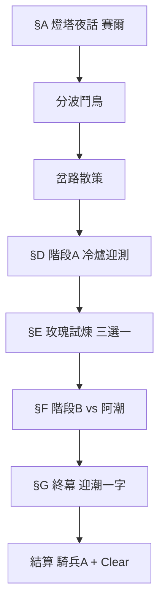

# 關卡設計企劃：1-3 河岔分波（M-1-3）

> **狀態**：企劃定案草案（2026-07-07，v2 燈下之詢）  
> **用途**：M-1-3 全流程、玩法變體、劇本、小遊戲、關卡節奏與獎勵梯次。  
> **文學原型**：博爾赫斯〈帕拉塞爾蘇斯之玫瑰〉→ 改寫見 [`M13_PLOT_SCRIPT.md`](M13_PLOT_SCRIPT.md)  
> **關聯**：[`LEVEL_DESIGN_GDD.md`](LEVEL_DESIGN_GDD.md) · [`LEVEL_DESIGN_M-1-2.md`](LEVEL_DESIGN_M-1-2.md) · [`GAMEPLAY_AND_RULES.md`](GAMEPLAY_AND_RULES.md) · [`Docs/鬥鳥手勢小遊戲企劃.md`](Docs/鬥鳥手勢小遊戲企劃.md) · [`HARBOR_COMBAT_COACH_GDD.md`](HARBOR_COMBAT_COACH_GDD.md) · `StoryProgressNodeDatabase.json`（`M-1-3`）

---

## 一、關卡定位

| 項目 | 內容 |
|------|------|
| **章節代碼** | 1-3 |
| **大地圖節點** | `M-1-3`（River Fork Crossroads / **河岔分波**） |
| **顯示副標** | **迎潮實測 · 燈下之詢** |
| **解鎖條件** | **M-1-2 段考 Clear**（`m12_trio_mastery_cleared`） |
| **關卡類型** | **文學改寫劇情** ＋ 分波鬥鳥 ＋ 岔路 ＋ **玫瑰試煉選項** ＋ 天氣實戰 ＋ 對決 |
| **預估時間** | 首次通關 **14～20 分鐘** |

**一句話**  
玩家在**邊燈塔**遇燈守·賽爾，學會「**道路即分波**」；阿潮逼當場奇蹟（燒玫瑰），玩家以**牌桌**作答；通關後賽爾獨白低語 **「迎潮」**，呼應 M-1-2 **潮印**封印。

**設計目標**

| 層次 | 內容 |
|------|------|
| **敘事** |  faith vs 眼見；奇蹟不為驗貨者表演，而留給走完路的人 |
| **玩法** | 首場天氣 ＋ 玩家選項改 B 段氛圍 ＋ 任務欄爽感 |
| **長線** | 潮印微光（非解封）；騎兵 A；M-1-4 解鎖 |

**章節情緒弧**

| 關卡 | 情緒 |
|------|------|
| M-1-1 | 被帶、學規則 |
| M-1-2 | 被考、段考恐怖、散策喘氣 |
| **M-1-3** | **夜與冷爐 → 被質疑 → 牌上證明 → 獨處真奇蹟（僅玩家見）** |

---

## 二、角色對位（改寫表）

| 原型 | 遊戲角色 | 職責 |
|------|----------|------|
| 帕拉塞爾蘇斯 | **燈守·賽爾** | 開場／玫瑰試煉／終幕；不進戰 |
| 格里斯巴赫 | **阿潮** | 要「現在就證明」；B 段對手 |
| 陌生人（弟子） | **玩家** | 帶入門 30 張＝**誓約** |
| 林可 | **林可姐** | 引路、教練、點破「別求把戲」 |
| 玫瑰 | **迎潮玫瑰**（燈下盆栽） | 連 **潮印**；可燒／可護 |
| 金幣 | **牌組鎖定** | 非消費，象徵願走此路 |
| 一字復玫瑰 | **「迎潮」** | 終幕全屏；潮印 UI 微光 |

---

## 三、總流程

| 段 | 戰鬥 | 敘事／玩法核心 |
|----|------|----------------|
| §A 開場 | 無 | 博爾赫斯基調；誓約三選一 |
| 分波鬥鳥 | 無 | 河岔隱喻；S 評加成 |
| 岔路 | 無 | 穩流／急流 |
| 階段 A | 有 | **冷爐 3 回合**→ 第 4 回合蒼潮；「外貌變、路不變」 |
| §E 玫瑰試煉 | 無 | **阻下／旁觀／我也要看** → 改 B modifier |
| 階段 B | 有 | 用**勝利＋任務**回應「你是不是騙子」 |
| §G 終幕 | 無 | 灰＋**迎潮**；潮印微光（玩家獨見） |

完整台詞見 [`M13_PLOT_SCRIPT.md`](M13_PLOT_SCRIPT.md)。

---

## 四、§E 玫瑰試煉（玩法＋劇情）

> **設計意圖**：把博爾赫斯「當眾不復、獨處復」做成**玩家選擇**；Clear 條件不綁選項，但 B 段**體感**不同。

| 選項 | 旗標 | 階段 B 修正 | 教練 | 終幕 |
|------|------|-------------|------|------|
| **阻下阿潮** | `m13_rose_intact` | 無 debuff | 全時段 | 賽爾觸玫瑰：「你選了路」 |
| **沉默旁觀** | `m13_rose_burned` | 敵 HP **+1** | 正常 | 反諷「憐憫的錯覺」 |
| **我也要看奇蹟** | `m13_rose_burned` + `m13_player_demanded_miracle` | 敵 HP +1 | **前 3 回合無教練** | 同上＋林可：「你也信眼睛」 |

**不做**：選錯即 Game Over；玫瑰燒了仍可依任務 Clear。

**演出**：燒玫瑰＝短 CG（1.5s）灰燼 UI；不刪除 M-1-2 已拾取潮印，僅加敘事 weight。

---

## 五、分波鬥鳥

（機制同 v1；敘事包裝改為 **「與分波同頻」**）

| 項目 | 定案 |
|------|------|
| 名稱 | **分波鬥鳥** |
| **BGM** | **ES_Maracuja - Kristoffer Adamah**（主線專用；鬥鳥 loop；Editor 量測 BPM／offset） |
| 局長 | 8 拍；左汊／右汊 |
| 可跳過 | 「直接迎測」 |
| S 評 | 開局天氣三選一 ＋ 多抽 1（僅 B） |

賽爾開場台詞掛鉤：「這條路就是**分波**」。

---

## 六、岔路散策

| 路線 | 敘事 | B 段 |
|------|------|------|
| **穩流道** | 林可：像賽爾說的 先穩 | Balanced；敵 HP 16 |
| **急流道** | 阿潮畫外：像我要證明的人 | FastAttack；敵傷 ×1.05 |

---

## 七、階段 A：冷爐迎測

| 項目 | 定案 |
|------|------|
| 目標名 | **冷爐與預報** |
| 隱喻 | 爐冷＝前 3 回合**無天氣**；第 4 回合蒼潮＝「別的工具」 |
| 牌組 | 18 張（同 v1 表） |
| 敵 | 木樁 AI；HP 14；×0.80 |

**任務欄 Clear**

1. 須勝利  
2. 蒼潮生效期間對敵英雄直擊 ≥1  
3. 聖療共鳴 ≥1  
4. 首見天氣預報播完（不可跳）

賽爾／教練句：「玫瑰是永恆的 只有**外貌**會變」→ 對齊天氣規則。

---

## 八、階段 B：燈下對決

| 項目 | 定案 |
|------|------|
| 目標名 | **分波對決** |
| 對手 | 阿潮 |
| 牌組 | 玩家入門 30 鎖定 |
| 天氣 | R3 預報 → R4 穿堂微風 → R8 蒼潮 |
| 難度 | 港灣普通 ＋ 岔路 ＋ §E modifier |

**任務欄 Clear**

1. 須勝利  
2. 單回合對敵英雄傷害 ≥8  
3. 祝聖→修女→初級治療 完整連攬 ≥1  

**敘事勝利**：阿潮離場＝格里斯巴赫離去；**你沒當場見玫瑰復活**，但**贏了牌局**＝「走這條路」的證明。

**熱血逆轉**（≤8 HP）：敵 +1 抽；阿潮：「現在呢 還信灰燼嗎」

---

## 九、§G 終幕與潮印

| 項目 | 定案 |
|------|------|
| 觀眾 | 僅**玩家**（阿潮已走） |
| 動作 | 賽爾倒灰；低語 **「迎潮」** |
| 視覺 | 全屏一字；貴重品庫 **封印法術** 副標 →「微光·未解」 |
| 解封 | **不**在本關；支線仍用 `m12_sealed_spell_found` 前置 |

**多巴胺**：結算騎兵 A **之前**播 15s 終幕——情緒 peak 在「奇蹟給你但不給阿潮」，再給卡牌獎。

---

## 十、通關獎勵

| 觸發 | 獎勵 |
|------|------|
| M-1-3 首通 | **王國騎兵** ×1；熟練度 **A** |
| 首通 | 解鎖 **M-1-4** |
| 分波 S 評 | 稱號「分波手」（展示） |
| 終幕 | `m13_tide_mark_glimmer`（潮印 UI） |

---

## 十一、多巴胺 × 文學對照

| 時刻 | 博爾赫斯 | 遊戲手段 |
|------|----------|----------|
| 冷爐靜坐 | 爐冷、灰塵 | A 段前 3 回合無天氣 |
| 要證明 | 「現在」 | §E 三選一 |
| 當眾失敗 | 灰燼不再成玫瑰 | 賽爾對阿潮不動 |
| 憐憫反諷 | 弟子以為大師空洞 | 阿潮離場；玩家若旁觀可選會心 |
| 獨處奇蹟 | 一字復玫瑰 | **迎潮**＋潮印微光 |
| 道路 | 起點即石頭 | 任務欄全綠、教練「出牌」 |
| 牌桌爆傷 | — | 單回合 ≥8（防線已破） |

---

## 十二、M-1-2 銜接（解鎖橋）

| # | 林可姐 |
|---|--------|
| 1 | 海牆段考過了 下游 **河岔分波** 的 **邊燈** 亮著 |
| 2 | 聽說燈守賽爾會問人 **為什麼來** 別只帶著段考分數去 |
| 3 | 地圖上節點開了 準備好再進 |

**旗標**：`m13_unlock_bridge_seen`

---

## 十三、程式占位

| 企劃項 | 錨點 |
|--------|------|
| 劇本 | `TutorialPlotScriptFactory.BuildM13OpeningSteps` · `BuildM13RoseTrialSteps` · `BuildM13EpilogueSteps` |
| 選項 | `MainPlotSceneController.PlayerChoice`（同入門劇情） |
| 玫瑰 CG | `M13RoseBurnPresentation`（1.5s） |
| 終幕 | `M13EpiloguePresentation`（一字「迎潮」） |
| 潮印 UI | `ValuablesVaultDisplay` 讀 `m13_tide_mark_glimmer` |
| 戰鬥 | `BeginM13WeatherTutorialBattleLaunch` · `BeginM13RivalDuelBattleLaunch` |
| 分波鬥鳥 | `M13StoryDuelContext` · `M13BirdDuelEntryOverlay` · `SceneLoader.LaunchM13RiverForkBirdDuel` · `BirdDuelRhythmChart.RiverForkWaveCdId` |
| B modifier | `M13RoseTrialOutcome.ApplyToBattleRules()` |
| 教練沉默 | `M13BattleCoachCatalog` + `m13_player_demanded_miracle` |
| 旗標 | `m13_rose_intact` · `m13_rose_burned` · `m13_player_demanded_miracle` · `m13_river_fork_cleared` · `m13_tide_mark_glimmer` |

---

## 十四、體驗檢查清單

- [ ] 開場呈現冷爐／邊燈氛圍；賽爾＋林可＋誓約選項可播完  
- [ ] §E 三選一皆能進 B；Clear 不綁選項  
- [ ] 燒玫瑰後阿潮仍可戰；勝利後終幕必播  
- [ ] 終幕後潮印副標變「微光·未解」（已拾取封印法術者）  
- [ ] 未拾取潮印者：終幕仍播，僅無 vault 變化  
- [ ] 阿潮 B 段台詞隨 `m13_rose_intact`／`burned` 分支  
- [ ] 首通騎兵 A；解鎖 M-1-4  

---

## 十五、修訂紀錄

| 日期 | 摘要 |
|------|------|
| 2026-07-07 | v1：河岔四段、鬥鳥、天氣、阿潮 |
| 2026-07-07 | **v2**：博爾赫斯改寫；燈守賽爾、玫瑰試煉、終幕迎潮、潮印微光；[`M13_PLOT_SCRIPT.md`](M13_PLOT_SCRIPT.md) |
| 2026-07-07 | 分波鬥鳥 BGM 定案：**ES_Maracuja - Kristoffer Adamah**（原 Light Within 更正） |
