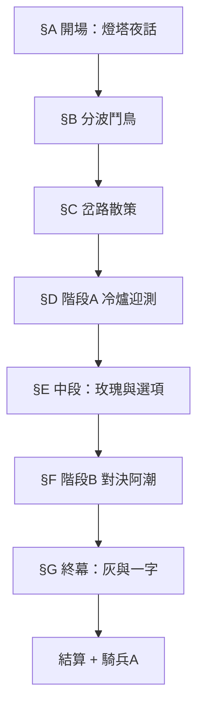

# M-1-3 劇本：河岔分波 · 燈下之詢

> **狀態**：企劃定案草案（2026-07-07）  
> **文學原型**：博爾赫斯〈帕拉塞爾蘇斯之玫瑰〉（改寫融入學院世界觀，非歷史考據）  
> **關聯**：[`LEVEL_DESIGN_M-1-3.md`](LEVEL_DESIGN_M-1-3.md) · [`LEVEL_DESIGN_M-1-2.md`](LEVEL_DESIGN_M-1-2.md) §3.3.3a **潮印** · `TutorialPlotScriptFactory.BuildM13*Steps`  
> **文案標點**：依專案慣例**不用標點**；空格分句；重點色 `#9A7A55`／機制 `#5F8F72`

---

## 一、改寫對照（原型 → 遊戲）

| 原型 | 遊戲對位 | 玩法／道具 |
|------|----------|------------|
| 帕拉塞爾蘇斯 | **燈守·賽爾**（河岔邊燈塔守術者，學院傳說中的迎潮導師） | 開場／終幕 NPC；**不**進戰鬥 |
| 約翰內斯·格里斯巴赫（弟子） | **阿潮**（M-1-2 熱血同學） | 階段 B 對手；中段「燒玫瑰」事件主導者 |
| 疲憊陌生人（玩家位） | **你**（玩家） | 實際操作者；帶**入門 30 張**當「誓約」 |
| 金幣 | **牌組誓約**（鎖定 30 張） | 象徵「願走這條路」；非消費資源 |
| 左手玫瑰 | **迎潮玫瑰**（燈下盆栽） | 連結 M-1-2 **封印法術**伏筆 |
| 冷爐、積灰蒸餾器 | **冷爐期**（A 段前 3 回合無天氣） | 天氣教學節奏 |
| 當眾不復玫瑰 | 賽爾在阿潮面前**不施奇蹟** | 中段劇情選項 |
| 獨處低語一字 | 賽爾對玩家說 **「迎潮」** | 通關後 **潮印** 封印態微光（非解封） |
| 道路即石頭 | 林可教練：**「打牌就是走這條路」** | 拒絕跳過教學／拒絕只按 S 評 |

**主題句（關卡）**  
> 你要的不是當場奇蹟，是在變天的牌桌上**仍相信這條路**。

---

## 二、流程與劇情段

---

## 三、§A 開場 `BuildM13OpeningSteps`

**場景**：河岔**邊燈塔**廳；夜；爐火微弱；遠處分波聲。  
**立繪**：賽爾（高椅剪影／老眼）、林可（側立）、無阿潮。

| # | 說話者 | 台詞 | 備註 |
|---|--------|------|------|
| 0 | VO | 夜幕垂在河岔 邊燈廳前的爐火晃著 火光似乎敵不過這股冷潮 | 黑屏或慢鏡 |
| 1 | 賽爾 | 神啊 求您賜我一位願意**走這條路**的弟子 | 面朝地面 聲輕 |
| 2 | VO | 賽爾欲起身點鐵燈 椅子一離身就變冷 他終究沒動 | |
| 3 | 林可姐 | ……賽爾師父 學院把**迎潮實測**排在這裡 不是為了再收一位學徒 | 對玩家 |
| 4 | 林可姐 | 這位是今次實測生 段考過了 教會三張也用過了 | |
| 5 | 賽爾 | 我得西方的面孔 也得東方的面孔 | 抬眼 |
| 6 | 賽爾 | 你的面孔我記不起來 你是誰 你希望我做什麼 | 對玩家 |
| 7 | 林可姐 | 他問的是**誓約** 不是名子 把你為什麼來說清楚 | 小字提示 |
| 8 | **選項** | — | 見下表 |

**選項 8（PlayerChoice）**

| 選項 | 台詞 | → | 賽爾回應 |
|------|------|---|----------|
| 1 | 我來學**迎潮** 讓牌桌會變天 | 9 | 好 變天不是懲罰 是路的一部分 |
| 2 | 我來證明段考不是運氣 | 10 | 證明給**對手**看 別向燈求把戲 |
| 3 | 我只是跟著地圖來的 | 11 | 那更要小心 漫無目的的人最愛要奇蹟 |

| # | 說話者 | 台詞 |
|---|--------|------|
| 9-11 | 賽爾 | 這條路就是**分波** 起點也是分波 你若只追終點 就還沒開始 |
| 12 | 賽爾 | 廳裡那盆**迎潮玫瑰** 是舊日學院留下的 別用手去試它 用**牌**去試 |
| 13 | 林可姐 | 先做**分波鬥鳥** 讓節奏與水流對齊 不想玩可以直接迎測 |

**旗標**：`m13_opening_seen` · `m13_oath_choice_{tide|prove|drift}`

---

## 四、§E 中段 `BuildM13RoseTrialSteps`（核心改寫）

**時機**：階段 A 通關後；燈塔廳；**迎潮玫瑰**在桌；阿潮闖入。

| # | 說話者 | 台詞 |
|---|--------|------|
| 0 | VO | 門外分波聲急了一陣 有人踏進來 同樣滿臉疲憊 |
| 1 | 阿潮 | 我聽說你在這裡 段考過了 教會三張也會了 那**現在**給我看啊 |
| 2 | 阿潮 | 傳說賽爾師父能令玫瑰成灰 再令灰成玫瑰 我只要一個**證明** |
| 3 | 賽爾 | 你太天真了 我不需要你的輕信 我需要的是**信仰** |
| 4 | 阿潮 | 正因我不輕信 我才要親眼看 玫瑰的毀滅與重生 |
| 5 | 賽爾 | 若我照做 你只會說那是把戲 那對**你**沒有幫助 |
| 6 | 賽爾 | 爐子是冷的 蒸餾器上覆蓋灰塵 這段路我用的是**別的工具** |
| 7 | 林可姐 | （對玩家）**別讓他替你做選擇** |
| 8 | **選項** | — |

**選項 8（影響 B 段氛圍，不影響 Clear）**

| 選 | 玩家 | 後續 | 玩法 |
|----|------|------|------|
| **1** | **阻下阿潮** | 9 | `m13_rose_intact`；B 教練全開；賽爾：「路還在 走」 |
| **2** | **沉默旁觀** | 12 | 阿潮自把玫瑰投入爐；`m13_rose_burned`；B 開場敵 **+1 HP**；終幕台詞加強 |
| **3** | **我也想看奇蹟** | 12 | 同燒玫瑰；`m13_player_demanded_miracle`；B 教練首 3 回合沉默後才開口 |

**若 1（阻下）**

| # | 說話者 | 台詞 |
|---|--------|------|
| 9 | 你 | 要證明去牌桌上 別動那盆花 |
| 10 | 阿潮 | ……行 那就在牌桌上見 |
| 11 | 賽爾 | 玫瑰是永恆的 只有**外貌**會變 像**天氣** 像**牌局** |

**若 2／3（玫瑰入爐）**

| # | 說話者 | 台詞 |
|---|--------|------|
| 12 | VO | 玫瑰的顏色在炭火裡一瞬間没了 只剩細灰 |
| 13 | 阿潮 | 看 什麼也沒有 |
| 14 | 賽爾 | 這些曾是玫瑰的灰 **在這裡** 不會再開花 | 對阿潮 不動 |
| 15 | 阿潮 | ……騙子 | 轉身 |
| 16 | 林可姐 | （對玩家）他錯了 但你若也只信眼睛 下一場會打得很難 |
| 17 | 賽爾 | 去牌桌上吧 若你仍願走這條路 **不用向我證明** |

---

## 五、§G 終幕 `BuildM13EpilogueSteps`

**時機**：階段 B 勝利且任務 Clear 後；**阿潮已離場**；僅玩家＋賽爾（林可 optional 旁白）。

| # | 說話者 | 台詞 | 演出 |
|---|--------|------|------|
| 0 | VO | 阿潮離去時沒有回頭 分波聲又慢了下來 | |
| 1 | 賽爾 | 你以為他看見的是空 其實他看見的是**自己的急** | |
| 2 | 賽爾 | 巴塞爾的醫生說我是騙子 或許他們對 或許我也騙自己 | |
| 3 | 賽爾 | 但我知道這是一條路 | |
| 4 | VO | 賽爾將掌中細灰傾入另一掌 低聲一個字 | **全屏：迎潮** |
| 5 | VO | 灰燼裡再無玫瑰 但貴重品庫裡那道**封印** 似乎亮了一下 | 潮印 `???` 副標改「**微光·未解**」 |
| 6 | 林可姐 | 別問我剛才那是不是魔法 問你**下一張牌**要怎麼出 | 回 Story progress 前 |
| 7 | 林可姐 | **河岔分波** Clear 外環接近解鎖了 騎兵牌拿去 祝聖終於有馬跟上了 | 接結算 |

**若 `m13_rose_intact`**：步驟 4 改為賽爾**輕觸**未燒的玫瑰，「你選了路 沒選把戲」；潮印微光較弱（同旗標不同 copy）。

**若 `m13_rose_burned`**：步驟 1 加「他憐憫我 正如你曾憐憲自己只看灰燼」——博爾赫斯式反諷。

---

## 六、戰鬥中台詞（教練／敵方）

### 6.1 階段 A（精簡教練）

| key | 台詞 |
|-----|------|
| weather_first | 天氣要來了 盤面變了 **路沒變** |
| fog_active | 蒼潮減直擊 不是讓你不打 是讓你**算對**再打 |
| heal_combo | 聖療共鳴 這就是**別的工具** |

### 6.2 階段 B（阿潮／林可）

| 時機 | 說話者 | 台詞 |
|------|--------|------|
| 開戰 | 阿潮 | 玫瑰都成灰了 你還敢開牌 |
| 開戰（玫瑰在） | 阿潮 | 花沒死 看你能不能贏 |
| 首天氣 | 林可 | 變天了 別求奇蹴 **出牌** |
| 任務2達成 | 阿潮 | ……這下算你打到 |
| 勝利 | 阿潮 | 行 這股潮我認了 下次不燒你的花 |

---

## 七、程式錨點

| 方法 | 內容 |
|------|------|
| `BuildM13OpeningSteps()` | §A |
| `BuildM13RoseTrialSteps()` | §E + PlayerChoice |
| `BuildM13EpilogueSteps()` | §G |
| `BuildM13UnlockBridgeSteps()` | M-1-2→3 林可短橋（保留原 3 句，加「邊燈在等」） |

**旗標**：`m13_rose_intact` · `m13_rose_burned` · `m13_player_demanded_miracle` · `m13_tide_mark_glimmer`（終幕後潮印 UI）

---

## 八、修訂紀錄

| 日期 | 摘要 |
|------|------|
| 2026-07-07 | 初版：博爾赫斯改寫、燈守賽爾、玫瑰試煉選項、終幕「迎潮」連潮印 |
