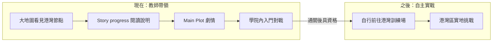

# 遊戲進度世界觀：港灣訓練場與 1-1 入門教學

> **狀態**：定案（2026-05）  
> **用途**：統一大地圖、Story progress 關卡 UI、Main Plot 劇情、教學對戰之空間與敘事邏輯。  
> **相關文件**：[`PLANNING_DOCS_INDEX.md`](PLANNING_DOCS_INDEX.md) · [`PLANNING_MASTER_TABLE.md`](PLANNING_MASTER_TABLE.md) · [`PLANNING_OPEN_ITEMS.md`](PLANNING_OPEN_ITEMS.md) · [`LEVEL_DESIGN_GDD.md`](LEVEL_DESIGN_GDD.md) · [`TUTORIAL_PLOT_SCRIPT.md`](TUTORIAL_PLOT_SCRIPT.md) · [`GAMEPLAY_AND_RULES.md`](GAMEPLAY_AND_RULES.md) · `Assets/Resources/StoryProgressNodeDatabase.json`  
> **進度／Clear 語意**：以 [`LEVEL_DESIGN_GDD.md`](LEVEL_DESIGN_GDD.md) 與總表為準；與本文件 §七「通關」敘事之差異見 [`PLANNING_OPEN_ITEMS.md`](PLANNING_OPEN_ITEMS.md) §DOC-001。

---

## 一、定案核心（必讀）

| 概念 | 定義 |
|------|------|
| **大地圖「港灣訓練場」** | 學生**學會打牌之後**，要自己前往的**自主實戰目的地**（世界地圖上的目標／戰區標記）。 |
| **1-1 流程** | **教師帶領**的**學院內入門教學**；完成後，玩家才算**有資格**在認知與劇情上「面對」地圖上的港灣挑戰。 |
| **當前階段（1-1 進行中）** | 玩家**尚未**在港灣實地獨立實戰；林可姐在**學院舊校舍對戰館**內帶入門試煉。 |

**一句話定案**

> 大地圖先標出你**以後**要自己去的地方；**現在**是老師在學院裡帶你把規則學會。

---

## 二、三層命名（避免地名與場景打架）

同一關卡在不同介面可有不同側重，但不得互相矛盾。

| 層級 | 玩家看到什麼 | 空間／敘事含義 | 建議用語範例 |
|------|----------------|----------------|--------------|
| **A. 大地圖節點** | 節點名、區域、路線起點 | 章節錨點、**未來自主實戰區**（`region: southwest_port`） | `港灣訓練場`、`1-1` |
| **B. Story progress 關卡面板** | 關卡說明、流程、佈告 | **當下**在學院內上課、老師帶打 | `學院舊校舍對戰館`、`入門指導` |
| **C. Main Plot → 教學對戰** | 劇情台詞、對戰場景 | 學院內對戰館、入門級、無天氣 | `舊校舍對戰館`、`訓練場入門級` |

**原則**：A 談「將來要去哪」；B、C 談「現在在哪學」。

---

## 三、玩家旅程（1-1 時間線）

| 階段 | 地點（敘事） | 誰主導 |
|------|----------------|--------|
| 登入後首次 | Story progress | 系統引導 |
| 點「進入關卡」 | Main Plot → 學院對戰館 | 林可姐／導師帶領 |
| 入門對戰 | 學院內（程式：入門級、無天氣） | 玩家操作、老師脈絡之教學戰 |
| 通關後 | 大地圖節點可標為 Clear；認知上「可面對港灣」 | 玩家自主（後續關卡擴充） |

---

## 四、劇情圓法（企劃用語，可寫進文案）

擇一或合併使用，**勿**在「學院教學段」描寫玩家已在港灣碼頭實戰。

### 4.1 招生／課程名（推薦）

- **港灣訓練場** = 學院為港灣線新生開設的**第一堂實戰課程名稱**（或畢業試煉的註冊名稱）。
- 實際上課地點 = **舊校舍對戰館**（與 `TutorialPlotScriptFactory` 一致）。

### 4.2 地圖為登記點、戰鬥在學院

- 大地圖港灣節點 = 任務簿上的**目標戰區登記**（日後自行前往）。
- 今日流程 = 林可姐在學院帶完成**入門試煉**，通過後才算完成「登記課程」。

---

## 五、文案與美術檢查表

新增或修改文案、場景、節點時，請對照本表。

| 檢查項 | 應 | 不應 |
|--------|----|------|
| 1-1 關卡說明 | 學院、對戰館、老師帶領、入門試煉 | 甲板、海鹽味、今日在港灣碼頭開打 |
| 大地圖節點副標（若有） | 日後實戰區、通關入門後面對 | 暗示玩家「現在就在港灣」 |
| Main Plot | 舊校舍對戰館、館內規則 | 把對戰改寫成港灣戶外 |
| 通關後台詞 | 你有資格挑戰地圖上的港灣訓練場 | 宣稱「剛才那一戰在港灣打的」 |
| 對戰背景美術 | 學院／對戰館內景（若已如此設定） | 港灣碼頭外景（除非另開關卡） |

**標點**：Story progress 關卡 UI 文案依專案慣例可**不用標點**，以空格分句；重點字用顏色標示（見 `StoryTextStyle`）。

---

## 六、程式與資料對照（實作錨點）

| 資源 | 欄位／常數 | 世界觀備註 |
|------|------------|------------|
| `StoryProgressNodeDatabase.json` | `M-1-1`, `title`, `region` | 地圖節點；`southwest_port` = 港灣線地理錨點，≠ 當前對戰座標 |
| `StoryProgressLevelCopy.cs` | `LevelTitle`, `BuildScenarioIntro`, `BuildHarborBulletin` | 右側面板與底欄佈告；應對齊「學院教學中」 |
| `TutorialPlotScriptFactory.cs` | 劇情 steps | **權威**學院場景用語：舊校舍對戰館 |
| `StoryProgressWorldMapRuntime.cs` | 節點 `M-1-1` 顯示 | 地圖可顯示「港灣訓練場」；與副標分層 |

資料庫節點英文 `title`（`Harbor Training Yard`）可保留作區域名；玩家-facing 中文以「港灣訓練場」為**目標戰區名**，非當前場景名。

---

## 七、常見誤解（給企劃／程式／美術）

| 誤解 | 正確理解 |
|------|----------|
| 「1-1 在港灣打所以大地圖放港灣」 | 大地圖標的是**章節與未來戰區**；當前戰在學院。 |
| 「關卡名叫港灣訓練場所以對戰 BG 要是碼頭」 | 名稱是**課程／戰區註冊名**；入門戰景在學院。 |
| 「通關 1-1 = 已經去過港灣」 | 通關 = **入門畢業**；「去港灣」是後續自主行動（可留給 1-2 或同一節點二階段）。 |

---

## 八、後續擴充備註（非本次範圍）

- **真正港灣實地戰**：可為 `M-1-2`、或 `M-1-1` 通關後解鎖之「二階段／重訪」，美術與副本規則與入門戰分開。
- **世界地圖路線**：港灣節點可作第一章起點；實線連往後續關卡，不暗示 1-1 戰鬥發生在碼頭。

---

## 九、修訂紀錄

| 日期 | 說明 |
|------|------|
| 2026-05-28 | 初版定案：港灣 = 學成後自主目的地；1-1 = 學院內教師帶領入門教學。 |
