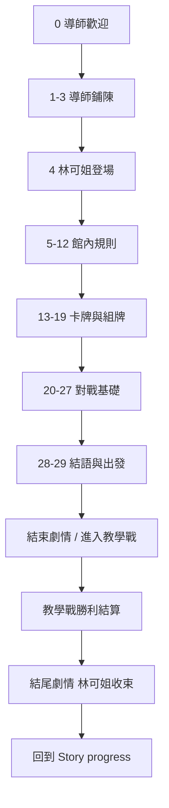

# 新手教學劇本

> **相關文件**：[`PLANNING_DOCS_INDEX.md`](PLANNING_DOCS_INDEX.md) · [`LEVEL_DESIGN_GDD.md`](LEVEL_DESIGN_GDD.md) · [`STORY_PROGRESS_WORLDVIEW.md`](STORY_PROGRESS_WORLDVIEW.md) · [`GAMEPLAY_AND_RULES.md`](GAMEPLAY_AND_RULES.md)  
> **用途**：`Main Plot` 場景之 `MainPlotSceneController.steps` 台詞與分支對照。  
> **目標玩家**：首次進館、尚未完成教學對戰者。  
> **教學後接續**：登入 → **Story progress**（1-1）→ 每次點 **進入關卡** 皆為 **Main Plot 劇情（含選項）** → **自動**入門級教學對戰 → 回到 Story progress。首次通關後可 **前往大廳**；登入已完成教學者直達大廳。  
> **角色**：**導師**（畫外／簡短）、**林可姐**（紀錄員兼引導，語氣沉穩俐落）、**你**（玩家）。

---

## 一、設計原則

| 原則 | 說明 |
|------|------|
| **一次一個概念** | 每 1～2 句只教一件事，避免與實機 UI 搶注意力。 |
| **先會玩、再記名詞** | 先讓玩家知道「英雄會死、手牌有上限」，再提怪獸／法術分類。 |
| **對齊實機規則** | 數值以 `GAMEPLAY_AND_RULES.md` 為準：英雄 20 HP、起手 5 張、手牌上限 7、牌組 30 張。 |
| **進階延後** | **天氣不在教學關演示**（入門級對戰程式關閉）；林可的凝視、熟練度 A/B/C、戰前謎題亦延後。 |
| **文案標點** | 暫不使用標點；以空格分句，重點用 `StoryTextStyle` 粗體＋色碼（`#9A7A55` 強調、`#5F8F72` 機制詞）。 |
| **推進方式** | 台詞**逐字顯示**；打字中點擊＝立即顯示全文，全文後再點＝前進。**TapToContinue**：依 `tapNextStepIndex` 換句；**PlayerChoice**：全文顯示後才出現選項按鈕。 |

---

## 二、流程總覽

---

## 三、角色立繪建議（選填）

| 欄位 | 建議 |
|------|------|
| `characterA` | 林可姐（主引導；立繪＝卡牌 **林可的凝視** 本體圖 `CardArt/林可的凝視`） |
| `characterB` | 導師或訓練場剪影 |
| `characterC` | 玩家側剪影／無立繪 |
| `backgroundSprite` | 訓練場／教室對戰區背景 |

---

## 四、完整步驟表（`PlotStep`）

**欄位說明**

- **#**：`steps` 清單索引（`startStepIndex = 0`）。
- **選1／選2／選3**：按鈕文字；`-` 表示該按鈕隱藏（`choiceNText` 留空且 `choiceNNext = -1`）。
- **→**：對應 `choiceNNext`。

| # | 說話者 | 台詞 | 選1 | → | 選2 | → | 選3 | → |
|---|--------|------|-----|---|-----|---|-----|---|
| 0 | 導師 | 歡迎來到舊校舍對戰館 從今天起 你不再只是看客 你要**親自舉牌** | 我準備好了 | 1 | - | - | - | - |
| 1 | 導師 | 館內燈光壓低了一檔 對戰桌一字排開 你以前多半只在欄外看別人出牌吧 | 繼續 | 2 | - | - | - | - |
| 2 | 導師 | 從今天起你正式登記入座 這裡的規則與勝負 都照對戰館的帳來算 不講人情 | 繼續 | 3 | - | - | - | - |
| 3 | 導師 | 實戰前的入門與戰況紀錄 我交給副館長 **林可** 她會帶你走過該知道的事 | 繼續 | 4 | - | - | - | - |
| 4 | 林可姐 | ……聽到了吧 導師說的就是我 戰況簿在我這 場上出了什麼岔 都會記一筆 | 繼續 | 5 | - | - | - | - |
| 5 | 林可姐 | 叫我林可姐就好 接下來帶你走一條**能開打**的最短路 別走神 | 繼續 | 6 | - | - | - | - |
| 6 | 林可姐 | 這裡的對戰 不比誰牌比較華麗 看的是誰先讓對手**英雄生命**歸零 | 繼續 | 7 | - | - | - | - |
| 7 | 林可姐 | 雙方英雄都是 **20** 點生命 歸零就輸 跟你場上還有沒有怪獸無關 記清楚 | 繼續 | 8 | - | - | - | - |
| 8 | 林可姐 | 開場擲骰定**先手** 別緊張 先手只是先出牌 又不代表你會贏 | 繼續 | 9 | - | - | - | - |
| 9 | 林可姐 | 牌就兩類 **怪獸** 跟 **法術** 怪獸站場上 法術多半打完進棄牌 | 繼續 | 10 | - | - | - | - |
| 10 | 林可姐 | 同一時間 場上通常只留一隻怪獸 新的來舊的就走 別指望排一整排 | 繼續 | 11 | - | - | - | - |
| 11 | 林可姐 | 法術有條件 例如**初級治療**治的是場上怪獸 場上已有怪時 有些牌就不能從手牌打出 | 繼續 | 12 | - | - | - | - |
| 12 | 林可姐 | **火球術**多半拿來拆對手場上的怪 對手場上沒怪 傷害才會落到英雄身上 | 繼續 | 13 | - | - | - | - |
| 13 | 林可姐 | 小測驗 想打英雄 對手場上卻有怪擋著 穩一點的做法是 | 先出火球清場 | 14 | 先放治療 | 15 | 棄掉所有手牌 | 15 |
| 14 | 林可姐 | 嗯 先清場再說 直攻英雄是下一步 火球常用在這種時候 | 繼續 | 16 | - | - | - | - |
| 15 | 林可姐 | 再想一下 治療只能救己方怪獸 **清對手場上的怪**不是治療的活 回去重選 | 回到題目 | 13 | - | - | - | - |
| 16 | 林可姐 | 進對戰前 先組一副**牌組** 規則簡單 **最多 30 張** 只能放你已持有的卡 | 繼續 | 17 | - | - | - | - |
| 17 | 林可姐 | 去 **Buildbeck** 組牌 左邊館藏 點卡加進右邊牌組 記得按**儲存** 不然下次還是空的 | 繼續 | 18 | - | - | - | - |
| 18 | 林可姐 | 列表是小圖 詳情才是大立繪 別以為壞掉 只是用途不同 | 繼續 | 19 | - | - | - | - |
| 19 | 林可姐 | 教學期間先給你一副基礎牌組 民兵 長弓 治療 火球都有 能開打再說 風格慢慢換 | 繼續 | 20 | - | - | - | - |
| 20 | 林可姐 | 進戰鬥起手抽 **5** 張 手牌最多 **7** 張 塞太滿就得棄牌或先打完 別拖 | 繼續 | 21 | - | - | - | - |
| 21 | 林可姐 | 你的回合通常就三件事 **出牌** **攻擊** 最後按**結束回合** 不按結束 對手不會動 | 繼續 | 22 | - | - | - | - |
| 22 | 林可姐 | 怪獸上場記得叫它攻擊 很多人輸在 **放了怪卻忘記打** 別當其中一個 | 繼續 | 23 | - | - | - | - |
| 23 | 林可姐 | 右側有**最近戰況** 剛剛發生什麼都記在那 結算看不懂 先翻那裡 | 繼續 | 24 | - | - | - | - |
| 24 | 林可姐 | 再考你一次 場上已有一隻民兵 還沒攻擊 這時該先做什麼 | 按結束回合 | 25 | 讓民兵攻擊 | 26 | 立刻再上一隻怪 | 25 |
| 25 | 林可姐 | 場上通常只留一隻怪 再上一隻會頂掉舊的 剛才那步等於白做 先攻擊 或先想清楚 | 回到題目 | 24 | - | - | - | - |
| 26 | 林可姐 | 這就對了 先攻擊 再視情況結束回合 最基本的節奏就是這樣 | 繼續 | 27 | - | - | - | - |
| 27 | 林可姐 | 進訓練場選**入門級** 給第一次實戰用的 這級不會有天氣 專心練出牌跟攻擊 | 繼續 | 28 | - | - | - | - |
| 28 | 林可姐 | 天氣 隱藏難度 那些特殊法術 贏幾場再說 現在目標只有一個 **打完第一場教學戰** | 繼續 | 29 | - | - | - | - |
| 29 | 林可姐 | 戰況簿我會幫你記 準備好了就點出發 **直接進教學對戰** | 出發 | -1 | 再看一次組牌說明 | 18 | - | - |

**步驟 29 說明**

- **出發！**：`choice1Next = -1`，三顆按鈕皆隱藏後劇情結束；請在場景外由按鈕／`SceneLoader` 跳轉大廳或 Buildbeck（見 §六）。
- **再看一次組牌說明**：跳回步驟 18（Buildbeck 組牌），給想複習的玩家。

---

## 五、教學對戰內提示文案（林可姐教戰面板）

> **港灣實戰區**（挑戰港灣訓練場）戰術提示為另一套系統，僅關鍵時刻救場，見 [`HARBOR_COMBAT_COACH_GDD.md`](HARBOR_COMBAT_COACH_GDD.md)。

第一場入門級教學戰（`BattleLaunchContext.IsIntroTutorialBattle`）由 `TutorialBattleCoachUi` 顯示林可姐立繪與逐字提示（9 字／秒）。**點擊面板**可展開／收起；展開時面板移至右側（棄牌階段）或左側（一般回合），半透明遮罩僅暗化畫面、**不擋**手牌觸控。暫不使用標點符號。

| 觸發時機 | 提示文字 |
|----------|----------|
| 開場後 | 這是你的回合試著出一張怪獸或法術 |
| 己方場上有怪、未攻擊 | 點選場上怪獸再選擇攻擊目標 |
| 手牌 6 張以上 | 手牌接近上限七張注意棄牌或快用掉 |
| **手牌超過 7 張（棄牌階段）** | 手牌超過上限了長按不要的牌拖到左側棄牌區（多張時文案會帶剩餘張數） |
| 可結束回合且已攻擊過 | 若沒有其他行動可按結束回合 |
| 勝利結算 | `TutorialBattleSettlementUi`：入場動畫＋依序展示國王／王后／民兵卡圖；贈送各 1 張入背包 |
| 戰敗結算 | `TutorialBattleSettlementUi`：教學對戰失敗；可再試一次或返回劇情 |

### 5.1 建議出牌 vs 建議棄牌（手牌高亮）

| 類型 | 程式 | 說明 |
|------|------|------|
| 建議**打出** | `TutorialHandPlayAdvisor` | 依回合目標評分；高亮與「你的回合」橫幅同步；見上表一般提示 |
| 建議**棄掉** | `TutorialHandDiscardAdvisor` | 與 `GetRecommendedPlayerDiscardHandIndex()` 相同；**每次只高亮 1 張**；棄掉一張後重算 |

**建議棄牌怎麼算**（三階段，與玩家自動棄一張相同）：

1. 優先棄**當下打不出去**的牌（手牌由左到右第一張符合者）。
2. 否則若有**同 `id` 重複**，在重複牌中棄**保留價值最低**者。
3. 否則棄全手**保留價值最低**者（怪獸：`攻×2+血`；法術依場上狀態與可否施放給分）。

完整判定表、數值與「未含開局火球封鎖」等細節 → [`ENEMY_AI_DECISION_TREE.md`](ENEMY_AI_DECISION_TREE.md) **§5.2**。

---

## 六、與場景／程式的銜接建議

| 項目 | 建議 |
|------|------|
| **Story progress** | `Assets/Scenes/Story progress.unity`；`StoryProgressSceneController` 自動生成並綁定「進入關卡」按鈕；左上 **返回** 使用 `Assets/UI/return.png`（執行期 `Resources/UI/return`）。 |
| **返回按鈕** | 僅 Story progress 場景；點選一律載入 `hall`。 |
| **劇情場景** | `Assets/Scenes/Main Plot.unity`；由 `TutorialPlotScriptFactory` 注入 26 步，不需手填 Inspector。 |
| **結束後跳轉** | 步驟 25「出發」或「略過本段劇情」→ 標記劇情完成 → **直接**載入教學對戰（`LaunchTutorialBattleAfterPlot`）。 |
| **教學對戰** | `TutorialDeckApplicator` + `SceneLoader.LaunchIntroTutorialBattleDirect`（入門級、無天氣）；不論是否通關過，**進入關卡** 都從劇情重新開始。 |
| **對戰結束** | 勝利：結算「繼續」→ 發放御三家 → `BuildTutorialPlotEpilogueSteps` 結尾劇情 → Story progress；戰敗：再試一次或返回劇情（重播開場劇情）。 |
| **結尾劇情** | `TutorialPlotScriptFactory.BuildTutorialPlotEpilogueSteps`（4 步，最後一步 `tapEndsPlot`）；BGM／打字／點擊音與開場劇情相同。 |
| **登入導流** | 未完成教學的槽位登入後進 **Story progress**，完成後進 `hall`。 |
| **教學關天氣** | `IntroGreedy` → `IsWeatherSystemEnabledForBattle()` 為 false。 |
| **跳過教學** | 設定場景或登入後提供「我已熟悉規則」→ 僅標記完成、不擋後續內容。 |
| **與熟練度 GDD** | 教學戰勝利可選：將教學牌 3 張升至 B（見 `CARD_PROFICIENCY_GDD.md` §7 待決）；劇情本稿不強制。 |

---

## 七、版本

| 日期 | 說明 |
|------|------|
| 2026-05-20 | 初版：29 步（索引 0～28），含 2 段小測驗與組牌／對戰／天氣入門。 |
| 2026-05-27 | 教學關移除天氣劇情（26 步，索引 0～25）；入門級對戰程式關閉天氣系統。 |
| 2026-05-27 | `TutorialBattleCoachUi`：教學戰內林可姐即時引導；點面板展開／收起。 |
| 2026-05-30 | 棄牌階段教戰文案、建議棄牌手牌高亮；規則細節見 `ENEMY_AI_DECISION_TREE.md` §5.2。 |
| 2026-05-27 | `TutorialBattleSettlementUi`：教學戰勝敗結算；勝利贈國王／王后／民兵。 |
