<div class="cover">
<div class="cover-kicker">DETAILED DESIGN DOCUMENT</div>
<h1 class="cover-title">詳細設計文件</h1>
<div class="cover-sub">卡牌遊戲（Unity 專題）</div>
<div class="cover-meta">版本：v1.0（彙整版）　·　日期：2026-06-07<br>提案摘要請見《遊戲企劃書》</div>
</div>

<div class="page-break"></div>

# 目錄

- **第一章　遊戲概述**
  - 1.1　遊戲定位
  - 1.2　市場分析
  - 1.3　市場分析資料來源
- **第二章　世界觀與敘事**
  - 2.1　世界觀設定
  - 2.2　主線教學劇本（1-1）
- **第三章　遊戲系統與機制**
  - 3.1　核心玩法與規則
  - 3.2　卡牌熟練度養成
  - 3.3　難度與 AI 設計
  - 3.4　敵方 AI 決策樹
  - 3.5　1-1 與練習場難度對照
  - 3.6　戰鬥教練系統
  - 3.7　場地牌狀態索引
  - 3.8　戰前預覽／解謎
  - 3.9　牌組存檔
- **第四章　關卡設計**
  - 4.1　關卡設計 GDD（1-1 港灣）
  - 4.2　關卡設計（1-2 海牆巡邏）
- **第五章　美術、UI 與視覺規格**
  - 5.1　對戰 UI 配色規格
  - 5.2　對戰 FX 配色規格
  - 5.3　背包檢視 UI 配色
  - 5.4　美術資源盤點
- **第六章　技術與效能**
  - 6.1　架構總覽
  - 6.2　效能優化索引
  - 6.3　資源讀取報告
  - 6.4　戰鬥教練實作
- **第七章　測試與平衡**
  - 7.1　P0 手動回歸測試
  - 7.2　港灣教學牌組勝率模擬
  - 7.3　平衡與 AI 參考書目
- **第八章　體驗企劃（發想）**
  - 8.1　體驗發想
- **附錄　修訂紀錄**

<div class="page-break"></div>

# 第一章　遊戲概述

> 本章說明遊戲的定位、目標受眾與市場切入點，建立全書的高層級認知。

## 1.1　遊戲定位

**遊戲名稱**：卡牌遊戲（Unity 專題）

**類型**：回合制卡牌對戰（含天氣、熟練度養成、教學引導）。

**平台**：Unity 2023.1.22f1；以 1920×1080 為 UI 設計基準，支援 Android 橫向。

**目標受眾**：喜愛輕量策略卡牌、可單機推進主線的玩家；以教學友善、單局節奏明快為主軸。

**一句話賣點**：用「看得懂的敵方 AI 意圖 + 隨牌成長的熟練度」，把卡牌對戰的學習曲線變得清楚又有成就感。

## 1.2　市場分析

<div class="source-note">來源文件：<code>MARKET_ANALYSIS_FIVE_GAMES.md</code></div>

### 五款熱門競品深讀：卡牌技能呈現 vs 本作 A／B／C 提案

| 項目 | 內容 |
|------|------|
| **目的 1** | 查「熟練度解鎖技能階段」是否有熱門先例；若有，玩家回饋與熱門的關係 |
| **目的 2** | 若無同構先例，歸納熱門作品的**技能／效果呈現方式**與玩家為何買單 |
| **對照軸** | 本作 **A**（無技能）→ **B**（一行摘要）→ **C**（完整條文） |
| **關聯** | [`MARKET_ANALYSIS_SOURCES.md`](MARKET_ANALYSIS_SOURCES.md)、[`CARD_PROFICIENCY_GDD.md`](CARD_PROFICIENCY_GDD.md) |
| **最後更新** | 2026-05-16 |

---

#### 1. 為何選這五款（皆屬「熱門」可操作定義）

| # | 作品 | 地區 | 商業化類型 | 熱門依據（公開資料摘要） |
|---|------|------|------------|--------------------------|
| 1 | **Pokémon TCG Pocket** | 亞洲（日本主導 IP／DeNA） | **商業化**（F2P 手遊） | 2024 上線後大量媒體報導「簡化實體 TCG、吸納新玩家」；與 Marvel Snap 並稱降低門檻的卡牌產品線 |
| 2 | **月圆之夜**（Night of Full Moon） | 亞洲（中國獨立／滴答工作室） | **獨立**（買斷＋手機） | 報導稱全球下載 **900 萬+**、手機流水 **5000 萬+** 人民幣級；Steam **約 8 萬則評價、81% 好評** |
| 3 | **MARVEL SNAP** | 非亞洲（Second Dinner，美國） | **商業化**（F2P） | 全球現象級快節奏 TCG；Steam／手機長期高討論度；2025 **Character Mastery** 上線引發社群辯論 |
| 4 | **Slay the Spire** | 非亞洲（Mega Crit，美國） | **獨立**（買斷） | Steam **21 萬+ 評價、約 97% 好評**；品類標竿，峰值同時在線 **5.5 萬+** |
| 5 | **Balatro** | 非亞洲（LocalThunk，加拿大） | **獨立**（買斷） | 2024 **現象級**；媒體稱 Demo 階段即 **10 萬+ 下載、數百萬小時**；TGA 等年度提名 |

> **未選 Indies' Lies 的原因**：屬亞洲獨立卡牌旁支，但 Steam 同時在線已跌至個位數，不符合本輪「**必須熱門**」門檻。若論文需「Erabit 發行路徑」可放附錄。

**一手來源（節錄）**

- Pokémon TCG Pocket：[Polygon 新手對戰入門](https://www.polygon.com/pokemon/473455/tcg-pocket-battling-first-time-trading-card-game)、[Kotaku 與 Snap 並論簡化](https://kotaku.com/pokemon-tcg-pocket-marvel-snap-1851653373)
- 月圆之夜：[GameLook 長線 IP 報導](http://www.gamelook.com.cn/2019/07/366808/)、[Steam 商店頁](https://store.steampowered.com/app/769560/)
- MARVEL SNAP Mastery：[官方 Character Mastery](https://marvelsnap.com/character-mastery/)、社群討論 [Steam Discussions](https://steamcommunity.com/app/1997040/discussions/0/598518433314777785/)
- Slay the Spire：[Steam 商店頁](https://store.steampowered.com/app/646570/)
- Balatro：[Polygon 評測](https://www.polygon.com/reviews/24084564/balatro-review-poker-game-deck-building-roguelite)

---

#### 2. 五款作品的「卡牌技能／效果」呈現方式

##### 2.1 總表（與本作 A／B／C 對位）

| 作品 | 玩家何時看到「技能」 | 文字量級 | 是否「先無後有」解鎖規則 | 接近本作階段 |
|------|----------------------|----------|--------------------------|--------------|
| **Pokémon TCG Pocket** | 拿到卡即見**改寫後**的攻擊／能力（較實體版精簡） | 中～短（行動選項少） | **否**（設計師預先簡化卡池，非玩家進度解鎖） | 像「全域 A→B」：一開始就給**簡化版 B**，不是 A |
| **月圆之夜** | 選牌／獲牌當下即見**完整效果** | 中（Roguelike 單卡說明） | **否**（進 Run 後逐步拿牌，但每張卡本身不鎖條文） | 偏 **C**（單卡層級一次給齊） |
| **MARVEL SNAP** | 抽到即知 **On Reveal／Ongoing** 等一行機制 | **極短**（關鍵字可點） | **否**；Mastery **不解鎖規則** | 常態 = **B**；Mastery = 外觀（非 B/C） |
| **Slay the Spire** | 獎勵三選一即見**全文 + 工具提示** | 中～長 | **否** | 標準 **C** + UI 輔助 |
| **Balatro** | 購買 Joker／道具當下即見**全文** | 短～中 | **否** | 基底規則極簡（像 **A 的世界觀**），成長靠**新卡全文**（像 **C 元件**） |

##### 2.2 分款摘要

###### （亞洲・商業化）Pokémon TCG Pocket

| 維度 | 內容 |
|------|------|
| **呈現** | 20 張牌組、自動能量、勝利條件改為擊倒 3 隻；**多數卡能力相對實體版刪減或改寫** |
| **玩家回饋（熱門相關）** | **正面**：collector 與新手願意「第一次真的打牌」；被媒體形容為把 TCG 簡化到可與快節奏產品競爭。**負面**：多貨幣、內容量大，首週仍覺得「confusing」 |
| **與 A/B/C 距離** | 熱門來自**全域簡化**，不是「同一張卡先 A 再 B 再 C」。與本作提案**路線不同**，但**目標一致**（降低門檻） |

###### （亞洲・獨立）月圆之夜

| 維度 | 內容 |
|------|------|
| **呈現** | Roguelike：**每張卡進牌組即帶完整效果**；複雜度來自「這局拿到什麼組合」，不是「這張卡還沒解鎖說明」 |
| **玩家回饋（熱門相關）** | **正面**：美術、童話 IP、重玩性、買斷良心。**負面**：後期 DLC／模式多後學習成本上升（仍是一次給齊規則，非分階鎖條文） |
| **與 A/B/C 距離** | 成功證明**華語市場願意為「卡牌 + Roguelike」付費**；但未驗證「熟練度鎖技能文字」 |

###### （非亞洲・商業化）MARVEL SNAP

| 維度 | 內容 |
|------|------|
| **呈現** | 12 張牌組、單局極短；卡面**一行能力** + 關鍵字；**Character Mastery（2025）** = 刷 Variant／Split 拿**閃光、Finish、表情**，**不改變對戰規則** |
| **玩家回饋（熱門相關）** | **正面**：快、爽、讀得懂、適合手機。**Mastery 負面**：進度綁**課金／抽 Variant** 而非「玩得熟」；池子被稀釋、無法自由混搭 Finish／Flare（社群常見抱怨） |
| **與 A/B/C 距離** | 有「Mastery」字樣但**不是本作意義的 B/C 規則解鎖**；若論文引用需**明確區分**，避免評審以為已有先例 |

###### （非亞洲・獨立）Slay the Spire

| 維度 | 內容 |
|------|------|
| **呈現** | **一開始就給完整卡面文字**；複雜度靠 Synergy 與路線選擇累積；工具提示降低誤讀 |
| **玩家回饋（熱門相關）** | **正面**：「易上手難精通」、每局不同、說明清楚。**負面**：少數卡敘述仍歧義；高難度需學習曲線（玩家接受，因為買斷 Roguelike 預期） |
| **與 A/B/C 距離** | 熱門依賴**透明（C）+ 教學 UI**，而非**隱藏（A）再揭露** |

###### （對立・獨立）Balatro

| 維度 | 內容 |
|------|------|
| **呈現** | **撲克牌型規則極簡且固定（A 級基底）**；成長來自 Joker／Planet 等**購買即全文可讀**的加成 |
| **玩家回饋（熱門相關）** | **正面**：10 分鐘內進入「數字爆炸」爽感、無劇情負擔、重開快。**負面**：後期數字與組合過多可能暈（玩家仍買單，因 Roguelike 隨機性） |
| **與 A/B/C 距離** | 啟示：**底層規則可先極簡**，但**新效果仍建議一次給清**；與「鎖條文」不同 |

---

#### 3. 研究問題 1：本作企劃（熟練度 → A/B/C）是否有熱門先例？

##### 3.1 結論（針對上述五款）

| 判斷 | 說明 |
|------|------|
| **同構先例：無** | 五款皆**未**採用「同一張怪物卡：先無技能 → 熟練度達標 → 一行技能 → 再達標 → 完整規則」 |
| **部分類似（需寫清差異）** | 見下表 |

| 類似點 | 作品 | 與本作差異 | 玩家回饋是否支撐「熱門」 |
|--------|------|------------|------------------------|
| 名稱有 Mastery | Marvel Snap | **外觀／表情**，非規則；進度綁 Variant | 熱門**不**靠 Mastery；Mastery **爭議** |
| 全域簡化 | Pokémon TCG Pocket | 設計師改卡＋改規則，**非**玩家個人進度 | **是**熱門主因之一 |
| 局內逐步複雜 | 月圆之夜、Slay the Spire | Run 內**取得新卡**，每卡仍**一次給齊**說明 | **是**；靠透明 + 組合深度 |
| 基底簡、元件全文 | Balatro | 基底像 A，但每個 Joker **購買即 C** | **是**；靠爽感與數學深度 |

##### 3.2 文獻／桌遊向補充（不在五款內，論文可註腳）

| 作品 | 機制 | 為何仍非本作同構 |
|------|------|------------------|
| **Shards of Infinity**（桌遊） | Mastery 軌解鎖卡上能力 | 實體桌遊進度，非數位「熟練度條」 |
| **Grand Archive**（TCG 規則） | Mastery 替換式玩家能力 | 玩家級 Mastery，非單卡三階文案 |

**論文可寫**：本作提案屬 **「數位 TCG 簡化門檻」+「單卡規則分階揭露」** 的交叉區，熱門競品多佔其中**一條軸**，少數兩條交集。

---

#### 4. 研究問題 2：熱門作品如何呈現技能？玩家為何喜歡？

##### 4.1 歸納四種「熱門公式」（由五款抽象）

| 公式 | 代表 | 玩家喜歡的原因（回饋指標） | 本作可借鏡 |
|------|------|---------------------------|------------|
| **F1 極短可讀** | Marvel Snap | 單局 <5 分鐘可決；**一眼懂** On Reveal | **B 階段**應真的只有一行，且關鍵字可點 |
| **F2 透明即完整** | Slay the Spire、月圆之夜 | 選牌時**不怕資訊詐欺**；失敗可歸因於構築 | 若長期目標是深度，**C 必須可查**（圖鑑／長按） |
| **F3 設計師幫你刪複雜度** | Pokémon TCG Pocket | 不用讀 9000+ 卡；**敢進門** | 本作 **A（無技能）** 與此同方向，但範圍更小（僅怪物） |
| **F4 簡基底 + 全文元件** | Balatro | 先會玩，再追組合；**爽感**驅動重開 | 對戰核心先 ATK/HP；**法術／場地**可當「元件」 |

##### 4.2 玩家**不喜歡**什麼（與熱門度負相關的訊號）

| 訊號 | 出處 | 對本作 A/B/C 的警示 |
|------|------|---------------------|
| 「要刷 Variant 才有 Mastery」 | Marvel Snap 社群 | **熟練度若像課金牆**會被反感；應綁**對戰行為** |
| 「多貨幣、看不懂」 | Pokémon TCG Pocket 評論 | 分階揭露**不能**再疊太多系統皮 |
| 「卡敘述歧義」 | Slay the Spire 少數負評 | **B 一行**必須與 **C 全文** 語意一致，避免升階後「規則變了」 |

---

#### 5. 本作 A／B／C 與五款的對照矩陣

|  | **A 無技能** | **B 一行** | **C 完整** | 五款多數落在 |
|--|-------------|-----------|-----------|--------------|
| **本作提案** | ✓ 預設 | ✓ 熟練度 1 | ✓ 熟練度 2 | — |
| Pocket | 部分（極簡局內規則） | ✓ 改寫能力 | 實體版才有完整 | B（全域） |
| 月圆之夜 | — | 少數關鍵字卡 | ✓ | C |
| Marvel Snap | — | ✓ 常態 | 詳情靠關鍵字 | B |
| Slay the Spire | — | — | ✓ | C |
| Balatro | ✓ 撲克基底 | — | ✓ 每張 Joker | A 基底 + C 元件 |

##### 5.1 對本作企劃的建議（仍不實作，僅策略）

| 建議 | 理由 |
|------|------|
| **A 可保留為預設體驗** | 與 Pocket、Balatro 的「簡基底」同賽道驗證過市場 |
| **B 必須「玩了就生效」或明確標「僅預覽」** | Snap Mastery 失分在「進度與玩法無關」；B 若不解鎖異能會被罵 |
| **C 用「可查」而非「強迫對戰中閱讀」** | StS／月圆之夜成功靠**玩家主動選牌時閱讀** |
| **論文敘事** | 定位為 **「Pocket 式門檻 + StS 式透明（延後）」** 的實驗性混合，**非** Snap 式 Mastery |

---

#### 6. 建議驗證：本作三階 vs 競品印象（給組員試玩／問卷）

##### 6.1 材料

同一張怪物卡準備三版卡面（僅改技能區）：

- **A**：僅 ATK／HP  
- **B**：+ 一行「戰技摘要」  
- **C**：+ 完整條文（或長按開 C）

##### 6.2 問題（7 點量表 + 開放題）

1. 哪一版你最願意**第一場**就玩？（A/B/C）  
2. 哪一版你最願意**玩超過 10 場**後還用？  
3. 「鎖著不說清楚」會不會降低信任感？（呼應 Snap Mastery 反感）  
4. 「一行摘要」是否足夠做決策？（呼應 Snap／Pocket）  
5. 你是否願意為「解鎖完整說明」多打幾局？（驗證熟練度動機）  
6. 對照你玩過的一款：**月圆之夜／Slay the Spire／Snap／Pocket／Balatro** 最接近哪一版？  
7. 開放題：請用一句話描述你喜歡的那款「卡牌效果是怎麼給你的」。

##### 6.3 結果怎麼寫進論文

| 若結果… | 論文結論方向 |
|---------|--------------|
| 多數喜歡 A→B，但要求 B 即生效 | 支持分階，反對「純鎖文案」 |
| 多數直接要 C | 熱門公式偏向 StS／月圆之夜；本作 A 只適合教學關 |
| 多數喜歡 A 且厭惡鎖 | 支持無技能，**反對**熟練度解鎖；改為 Pocket 式全域簡化 |

---

#### 7. 五款一句話（簡報用）

| 作品 | 技能呈現一句話 | 熱門與技能的關係一句話 |
|------|----------------|------------------------|
| **Pokémon TCG Pocket** | 設計師給簡化版能力，不是玩家解鎖 | 熱門因為**敢讓新手進場**，不是因為分階鎖條文 |
| **月圆之夜** | 每張卡效果進牌即全文 | 熱門因為**Roguelike 透明構築 + IP**，非鎖規則 |
| **MARVEL SNAP** | 常態一行；Mastery 只換皮 | 熱門因為**快**；Mastery **爭議**、非規則解鎖 |
| **Slay the Spire** | 選牌即全文 + Tooltip | 熱門因為**清楚 + 深度在組合** |
| **Balatro** | 撲克簡規則 + 買 Joker 看全文 | 熱門因為**簡基底、爽成長** |

---

#### 8. 版本紀錄

| 日期 | 版本 | 說明 |
|------|------|------|
| 2026-05-16 | 1.0 | 五款熱門競品深讀；A/B/C 先例結論；呈現公式與試玩問卷 |

---

*熱門指標隨時間變動；引用時請附上查詢日期與 Steam／報導連結。*

## 1.3　市場分析資料來源

<div class="source-note">來源文件：<code>MARKET_ANALYSIS_SOURCES.md</code></div>

### 市場分析參考來源目錄（獨立／商業化／卡牌相關）

| 項目 | 內容 |
|------|------|
| **用途** | 供畢業專題「市場定位／競品分析」引用；**非**完整市場報告，而是**可查證作品與資料來源清單** |
| **關聯** | [`CARD_PROFICIENCY_GDD.md`](CARD_PROFICIENCY_GDD.md)、[`GAMEPLAY_AND_RULES.md`](GAMEPLAY_AND_RULES.md) |
| **最後更新** | 2026-05-16 |

---

#### 1. 收錄標準（本目錄怎麼選）

##### 1.1 必須符合

| 條件 | 說明 |
|------|------|
| **已商業化** | 曾或現於 Steam／手機商店／主機等**付費或 F2P 正式營運**（含 Early Access 轉正式） |
| **獨立性** | 以**小團隊／獨立發行商**為主；非暴雪、Riot、萬代等 3A 常規 TCG 管線 |
| **可查到一手來源** | 至少有 Steam 商店頁、官網、或發行新聞稿之一 |

##### 1.2 刻意不收（但論文可當「產業背景」一句帶過）

| 類型 | 範例 | 原因 |
|------|------|------|
| 3A／大廠常規 TCG | 《爐石傳說》《Marvel Snap》《闇影詩章》手遊版 | 非獨立；預算與營運模式不可比 |
| 純實體 TCG | 萬智牌紙牌、寶可夢 PTCG | 非數位獨立遊戲賽道 |
| 僅 Demo／Jam | 多數 Itch 48h 原型 | 未商業化 |

##### 1.3 類型三分法（本目錄欄位 `類型`）

| 代碼 | 名稱 | 定義 |
|------|------|------|
| **TCG** | 集換式／構築牌組對戰 | 明確「牌組構築 + 1v1（或多線）對戰」；可含 F2P 開包 |
| **旁支** | 卡牌旁支 | 牌組／卡牌驅動，但核心循環是 Roguelike、自走棋、背包整理、戰棋等 |
| **對立** | 類型對照 | **不以卡牌構築為核心**的商業化獨立作；用來對照「為何要做／不做 TCG」 |

##### 1.4 地區二分（工作定義）

| 分類 | 定義（務實用，非政治學精確） |
|------|------------------------------|
| **亞洲** | 開發商／發行商總部或主體團隊常見於 **東亞、東南亞、南亞**（含中國大陸、香港、台灣、新加坡、日本、韓國等） |
| **非亞洲** | 歐洲、北美、大洋洲、拉美等 |

> 若工作室跨國（例：新加坡總部 + 中國團隊），表中會註明**「亞洲（新加坡）」**並在備註寫雙邊背景。

---

#### 2. 建議使用的二級資料來源（怎麼搜、怎麼引用）

##### 2.1 商店與數據

| 來源 | 網址 | 適合查什麼 |
|------|------|------------|
| **Steam 商店** | https://store.steampowered.com | 類型標籤、評價比例、語言、DLC、EA 歷程 |
| **SteamDB** | https://steamdb.info | 發售日、價格歷史、同時在線（若公開） |
| **Steam 標籤排行** | 商店 → 瀏覽 → 標籤 `Deckbuilding` / `Card Game` / `Trading Card Game` | 同賽道密度與玩家用語 |
| **Google Play / App Store** | 各商店 | 亞洲手機獨立卡牌的評分、下載量區間、課金描述 |
| **IsThereAnyDeal / MetaCritic** | 彙總評分 | 跨平台口碑摘要 |

##### 2.2 產業與新聞（亞洲／全球）

| 來源 | 網址 | 適合查什麼 |
|------|------|------------|
| **QooApp News** | https://news.qoo-app.com | 亞洲手遊／獨立上 Steam 消息（中英） |
| **GamesPress** | https://www.gamespress.com | 發行通稿、上架日期 |
| **MobyGames** | https://www.mobygames.com | 開發商國別、作品年表 |
| **itch.io 發行商頁** | 例：https://erabitstudios.itch.io | 獨立發行商作品集 |

##### 2.3 設計與趨勢（論文「文獻回顧」用）

| 來源類型 | 建議關鍵字（中英） |
|----------|-------------------|
| 學位／研討會 | `digital TCG` `deckbuilding roguelike` `complexity` `onboarding` |
| GDC／演講 | `Slay the Spire` design postmortem；`Marvel Snap` accessibility（若對比複雜度） |
| 玩家社群 | Steam 評論篩選「新手」「複雜」「Pay to win」；Reddit r/digitalcardgames、NGA／巴哈姆特（繁中） |

##### 2.4 本專題分析時建議記錄欄位

對每一款競品建議填：**平台、商業模式、單局長度、規則揭露方式、長期成長軸、與熟練度提案的距離（高／中／低）**。

---

#### 3. 亞洲遊戲｜已商業化｜獨立（及強獨立發行）

> **TCG** = 較接近集換式；**旁支** = Roguelike 組牌等；排序：類型 → 發售年（新→舊）。

| 作品 | 類型 | 地區（工作室） | 平台／狀態 | 與本作／熟練度提案的關聯 | 一手來源 |
|------|------|----------------|------------|--------------------------|----------|
| **卡戰奇謀**（譯名以商店為準） | 旁支 | 待查（The Arcade Crew 發行） | Steam 2025；Roguelike 卡牌策略 RPG | 亞洲發行節奏上的新 Roguelike 卡牌；可對「場地＋牌組」複雜度 | [Steam 搜尋](https://store.steampowered.com/search/?term=%E5%8D%A1%E6%88%B0) |
| **Looper Tactics** | 旁支 | 亞洲（2P Games / Gamersky 發行） | Steam 2023；Roguelike + 自走棋式卡牌 | **低門檻循環** + 自動戰鬥；非 TCG 開包 | [Steam](https://store.steampowered.com/app/2140850/) |
| **元卡牌 MetaCard** | 旁支 | 亞洲（SZ.ITERATION，中國） | Steam 2023；3D 雙角色牌組 Roguelike | 明確致敬 Slay the Spire；**單卡池分角色** | [Steam](https://store.steampowered.com/app/1880160/) |
| **幻斋阴阳录 Genzai: Serialization** | 旁支 | 亞洲（中國獨立） | Steam 2023；陰陽主題 Roguelike 卡牌 | **文化包裝** + 機制變體（陰陽牌） | [Steam](https://store.steampowered.com/app/2180350/) |
| **Indies' Lies** | 旁支 | 亞洲（Erabit，**新加坡**總部；中國團隊參與） | Steam／手機 2021–2023；牌組 Roguelike + 夥伴 | **手機先行再 PC** 的亞洲獨立路徑；多角色多牌池 | [Steam](https://store.steampowered.com/app/1638390/) · [Erabit](https://erabitstudios.com/) |
| **Gordian Quest** | 旁支 | 亞洲（**新加坡** Mixed Realms） | Steam 2022；隊伍制戰棋 + 牌組構築 | 介於 TCG 與 RPG；**規則量中高** | [Steam](https://store.steampowered.com/app/981430/) |
| **回纹集换卡牌 TCG** | **TCG** | 亞洲（中國個人開發者） | Steam 2021；標榜集換式構築 | **少數明確標 TCG 的華人獨立**；規模小、可當對照極端 | [Steam](https://store.steampowered.com/app/1547060/) |
| **Nova Island** | **TCG** | 待確認（Thirteen Games LLC） | 手機／Steam F2P；1v1 構築對戰 | **F2P 集換**、多角色技能；偏亞洲手遊圈傳播 | [官網](https://novaisland.com/) · [Google Play](https://play.google.com/store/apps/details?id=com.thirteengames.marketparty) |

**亞洲備註（非獨立但常被拿來比 TCG，僅寫背景一句）**

| 作品 | 為何列出 | 來源 |
|------|----------|------|
| KARDS | 二戰 TCG、Steam F2P；**非獨立**（1939 Games） | [Steam](https://store.steampowered.com/app/544810/) |
| Duel of Summoners | Nexon 發行 TCG；**非獨立** | [Steam](https://store.steampowered.com/app/550160/) |

---

#### 4. 非亞洲遊戲｜已商業化｜獨立

| 作品 | 類型 | 地區 | 平台／狀態 | 與本作／熟練度提案的關聯 | 一手來源 |
|------|------|------|------------|--------------------------|----------|
| **Duel Champions**（開發中） | **TCG** | 比利時等（Alexander Van den Bulck 等） | Steam 預計 2026；單機 Roguelike + 開包構築 | **明確標榜 Roguelike TCG**、無課金開包敘事；最接近「單機 TCG 成長」研究對象 | [Steam](https://store.steampowered.com/app/3367680/) · [GamesPress](https://www.gamespress.com/Announcing-Duel-Champions---Roguelike-Deckbuilder) |
| **Backpack Battles** | 旁支 | 歐洲（PlayWithFurcifer 等） | Steam 2024–2025；背包整理 + 自動戰鬥 | **徹底不是 TCG**，但搶走「策略構築」受眾；對立參考 | [Steam](https://store.steampowered.com/app/2427700/) |
| **Deck of Souls** | 旁支 | 歐洲／北美獨立 | Steam 2024 | 牌組 + Souls-like；**單卡轉化**敘事 | [Steam](https://store.steampowered.com/app/2088770/) |
| **Inscryption** | 旁支 | 北美（Daniel Mullins Games） | Steam 2021 | 卡牌 Roguelike **敘事破牆**；複雜度隱藏示範 | [Steam](https://store.steampowered.com/app/1092790/) |
| **Monster Train** | 旁支 | 北美（Shiny Shoe） | Steam 2020 | 多線路牌組 Roguelike；**深度高** | [Steam](https://store.steampowered.com/app/1102190/) |
| **Slay the Spire** | 旁支 | 北美（Mega Crit） | Steam 2019 | 品類**原型**；幾乎所有「旁支」都繞不開 | [Steam](https://store.steampowered.com/app/646570/) |
| **Faeria** | **TCG** | 歐洲（比利時 Abrakam） | PC／主機；Living Board 策略卡牌 | **棋盤 + TCG**；商業模式標榜非暴力開包 | [官網](https://faeria.com/) |
| **Mythgard** | **TCG** | 北美（Rhino Games → Monumental 接手） | Steam F2P；曾 EA 轉正式 | **獨立 TCG 資源不足**案例（訪談常引） | [Wikipedia](https://en.wikipedia.org/wiki/Mythgard) · [Steam](https://store.steampowered.com/app/839910/) |
| **Cardpocalypse** | 旁支／TCG 敘事 | 歐洲（**愛爾蘭** Gambrinous） | 2020 前後多平台 | 劇情包「校園 TCG」；**單機收藏 + 改規則** | [官網](https://cardpocalyp.se/) · [Steam](https://store.steampowered.com/app/904400/) |
| **Hand of Fate** / **Hand of Fate 2** | 旁支 | 大洋洲（Defiant Development，澳洲） | 商業化成功 | 卡牌 + 動作地下城；**混合類型**教科書 | Steam 搜尋 `Hand of Fate` |
| **Griftlands** | 旁支 | 北美（Klei，加拿大） | 2021 | 卡牌 + 劇情選擇；**敘事驅動** | [Steam](https://store.steampowered.com/app/601840/) |
| **Vault of the Void** | 旁支 | 北美獨立 | 2021 | 偏硬核 Roguelike 牌組 | [Steam](https://store.steampowered.com/app/653060/) |

---

#### 5. 類型「對立」對照｜已商業化獨立（非卡牌構築核心）

> 用來回答：「若不做 TCG／不做牌組，玩家還會得到什麼？」

| 作品 | 地區 | 核心循環 | 與 TCG 的對立點 | 一手來源 |
|------|------|----------|-----------------|----------|
| **Balatro** | 北美 | 撲克牌型 Roguelike（**非構築牌組戰**） | 同有「牌」但**無場上怪獸、無集換**；2024 現象級 | [Steam](https://store.steampowered.com/app/2379780/) |
| **Into the Breach** | 北美（Subset） | 戰棋／網格戰術 | **無手牌構築**；低隨機、高可讀 | [Steam](https://store.steampowered.com/app/590380/) |
| **Usurper** | 歐洲獨立 | 棋類靈感 + Roguelike（標籤含 Deckbuilder 但偏棋步） | 「棋」取代「抽牌」思維 | [Steam](https://store.steampowered.com/app/2347280/) |
| **Wantless: Solace at World's End** | 歐洲 | 戰術 RPG、技能組合 | 2024 戰術獨立；**零卡牌** | [Steam](https://store.steampowered.com/app/1807090/) |
| **Arco** | 歐洲／南美獨立 | 戰術 RPG、無格網即時回合 | 2024–2025 評價戰術創新 | 搜尋 `Arco` Steam |
| **Tenderfoot Tactics** | 北美 | 開放世界戰術 | 慢節奏、無牌組 | [Steam](https://store.steampowered.com/app/1061610/) |

---

#### 6. 依「與本作距離」的速查矩陣（給熟練度提案用）

| 研究問題 | 建議優先讀 |
|----------|------------|
| 華人獨立、真的叫 TCG 的有哪些？ | **回纹集换卡牌**、**Duel Champions**（未來）、**Nova Island**（F2P） |
| 亞洲獨立如何把牌組變「好上手」？ | **Indies' Lies**、**Looper Tactics**、**MetaCard** |
| 獨立 TCG 為何難活？ | **Mythgard** 沿革、Steam 評論「圈小／匹配／課金」 |
| 不做 TCG 的牌類爆款？ | **Slay the Spire**、**Backpack Battles**、**Balatro** |
| 規則分階揭露有無先例？ | **Cardpocalypse**（進度改規則）、**Inscryption**（敘事藏規則）；**Marvel Snap Character Mastery**（精通多為**外觀**，非規則解鎖——若寫論文需註明非獨立） |
| 與本作「訓練廳、場地效果、無怪獸技能」最近？ | 少有完全同構；需以 **旁支** 為主、**TCG** 為輔 |

---

#### 7. 建議的下一輪分析步驟（仍不寫程式）

**已完成（五款熱門深讀）**：見 **[`MARKET_ANALYSIS_FIVE_GAMES.md`](MARKET_ANALYSIS_FIVE_GAMES.md)**  
（亞洲商業化 Pocket、亞洲獨立月圆之夜、非亞洲商業化 Marvel Snap、非亞洲獨立 Slay the Spire、對立 Balatro）

後續可選：

1. **實機或影片**各 30 分鐘：記「首局要讀幾條規則」「何時才需要認識單卡異能」。  
2. **§6 問卷**（見 `MARKET_ANALYSIS_FIVE_GAMES.md` §6）：A／B／C 三版卡面對照。  
3. 將結論寫回 [`CARD_PROFICIENCY_GDD.md`](CARD_PROFICIENCY_GDD.md) §7「待決事項」的 **Go / Later** 建議。

---

#### 8. 版本紀錄

| 日期 | 版本 | 說明 |
|------|------|------|
| 2026-05-16 | 0.1 | 初版：收錄標準、二級來源、亞洲／非亞洲／對立作品表、熟練度研究速查 |

---

*表中連結以 2026-05 檢索為準；若商店頁下架或開發商改名，請以 Steam／MobyGames 最新狀態為準並更新本表。*

<div class="page-break"></div>

# 第二章　世界觀與敘事

> 本章描述遊戲世界觀分層與主線教學的劇情編排。

## 2.1　世界觀設定

<div class="source-note">來源文件：<code>STORY_PROGRESS_WORLDVIEW.md</code></div>

### 遊戲進度世界觀：港灣訓練場與 1-1 入門教學

> **狀態**：定案（2026-05）  
> **用途**：統一大地圖、Story progress 關卡 UI、Main Plot 劇情、教學對戰之空間與敘事邏輯。  
> **相關文件**：[`PLANNING_DOCS_INDEX.md`](PLANNING_DOCS_INDEX.md) · [`PLANNING_MASTER_TABLE.md`](PLANNING_MASTER_TABLE.md) · [`PLANNING_OPEN_ITEMS.md`](PLANNING_OPEN_ITEMS.md) · [`LEVEL_DESIGN_GDD.md`](LEVEL_DESIGN_GDD.md) · [`TUTORIAL_PLOT_SCRIPT.md`](TUTORIAL_PLOT_SCRIPT.md) · [`GAMEPLAY_AND_RULES.md`](GAMEPLAY_AND_RULES.md) · `Assets/Resources/StoryProgressNodeDatabase.json`  
> **進度／Clear 語意**：以 [`LEVEL_DESIGN_GDD.md`](LEVEL_DESIGN_GDD.md) 與總表為準；與本文件 §七「通關」敘事之差異見 [`PLANNING_OPEN_ITEMS.md`](PLANNING_OPEN_ITEMS.md) §DOC-001。

---

#### 一、定案核心（必讀）

| 概念 | 定義 |
|------|------|
| **大地圖「港灣訓練場」** | 學生**學會打牌之後**，要自己前往的**自主實戰目的地**（世界地圖上的目標／戰區標記）。 |
| **1-1 流程** | **教師帶領**的**學院內入門教學**；完成後，玩家才算**有資格**在認知與劇情上「面對」地圖上的港灣挑戰。 |
| **當前階段（1-1 進行中）** | 玩家**尚未**在港灣實地獨立實戰；林可姐在**學院舊校舍對戰館**內帶入門試煉。 |

**一句話定案**

> 大地圖先標出你**以後**要自己去的地方；**現在**是老師在學院裡帶你把規則學會。

---

#### 二、三層命名（避免地名與場景打架）

同一關卡在不同介面可有不同側重，但不得互相矛盾。

| 層級 | 玩家看到什麼 | 空間／敘事含義 | 建議用語範例 |
|------|----------------|----------------|--------------|
| **A. 大地圖節點** | 節點名、區域、路線起點 | 章節錨點、**未來自主實戰區**（`region: southwest_port`） | `港灣訓練場`、`1-1` |
| **B. Story progress 關卡面板** | 關卡說明、流程、佈告 | **當下**在學院內上課、老師帶打 | `學院舊校舍對戰館`、`入門指導` |
| **C. Main Plot → 教學對戰** | 劇情台詞、對戰場景 | 學院內對戰館、入門級、無天氣 | `舊校舍對戰館`、`訓練場入門級` |

**原則**：A 談「將來要去哪」；B、C 談「現在在哪學」。

---

#### 三、玩家旅程（1-1 時間線）

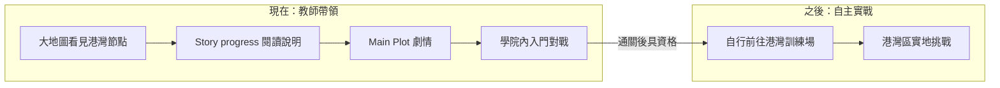
```mermaid
flowchart LR
    subgraph now [現在：教師帶領]
        M[大地圖看見港灣節點]
        S[Story progress 閱讀說明]
        P[Main Plot 劇情]
        B[學院內入門對戰]
    end
    subgraph later [之後：自主實戰]
        H[自行前往港灣訓練場]
        F[港灣區實地挑戰]
    end
    M --> S --> P --> B
    B -->|通關後具資格| H --> F
```

| 階段 | 地點（敘事） | 誰主導 |
|------|----------------|--------|
| 登入後首次 | Story progress | 系統引導 |
| 點「進入關卡」 | Main Plot → 學院對戰館 | 林可姐／導師帶領 |
| 入門對戰 | 學院內（程式：入門級、無天氣） | 玩家操作、老師脈絡之教學戰 |
| 通關後 | 大地圖節點可標為 Clear；認知上「可面對港灣」 | 玩家自主（後續關卡擴充） |

---

#### 四、劇情圓法（企劃用語，可寫進文案）

擇一或合併使用，**勿**在「學院教學段」描寫玩家已在港灣碼頭實戰。

##### 4.1 招生／課程名（推薦）

- **港灣訓練場** = 學院為港灣線新生開設的**第一堂實戰課程名稱**（或畢業試煉的註冊名稱）。
- 實際上課地點 = **舊校舍對戰館**（與 `TutorialPlotScriptFactory` 一致）。

##### 4.2 地圖為登記點、戰鬥在學院

- 大地圖港灣節點 = 任務簿上的**目標戰區登記**（日後自行前往）。
- 今日流程 = 林可姐在學院帶完成**入門試煉**，通過後才算完成「登記課程」。

---

#### 五、文案與美術檢查表

新增或修改文案、場景、節點時，請對照本表。

| 檢查項 | 應 | 不應 |
|--------|----|------|
| 1-1 關卡說明 | 學院、對戰館、老師帶領、入門試煉 | 甲板、海鹽味、今日在港灣碼頭開打 |
| 大地圖節點副標（若有） | 日後實戰區、通關入門後面對 | 暗示玩家「現在就在港灣」 |
| Main Plot | 舊校舍對戰館、館內規則 | 把對戰改寫成港灣戶外 |
| 通關後台詞 | 你有資格挑戰地圖上的港灣訓練場 | 宣稱「剛才那一戰在港灣打的」 |
| 對戰背景美術 | 學院／對戰館內景（若已如此設定） | 港灣碼頭外景（除非另開關卡） |

**標點**：Story progress 關卡 UI 文案依專案慣例可**不用標點**，以空格分句；重點字用顏色標示（見 `StoryTextStyle`）。

---

#### 六、程式與資料對照（實作錨點）

| 資源 | 欄位／常數 | 世界觀備註 |
|------|------------|------------|
| `StoryProgressNodeDatabase.json` | `M-1-1`, `title`, `region` | 地圖節點；`southwest_port` = 港灣線地理錨點，≠ 當前對戰座標 |
| `StoryProgressLevelCopy.cs` | `LevelTitle`, `BuildScenarioIntro`, `BuildHarborBulletin` | 右側面板與底欄佈告；應對齊「學院教學中」 |
| `TutorialPlotScriptFactory.cs` | 劇情 steps | **權威**學院場景用語：舊校舍對戰館 |
| `StoryProgressWorldMapRuntime.cs` | 節點 `M-1-1` 顯示 | 地圖可顯示「港灣訓練場」；與副標分層 |

資料庫節點英文 `title`（`Harbor Training Yard`）可保留作區域名；玩家-facing 中文以「港灣訓練場」為**目標戰區名**，非當前場景名。

---

#### 七、常見誤解（給企劃／程式／美術）

| 誤解 | 正確理解 |
|------|----------|
| 「1-1 在港灣打所以大地圖放港灣」 | 大地圖標的是**章節與未來戰區**；當前戰在學院。 |
| 「關卡名叫港灣訓練場所以對戰 BG 要是碼頭」 | 名稱是**課程／戰區註冊名**；入門戰景在學院。 |
| 「通關 1-1 = 已經去過港灣」 | 通關 = **入門畢業**；「去港灣」是後續自主行動（可留給 1-2 或同一節點二階段）。 |

---

#### 八、後續擴充備註（非本次範圍）

- **真正港灣實地戰**：可為 `M-1-2`、或 `M-1-1` 通關後解鎖之「二階段／重訪」，美術與副本規則與入門戰分開。
- **世界地圖路線**：港灣節點可作第一章起點；實線連往後續關卡，不暗示 1-1 戰鬥發生在碼頭。

---

#### 九、修訂紀錄

| 日期 | 說明 |
|------|------|
| 2026-05-28 | 初版定案：港灣 = 學成後自主目的地；1-1 = 學院內教師帶領入門教學。 |

## 2.2　主線教學劇本（1-1）

<div class="source-note">來源文件：<code>TUTORIAL_PLOT_SCRIPT.md</code></div>

### 新手教學劇本

> **相關文件**：[`PLANNING_DOCS_INDEX.md`](PLANNING_DOCS_INDEX.md) · [`LEVEL_DESIGN_GDD.md`](LEVEL_DESIGN_GDD.md) · [`STORY_PROGRESS_WORLDVIEW.md`](STORY_PROGRESS_WORLDVIEW.md) · [`GAMEPLAY_AND_RULES.md`](GAMEPLAY_AND_RULES.md)  
> **用途**：`Main Plot` 場景之 `MainPlotSceneController.steps` 台詞與分支對照。  
> **目標玩家**：首次進館、尚未完成教學對戰者。  
> **教學後接續**：登入 → **Story progress**（1-1）→ 每次點 **進入關卡** 皆為 **Main Plot 劇情（含選項）** → **自動**入門級教學對戰 → 回到 Story progress。首次通關後可 **前往大廳**；登入已完成教學者直達大廳。  
> **角色**：**導師**（畫外／簡短）、**林可姐**（紀錄員兼引導，語氣沉穩俐落）、**你**（玩家）。

---

#### 一、設計原則

| 原則 | 說明 |
|------|------|
| **一次一個概念** | 每 1～2 句只教一件事，避免與實機 UI 搶注意力。 |
| **先會玩、再記名詞** | 先讓玩家知道「英雄會死、手牌有上限」，再提怪獸／法術分類。 |
| **對齊實機規則** | 數值以 `GAMEPLAY_AND_RULES.md` 為準：英雄 20 HP、起手 5 張、手牌上限 7、牌組 30 張。 |
| **進階延後** | **天氣不在教學關演示**（入門級對戰程式關閉）；林可的凝視、熟練度 A/B/C、戰前謎題亦延後。 |
| **文案標點** | 暫不使用標點；以空格分句，重點用 `StoryTextStyle` 粗體＋色碼（`#9A7A55` 強調、`#5F8F72` 機制詞）。 |
| **推進方式** | 台詞**逐字顯示**；打字中點擊＝立即顯示全文，全文後再點＝前進。**TapToContinue**：依 `tapNextStepIndex` 換句；**PlayerChoice**：全文顯示後才出現選項按鈕。 |

---

#### 二、流程總覽

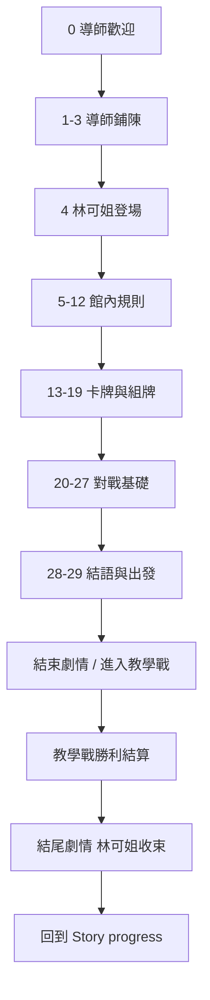
```mermaid
flowchart TD
    A[0 導師歡迎] --> B[1-3 導師鋪陳]
    B --> C[4 林可姐登場]
    C --> D[5-12 館內規則]
    D --> E[13-19 卡牌與組牌]
    E --> F[20-27 對戰基礎]
    F --> G[28-29 結語與出發]
    G --> H[結束劇情 / 進入教學戰]
    H --> I[教學戰勝利結算]
    I --> J[結尾劇情 林可姐收束]
    J --> K[回到 Story progress]
```

---

#### 三、角色立繪建議（選填）

| 欄位 | 建議 |
|------|------|
| `characterA` | 林可姐（主引導；立繪＝卡牌 **林可的凝視** 本體圖 `CardArt/林可的凝視`） |
| `characterB` | 導師或訓練場剪影 |
| `characterC` | 玩家側剪影／無立繪 |
| `backgroundSprite` | 訓練場／教室對戰區背景 |

---

#### 四、完整步驟表（`PlotStep`）

**欄位說明**

- **#**：`steps` 清單索引（`startStepIndex = 0`）。
- **選1／選2／選3**：按鈕文字；`-` 表示該按鈕隱藏（`choiceNText` 留空且 `choiceNNext = -1`）。
- **→**：對應 `choiceNNext`。

| # | 說話者 | 台詞 | 選1 | → | 選2 | → | 選3 | → |
|---|--------|------|-----|---|-----|---|-----|---|
| 0 | 導師 | 歡迎來到舊校舍對戰館 從今天起 你不再只是看客 你要**親自舉牌** | 我準備好了 | 1 | - | - | - | - |
| 1 | 導師 | 館內燈光壓低了一檔 對戰桌一字排開 你以前多半只在欄外看別人出牌吧 | 繼續 | 2 | - | - | - | - |
| 2 | 導師 | 從今天起你正式登記入座 這裡的規則與勝負 都照對戰館的帳來算 不講人情 | 繼續 | 3 | - | - | - | - |
| 3 | 導師 | 實戰前的入門與戰況紀錄 我交給副館長 **林可** 她會帶你走過該知道的事 | 繼續 | 4 | - | - | - | - |
| 4 | 林可姐 | ……聽到了吧 導師說的就是我 戰況簿在我這 場上出了什麼岔 都會記一筆 | 繼續 | 5 | - | - | - | - |
| 5 | 林可姐 | 叫我林可姐就好 接下來帶你走一條**能開打**的最短路 別走神 | 繼續 | 6 | - | - | - | - |
| 6 | 林可姐 | 這裡的對戰 不比誰牌比較華麗 看的是誰先讓對手**英雄生命**歸零 | 繼續 | 7 | - | - | - | - |
| 7 | 林可姐 | 雙方英雄都是 **20** 點生命 歸零就輸 跟你場上還有沒有怪獸無關 記清楚 | 繼續 | 8 | - | - | - | - |
| 8 | 林可姐 | 開場擲骰定**先手** 別緊張 先手只是先出牌 又不代表你會贏 | 繼續 | 9 | - | - | - | - |
| 9 | 林可姐 | 牌就兩類 **怪獸** 跟 **法術** 怪獸站場上 法術多半打完進棄牌 | 繼續 | 10 | - | - | - | - |
| 10 | 林可姐 | 同一時間 場上通常只留一隻怪獸 新的來舊的就走 別指望排一整排 | 繼續 | 11 | - | - | - | - |
| 11 | 林可姐 | 法術有條件 例如**初級治療**治的是場上怪獸 場上已有怪時 有些牌就不能從手牌打出 | 繼續 | 12 | - | - | - | - |
| 12 | 林可姐 | **火球術**多半拿來拆對手場上的怪 對手場上沒怪 傷害才會落到英雄身上 | 繼續 | 13 | - | - | - | - |
| 13 | 林可姐 | 小測驗 想打英雄 對手場上卻有怪擋著 穩一點的做法是 | 先出火球清場 | 14 | 先放治療 | 15 | 棄掉所有手牌 | 15 |
| 14 | 林可姐 | 嗯 先清場再說 直攻英雄是下一步 火球常用在這種時候 | 繼續 | 16 | - | - | - | - |
| 15 | 林可姐 | 再想一下 治療只能救己方怪獸 **清對手場上的怪**不是治療的活 回去重選 | 回到題目 | 13 | - | - | - | - |
| 16 | 林可姐 | 進對戰前 先組一副**牌組** 規則簡單 **最多 30 張** 只能放你已持有的卡 | 繼續 | 17 | - | - | - | - |
| 17 | 林可姐 | 去 **Buildbeck** 組牌 左邊館藏 點卡加進右邊牌組 記得按**儲存** 不然下次還是空的 | 繼續 | 18 | - | - | - | - |
| 18 | 林可姐 | 列表是小圖 詳情才是大立繪 別以為壞掉 只是用途不同 | 繼續 | 19 | - | - | - | - |
| 19 | 林可姐 | 教學期間先給你一副基礎牌組 民兵 長弓 治療 火球都有 能開打再說 風格慢慢換 | 繼續 | 20 | - | - | - | - |
| 20 | 林可姐 | 進戰鬥起手抽 **5** 張 手牌最多 **7** 張 塞太滿就得棄牌或先打完 別拖 | 繼續 | 21 | - | - | - | - |
| 21 | 林可姐 | 你的回合通常就三件事 **出牌** **攻擊** 最後按**結束回合** 不按結束 對手不會動 | 繼續 | 22 | - | - | - | - |
| 22 | 林可姐 | 怪獸上場記得叫它攻擊 很多人輸在 **放了怪卻忘記打** 別當其中一個 | 繼續 | 23 | - | - | - | - |
| 23 | 林可姐 | 右側有**最近戰況** 剛剛發生什麼都記在那 結算看不懂 先翻那裡 | 繼續 | 24 | - | - | - | - |
| 24 | 林可姐 | 再考你一次 場上已有一隻民兵 還沒攻擊 這時該先做什麼 | 按結束回合 | 25 | 讓民兵攻擊 | 26 | 立刻再上一隻怪 | 25 |
| 25 | 林可姐 | 場上通常只留一隻怪 再上一隻會頂掉舊的 剛才那步等於白做 先攻擊 或先想清楚 | 回到題目 | 24 | - | - | - | - |
| 26 | 林可姐 | 這就對了 先攻擊 再視情況結束回合 最基本的節奏就是這樣 | 繼續 | 27 | - | - | - | - |
| 27 | 林可姐 | 進訓練場選**入門級** 給第一次實戰用的 這級不會有天氣 專心練出牌跟攻擊 | 繼續 | 28 | - | - | - | - |
| 28 | 林可姐 | 天氣 隱藏難度 那些特殊法術 贏幾場再說 現在目標只有一個 **打完第一場教學戰** | 繼續 | 29 | - | - | - | - |
| 29 | 林可姐 | 戰況簿我會幫你記 準備好了就點出發 **直接進教學對戰** | 出發 | -1 | 再看一次組牌說明 | 18 | - | - |

**步驟 29 說明**

- **出發！**：`choice1Next = -1`，三顆按鈕皆隱藏後劇情結束；請在場景外由按鈕／`SceneLoader` 跳轉大廳或 Buildbeck（見 §六）。
- **再看一次組牌說明**：跳回步驟 18（Buildbeck 組牌），給想複習的玩家。

##### 4.1 教學戰勝利後結尾劇情（`BuildTutorialPlotEpilogueSteps`）

> 接在 `TutorialBattleSettlementUi` 勝利結算的「繼續」之後；BGM／打字／點擊音與開場劇情相同。  
> 語音命名接續 1-1 主線：`1-1_30`～`1-1_33`。

| # | 語音 ID | 說話者 | 台詞 | 選1 | → | 備註 |
|---|---------|--------|------|-----|---|------|
| E0 | `1-1_30` | 林可姐 | ……回來了 第一場**教學戰**算你過關 出牌跟攻擊的節奏有跟上 | 繼續 | E1 | `tapNextStepIndex = 1` |
| E1 | `1-1_31` | 林可姐 | **國王** **王后** **民兵** 各一張已放進背包 之後在 **Buildbeck** 或館藏都能看 | 繼續 | E2 | `tapNextStepIndex = 2` |
| E2 | `1-1_32` | 林可姐 | 想再練就回**遊戲進度** 開入門級 熟了也能從那裡**前往大廳** 自己逛 | 繼續 | E3 | `tapNextStepIndex = 3` |
| E3 | `1-1_33` | 林可姐 | 今天的引導先到這 戰況簿我會繼續幫你記 按下回到遊戲進度 | 繼續 | 結束 | `tapEndsPlot = true` |

---

#### 五、教學對戰內提示文案（林可姐教戰面板）

> **港灣實戰區**（挑戰港灣訓練場）戰術提示為另一套系統，僅關鍵時刻救場，見 [`HARBOR_COMBAT_COACH_GDD.md`](HARBOR_COMBAT_COACH_GDD.md)。

第一場入門級教學戰（`BattleLaunchContext.IsIntroTutorialBattle`）由 `TutorialBattleCoachUi` 顯示林可姐立繪與逐字提示（9 字／秒）。**點擊面板**可展開／收起；展開時面板移至右側（棄牌階段）或左側（一般回合），半透明遮罩僅暗化畫面、**不擋**手牌觸控。暫不使用標點符號。

| 觸發時機 | 提示文字 |
|----------|----------|
| 開場後 | 這是你的回合試著出一張怪獸或法術 |
| 己方場上有怪、未攻擊 | 點選場上怪獸再選擇攻擊目標 |
| 手牌 6 張以上 | 手牌接近上限七張注意棄牌或快用掉 |
| **手牌超過 7 張（棄牌階段）** | 手牌超過上限了長按不要的牌拖到左側棄牌區（多張時文案會帶剩餘張數） |
| 可結束回合且已攻擊過 | 若沒有其他行動可按結束回合 |
| 勝利結算 | `TutorialBattleSettlementUi`：入場動畫＋依序展示國王／王后／民兵卡圖；贈送各 1 張入背包 |
| 戰敗結算 | `TutorialBattleSettlementUi`：教學對戰失敗；可再試一次或返回劇情 |

##### 5.1 建議出牌 vs 建議棄牌（手牌高亮）

| 類型 | 程式 | 說明 |
|------|------|------|
| 建議**打出** | `TutorialHandPlayAdvisor` | 依回合目標評分；高亮與「你的回合」橫幅同步；見上表一般提示 |
| 建議**棄掉** | `TutorialHandDiscardAdvisor` | 與 `GetRecommendedPlayerDiscardHandIndex()` 相同；**每次只高亮 1 張**；棄掉一張後重算 |

**建議棄牌怎麼算**（三階段，與玩家自動棄一張相同）：

1. 優先棄**當下打不出去**的牌（手牌由左到右第一張符合者）。
2. 否則若有**同 `id` 重複**，在重複牌中棄**保留價值最低**者。
3. 否則棄全手**保留價值最低**者（怪獸：`攻×2+血`；法術依場上狀態與可否施放給分）。

完整判定表、數值與「未含開局火球封鎖」等細節 → [`ENEMY_AI_DECISION_TREE.md`](ENEMY_AI_DECISION_TREE.md) **§5.2**。

---

#### 六、與場景／程式的銜接建議

| 項目 | 建議 |
|------|------|
| **Story progress** | `Assets/Scenes/Story progress.unity`；`StoryProgressSceneController` 自動生成並綁定「進入關卡」按鈕；左上 **返回** 使用 `Assets/UI/return.png`（執行期 `Resources/UI/return`）。 |
| **返回按鈕** | 僅 Story progress 場景；點選一律載入 `hall`。 |
| **劇情場景** | `Assets/Scenes/Main Plot.unity`；由 `TutorialPlotScriptFactory` 注入開場 30 步與勝利後結尾 4 步，不需手填 Inspector。 |
| **結束後跳轉** | 步驟 25「出發」或「略過本段劇情」→ 標記劇情完成 → **直接**載入教學對戰（`LaunchTutorialBattleAfterPlot`）。 |
| **教學對戰** | `TutorialDeckApplicator` + `SceneLoader.LaunchIntroTutorialBattleDirect`（入門級、無天氣）；不論是否通關過，**進入關卡** 都從劇情重新開始。 |
| **對戰結束** | 勝利：結算「繼續」→ 發放御三家 → `BuildTutorialPlotEpilogueSteps` 結尾劇情 → Story progress；戰敗：再試一次或返回劇情（重播開場劇情）。 |
| **結尾劇情** | `TutorialPlotScriptFactory.BuildTutorialPlotEpilogueSteps`（4 步，最後一步 `tapEndsPlot`）；BGM／打字／點擊音與開場劇情相同。 |
| **登入導流** | 未完成教學的槽位登入後進 **Story progress**，完成後進 `hall`。 |
| **教學關天氣** | `IntroGreedy` → `IsWeatherSystemEnabledForBattle()` 為 false。 |
| **跳過教學** | 設定場景或登入後提供「我已熟悉規則」→ 僅標記完成、不擋後續內容。 |
| **與熟練度 GDD** | 教學戰勝利可選：將教學牌 3 張升至 B（見 `CARD_PROFICIENCY_GDD.md` §7 待決）；劇情本稿不強制。 |

---

#### 七、版本

| 日期 | 說明 |
|------|------|
| 2026-05-20 | 初版：29 步（索引 0～28），含 2 段小測驗與組牌／對戰／天氣入門。 |
| 2026-05-27 | 教學關移除天氣劇情（26 步，索引 0～25）；入門級對戰程式關閉天氣系統。 |
| 2026-05-27 | `TutorialBattleCoachUi`：教學戰內林可姐即時引導；點面板展開／收起。 |
| 2026-05-30 | 棄牌階段教戰文案、建議棄牌手牌高亮；規則細節見 `ENEMY_AI_DECISION_TREE.md` §5.2。 |
| 2026-05-27 | `TutorialBattleSettlementUi`：教學戰勝敗結算；勝利贈國王／王后／民兵。 |
| 2026-06-06 | 補入教學戰勝利後結尾劇情 4 步，語音 ID 接續 `1-1_30`～`1-1_33`。 |

<div class="page-break"></div>

# 第三章　遊戲系統與機制

> 本章拆解核心玩法、養成、敵方 AI、教練、場地狀態與存檔等系統。

## 3.1　核心玩法與規則

<div class="source-note">來源文件：<code>GAMEPLAY_AND_RULES.md</code></div>

### 卡牌設定規則與遊戲玩法

> **企劃索引**：[PLANNING_DOCS_INDEX.md](./PLANNING_DOCS_INDEX.md) · **主線關卡**：[LEVEL_DESIGN_GDD.md](./LEVEL_DESIGN_GDD.md)

本文件說明本專案中**卡牌資料如何定義**、**組牌規則**，以及**對戰時玩家會遇到的流程與機制**。數值與演出若以場景／Prefab 上設定為準，與程式預設不同時，以遊戲內表現為準。

---

#### 一、卡牌資料從哪裡來

- 主要表檔路徑：`Assets/Assets/Datas/CardList.csv`
- **怪獸列**：`monster,<編號>,<卡名>,<英文名>,<攻擊力>,<生命值>`
- **法術列**：`spell,<三位編號>,<卡名>,<英文名>,<效果說明>`（效果欄為給玩家與企劃閱讀的敘述，實際結算以程式邏輯為準）

新增或調整卡牌時，應同步確認遊戲內載入流程是否會讀取到該列（避免僅改 CSV 卻未匯入／快取未更新）。

---

#### 二、卡牌類型與編號（程式內）

- **怪獸牌**：使用 **非負整數**編號，對應 CSV 的怪獸編號。
- **法術牌**：在存檔與牌組結構中，法術以 **負數鍵** 表示，避免與怪獸編號衝突（見 `DeckCardId`：依法術序號換算）。  
  玩家在遊戲中通常只看「卡名與效果」，不需記住內部鍵。

---

#### 三、組牌（ Buildbeck／牌組編輯）規則

| 項目 | 說明 |
|------|------|
| **牌組張數上限** | 預設 **30 張**（`DeckManager.maxDeckCards`，可在 Inspector 調整）。 |
| **槽位** | 可有多組牌組槽；可為槽位設定**顯示名稱**並**儲存**；也可**解散／清空**該槽。 |
| **持有與編組** | 僅能使用你已「持有」的卡來組牌（實際檢查方式依商店／背包與存檔狀態）；編輯介面會區分持有張數與已放入牌組張數。 |

同一張卡的重複張數可否超過持有量，以遊戲內按鈕與提示為準。

##### 3.1 組牌介面美術：縮圖與立繪

| 用途 | 資源位置（專案內） | 說明 |
|------|---------------------|------|
| **組牌／Buildbeck 左側館藏格** | `Assets/UI/DeckThumb/` | 館藏列表格子顯示**縮圖**（與 CSV／`CardStore` 中為該卡設定的縮圖欄對應）。 |
| **本體立繪（商店／背包預覽等）** | `Assets/UI/CardArt/` | 較大張的**卡牌立繪**；不得與縮圖混用語意時，企劃與美術宜分資料夾管理。 |

匯入圖檔時，可依 Editor 既有 **自動綁定**流程寫回場景／Prefab 上的 `CardStore` 覆寫資料（細節以 `Assets/Editor/CardArtworkAutoBinder.cs` 與資產工作流程為準）。改版新增卡時請**同時**補齊縮圖與立繪（若有其中一張缺漏，館藏格或詳情端可能退回僅顯示另一類圖或留白，以實機為準）。

---

#### 四、對戰玩法概覽

##### 4.1 勝負條件

- **雙方各有「英雄」生命值**；生命值先降至 **0** 的一方落敗。
- 預設起始英雄生命為 **20**（`BattleSimulationManager.startHealth`，可在場景中調整）。

##### 4.2 開場與手牌

- 開場會以**骰子／開場演出**決定**先手**，並有一段開場展示時間。
- 對戰中 HUD 顯示於**畫面右下角**（與右、下邊保留呼吸空間，不擋中央戰場）：**第 N 回合**與**本回合先攻擊方**（依結束回合順序推導，不改規則）；入門教學戰以**敵我色塊**標示先攻擊方，其餘對戰以「先攻 我方／敵方」文字。
- 起手抽牌數為 **5**，且不會超過**手牌上限**（預設手牌上限 **7** 張：`maxHandSize`）。超限時須棄至 7 張以下；玩家／敵方「下一張該棄哪張」的演算法見 [`ENEMY_AI_DECISION_TREE.md`](ENEMY_AI_DECISION_TREE.md) §5。

##### 4.3 回合與行動（概念）

- 回合中通常可：**打出怪獸或符合條件的法術**、進行**攻擊**、必要時**結束回合**。
- **場上怪獸區**：同一側同一時間主要為**單一怪獸**與玩法規則互動（例如部分法術僅在「場上已有怪獸」時可從手牌打出）。
- **法術**：例如 **火球術**（對場上或英雄的傷害規則）、**初級治療**（治療我方場上怪獸；場上已有怪時，部分其他手牌可能無法打出）、**林可的凝視**（置場型特殊規則與禁止攻擊等）——細節以對戰內提示與結算為準。

##### 4.4 天氣系統

對戰進行一段時間後會進入**天氣預報／天氣生效**節奏（**第一回合不會觸發天氣預報**）。常見四種天氣名稱與效果概念如下（完整文案見場上 UI）：

| 天氣 | 效果概念（摘要） |
|------|-------------------|
| **緋焰時雨** | 回合結束時，雙方**場上怪獸**受到固定傷害（英雄不受此項）。 |
| **月華聖祈** | 本回合**治療量額外加成**。 |
| **蒼潮夜湧** | 本回合**直接攻擊英雄**的傷害減免。 |
| **朔風森詠** | 本回合**第一張法術**效果強化（回合內觸發過後會消耗該加成機會）。 |

天氣實際**持續回合數**、**冷卻**與是否優先指定第一輪天氣等，由場景中的戰鬥設定控制。

**教學／入門級對戰**：戰前預覽選 **入門級** 時，程式以 `IntroGreedy` AI 開戰，並透過 `BattleSimulationManager.IsWeatherSystemEnabledForBattle()` **關閉整場天氣**（無預報、無天氣效果），方便新手專注出牌與攻擊節奏。

##### 4.5 對戰畫面的顯示比例（設定場景套用）

- 玩家在 **Settings**（遊戲設定）選擇的「顯示比例」預設，會在進入對戰等流程時套用至 **Battle Simulation** 相關的卡牌版面／文字／場上配置（細項以程式與 Prefab 為準）。
- 預設表（JSON）：`Assets/Resources/BattleCardTuningPresets.json`  
  （含「預設一」「對照組」等項目，供對照與驗證；實際遊玩以玩家在設定場景選定並儲存的選項為準。）
- UI 上以 **對照表** 呈現之手牌／場上參數，數值單位與欄位意義以遊戲內顯示與上述 JSON 註解／Tooltips 為準。

---

#### 五、遊戲設定場景（Settings）

- **進入方式**：多數場景之全域選單內的「**遊戲設定**」（場景檔：`Assets/Scenes/Settings.unity`）。
- **顯示比例**：選擇戰鬥場景卡牌調校預設；目前選擇以 **PlayerPrefs** 鍵 `battle_card_tuning_preset_id` 保存，進入對戰時由程式讀取並套用（對照表細節見上文 4.5）。
- **畫面品質**：切換 Unity Quality 等級，以 PlayerPrefs 鍵 `settings_quality_level` 記住。

---

#### 六、卡牌熟練度與怪物技能

本作以**卡牌熟練度**分階解鎖怪物牌技能（見 [`CARD_PROFICIENCY_GDD.md`](CARD_PROFICIENCY_GDD.md)）：toward-B 進度滿 **2.0**（不限難度）→ **B**（約 10 場勝）；**10 場普通以上難度勝利** → **C**。單局結算：勝 +1/2、平 +2/3×1/2、敗 +1/3×1/2。**國王／王后／民兵** 為御三家，預設 **C**。對戰結束浮層會列出牌組內怪物牌並播放熟練度條動畫。

| 階段 | 玩家體驗（摘要） |
|------|------------------|
| **A** | 無技能；可提示「熟練後解鎖」 |
| **B** | 一行技能摘要 |
| **C** | 完整技能說明 |

完整企劃、解鎖條件類型、待決事項與 UI 原則見：**[`CARD_PROFICIENCY_GDD.md`](CARD_PROFICIENCY_GDD.md)**。  
單卡戰技 A/B/C 文案（含**國王**範例）見：**[`卡牌技能階段式揭露.md`](卡牌技能階段式揭露.md)**。  
市場競品與引用來源見：**[`MARKET_ANALYSIS_SOURCES.md`](MARKET_ANALYSIS_SOURCES.md)**。

---

#### 七、與論文／展示的搭配建議

- **卡牌規則**：可引用本文件的「CSV 結構 + 組牌上限 + 類型鍵」。
- **玩法規則**：可引用「英雄生命、先手、手牌上限、天氣四類」。
- **成長系統（提案）**：可引用 [`CARD_PROFICIENCY_GDD.md`](CARD_PROFICIENCY_GDD.md) 的 A/B/C 與熟練度設計（註明尚未實作）。
- **介面與設定**：可引用「DeckThumb／CardArt 分工」「Settings 與 `BattleCardTuningPresets.json`」。
- 若後續改版，請**同步更新本文件**或於論文註明版本／日期。

## 3.2　卡牌熟練度養成

<div class="source-note">來源文件：<code>CARD_PROFICIENCY_GDD.md</code></div>

### 卡牌熟練度與怪物技能解鎖（企劃／GDD）

| 項目 | 內容 |
|------|------|
| **文件類型** | 企劃提案／遊戲設計文件（GDD） |
| **狀態** | 門檻已定案；**勝場累計與 A/B/C 判定已實作**（`CardSkillProficiencyService`／`PlayerData`） |
| **關聯文件** | [`PLANNING_DOCS_INDEX.md`](PLANNING_DOCS_INDEX.md) · [`PLANNING_OPEN_ITEMS.md`](PLANNING_OPEN_ITEMS.md) §PROF · [`GAMEPLAY_AND_RULES.md`](GAMEPLAY_AND_RULES.md) · [`卡牌技能階段式揭露.md`](卡牌技能階段式揭露.md)（單卡 A/B/C 文案與範例）· [`MARKET_ANALYSIS_SOURCES.md`](MARKET_ANALYSIS_SOURCES.md) · [`MARKET_ANALYSIS_FIVE_GAMES.md`](MARKET_ANALYSIS_FIVE_GAMES.md) |
| **最後更新** | 2026-05-16 |

---

#### 1. 設計背景

集換式卡牌遊戲（TCG）常見痛點是**規則與關鍵字複雜**，新手在首局就要同時理解「出牌節奏、場上互動、單卡異能、全域效果」，學習曲線陡峭。

本作刻意**降低上手門檻**：現階段**怪物牌不設計任何技能**，玩家先以 **ATK／HP、出牌、攻擊、場地效果** 建立對戰直覺。在此基礎上，以**卡牌熟練度**作為長期成長軸：玩家對某張怪物牌累積使用與理解後，依階段**解鎖該卡的技能說明與實際效果**，在「簡單入門」與「深度精通」之間取得平衡。

---

#### 2. 設計意圖

| 痛點 | 本作對策 |
|------|----------|
| 規則複雜、關鍵字多 | 初期怪物牌**無技能**，專注基礎對戰 |
| 進階內容缺乏動機 | **卡牌熟練度**達標 → 解鎖技能階段 |
| 一次揭露過多資訊 | **A → B → C** 分層揭露，避免長文嚇退新手 |

##### 2.1 設計目標（可驗收）

1. **首局可玩**：不閱讀技能長文即可完成一場對戰。
2. **中期有發現感**：玩家能察覺「這張牌還有未解放的能力」。
3. **長期有精通感**：願意鑽研的玩家可解鎖完整規則說明與實際異能。
4. **與稀有度解耦**：熟練度門檻不應變成「強卡還要雙重刷關」的懲罰。

---

#### 3. 怪物技能三階段（A／B／C）

每張**怪物牌**各自擁有一條熟練度進度，對應下列三階段。法術牌、場地效果、英雄技能**不在**本系統範圍內（除非日後另立附錄）。

| 階段 | 名稱（工作用） | 玩家看到的內容 | 設計目的 |
|------|----------------|----------------|----------|
| **A** | 未解放 | 卡面**無技能區**（或灰鎖＋極短提示，如「熟練後解鎖戰技」）。圖鑑／收藏可標示「尚有未解放能力」。 | 降低首局認知負荷；保留**發現感**（「這張牌還有東西」）。 |
| **B** | 基礎解放 | **簡短技能一句話**（效果摘要；少或無關鍵字）。達成**進階解鎖條件**後可進入 C。 | 能玩、能記；進階玩家仍感到「尚未讀完規則」。 |
| **C** | 完整解放 | **完整技能說明**（觸發時機、對象、數值、與場地／法術／其他卡互動等）。 | 服務願意鑽規則的玩家；適合圖鑑詳情、長按說明、教學關卡後查閱。 |

##### 3.1 階段與 UI 呈現原則（建議）

| 階段 | 卡面（對戰中） | 圖鑑／收藏 | 備註 |
|------|----------------|------------|------|
| A | 不顯示技能正文；可選：鎖頭圖示 + 一句話 | 顯示「未解放」與**模糊提示**（不寫具體數值） | 避免剧透具體效果 |
| B | 顯示**一行摘要** | 摘要 + 「詳情未解放」標記 | 預設戰鬥 HUD 可讀性優先 |
| C | 摘要可保留；詳情入口開放 | 完整條文、範例、互動註記 | 長按／「？」開詳情 |

**B 與 C 的介面分工（建議定案）**

- **B**：戰鬥中預設可見的「一句話效果」。
- **C**：圖鑑詳情頁、長按說明、教學關卡結算後解鎖的完整條文。

---

#### 4. 卡牌熟練度與解鎖條件

##### 4.1 兩道門檻（已定案）

| 門檻 | 階段轉換 | 條件（程式） |
|------|----------|----------------|
| **基礎解鎖** | A → B | 該怪物牌在**目前牌組**中，累計 toward-B 進度 **2.0**（**不限難度**）；每場依結局累加（見下表）。 |
| **進階解鎖** | B → C | 同上牌，累計 **10 場「普通以上」難度勝利**（普通／困難／魔王；僅**勝利**時 +1）；每場每種怪物 id 最多 +1。 |
| **單局進度** | 結算播報 | **勝** +1/2；**平** +1/2×2/3；**敗** +1/2×1/3（御三家不累加；約 **10 場勝**到 B，試玩向）。 |
| **御三家** | 預設 C | **國王（13）／王后（12）／民兵（4）** 無需累計，詳情與戰技視為 **C · 完整**。 |
| **1-2 宗教線畢業** | 預設 **B** | **修女（17）／主教（14）／城堡（7）**：M-1-2 段考首通時 `progressAny=2`、`winsNormal=0`（`M12ReligiousLineRewardService`）；**非** C，toward-C 仍須 10 場普通以上勝。 |
| **熟練度條** | 全怪物牌 | 背包詳情中**所有怪物牌**顯示勝場進度條（尚無戰技表者仍累計勝場，戰技文案待擴充）。 |

##### 4.2 熟練度資料（概念欄位）

每張怪物牌可共用一組**帳號級（或存檔級）**進度欄位，企劃表再掛上各卡的 B／C 門檻數值：

| 欄位（概念） | 說明 |
|--------------|------|
| 累計加入牌組次數 | 是否曾納入有效牌組 |
| 累計打出次數 | 從手牌成功置場或依規則計入 |
| 累計造成／承受傷害 | 可選；用於「坦克型」「輸出型」分流 |
| `wins_any` | toward-B 進度（滿 **2.0** → B；存檔欄位 `progressAny`） |
| `wins_normal` | 「普通以上」難度勝場數（達 10 → C） |
| 當前階段 | 由勝場推算 `A` / `B` / `C`（御三家固定 C） |

##### 4.3 解鎖條件類型（範例，數值 TBD）

以下為**條件類型範本**，實作前由企劃逐卡填表；同一張卡可組合多條件（AND／OR 需明訂）。

**A → B（基礎解鎖）範例**

| 類型 | 範例敘述 |
|------|----------|
| 使用次數 | 該卡累計**打出 N 次**（建議 N = 3～10，依卡稀有度調整） |
| 對戰參與 | 該卡曾在牌組中完成 **M 場**對戰 |
| 教學引導 | 完成指定**單人教學關卡**後直接升至 B（僅少數起始卡） |

**B → C（進階解鎖）範例**

| 類型 | 範例敘述 |
|------|----------|
| 勝場貢獻 | 該卡進場的對戰中累計**獲勝 K 次** |
| 情境觸發 | 在特定**場地效果**生效的回合內打出該卡 L 次 |
| 搭配行為 | 與指定**法術類型**同回合或同局內共同出現 |
| 傷害里程碑 | 該卡累計造成／承受傷害達閾值（進階玩家向） |

##### 4.4 單卡文案與範例（另冊）

怪物牌 **A／B／C 具體戰技文案**、填表模板與**國王**完整範例，統一維護於：

**[`卡牌技能階段式揭露.md`](卡牌技能階段式揭露.md)**

| 卡名 | id | 狀態 |
|------|-----|------|
| 國王 | 13 | ✅ 已定案（見該文件 §4） |
| 其餘怪物 | — | 待擴充 |

---

#### 5. 與現行版本的關係

| 現況（程式／內容） | 企劃對應 |
|--------------------|----------|
| 怪物牌**無技能**欄位與結算 | 全玩家預設視為階段 **A**（或尚未達 B 門檻） |
| 法術牌已有固定效果 | **不納入**本熟練度系統 |
| 場地效果四系（室內名稱：爐心飛燼／暖燈浮塵／訓練薄霧／穿堂微風） | **全域規則**；與單卡技能分層，首日不搶注意力 |
| 對戰場景為學院訓練廳 | 敘事可包裝為：「基礎演練僅開放體質（ATK／HP），熟練後開放個人戰技」 |

**過渡原則**：實作本系統前，現有對戰平衡以「無技能怪物」為準；實作後宜提供**舊存檔預設 A** 或依歷史對戰次數**追溯 B** 與否（待技術評估）。

---

#### 6. 與其他系統的分工

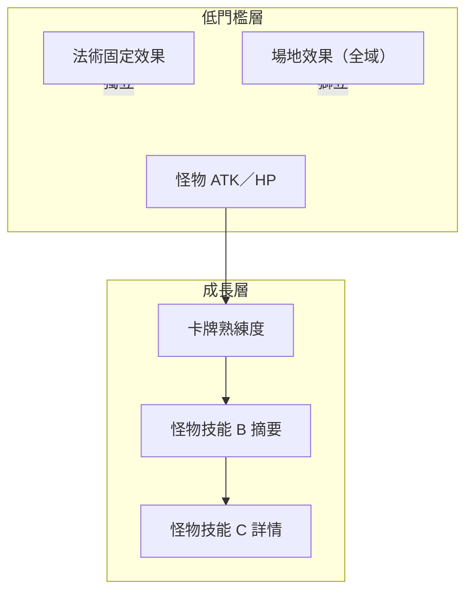
```mermaid
flowchart TB
  subgraph onboarding["低門檻層"]
    ATKHP["怪物 ATK／HP"]
    Spell["法術固定效果"]
    Weather["場地效果（全域）"]
  end
  subgraph growth["成長層"]
    Prof["卡牌熟練度"]
    SkillB["怪物技能 B 摘要"]
    SkillC["怪物技能 C 詳情"]
  end
  ATKHP --> Prof
  Prof --> SkillB
  SkillB --> SkillC
  Spell -.獨立.-> onboarding
  Weather -.獅立.-> onboarding
```

| 系統 | 與熟練度關係 |
|------|----------------|
| 組牌／持有張數 | 熟練度不取代「是否擁有卡」，僅影響技能揭露與異能開關 |
| 稀有度 N／R／SR… | 建議**不綁定**熟練度門檻高低，避免雙重門檻 |
| 對戰 AI | 需決策：敵方怪物是否也分 A/B/C（見 §7） |
| 成就／任務 | 可引用「首次 C 階解鎖」「全圖鑑 B 達成」等 |

---

#### 7. 企劃待決事項（TBD）

> 彙總索引與優先級見 [`PLANNING_OPEN_ITEMS.md`](PLANNING_OPEN_ITEMS.md) §PROF；全專案待定見同文件。

實作前建議逐條定案並寫入本節：

| # | 議題 | 選項／備註 |
|---|------|------------|
| 1 | **熟練度綁定範圍** | 帳號全域 vs 單一存檔槽 vs 角色 |
| 2 | **解鎖是否可逆** | 建議**不可逆**（避免玩家刻意不升 C） |
| 3 | **對戰中對手是否可見** | B 階段摘要是否公開；公開用圖示還是文字 |
| 4 | **敵方／AI 怪物** | 僅玩家牌成長 vs 敵方同步階段（影響 PVE 難度） |
| 5 | **B 階段是否啟用異能** | B 僅文案 vs B 已啟用簡化版效果（影響開發量） |
| 6 | **追溯舊存檔** | 是否依歷史戰績自動補 B／C |
| 7 | **教學關卡** | 是否強制若干張起始卡直升 B |
| 8 | **數值表維護** | 由 `CardList.csv` 擴欄或獨立 `Proficiency.csv` |

---

#### 8. 玩家向說明（草案，可貼圖鑑）

> 學院的新進練習生會先以怪獸的**攻擊力與生命力**完成基礎對戰。當你與某張怪獸牌越來越熟練，將逐步**解鎖戰技說明**；持續精進後，還能閱讀**完整戰技規則**。  
> 這不代表其他牌變弱——只是你與這張牌之間的默契，被訓練廳記錄下來了。

---

#### 9. 實作狀態與範圍

| 項目 | 狀態 |
|------|------|
| 本文件（企劃／GDD） | **已建立** |
| 程式：熟練度存檔、解鎖判定 | **已實作**（`playerdata.csv` → `proficiency,m,{id},{any},{normal}`） |
| 程式：代表卡戰技結算（v1） | **已實作**（`MonsterSkillRegistry`、國王／王后／民兵） |
| UI：A／B／C 卡面與圖鑑 | **未實作**（v1 場上卡一律顯示 B 行） |
| `CardList.csv` 技能欄 | **未實作**（技能文案在 `MonsterSkillRegistry`） |

**可玩 v1 產品決策（2026-05-16）**：§7 暫採 — (1) 熟練度綁帳號存檔（日後）；(2) 解鎖不可逆；(3) 對戰 B 摘要公開；(4) **AI 與玩家同規則**（敵方亦觸發同戰技）；(5) **B 即生效**；(6) 舊存檔不追溯；(7) 教學關不強制；(8) 技能表獨立於 CSV 直至欄位定案。

---

#### 10. 版本紀錄

| 日期 | 版本 | 說明 |
|------|------|------|
| 2026-05-16 | 0.1 | 初版：整合企劃提案與 GDD 結構；A/B/C 三階段、熟練度門檻、待決事項、與現行玩法關係 |
| 2026-05-16 | 0.2 | 國王 A/B/C 範例移至 [`卡牌技能階段式揭露.md`](卡牌技能階段式揭露.md) |

---

*本文件為**設計提案**；若與 `GAMEPLAY_AND_RULES.md` 中「現行可玩內容」衝突，以後者描述**目前已實作**之行為為準，本文件描述**目標體驗**。*

## 3.3　難度與 AI 設計

<div class="source-note">來源文件：<code>DIFFICULTY_AND_AI_DESIGN.md</code></div>

### 對戰難易度與敵方 AI 決策設計說明

> **文件用途**：畢業專題報告書「系統設計／對戰模組」章節之技術說明。  
> **程式對照**：`SceneLoader.cs` · `BattleSimulationManager.cs` · `EnemyAI.cs` · `EnemyAiPlayStyle.cs`  
> **延伸文件**：[PLANNING_DOCS_INDEX.md](./PLANNING_DOCS_INDEX.md) · [LEVEL_DESIGN_GDD.md](./LEVEL_DESIGN_GDD.md) · [ENEMY_AI_DECISION_TREE.md](./ENEMY_AI_DECISION_TREE.md)（出牌決策樹細節）· [ARCHITECTURE_OVERVIEW.md](./ARCHITECTURE_OVERVIEW.md) · [BALANCE_AND_AI_BIBLIOGRAPHY.md](./BALANCE_AND_AI_BIBLIOGRAPHY.md)（外部文獻與網路資源）

---

#### 1. 設計前提（回覆口試常見誤解）

本專案對戰難易度與敵方 AI 具備下列特性，宜在報告中先界定範圍：

| 項目 | 本專案作法 | 非本專案作法 |
|------|------------|--------------|
| 難易度調整 | 開戰前由玩家**手動選擇五檔**（入門～魔王） | 依玩家勝率即時動態調檔（Adaptive Difficulty） |
| AI 反應時機 | **回合制**：玩家回合結束後，敵方回合內決策 | 玩家每出一張牌即即時反制（Interrupt） |
| 決策方法 | **規則 + 評分函數 + 決策樹**（Heuristic） | 機器學習、蒙地卡羅樹搜尋（MCTS）等 |

因此，口試時「AI 如何根據玩家出牌做決策」的準確表述為：**根據玩家整回合結束後的盤面狀態，在敵方回合以固定規則選出要出的手牌並執行攻擊**。

---

#### 2. 難易度如何定義？分界在哪裡？

##### 2.1 分界：五個離散檔位

程式以列舉型別 `BattleDifficultyTier` 定義五檔：`Intro`（入門）、`Easy`（簡單）、`Normal`（普通）、`Hard`（困難）、`Boss`（魔王）。  
**檔位分界 = 玩家在戰前預覽介面（Battle Preview Modal）所按的難度按鈕**；系統不會依玩家表現自動升／降難度。

玩家按下「開始對戰」後，`SceneLoader.OnBattlePreviewStartClicked()` 將所選檔位轉成兩類執行期設定：

1. **牌組與數值難度**（敵方牌庫、容錯、分數倍率等）  
2. **AI 出牌風格**（Greedy 或 Scheming）

##### 2.2 設計指數（Designer Index, 0～100）

每檔對應一組 `DifficultyDesignProfile`（可在 Unity Inspector 的 `SceneLoader` 上調整），主要欄位如下：

| 欄位 | 意義 |
|------|------|
| `deckStrengthIndex` | 敵方牌組整體強度指數 |
| `spellRatioIndex` | 敵方牌組中法術比例傾向 |
| `overLimitToleranceIndex` | 允許超過 30 張上限的容錯程度 |
| `revealRatio` | 對戰中資訊揭露比例（教學／壓力調節） |
| `scoreMultiplier` | 敵方選牌構築時的分數倍率 |
| `overLimitBias` / `minSpellsBias` | 微調用整數偏移 |
| `useFixedDeck` / `fixedDeckOverride` | 是否使用固定牌組（魔王檔有專用 20 張） |

**內建預設值（摘要）**：

| 檔位 | 牌組強度 | 法術比例 | 超牌容許 | 分數倍率 | 資訊揭露 |
|------|:--------:|:--------:|:--------:|:--------:|:--------:|
| 入門 | 8 | 8 | 5 | 0.72 | 100% |
| 簡單 | 24 | 18 | 20 | 0.82 | 68% |
| 普通 | 50 | 45 | 45 | 1.00 | 50% |
| 困難 | 70 | 65 | 70 | 1.14 | 42% |
| 魔王 | 92 | 85 | 96 | 1.38 | 28% |

魔王檔另以 `fixedDeckOverride` 指定固定 20 張卡牌 ID，確保高強度牌組可重現。

##### 2.3 指數到實際參數的映射公式

`SceneLoader.BuildDifficultyConfig()` 將 0～100 的設計指數**線性映射**為對戰用數值，例如：

- **超過 30 張容許張數**  
  `overLimit = Round(Lerp(1, 12, overLimitToleranceIndex / 100)) + overLimitBias`，再限制於 0～30。  
- **牌組最少法術張數**  
  `minSpells = Round(Lerp(1, 4, spellRatioIndex / 100)) + minSpellsBias`。  
- **敵方構築分數倍率**  
  `scoreMul = Clamp(scoreMultiplier × Lerp(0.78, 1.22, deckStrengthIndex / 100), 0.6, 1.45)`。

亦即：**檔位決定「哪一組 profile」；profile 內指數決定具體數值**。企劃或開發可在不修改 AI 程式的前提下，於 Inspector 調整各檔手感。

##### 2.4 AI 行為的分界（與牌組難度獨立）

牌組強度與 AI 風格透過 `MapDifficultyToEnemyAiPlayStyle()` 分開設定：

| UI 難度 | `EnemyAiPlayStyle` | 行為摘要 |
|---------|-------------------|----------|
| 入門 | `IntroGreedy` | Greedy 基礎，**略偏先出怪**（法術評分 −14） |
| 簡單 | `EasySpellLean` | Greedy 基礎，**略偏法術**（法術評分 +12） |
| 普通 | `Greedy` | 每回合在可出牌中選**評分最高**者立即打出 |
| 困難 | `SchemingHard` | 在 Greedy 基礎上，**SR 以上**高稀有卡可暫緩出牌，等待時機 |
| 魔王 | `SchemingBoss` | 囤牌門檻更高（**R 以上**即可能暫緩），連續囤牌上限 4 回合，出手條件更嚴 |

執行期標籤（供玩家資訊／戰績紀錄）寫入 `BattleDifficultyRuntime` 與 `BattleLaunchContext`（例如「入門」「困難」「魔王」）。

---

#### 3. 敵方 AI 如何依盤面決策？

##### 3.1 決策時序（回合制）

敵方 AI **不在玩家出牌當下**運算，而在**玩家按下結束回合**後進入敵方回合。流程如下：

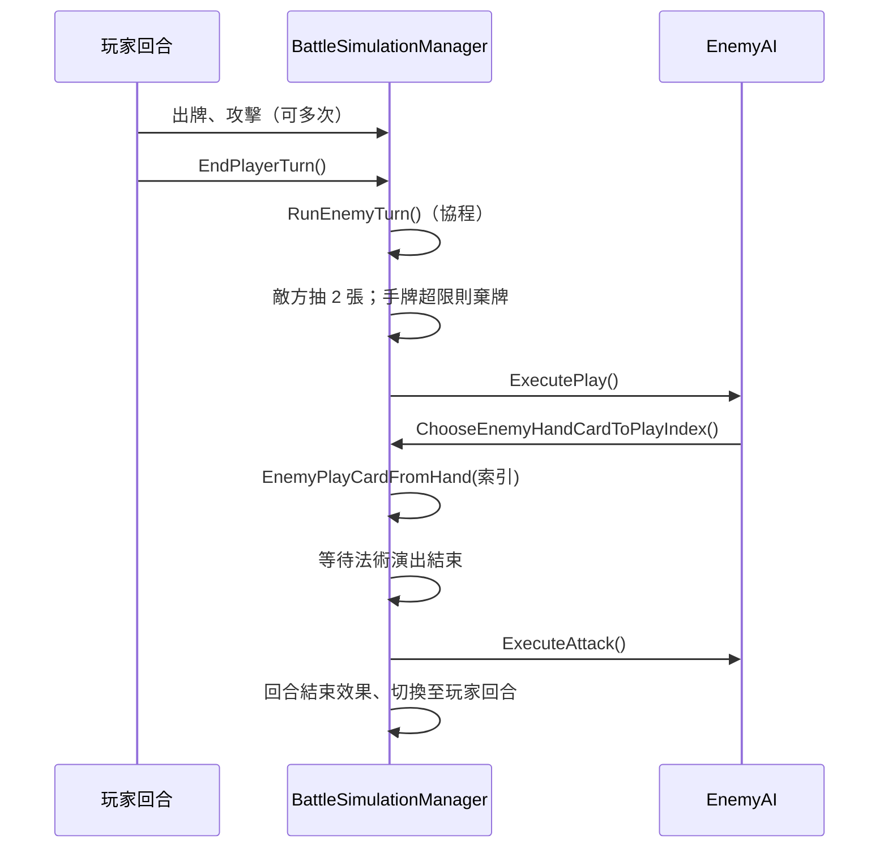
```mermaid
sequenceDiagram
    participant P as 玩家回合
    participant M as BattleSimulationManager
    participant AI as EnemyAI

    P->>M: 出牌、攻擊（可多次）
    P->>M: EndPlayerTurn()
    M->>M: RunEnemyTurn()（協程）
    M->>M: 敵方抽 2 張；手牌超限則棄牌
    M->>AI: ExecutePlay()
    AI->>M: ChooseEnemyHandCardToPlayIndex()
    M->>M: EnemyPlayCardFromHand(索引)
    M->>M: 等待法術演出結束
    M->>AI: ExecuteAttack()
    M->>M: 回合結束效果、切換至玩家回合
```

演出用延遲（約 0.2～0.4 秒）由 `EnemyAI.playDelay`、`attackDelay` 及 `RunEnemyTurn` 內 `WaitForSeconds` 控制，目的為**可讀性**，非運算瓶頸。

##### 3.2 程式呼叫鏈

| 步驟 | 類別／方法 |
|------|------------|
| 敵方出牌 | `EnemyAI.ExecutePlay()` → `BattleSimulationManager.ChooseEnemyHandCardToPlayIndex()` → `EnemyPlayCardFromHand(index)` |
| 敵方攻擊 | `EnemyAI.ExecuteAttack()` → `BattleSimulationManager.EnemyAttack()` |

##### 3.3 出牌決策樹（摘要）

完整流程見 [ENEMY_AI_DECISION_TREE.md](./ENEMY_AI_DECISION_TREE.md)。`ChooseEnemyHandCardToPlayIndex()` 依序：

1. **斬殺優先**  
   敵方場上無怪、我方場上有「脆怪」（攻擊力 > 卡面生命上限）、手牌存在可一擊致死的怪物 → 打出該怪（**不受囤牌邏輯影響**）。  
2. **敵方場空**  
   僅在怪物牌中選評分最高者（先排除本回合暫緩的高稀卡，必要時再強制出牌）。  
3. **祝聖待換**（主教戰技）  
   敵方場上有怪且 `awaitingNextSummon` → 依綁定分選手牌怪**替換**場怪（修女 > 宗教 > 高血），並向玩家 Toast／戰報。  
4. **一般情況**  
   在當下**可合法打出**的手牌中選評分最高；困難／魔王先排除 `ShouldDeferSchemingCard == true` 的牌。  
5. **避免空過**  
   若高稀卡全被暫緩，改從全手牌再選一次最高評分。

**六張戰技怪**（國王／王后／民兵／修女／主教／城堡）的加權表與條件見 [ENEMY_AI_DECISION_TREE.md §3.5](./ENEMY_AI_DECISION_TREE.md#35-戰技怪獸出牌決策6-張)。

##### 3.4 出牌優先度評分

`EvaluateEnemyCardPlayPriority(card)` 數值愈高愈優先打出。基礎分之上疊加**宗教線**與**御三家**戰技加權（見決策樹 §3.5）。

**稀有度加權（全難度共用）**：

```
rarityBonus = (int)rarity × 25
```

| 稀有度 | 加權 |
|--------|------|
| N | +0 |
| R | +25 |
| SR | +50 |
| SSR | +75 |
| UR | +100 |

魔王 AI 另將稀有度加權 ×1.35。

**怪物**：`attack × 2 + healthPointMax + rarityBonus`  

**法術（依當下場面動態調整）**：例如火球在敵場無怪時分數較高、治療在己方場怪受傷時分數較高、林可的凝視依是否可施放調整；並受開局禁火球等規則約束。

評分函數讀取的是**玩家回合結束當下**的 `playerField`、`enemyField`、`playerHp`、`enemyHp` 等，因此能反映玩家該回合的佈局結果，但**不模擬玩家下一回合的意圖**。

##### 3.5 困難／魔王「囤牌」邏輯

`ShouldDeferSchemingCard(card)` 在下列條件成立時，本回合暫不出該牌：

- AI 風格為 `SchemingHard` 或 `SchemingBoss`；  
- 卡牌稀有度 ≥ 門檻（困難：SR；魔王：R）；  
- 尚未達連續囤牌上限（困難 3 回合、魔王 4 回合）；  
- `IsSchemingPremiumTimingReady(card)` 為 false（時機未到）。

「時機已到」範例（程式內門檻）：

- 怪物：敵場已有怪、或我方場有怪、或雙方英雄血線進入設定百分比、或手牌將滿；  
- 火球：敵場有怪可打、或玩家血線偏低；  
- 治療：敵方場怪血量低於 maxHp 一定比例。

囤牌與出牌後透過 `NoteEnemySchemingCardPlayed` 更新 `enemySchemingHoldStreak` 計數。

##### 3.6 攻擊決策

出牌階段結束且法術演出完成後，獨立執行 `EnemyAttack()`：若敵方場上有怪且未被「林可的凝視」等狀態阻擋，則對玩家場怪或英雄攻擊（含開局禁攻、反擊次數等規則，見 `BattleSimulationManager`）。

---

#### 4. 與玩家資訊／戰績的銜接

對戰結束後，難度標籤由 `BattleDifficultyRuntime.ResolveForBattleRecord()` 解析，寫入玩家 profile 的對戰紀錄（難度維度統計）。標籤來源優先順序為：當場 `BattleSimulationManager` 記錄 → `BattleLaunchContext` → 靜態快取。

---

#### 5. 設計限制與未來工作

報告中可誠實列出下列**尚未實作**、可作為後續研究或改版方向：

| 方向 | 說明 |
|------|------|
| 動態難度 | 依玩家勝率或遊戲時間自動選檔 |
| 深度搜尋 | 模擬未來 2～3 回合再出牌（Minimax / MCTS） |
| 即時反制 | 玩家出牌當下觸發敵方反應卡 |
| 數據驅動調參 | 以 `BattleAutoSimPlugin` 批次對戰結果回饋調整 `DifficultyDesignProfile` |

---

#### 6. 口試用一句話總結

> 本專題難易度為開戰前五檔離散設定，每檔以設計指數映射敵方牌組強度與容錯；困難與魔王另啟用「高稀有卡囤牌待機」AI。敵方於玩家結束回合後，依當前盤面以規則化評分與決策樹選牌並攻擊，屬回合制啟發式 AI，而非即時跟招或學習型 AI。

---

#### 7. 參考程式進入點

| 主題 | 檔案／符號 |
|------|------------|
| 難度 Profile 與映射 | `SceneLoader.DifficultyDesignProfile`、`BuildDifficultyConfig` |
| 開戰注入 | `SceneLoader.OnBattlePreviewStartClicked` |
| AI 風格列舉 | `EnemyAiPlayStyle` |
| 敵方回合 | `BattleSimulationManager.RunEnemyTurn` |
| 出牌決策 | `BattleSimulationManager.ChooseEnemyHandCardToPlayIndex` |
| 囤牌判定 | `ShouldDeferSchemingCard`、`IsSchemingPremiumTimingReady` |
| AI 薄包裝 | `EnemyAI.ExecutePlay` / `ExecuteAttack` |

## 3.4　敵方 AI 決策樹

<div class="source-note">來源文件：<code>ENEMY_AI_DECISION_TREE.md</code></div>

### 敵方 AI 出牌決策樹

| 項目 | 內容 |
| -------- | -------- |
| **文件類型** | 程式行為說明（對戰敵方 AI） |
| **程式入口** | `EnemyAI.ExecutePlay` → `BattleSimulationManager.ChooseEnemyHandCardToPlayIndex` |
| **難度注入** | `SceneLoader.MapDifficultyToEnemyAiPlayStyle` → `QueueRuntimeDifficultyConfig` |
| **關聯程式** | `EnemyAiPlayStyle.cs` · `CardRarityUtility` · `BattleSimulationManager.cs` |
| **最後更新** | 2026-05-30（§3.5 六張戰技怪） |

---

#### 1. 難度與 AI 風格對照

開戰預覽介面選擇的「敵方難度」會同時影響**牌組強度**（牌庫、超面板容許、法術比例等）與**出牌 AI 風格**（本文件主題）。

| 難度（UI） | `BattleDifficultyTier` | `EnemyAiPlayStyle` | 出牌策略摘要 |
| ---------- | ---------------------- | ------------------ | ------------ |
| 入門 | Intro | **IntroGreedy** | Greedy 基礎，法術出牌評分降低，較常先出怪 |
| 簡單 | Easy | **EasySpellLean** | Greedy 基礎，法術出牌評分提高，較常施法 |
| 普通 | Normal | **Greedy** | 每回合依優先度立即打出最佳可出牌 |
| 困難 | Hard | **SchemingHard** | Greedy 基礎上，**SR／SSR／UR** 可囤牌待時機 |
| 魔王 | Boss | **SchemingBoss** | 囤牌門檻更高（**R 以上**），出手條件更嚴 |

> 牌組參數（`deckStrengthIndex`、`overLimitAllowance` 等）見 `SceneLoader` 的 `DifficultyDesignProfile`，不在本決策樹展開。

---

#### 2. 敵方回合流程（決策發生時機）

出牌決策樹僅在**敵方回合·出牌階段**執行一次；攻擊與棄牌為獨立邏輯。

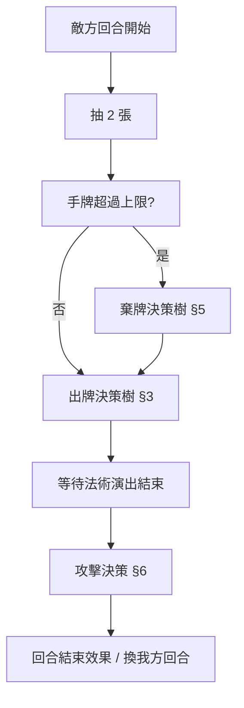
```mermaid
flowchart TD
    A[敵方回合開始] --> B[抽 2 張]
    B --> C[手牌超過上限?]
    C -->|是| D[棄牌決策樹 §5]
    C -->|否| E[出牌決策樹 §3]
    D --> E
    E --> F[等待法術演出結束]
    F --> G[攻擊決策 §6]
    G --> H[回合結束效果 / 換我方回合]
```

---

#### 3. 出牌總決策樹（`ChooseEnemyHandCardToPlayIndex`）

所有難度共用同一棵樹；**困難／魔王**在「選最高優先度」前多一層**是否暫緩高稀有卡**（§4）。

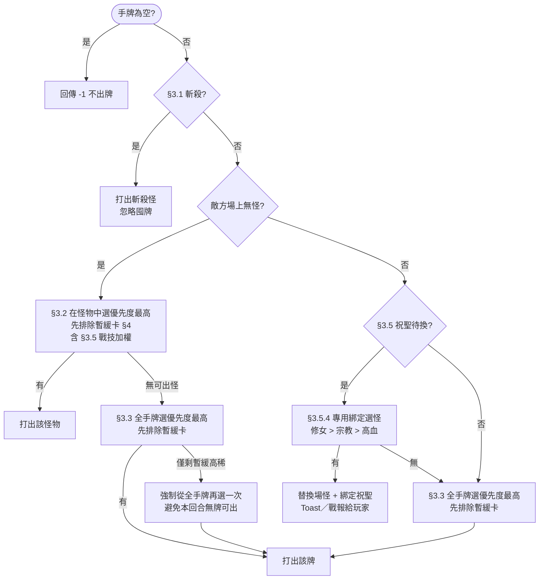
```mermaid
flowchart TD
    Start([手牌為空?]) -->|是| None[回傳 -1 不出牌]
    Start -->|否| Lethal{§3.1 斬殺?}
    Lethal -->|是| PlayLethal[打出斬殺怪<br/>忽略囤牌]
    Lethal -->|否| FieldEmpty{敵方場上無怪?}
    FieldEmpty -->|是| MonPick[§3.2 在怪物中選優先度最高<br/>先排除暫緩卡 §4<br/>含 §3.5 戰技加權]
    MonPick -->|有| PlayMon[打出該怪物]
    MonPick -->|無可出怪| SpellPick[§3.3 全手牌選優先度最高<br/>先排除暫緩卡]
    FieldEmpty -->|否| Consec{§3.5 祝聖待換?}
    Consec -->|是| BindPick[§3.5.4 專用綁定選怪<br/>修女 &gt; 宗教 &gt; 高血]
    BindPick -->|有| PlayBind[替換場怪 + 綁定祝聖<br/>Toast／戰報給玩家]
    BindPick -->|無| SpellPick2
    Consec -->|否| SpellPick2[§3.3 全手牌選優先度最高<br/>先排除暫緩卡]
    SpellPick -->|有| PlaySpell[打出該牌]
    SpellPick -->|僅剩暫緩高稀| ForcePlay[強制從全手牌再選一次<br/>避免本回合無牌可出]
    SpellPick2 --> PlaySpell
    ForcePlay --> PlaySpell
```

##### 3.1 斬殺（全難度、優先於囤牌）

**條件（同時成立）**

1. 敵方場上**無**怪物  
2. 我方場上有怪物，且為「脆怪」：`攻擊力 > 卡面生命值上限`（以 `MonsterCard.healthPoint` 判斷）  
3. 手牌中有怪物滿足：`攻擊力 ≥ 我方該怪生命值上限`（可一擊致死）

**若多張可斬殺**：稀有度 rank 最高者 → 同稀有則攻擊力最高。

> 斬殺**不**受 `ShouldDeferSchemingCard` 影響。

##### 3.2 空場優先出怪（全難度）

敵方場上無怪時，**只在怪物牌**中選優先度（§3.4）；不會在有空位時先打火球。

1. 先從「未暫緩」的怪物中選最高優先度  
2. 若全部被暫緩，再從**所有**怪物中選最高優先度（強制出牌）

##### 3.3 法術／場上有怪時

在**當下可合法打出**的手牌中選最高優先度（先排除暫緩卡，必要時再強制選一次）。

**可出性**（`IsEnemyCardUnplayableNow`）摘要：

| 牌種 | 不可出條件 |
| ---- | ---------- |
| 怪物 | 敵方場上已有怪時**不可出**，**例外**：`CanReplaceFieldMonsterForConsecration`（主教·祝聖待換）時可用手牌怪**替換**場怪（§3.5.4） |
| 火球（ordinal 0） | 首回合禁火球 |
| 初級治療（ordinal 1） | 敵方場上無怪 |
| 林可的凝視（ordinal 2） | 無法滿足施放條件（例如我方場上有怪） |
| 其他法術 | 敵方場上有怪時僅治療可出 |

##### 3.4 出牌優先度公式（Greedy 核心）

`EvaluateEnemyCardPlayPriority(card)` — 數值**愈大愈想打**。

**稀有度加權**（全難度、出牌／棄牌共用）：

```
rarityBonus = CardRarityUtility.GetPlayAndKeepBonus(rarity)
            = (int)rarity × 25
```

| 稀有度 | rank | 加權 |
| ------ | ---- | ---- |
| N | 0 | +0 |
| R | 1 | +25 |
| SR | 2 | +50 |
| SSR | 3 | +75 |
| UR | 4 | +100 |

**怪物**

```
priority = 攻擊力 × 2 + 生命值上限 + rarityBonus
```

**法術**（基礎分 + rarityBonus；隨場況變化）

| ordinal | 法術 | 敵方場上無怪 | 敵方場上有怪 |
| ------- | ---- | ------------ | ------------ |
| 0 | 火球 | 75 | 55 |
| 1 | 初級治療 | 8（通常不可出） | 90 |
| 2 | 林可的凝視 | 62 或 10（看能否施放） | 通常不可出 |

首回合火球若被規則封鎖，該牌優先度視為極低。

**戰技加權**（§3.5）疊加於上式之後、難度風格微調（`ApplyIntroEasyPriorityTweak`）之前。

---

#### 3.5 戰技怪獸出牌決策（6 張）

戰技**結算規則**見 [`卡牌技能階段式揭露.md`](卡牌技能階段式揭露.md)（§4 國王、§5 王后、§6 民兵、§7 修女、§8 主教、§9 城堡）。本節僅描述**敵方 AI 如何因戰技調整出牌優先度與合法出牌**。

| 分類 | id | 卡名 | 戰技 | 程式加權 |
| ---- | -- | ---- | ---- | -------- |
| 御三家 | 4 | 民兵 | 列陣 | `EvaluateEnemyStarterTrioMonsterPlayBonus` |
| 御三家 | 12 | 王后 | 王室庇護 | 同上 |
| 御三家 | 13 | 國王 | 庭訓號令 | 同上 |
| 宗教線 | 14 | 主教 | 祝聖預留 | `EvaluateEnemyReligiousMonsterPlayBonus` |
| 宗教線 | 7 | 城堡 | 堅城駐守 | 同上 |
| 宗教線 | 17 | 修女 | 聖療共鳴 | 同上 |

> **敵方示範對戰**：主教／城堡戰技在 AI 局內視為**一律可觸發**（`IsEnemyBishopSkillActiveForBattle`／`IsEnemyCastleSkillActiveForBattle`）。御三家依 `CardSkillProficiencyService.IsStarterTrio`。玩家方仍受熟練度 B／牌組等條件約束。

##### 3.5.1 優先度疊加順序

```
EvaluateEnemyCardPlayPriority(card)
  → 基礎分（§3.4：攻×2+血 或 法術場況分 + rarityBonus）
  → ApplyEnemyReligiousLineSkillPlayBonus   // 修女／主教／城堡
  → ApplyEnemyStarterTrioSkillPlayBonus     // 國王／王后／民兵
  → ApplyIntroEasyPriorityTweak             // 入門／快攻／法術偏好
```

法術牌僅在 `EvaluateEnemyReligiousSpellPlayBonus`／`EvaluateEnemyStarterTrioSpellPlayBonus` 有額外加權（多為**初級治療**）。

##### 3.5.2 御三家加權（怪物牌）

條件欄中的「空場」= `enemyField == null`；「我方有場怪」= `playerField != null`；「我方可能直擊敵英雄」= `playerField == null` 且我方無林可凝視鎖攻。

| 卡 | 戰技狀態 | 加權（疊加，愈大愈想打） |
| -- | -------- | ------------------------ |
| **民兵** | 本局未觸發列陣且空場 | **+34** |
| 民兵 | 上列 + 我方有場怪 | **+18** |
| 民兵 | 上列 + 我方可能直擊 | **+14** |
| **王后** | 王室庇護未用且空場 + 我方有場怪 | **+44** |
| 王后 | 庇護未用且空場（我方無場怪） | **+12** |
| 王后 | 場上已是王后且庇護未用 | **+8** |
| **國王** | 庭訓次數 > 0 且空場 + 我方可能直擊 | **+38** |
| 國王 | 上列改為我方有場怪 | **+22** |
| 國王 | 庭訓次數 > 0 且空場（其餘） | **+14** |
| 國王 | 上列 + 敵英雄 HP ≤ 62% `startHealth` | **+12** |
| 國王 | 場上已是國王且庭訓尚有次數 | **+10** |
| 國王 | 本局曾出過國王、庭訓尚有次數、我方可能直擊（場上非國王） | **+6** |

**初級治療（法術）加權**（`EvaluateEnemyStarterTrioSpellPlayBonus`，僅 ordinal 1 且敵方場上有怪）：

| 場上怪 | 加權 |
| ------ | ---- |
| 王后且庇護未用 | +14 |
| 國王且庭訓次數 > 0 | +8 |
| 民兵且列陣未用 | +6 |

##### 3.5.3 宗教線加權（怪物牌）

| 卡 | 戰技狀態 | 加權 |
| -- | -------- | ---- |
| **主教** | 空場且本局未授予祝聖預留 | **+52** |
| 主教 | 場上是主教且祝聖待換（`awaitingNextSummon`） | **−18**（避免重複出主教） |
| **城堡** | 空場 + 我方有場怪 | **+44** |
| 城堡 | 空場 + 我方英雄 HP ≤ 55% `startHealth` | **+22** |
| 城堡 | 場上已是城堡且堅城駐守未用 | **+12** |
| **修女** | 祝聖待換中 | **+58**（聖療連攜綁定首選） |
| 修女 | 空場且手牌有初級治療 | **+14** |
| **其他宗教怪**（`MonsterSkillReligion` 名單，非主教） | 祝聖待換中 | **+30** |
| 任意怪 | 祝聖待換可替換場怪時 | 另加 **§3.5.4 綁定分**（與下表） |

**初級治療加權**（`EvaluateEnemyReligiousSpellPlayBonus`）：

| 條件 | 加權 |
| ---- | ---- |
| 場上怪 HP < 88% maxHp | +12（滿血約 +7） |
| 場上為修女 | +28 |
| 修女且聖療共鳴未用 | +18 |
| 修女且已聖療連攜（祝聖綁修女） | +22 |
| 場上為城堡且堅城未用 | +10 |
| 場上為主教且祝聖待換 | **−8** |

##### 3.5.4 主教·祝聖待換（出牌樹分支）

**觸發**：敵方首次置場主教且授予祝聖後，`enemyConsecration.awaitingNextSummon == true`（敵方**不**彈玩家選擇 UI，程式預設「下一張場怪」）。

**決策**（在 §3 斬殺之後、一般法術選牌之前）：

1. `CanReplaceFieldMonsterForConsecration(false)` 為真  
2. `PickBestEnemyConsecrationBindHandIndex()`：只在手牌**怪物**中選，分數 = 綁定分 + 稀有度加權（**不用**完整 `EvaluateEnemyCardPlayPriority`）  
3. 打出該怪 → `EnemyPlayCardFromHand` 走**替換場怪**路徑 → `ApplySummonMonsterSkills` 綁定祝聖  

**綁定分**（`EvaluateEnemyConsecrationBindMonsterBonus`）：

| 候選怪 | 分數 |
| ------ | ---- |
| 修女（17） | 62 |
| 其他宗教派系怪 | 40 |
| 其餘 | 12 + min(生命值上限, 16) |

**玩家播報**：`LogBattleHistory` + `ShowBattleToast`（`敵方以 … 替換場上 …（祝聖轉移）`）；綁定時 Toast 前綴 **敵方**。

**玩家 UI**：無選擇面板；我方仍須在己方回合自行選擇（見技能 GDD §8）。

##### 3.5.5 困難／魔王·治療囤牌與戰技

`IsSchemingSpellReady`（ordinal 1）在一般 HP 比例之外，下列情況視為**時機成熟、可出治療**：

| 場上怪 | 條件 |
| ------ | ---- |
| 修女 | 聖療連攜中，或聖療共鳴本局未用 |
| 王后 | 王室庇護未用且**我方場上有怪**（預期將挨打） |

---

#### 4. 耍心機分支（僅困難／魔王）

##### 4.1 何時啟用

```
UsesSchemingEnemyAi = (runtimeEnemyAiPlayStyle != Greedy)
```

##### 4.2 哪些牌會被視為「高稀有待囤」

| 風格 | 門檻 |
| ---- | ---- |
| SchemingHard（困難） | `rarity` rank ≥ **SR**（2） |
| SchemingBoss（魔王） | `rarity` rank ≥ **R**（1） |

##### 4.3 暫緩判定

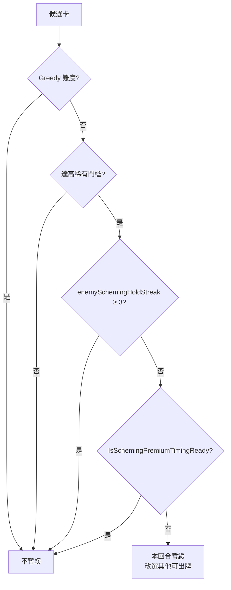
```mermaid
flowchart TD
    A[候選卡] --> B{Greedy 難度?}
    B -->|是| Play[不暫緩]
    B -->|否| C{達高稀有門檻?}
    C -->|否| Play
    C -->|是| D{enemySchemingHoldStreak ≥ 3?}
    D -->|是| Play
    D -->|否| E{IsSchemingPremiumTimingReady?}
    E -->|是| Play
    E -->|否| Hold[本回合暫緩<br/>改選其他可出牌]
```

**囤牌 streak**：若本回合打出的是**非**高稀有卡，且手牌中仍有「應暫緩」的高稀有卡 → `enemySchemingHoldStreak++`；打出高稀有卡或手牌已無需暫緩的卡 → 歸零。連續囤 **3 回合**後不再暫緩，強制進入正常優先度選牌。

##### 4.4 高稀有·怪物：何時算「時機成熟」（空場上怪）

`IsSchemingMonsterSummonReady(strict)` — `strict = true` 為魔王。

| 結果 | 條件 |
| ---- | ---- |
| **立即出** | 敵方場上已有怪；或我方場上有怪；或我方 HP ≤ 門檻；或敵方 HP ≤ 門檻；或手牌 ≥ 7 張 |
| **繼續囤** | 雙方場上皆空，且雙方 HP 都還高（開局慫出王牌） |

**HP 門檻**（以 `startHealth` 為基準）：

| 檢查 | 困難 | 魔王（更嚴） |
| ---- | ---- | ------------ |
| 我方英雄 HP 夠低 → 出 | ≤ 65% | ≤ 55% |
| 敵方英雄 HP 夠低 → 出 | ≤ 35% | ≤ 40% |
| 雙空場且雙方都「很健康」→ 囤 | 我方 > 70% 且 敵方 > 65% | 我方 > 70% 且 敵方 > 75% |

##### 4.5 高稀有·法術：何時算「時機成熟」

`IsSchemingSpellReady(spell, strict)`

**火球（ordinal 0）**

| 結果 | 條件 |
| ---- | ---- |
| 不出 | 首回合禁火球 |
| 出 | 敵方場上有怪（打場怪）；或我方場上有怪；或我方英雄 HP 夠低 |
| 囤 | 我方場空且我方英雄 HP 仍高（困難 > 72%；魔王 > 65%） |

**初級治療（ordinal 1）**

| 結果 | 條件 |
| ---- | ---- |
| 不出 | 敵方場上無怪 |
| 出 | 場上怪 `currentHp < maxHp × 比例`（困難 78%；魔王 88%） |
| 出 | **或** 場上為**修女**（聖療連攜／共鳴未用）；**或** 場上為**王后**、庇護未用且我方有場怪（§3.5.5） |
| 囤 | 怪血量夠滿且不符合上列戰技例外 |

**林可的凝視（ordinal 2）**

| 結果 | 條件 |
| ---- | ---- |
| 不出 | 無法施放（例如我方場上有怪） |
| 出 | 我方英雄 HP 夠低（困難 ≤ 45%；魔王 ≤ 50%） |
| 囤 | 我方場空且我方 HP 仍高（困難 > 55%；魔王 > 60%） |

---

#### 5. 棄牌決策樹（敵我共用流程、評分函式分開）

手牌數 > `maxHandSize`（預設 **7**）時進入棄牌：每輪只棄 **1** 張，重複直到手牌 ≤ 上限。敵方在抽牌後由 AI 自動棄；玩家需手動長按拖曳至棄牌區（`PlayerDiscardCardFromHand`），或使用 `AutoDiscardOneForPlayer`。

**決策流程（敵我相同的三階段）：**

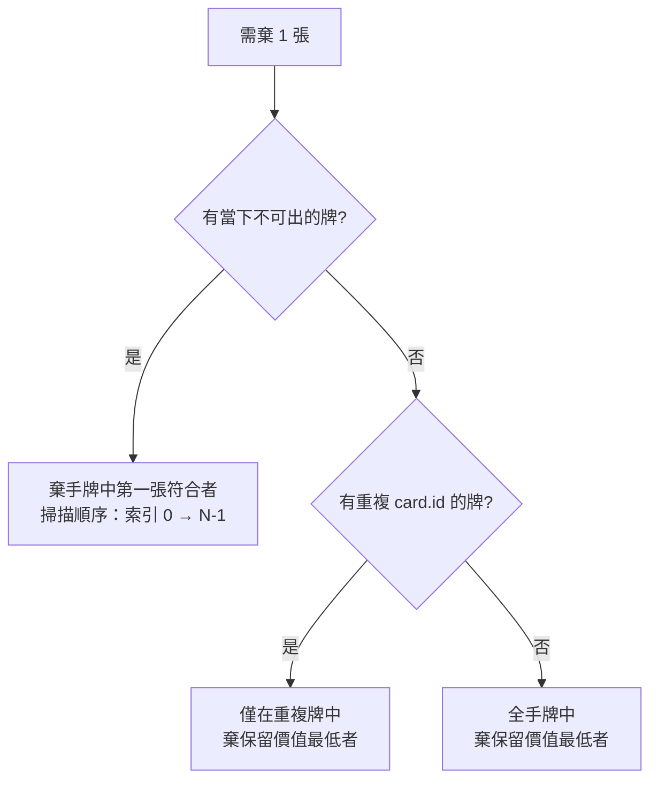
```mermaid
flowchart TD
    A[需棄 1 張] --> B{有當下不可出的牌?}
    B -->|是| C[棄手牌中第一張符合者<br/>掃描順序：索引 0 → N-1]
    B -->|否| D{有重複 card.id 的牌?}
    D -->|是| E[僅在重複牌中<br/>棄保留價值最低者]
    D -->|否| F[全手牌中<br/>棄保留價值最低者]
```

##### 5.1 敵方棄牌

| 項目 | 說明 |
| ---- | ---- |
| 入口 | `ChooseEnemyDiscardIndex`（`BattleSimulationManager.cs`） |
| 不可出判定 | `IsEnemyCardUnplayableNow` |
| 保留價值 | `EvaluateEnemyCardKeepValue` = `EvaluateEnemyCardPlayPriority`（含稀有度加權） |

**優先度低的先丟**；高稀有、高效用牌較易留在手牌（利於困難／魔王囤牌）。

##### 5.2 玩家棄牌

| 項目 | 說明 |
| ---- | ---- |
| 入口 | `ChoosePlayerDiscardIndex` |
| 對外查詢 | `GetRecommendedPlayerDiscardHandIndex()`（與 `AutoDiscardOneForPlayer` 同一邏輯） |
| 不可出判定 | `IsPlayerCardUnplayableNow` |
| 保留價值 | `EvaluatePlayerCardKeepValue`（**不含**出牌決策樹的斬殺／開局囤牌等加權） |

###### 5.2.1 「當下打不出去」（`IsPlayerCardUnplayableNow`）

| 場上狀態 | 視為不可出（會優先被建議棄掉） |
| -------- | ------------------------------ |
| 我方場上**已有怪獸** | 所有**怪獸**；法術中僅 **初級治療**（`SpellOrdinal == 1`）仍可打出，其餘法術不可出 |
| 我方場上**無怪** | **初級治療**（ordinal 1）不可出；**林可的凝視**（ordinal 2）在 `CanPlayerCastLinGazeNow()` 為 false 時不可出 |

掃描時取**第一張**符合條件的手牌索引（由左至右）。

> **與出牌教學的差異**：`TutorialHandPlayAdvisor` 會把「第一回合火球封鎖」等納入**出牌**建議；**棄牌**邏輯**未**將開局火球封鎖算入「打不出去」。若場上空、手牌僅剩被封鎖的火球，會改走 §5.2.2 的保留價值比較（火球在空場時分值 75，通常不會成為首選棄牌）。

###### 5.2.2 保留價值（`EvaluatePlayerCardKeepValue`）

分數**越低越先棄**。無「打不出去」的牌、且無重複 `id` 時，棄全手最低分者。

| 牌種 | 計算方式 |
| ---- | -------- |
| 怪獸 | `attack × 2 + healthPointMax` |
| 火球術（ordinal 0） | 場上有己方怪：**55**；場上無怪：**75** |
| 初級治療（ordinal 1） | 場上有己方怪：**90**；場上無怪：**8** |
| 林可的凝視（ordinal 2） | 當下可施放：**62**；不可施放：**10** |
| 其他法術 | **20** |

**重複牌**：若多張手牌 `card.id` 相同，只在這些重複牌裡比較保留價值，棄**最低**者。

###### 5.2.3 教學戰 UI（1-1 入門課 · 學院內）

| 行為 | 程式 |
| ---- | ---- |
| 林可姐棄牌文案 | `TutorialBattleCoachUi`（`discard` 提示鍵） |
| 手牌高亮 | `TutorialHandDiscardAdvisor` → `RequestTutorialHandDiscardHighlights` |
| 高亮規則 | 每次只亮 **1** 張：即 `GetRecommendedPlayerDiscardHandIndex()` 的結果；玩家棄掉後會依新手牌重算 |

出牌建議（`TutorialHandPlayAdvisor`）與棄牌建議為**兩套評分**，勿混用。教戰文案見 [`TUTORIAL_PLOT_SCRIPT.md`](TUTORIAL_PLOT_SCRIPT.md) §五。

---

#### 6. 攻擊階段（全難度相同）

出牌後執行 `EnemyAttackIfPossible`（`EnemyAI.ExecuteAttack` 呼叫）。**不**再跑出牌決策樹。

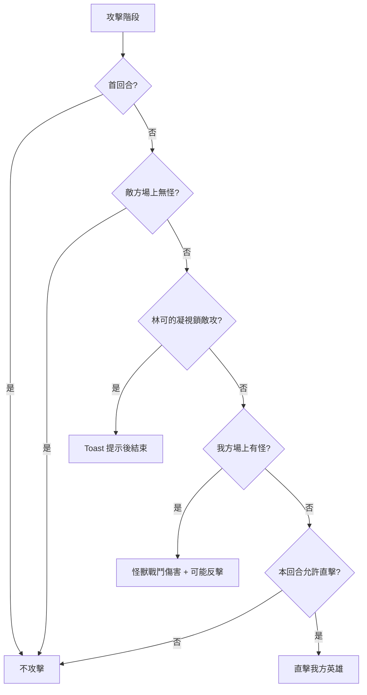
```mermaid
flowchart TD
    A[攻擊階段] --> B{首回合?}
    B -->|是| Skip[不攻擊]
    B -->|否| C{敵方場上無怪?}
    C -->|是| Skip
    C -->|否| D{林可的凝視鎖敵攻?}
    D -->|是| Block[Toast 提示後結束]
    D -->|否| E{我方場上有怪?}
    E -->|是| F[怪獸戰鬥傷害 + 可能反擊]
    E -->|否| G{本回合允許直擊?}
    G -->|否| Skip
    G -->|是| H[直擊我方英雄]
```

傷害結算會套用戰技（王后減傷、國王減傷等），與難度 AI 風格無關。

---

#### 7. 難度差異一覽（僅 AI 決策）

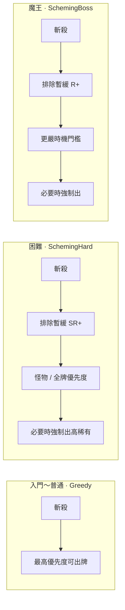
```mermaid
flowchart LR
    subgraph Greedy["入門～普通 · Greedy"]
        G1[斬殺] --> G2[最高優先度可出牌]
    end
    subgraph Hard["困難 · SchemingHard"]
        H1[斬殺] --> H2[排除暫緩 SR+]
        H2 --> H3[怪物 / 全牌優先度]
        H3 --> H4[必要時強制出高稀有]
    end
    subgraph Boss["魔王 · SchemingBoss"]
        B1[斬殺] --> B2[排除暫緩 R+]
        B2 --> B3[更嚴時機門檻]
        B3 --> B4[必要時強制出]
    end
```

| 行為 | Greedy | 困難 | 魔王 |
| ---- | ------ | ---- | ---- |
| 斬殺優先 | ✓ | ✓ | ✓ |
| 空場先出怪 | ✓ | ✓ | ✓ |
| 稀有度影響選牌 | 加權 only | 加權 + 可囤 SR+ | 加權 + 可囤 R+ |
| 開局雙空場囤王牌 | ✗ | ✓（條件較鬆） | ✓（條件較嚴） |
| 最多連囤 | — | 3 回合 | 3 回合 |

---

#### 8. 程式索引（維護用）

| 行為 | 方法 | 檔案 |
| ---- | ---- | ---- |
| 難度 → AI 風格 | `MapDifficultyToEnemyAiPlayStyle` | `SceneLoader.cs` |
| 注入戰鬥 | `QueueRuntimeDifficultyConfig(..., aiPlayStyle)` | `BattleSimulationManager.cs` |
| 出牌入口 | `EnemyAI.ExecutePlay` | `EnemyAI.cs` |
| 出牌決策 | `ChooseEnemyHandCardToPlayIndex` | `BattleSimulationManager.cs` |
| 優先度 | `EvaluateEnemyCardPlayPriority` | 同上 |
| 戰技加權·宗教線 | `ApplyEnemyReligiousLineSkillPlayBonus` · `EvaluateEnemyReligiousMonsterPlayBonus` · `EvaluateEnemyReligiousSpellPlayBonus` | 同上 |
| 戰技加權·御三家 | `ApplyEnemyStarterTrioSkillPlayBonus` · `EvaluateEnemyStarterTrioMonsterPlayBonus` · `EvaluateEnemyStarterTrioSpellPlayBonus` | 同上 |
| 祝聖綁定選牌 | `PickBestEnemyConsecrationBindHandIndex` · `EvaluateEnemyConsecrationBindMonsterBonus` | 同上 |
| 祝聖替換出牌 | `CanReplaceFieldMonsterForConsecration` · `EnemyPlayCardFromHand`（替換分支） | 同上 |
| 暫緩 | `ShouldDeferSchemingCard` | 同上 |
| 囤牌 streak | `NoteEnemySchemingCardPlayed` | 同上（`EnemyPlayCardFromHand` 成功後） |
| 敵棄牌 | `ChooseEnemyDiscardIndex` | 同上 |
| 玩家棄牌 | `ChoosePlayerDiscardIndex` · `GetRecommendedPlayerDiscardHandIndex` | 同上 |
| 教學棄牌高亮 | `TutorialHandDiscardAdvisor.TryGetRecommendedDiscardHandIndices` | `TutorialHandDiscardAdvisor.cs` |
| 攻擊 | `EnemyAttackIfPossible` | 同上 |

---

#### 9. 版本紀錄

| 日期 | 說明 |
| ---- | ---- |
| 2026-05-16 | 初版：五階難度對照、出牌／囤牌／棄牌／攻擊決策樹，對齊 `EnemyAiPlayStyle` 實作 |
| 2026-05-30 | §5 擴充：玩家棄牌三階段、保留價值表、與教學出牌建議差異、教學戰棄牌高亮索引 |
| 2026-05-30 | **§3.5**：六張戰技怪（御三家 + 宗教線）出牌加權、祝聖待換替換分支、玩家播報、囤牌治療例外；§3／§4.5／§8 同步 |

---

*數值門檻（HP ％、囤牌 3 回合）若調整程式，請同步更新本文件 §4。棄牌保留價值若調整 `EvaluatePlayerCardKeepValue`，請同步更新 §5.2.2。戰技加權分數若調整 `EvaluateEnemy*PlayBonus`，請同步更新 §3.5。*

## 3.5　1-1 與練習場難度對照

<div class="source-note">來源文件：<code>HARBOR_1-1_VS_TRAINING_GROUND_DIFFICULTY.md</code></div>

### 1-1 實戰 vs 訓練場：簡單／普通難度對照

> **狀態**：2026-06-01（依目前程式）  
> **用途**：釐清兩套「簡單／普通」的入口、平衡與 AI 差異，避免與入門教學戰或港灣困難混談。  
> **相關**：[`LEVEL_DESIGN_GDD.md`](LEVEL_DESIGN_GDD.md) · [`DIFFICULTY_AND_AI_DESIGN.md`](DIFFICULTY_AND_AI_DESIGN.md) · [`BATTLE_PREVIEW_PUZZLE_INDEX.md`](BATTLE_PREVIEW_PUZZLE_INDEX.md)

---

#### 一、名詞對照（先讀這段）

| 玩家／企劃說法 | 實際指什麼 | 程式旗標／入口 |
|----------------|------------|----------------|
| **1-1 實戰**、港灣實戰、實戰區 | Story progress **入門畢業後**，在 `M-1-1` 挑戰的港灣對戰（簡單／普通／困難） | `BattleLaunchContext.IsHarborTrainingGroundBattle` · `SceneLoader.HarborTraining.cs` |
| **訓練場**（本文件所指） | **Buildbeck** 內戰前預覽（`PZ01` 訓練場魔王解謎／`PZ02` 等），**非**港灣節點 | `battlePreviewHarborTrainingMode == false` · `SceneLoader.BuildDifficultyConfig` |
| **1-1 入門教學戰**（對照用） | 學院內教師帶打，**不是**本表「簡單／普通」 | `IsIntroTutorialBattle` · `IntroTutorialBattleRules` |

**易混淆點**：大地圖節點顯示名也叫「港灣訓練場」，但戰鬥分兩段——入門在學院、**實戰在港灣 BG（`bay.png`）**。本文件「1-1 實戰」僅指後者。

---

#### 二、四欄總覽

| 項目 | 1-1 實戰 · 簡單 | 1-1 實戰 · 普通 | 訓練場 · 簡單 | 訓練場 · 普通 |
|------|-----------------|-----------------|---------------|---------------|
| **章節** | 1-1 港灣（階段 B） | 同左 | Buildbeck 一般練習 | 同左 |
| **解鎖** | 入門劇情＋入門戰畢業 | 同左 | 牌組編輯／預覽即可開 | 同左 |
| **戰前預覽** | `HARBOR_M11` 港灣版面 | 同左 | `PZ01`／`PZ02` 拱門解謎 | 同左 |
| **對戰場景** | `BattleSimulation` + 港灣背景 | 同左 | `BattleSimulation`（預設背景） | 同左 |
| **敵方 AI** | `FastAttack` | `FastAttack` | `EasySpellLean` | `Greedy` |
| **專用平衡檔** | `HarborTrainingEasyBattleRules` | `HarborTrainingNormalBattleRules` | 無（通用 profile） | 無 |
| **我方英雄 HP** | 20（場景預設） | 20 | 20 | 20 |
| **敵英雄 HP** | **17** | **15** | **20** | **20** |
| **敵傷害倍率** | **0.78** | **0.66** | **1.0**（無額外倍率） | **1.0** |
| **敵抽牌** | 第 1～4 回合 1 張／回合，之後 2 | 第 1～5 回合 1 張，之後 2 | 全程 **2** 張／回合 | 全程 **2** 張／回合 |
| **回合上限** | **第 10 回合後必勝**（拉齊局長） | **不限** | 無 | 無 |
| **快攻出怪加成** | 前 4 回合 +6，之後 +16 | 前 5 回合 +3，之後 +6 | 不適用（非 FastAttack） | 不適用 |
| **敵牌組來源** | 港灣簡單固定池（18 種循環→30） | 港灣普通固定池（30） | `previewFixedEnemyDeckCardIds` 循環→30 | 同左 |
| **超牌容許** | **2** | **2** | **2**（profile 推算） | **6**（profile 推算） |
| **最少法術** | **1** | **1** | **1** | **2** |
| **構築分數倍率** | 不沿用 profile | 不沿用 | **≈0.73**（Easy profile） | **1.0**（Normal profile） |
| **資訊揭露** | — | — | **68%** | **50%** |
| **戰術教練** | 有（`HarborCombatCoach*`） | 有 | **無** | **無** |
| **通關進度** | 首通可 `harbor_combat_clear` | 同左 | 無章節旗標 | 無 |
| **企劃 KPI** | 首通約 **70%**，均局約 **10 回合** | 首通約 **60%**（入門 30 張牌組） | 未定（非 1-1 主線） | 未定 |
| **1-1 實戰 · 困難** | — | — | — | 見 §3.4（`HarborTrainingHardBattleRules`） |

---

#### 三、敵方牌組內容對照

卡牌編號見 `Assets/Assets/Datas/CardList.csv`。法術 Key：`-1` 火球、`-2` 初級治療、`-3` 林可的凝視。

##### 3.1 1-1 實戰 · 簡單（`EasyEnemyDeckCardIds`，循環湊滿 30 張）

| 編號 | 卡名 | 張數（池內） |
|------|------|-------------|
| 4 | 民兵 | 4 |
| 5 | 長弓兵 | 3 |
| 22 | 教徒 | 3 |
| 17 | 修女 | 2 |
| -2 | 初級治療 | 2 |
| -1 | 火球術 | 1 |
| 4, 5, 22 | 填充 | 各 1 |

**特點**：與入門弱牌同系；**僅 1 張火球**練拆場；**無 SSR**。

##### 3.2 1-1 實戰 · 普通（`NormalEnemyDeckCardIds`，30 張）

| 編號 | 卡名 | 張數 |
|------|------|------|
| 4 | 民兵 | 4 |
| 5 | 長弓兵 | 4 |
| 22 | 教徒 | 3 |
| 17 | 修女 | 2 |
| 14 | 主教 | 1 |
| 6 | 王國騎兵 | 1 |
| -2 | 初級治療 | 2 |
| -1 | 火球術 | 1 |
| 其餘 | 4／5／22／14 填充 | 12 |

**特點**：在簡單池上略增長弓、主教、騎兵；仍 **無 SSR 四騎（8～11）**。

##### 3.3 1-1 實戰 · 困難（`HarborTrainingHardBattleRules`，30 張）

| 編號 | 卡名 | 張數 |
|------|------|------|
| 4 | 民兵 | 4 |
| 5 | 長弓兵 | 4 |
| 22 | 教徒 | 3 |
| 17 | 修女 | 2 |
| 14 | 主教 | 2 |
| 6 | 王國騎兵 | 2 |
| 16 | 宗教審判官 | 1 |
| -2 | 初級治療 | 2 |
| -1 | 火球術 | 2 |
| 填充 | 4／5／22 等 | 10 |

**特點**：高於普通；**仍無 SSR 四騎**；畢業證僅困難首通發放（見 `LEVEL_DESIGN_GDD` §3）。

##### 3.4 訓練場 · 簡單／普通（共用 `previewFixedEnemyDeckCardIds`）

| 編號 | 卡名 | 備註 |
|------|------|------|
| 1 | 光明騎士 | SR |
| 2 | 護林鹿 | R |
| 3 | 遠古雷鳥 | SR |
| 4～7 | 民兵、長弓、騎兵、城堡 | |
| 8～11 | 死、戰爭、瘟疫、飢荒 | **SSR** |
| 12 | 王后 | SR |
| 14 | 主教 | |
| 16 | 宗教審判官 | |
| 18 | 聖院騎士 | SR |
| 19 | 聖盾軍 | |
| 22 | 教徒 | |
| -1～-3 | 火球、治療、林可的凝視 | |

**特點**：簡單與普通 **同一套 20 種池**，差在 `DifficultyDesignProfile` 的構築分數／超牌／法術數，**不是**港灣專用弱牌池。

---

#### 四、1-1 實戰內：簡單 vs 普通

| 維度 | 簡單 | 普通 | 設計意圖 |
|------|------|------|----------|
| 定位 | 首次實戰、熟悉快攻 | 可練可過的標準壓力 | 普通高於簡單，但仍可過 |
| 局長 | 第 10 回合強制勝利 | 無上限 | 簡單保證收尾；普通靠真勝 |
| 敵 HP | 17 | 15 | 普通略脆但無回合必勝 → 實際壓力靠傷害與 AI |
| 敵傷害 | 0.78 | 0.66 | 普通數值更寬（補償無 10 回合必勝） |
| 前段抽牌 | 4 回合 ×1 | 5 回合 ×1 | 普通前段更長 |
| 快攻壓力 | +6 → +16 | +3 → +6 | 普通快攻評分明顯低於簡單後段 |
| 敵牌 | 弱牌 + 1 火球 | 弱牌 + 主教／騎兵 | 普通牌面略強 |
| KPI | 首通 ~70% | 首通 ~60% | 入門 30 張預設牌組 |

##### 4.1 1-1 實戰三檔梯次（簡表）

| 維度 | 簡單 | 普通 | 困難 |
|------|------|------|------|
| 敵 HP | 17 | 15 | 18 |
| 敵傷害倍率 | 0.78 | 0.66 | 0.74 |
| 回合必勝 | 第 10 回合 | 無 | 無 |
| 快攻（前段→後段） | +6→+16 | +3→+6 | +5→+12 |
| 超牌容許 | 2 | 2 | 3 |

---

#### 五、訓練場內：簡單 vs 普通（Buildbeck）

| 維度 | 簡單（`BattleDifficultyTier.Easy`） | 普通（`BattleDifficultyTier.Normal`） |
|------|--------------------------------------|----------------------------------------|
| **AI** | `EasySpellLean`（偏法術） | `Greedy`（貪婪評分） |
| **牌組強度指數** | 24 | 50 |
| **法術比例指數** | 18 | 45 |
| **超牌容許指數** | 20 → 約 **2** 張超上限 | 45 → 約 **6** 張超上限 |
| **構築 scoreMultiplier** | 0.82 × 指數修正 ≈ **0.73** | **1.0** |
| **敵牌池** | 同上表 3.3（含 SSR） | 同上 |
| **港灣式減傷／減抽** | 無 | 無 |
| **與 1-1 關係** | 獨立；**不觸發** `HarborTraining*BattleRules` | 同左 |

---

#### 六、跨系統對照（實戰 vs 訓練場）

##### 6.1 簡單：1-1 實戰 vs 訓練場

| 比較點 | 1-1 實戰 · 簡單 | 訓練場 · 簡單 |
|--------|-----------------|---------------|
| 難度體感 | 專為港灣調參，前段緩、有回合必勝 | 通用 Easy profile + **SSR 牌池**，無減傷 |
| AI 行為 | 快攻、早出怪 | 偏法術的 Greedy 變體 |
| 敵 HP | 17 | 20 |
| 敵傷害 | ×0.78 | ×1.0 |
| 適用情境 | 主線 1-1 首次實戰 KPI | Buildbeck 練習／解謎預覽 |

##### 6.2 普通：1-1 實戰 vs 訓練場

| 比較點 | 1-1 實戰 · 普通 | 訓練場 · 普通 |
|--------|-----------------|---------------|
| 難度體感 | 弱牌池 + 低快攻 + 0.66 傷害（**偏友善**） | 全池 + 6 超牌 + Greedy（**偏硬**） |
| 自動模擬勝率（入門牌組） | 約 **15%**（僅回歸參考） | 歷史實測曾 **0%**（舊池 + 無港灣規則） |
| 企劃 KPI | 真人首通 **~60%** | 無 |
| 教練 UI | 有 | 無 |

**結論（給平衡／企劃）**：1-1 三檔皆走 `HarborTraining*BattleRules` + `HarborTrainingDifficultyRuntime`；Buildbeck 訓練場仍走 `BuildDifficultyConfig`，**互不覆蓋**。困難已脫離 SSR 通用池。

---

#### 七、程式索引

| 職責 | 1-1 實戰 | 訓練場（Buildbeck） |
|------|----------|---------------------|
| 開戰設定 | `HarborTrainingDifficultyRuntime.ResolvePendingConfig` | `SceneLoader.BattlePreview` → `BuildDifficultyConfig` |
| 難度構築 | `HarborTrainingEasy/Normal/HardBattleRules` | `previewFixedEnemyDeckCardIds` + profile |
| AI 映射 | 固定 `FastAttack` | `MapDifficultyToEnemyAiPlayStyle` |
| 戰中數值 | `HarborTrainingDifficultyRuntime` + `BattleSimulationManager.HarborTraining.cs` | 無港灣減傷 |
| 勝率批次測 | `HarborNormalWinRateSimBootstrap`（僅港灣普通） | `BattleAutoSimPlugin`（預設 Buildbeck 開局） |

---

#### 八、版本紀錄

| 日期 | 說明 |
|------|------|
| 2026-06-01 | 初版：四欄對照、牌組、跨系統結論、程式索引 |
| 2026-06-01 | 困難專規、`HarborTrainingDifficultyRuntime`、三檔梯次表 |

## 3.6　戰鬥教練系統

<div class="source-note">來源文件：<code>HARBOR_COMBAT_COACH_GDD.md</code></div>

### 港灣實戰區：戰術教練 GDD（Harbor Combat Coach）

> **狀態**：企劃定案（2026-05-31）  
> **範圍**：1-1 **港灣訓練場實戰**（`BattleLaunchContext.IsHarborTrainingGroundBattle`）  
> **非範圍**：學院入門教學戰（`IsIntroTutorialBattle` · 見 `TutorialBattleCoachUi`）、Buildbeck 一般對戰、M-1-2 以後  
> **相關文件**：[`PLANNING_DOCS_INDEX.md`](PLANNING_DOCS_INDEX.md) · [`LEVEL_DESIGN_GDD.md`](LEVEL_DESIGN_GDD.md) · [`TUTORIAL_PLOT_SCRIPT.md`](TUTORIAL_PLOT_SCRIPT.md) §五 · [`GAMEPLAY_AND_RULES.md`](GAMEPLAY_AND_RULES.md) · [`DIFFICULTY_AND_AI_DESIGN.md`](DIFFICULTY_AND_AI_DESIGN.md)

---

#### 一、設計目標

| 項目 | 定義 |
|------|------|
| **玩家狀態** | 已完成入門劇情與入門教學戰，**會基本出牌、攻擊、結束回合** |
| **教練角色** | 仍為**林可姐**，但語氣從「帶做」改為**戰術參謀** |
| **觸發哲學** | **關鍵時刻救場**（contextual / danger coaching），非每回合教學 |
| **頻率目標** | 單局約 **2～5 次**有效提示；同一觸發鍵每局有冷卻 |
| **市場對照** | 類似手遊 TCG 的致死預警、環境生效提醒、危機時建議解場／囤牌；**不是**全程新手教程 |

**一句話**

> 入門教會你怎麼玩；港灣實戰在「可能要輸」或「環境改變決策」時才開口。

---

#### 二、與入門 Coach 差異（必讀）

| 維度 | 入門 `TutorialBattleCoachUi` | 港灣實戰 `HarborCombatCoachUi`（本文件） |
|------|------------------------------|------------------------------------------|
| **啟用條件** | `IsIntroTutorialBattle` | `IsHarborTrainingGroundBattle` |
| **提示密度** | 高（幾乎每回合可操作窗口） | 低（僅 P0～P1 觸發） |
| **預設面板** | 可收起；常態有未讀提示 | **預設收起**；有未讀時**僅邊框脈動**，玩家**點開**才展開（見 §3.1） |
| **手牌高亮** | 建議出牌／棄牌常開（見 `TutorialHandPlayAdvisor`） | 簡單／普通：提示觸發時可高亮；**困難：完全關閉**（見 §3.2、§六） |
| **劇情台詞** | 無長篇；但會反覆講規則 | **不講**基礎規則（火球用法、結束回合等） |
| **天氣** | 入門戰**關閉**天氣系統 | 港灣實戰**啟用**天氣（非 `IntroGreedy`） |
| **敵方 AI** | `IntroGreedy` | 港灣多為 `FastAttack`（見關卡 GDD） |
| **文案標點** | 入門戰慣例不用標點 | 戰術提示**不用標點**，與 Story progress 一致 |
| **強調字** | `StoryTextStyle.Em` / `Hi` 可選 | 僅關鍵數字與牌名用 `Em` |
| **立繪表情** | 單張（凝視卡圖 fallback） | **多表情**依 `hintKey` 切換（§3.5） |

**禁止重複（實戰區不再出現）**

- 「這是你的回合試著出一張怪獸或法術」
- 「第一回合火球還不能用先出怪獸吧」
- 「場上有怪獸了按結束回合就會自動攻擊」（除非 P1 且玩家連續漏攻擊節奏 N 次，見 §4.3）

---

#### 三、UI 與互動規格

##### 3.1 呈現

| 項目 | 規格 |
|------|------|
| **元件** | 復用林可姐教練面板骨架（與入門相同 Prefab／程式結構），**獨立元件** `HarborCombatCoachUi` |
| **預設狀態** | 收起（僅頭像／小圓點） |
| **未讀提示** | 邊框／頭像**脈動**；**不**自動展開、不搶焦點 |
| **展開** | **僅玩家點擊**教練面板後展開並播放該則戰術文案（打字機效果） |
| **收起** | 玩家再次點擊收起；切換提示時若已展開則更新文案 |
| **位置** | 與入門相同：一般回合**左側**；棄牌階段**右側**（不遮棄牌區） |
| **遮罩** | 半透明暗化；**不擋**手牌與結束回合 |
| **打字速度** | 與入門相同 9 字／秒；戰術句短，總字數 ≤ 40 字為宜 |
| **立繪表情** | **定案（HARBOR-COACH-004）**：與台詞 **UI 分開**（頭像 `Image` + 文案 `TMP`）；依 `hintKey` **切換不同表情圖**，見 §3.5 |

##### 3.2 玩家設定（建議）

| 設定項 | 預設 | 說明 |
|--------|------|------|
| **實戰戰術提示** | 開 | 關閉後教練面板不評估、不脈動 |
| **戰術手牌高亮** | 開（簡單／普通） | 關閉則只顯示文字；**困難級永遠不高亮**（定案，不受此開關影響） |

##### 3.3 已定案互動（HARBOR-COACH-002）

| 項目 | 定案 |
|------|------|
| 自動展開 | **不做** |
| 脈動 | 有未讀戰術提示時脈動 |
| 閱讀 | 玩家**主動點開**才看到完整句子 |
| 理由 | 實戰區不搶操作節奏；進階玩家可忽略脈動繼續出牌 |

##### 3.5 立繪表情（定案 · HARBOR-COACH-004）

**不是**把文字畫進立繪圖裡，而是：**同一套教練面板裡，頭像區與台詞區本來就分開**；實戰區在顯示／排隊提示時，依戰術類型換**不同林可立繪 Sprite**（入門教練仍維持單張立繪，不共用表情表）。

| 項目 | 規格 |
|------|------|
| **表情枚舉** | `neutral` 平常 · `alert` 警示 · `serious` 嚴肅 · `encourage` 鼓勵 |
| **切換時機** | 佇列有新 `hintKey` 時更新頭像（收起態也換，配合脈動）；玩家點開後展開文案時頭像與該鍵一致 |
| **缺圖 fallback** | 該表情資源不存在 → `neutral`；`neutral` 仍無 → `TutorialPlotScriptFactory.GetLinKePortraitSprite()` |
| **資源路徑（建議）** | `Resources/UI/LinKeCoach/linke_{expression}.png`（例：`linke_alert.png`） |
| **美術備註** | 與入門卡圖裁切可不同：教練頭像建議 **1:1、臉部居中**，四張表情構圖一致以利切換 |

###### 產出尺寸（1:1，四張相同）

| 項目 | 數值 | 說明 |
|------|------|------|
| **標準交件** | **512 × 512 px** | 建議四張皆以此尺寸匯出；Canvas 參考 1920×1080，頭像最大顯示約 **152×152**（收起），512 約 **3.3×** 超採樣，手機／PC 皆夠銳 |
| **可選母稿** | **1024 × 1024 px** | 僅在需要更大臉部細節時；匯入 Unity 前縮成 512 或保留 1024（檔案較大） |
| **比例** | **1:1** | 寬高必須一致，四張像素尺寸必須相同 |
| **格式** | PNG（透明或淺底皆可） | 與現有 UI 圖一致；`preserveAspect` 顯示 |
| **檔名** | `linke_neutral.png` · `linke_alert.png` · `linke_serious.png` · `linke_encourage.png` | 四檔皆 **512×512**（或四檔皆 1024×1024，勿混用） |

**構圖安全區（512 畫布上）**

- 臉部與雙肩落在畫面**正中**；四張表情的**臉大小、眼睛高度、下巴位置**對齊（切換時才不跳）。
- 建議以中心 **360 × 360 px** 方框（約 70%）放臉部關鍵特徵；外圈留髮飾／肩線，避免貼邊被圓角框裁切（入門框內緒約 **4 px**，框線約 **152 + 12** 外框）。

**Unity 匯入（建議）**

- Texture Type：Sprite (2D and UI) · Mesh Type：Full Rect · Pixels Per Unit：**100**（與多數 UI 圖一致即可）
- Max Size：**512**（交 1024 母稿時可設 1024，顯示仍縮到 ~152）
- Filter Mode：Bilinear · Compression：依專案 UI 慣例（與 `Assets/UI/` 其他 PNG 相同）

###### `hintKey` → 表情對照（首版）

| `hintKey` | 表情 | 理由 |
|-----------|------|------|
| `lethal_next_turn` | `alert` | 致死／斷血預警 |
| `discard_required` | `neutral` | 操作說明，語氣平穩 |
| `weather_fire_rain` | `serious` | 環境傷害壓力 |
| `weather_holy_light` | `encourage` | 正面時機 |
| `weather_fog` | `neutral` | 戰術取捨說明 |
| `weather_gale` | `encourage` | 法術加成機會 |
| `hand_near_cap` | `serious` | 資源壓力 |
| `threat_field` | `alert` | 場面威脅 |
| `no_field_before_end` | `encourage` | 建議補場，非驚嚇 |
| `heal_before_end` | `encourage` | 防守恢復 |
| `harbor_pressure` | `serious` | 訓練強度提醒 |

新增提示鍵時須同步補此表與資源檔名。

##### 3.6 與其他 HUD 關係

- **回合／先攻擊 HUD**（右下角）：常駐，不取代教練。
- **天氣 Badge**（除錯／戰鬥 UI）：教練在天氣**首次影響決策**時補一句，不重複念天氣表。
- **「你的回合」橫幅**：教練**不**因回合開始自動展開。

---

#### 四、觸發表

優先級：**數字越小越優先**；同幀只顯示**一則**。評估時機：我方回合、非開場演出、非回合動畫中、非棄牌動畫鎖定（與入門 `EvaluatePlayerTurnHints` 相同窗口）。

**冷卻欄位說明**

| 欄位 | 含義 |
|------|------|
| **每局** | 本局對戰最多觸發 1 次 |
| **每回合窗口** | 每次 `PlayerTurnActionWindowOpened` 最多 1 次 |
| **每 N 回合** | 距上次同鍵觸發至少 N 個 `currentRound` |

---

##### 4.1 P0（首版必做）

| 優先 | 鍵名 `hintKey` | 觸發條件（程式可檢） | 冷卻 | 手牌高亮 |
|:----:|----------------|-------------------|------|----------|
| 1 | `lethal_next_turn` | **致死預警**：模擬敵方下回合行動後對英雄的**最大合理傷害**（§4.4；含場攻、法術／火球意圖、直傷） | 每局 2 | 簡單／普通：可高亮 1～2 張；**困難：否** |
| 2 | `discard_required` | `GetPlayerPendingDiscardCount() > 0` 或進入棄牌選擇 | 每回合窗口 1 | 簡單／普通：棄牌 Advisor 1 張；**困難：否** |
| 3 | `weather_active` | 本回合天氣生效且 `IsWeatherSystemEnabledForBattle()`；依 `currentWeather` 子鍵（見 §4.2） | 每種天氣每局 1 | 簡單／普通：視子鍵；**困難：否** |
| 4 | `hand_near_cap` | 手牌 ≥ 6 且未在棄牌階段 | 每局 1 | 否 |

---

##### 4.2 天氣子鍵（`weather_active` 分流）

| 子鍵 | 天氣（UI 名） | 觸發補充 | 戰術重點 |
|------|---------------|----------|----------|
| `weather_fire_rain` | 緋焰時雨 | 回合結束場上怪各 -5 | 解場或接受換血 |
| `weather_holy_light` | 月華聖祈 | 治療 +10 | 有治療／場怪時值得現在打 |
| `weather_fog` | 蒼潮夜湧 | 直傷英雄 -50% | 可考慮直傷而非執著解怪 |
| `weather_gale` | 朔風森詠 | 首張法術 +20% | 可現在打法術或囤關鍵法術 |

**觸發時機**：天氣生效後**第一次**進入我方回合且該天氣仍有效；或天氣預報剛結束進入我方回合（二擇一，實作取較不吵者）。

---

##### 4.3 P1（次版）

| 優先 | 鍵名 | 觸發條件 | 冷卻 | 手牌高亮 |
|:----:|------|----------|------|----------|
| 5 | `threat_field` | 敵方場怪存在，且其威脅（攻+血）明顯高於我方場怪或我方無怪；手上有可解場法術（如火球） | 每局 1 | 簡單／普通：火球等；**困難：否** |
| 6 | `no_field_before_end` | 我方回合、場上無怪、尚未結束回合、已過開局回合；手上有可出怪 | 每 2 回合 1 | 簡單／普通：怪 1 張；**困難：否** |
| 7 | `heal_before_end` | 場上有怪、HP ≤ 72% max、手有初級治療 | 每局 1 | 簡單／普通：治療；**困難：否** |
| 8 | `harbor_pressure` | 港灣簡單／普通：第 3～6 回合內玩家 HP 掉幅 ≥ 35% max | 每局 1 | 簡單／普通：防守牌；**困難：否** |

**P2（暫不做）**

- 敵方凝視、林可 gaze 專屬長說明（入門已教）
- 戰後復盤、AI 覆盤
- 依牌組熟練度動態調文案

---

##### 4.4 致死預警演算法（定案：含法術／火球意圖 · HARBOR-COACH-001）

> 目標：**寧可早警告，不要漏警告**。  
> **定案**：不只算「場怪攻擊」，須**淺層模擬敵方下一回合**，納入敵方法術（含火球）與快攻 AI 出牌傾向。

###### 4.4.1 模擬範圍（敵方回合內順序）

在**當前盤面快照**上，保守估計敵方回合結束後對我方英雄造成的**最大合理傷害** `threatDamageMax`（取多條路徑中的最大值，非加總）：

| 步驟 | 模擬內容 | 程式錨點 |
|------|----------|----------|
| A. 出牌階段 | 若敵方可出牌：用 `ChooseEnemyHandCardToPlayIndex()`（或同等評分）取**最傷英雄**的一手；若為火球且我方有場怪，假設打場怪，**本回合不直傷**；若為火球且我方無場怪，算法術對英雄傷害 | `BattleSimulationManager.ChooseEnemyHandCardToPlayIndex` |
| B. 攻擊階段 | 敵方場怪攻擊：若我方無場怪或 `pendingEnemyDirectAttackUnlock`／可直傷，加上場攻（含反擊後仍可能對英雄的淨傷害，取保守上界） | `EnemyAI.ExecuteAttack` 規則對照 |
| C. 法術後盤面 | 若 A 步火球擊殺我方場怪且 B 未發生直傷，再評估**攻擊階段是否改打英雄**（無場即直傷） | 盤面狀態推演 |

**不模擬（首版）**

- 敵方多張牌連打、凝視週期傷、天氣結算（天氣另走 `weather_active`）。
- 精確 Monte Carlo 或完整回合克隆。

###### 4.4.2 火球／法術意圖（定案納入）

| 情境 | 是否計入對英雄威脅 | 說明 |
|------|-------------------|------|
| 敵手有火球、我方**無**場怪 | **是** | 取火球對英雄傷害（含減傷係數） |
| 敵手有火球、我方**有**場怪、場怪 HP ≤ 敵場攻擊 | **部分** | 假設敵方優先解場；`threatDamageMax` 取 `max(直傷機率加權, 場攻後直傷)`，簡單級直傷權重 0.35、普通 0.5、困難 0.65 |
| 敵手有火球、我方場怪可擋一輪 | **否（該路徑）** | 改提示「下回合先解場」分支，致死鍵仍可因 B+C 路徑觸發 |
| 敵手有初級治療 | **否** | 不計對英雄傷害 |
| `ChooseEnemyHandCardToPlayIndex` 選到非傷害牌 | **否** | 僅取傷害向出牌 |

###### 4.4.3 難度與安全邊際

| 難度 | `threatDamage` 安全邊際 | 直傷權重（有場怪時） |
|------|-------------------------|---------------------|
| 簡單 | `playerHp ≤ threatDamageMax × 1.20` | 0.35 |
| 普通 | `playerHp ≤ threatDamageMax × 1.15` | 0.50 |
| 困難 | `playerHp ≤ threatDamageMax × 1.10` | 0.65 |

敵方傷害倍率：港灣簡單用 `HarborTrainingEasyBattleRules`；其餘用難度檔 `EnemyDamageMultiplier` 等現有係數。

###### 4.4.4 輸出與文案

- UI 顯示傷害值 = `Ceil(threatDamageMax)`，文案見 `lethal_next_turn`。
- **建議動作分支**（僅影響文案，不強制高亮）：
  - 模擬顯示下回合火球直傷為主 → 文案加「注意直傷」
  - 模擬顯示場攻為主 → 文案加「解場或出怪」
  - 有初級治療 + 場怪 → 偏治療

###### 4.4.5 實作備註

- 獨立類別 `HarborCombatLethalThreatEstimator`；**唯讀**盤面，不呼叫真實 `EnemyPlayCard`。
- 可複用 `ChooseEnemyHandCardToPlayIndex` 的評分結果作「敵方最可能出的傷害牌」；若該索引為 -1 則跳過 A 步。
- 單元測試建議：無場 + 敵手火球 → 必觸發；有場 + 僅場攻 → 依 HP 與攻擊力；與實際敵方回合不一致時以**預警偏早**為驗收通過。

---

#### 五、文案草案

> 格式：無標點；數字與牌名用 `StoryTextStyle.Em`；必要時用 `Hi` 標「先攻」「解場」。

##### 5.1 P0 文案

| 鍵名 | 文案草案 |
|------|----------|
| `lethal_next_turn` | 下回合敵方可能造成約 Em(傷害值) 點傷害 優先解場治療或出怪擋 |
| `discard_required` | 手牌超過上限 長按不要的牌拖到左側棄牌區（多張時帶剩餘張數，與入門相同生成規則） |
| `weather_fire_rain` | 緋焰時雨生效 回合結束場上怪各受 5 傷 先想清楚要不要解場 |
| `weather_holy_light` | 月華聖祈生效 本回合治療加 10 有治療或場怪時值得現在打 |
| `weather_fog` | 蒼潮夜湧生效 直傷英雄減半 有時打英雄比硬解怪划算 |
| `weather_gale` | 朔風森詠生效 本回合第一張法術加 20 可現在打或囤給關鍵法術 |
| `hand_near_cap` | 手牌接近上限 先打掉低價值牌 避免被迫棄掉關鍵牌 |

##### 5.2 P1 文案

| 鍵名 | 文案草案 |
|------|----------|
| `threat_field` | 敵方場上怪壓力大 用火球術拆場或先出怪換血 |
| `no_field_before_end` | 場上還沒怪 先出一隻再結束回合 下回合才能穩定攻擊 |
| `heal_before_end` | 血量偏低 場上有怪時可先打初級治療 |
| `harbor_pressure` | 港灣訓練壓力上來了 多用防守牌和法術別只換血 |

##### 5.3 簡單級補充（可併入 `harbor_pressure` 或獨立）

| 條件 | 文案 |
|------|------|
| 簡單級 + 連續 2 回合無法解場 | 對手快攻很兇 優先解場再談打臉 |

---

#### 六、難度與 KPI 差異

| 難度 | 提示傾向 | 致死預警 | 手牌高亮（定案 HARBOR-COACH-003） |
|------|----------|----------|------------------------------|
| **簡單** | P0 全開；P1 僅 `harbor_pressure`、`heal_before_end` | 安全邊際 20% · 含法術模擬 | 允許（玩家可關） |
| **普通** | P0 全開；P1 全開 | 安全邊際 15% · 含法術模擬 | 允許（玩家可關） |
| **困難** | 僅 `lethal_next_turn`、`weather_active`、`discard_required` | 安全邊際 10% · 含法術模擬 | **完全關閉**（忽略設定） |

與 [`LEVEL_DESIGN_GDD.md`](LEVEL_DESIGN_GDD.md) 港灣簡單 KPI（約 70% 首通、約 10 回合）對齊：簡單可略多提示，困難減少「嘮叨」。

---

#### 七、程式實作錨點（已實作 2026-05-31）

> 程式細節見 [`Assets/Scripts/HARBOR_COMBAT_COACH_IMPLEMENTATION.md`](Assets/Scripts/HARBOR_COMBAT_COACH_IMPLEMENTATION.md)、[`PROJECT_CODE_INDEX_v2.md`](Assets/Scripts/PROJECT_CODE_INDEX_v2.md) §G。

| 元件 | 建議路徑 |
|------|----------|
| 教練 UI | `HarborCombatCoachUi.cs`（鏡像 `TutorialBattleCoachUi`，獨立 `ShouldRun()`） |
| 立繪表情 | `HarborCombatCoachExpressionCatalog.cs`（`hintKey` → `HarborCoachExpression`，`Resources.Load` 四張圖 + fallback） |
| 觸發評估 | `HarborCombatCoachAdvisor.cs`（靜態或服務類；輸入 `BattleSimulationManager`） |
| 致死估算 | `HarborCombatLethalThreatEstimator.cs`（唯讀盤面 + `ChooseEnemyHandCardToPlayIndex`） |
| 手牌高亮 | 復用 `TutorialBattleHandPlayHighlight`；`HarborCombatCoachUi.ShouldAllowHandHighlight()`：**困難永遠 false** |
| 啟動掛點 | `BattleSimulationDebugUI.EnsureTutorialBattleCoach` 旁新增 `EnsureHarborCombatCoach` |
| 開關 | `BattleLaunchContext.IsHarborTrainingGroundBattle` |

**不得修改**

- 入門 `TutorialBattleCoachUi` 的觸發表與優先級（避免回歸教學戰）。

---

#### 八、驗收清單

- [ ] 入門教學戰**不會**出現港灣戰術提示。
- [ ] 港灣實戰單局提示 ≤ 7 次（含重複鍵冷卻後），多數局 2～5 次。
- [ ] 致死預警在「下回合可能斷血」場景有觸發；滿血虐菜局不洗版。
- [ ] 天氣生效首回合有對應一句；同天氣不重複洗版。
- [ ] 棄牌階段提示與入門棄牌邏輯一致，但不講「什麼是棄牌」教學。
- [ ] 關閉「實戰戰術提示」後行為符合設定。
- [ ] 有未讀提示時**僅脈動**，不自動展開；點開後才顯示文案。
- [ ] 困難級**無**手牌高亮（含致死／棄牌／天氣觸發）。
- [ ] 致死預警在敵手持有火球且可能直傷時會觸發（含模擬）。
- [ ] 與右下角回合／先攻擊 HUD、天氣 UI、你的回合橫幅不重疊遮擋。
- [ ] 各 `hintKey` 觸發時頭像切到對應表情；缺圖時 fallback 不崩潰。
- [ ] 入門教練仍為單立繪，不受港灣表情表影響。

---

#### 九、已定案項（原待定）

| ID | 定案 |
|----|------|
| **HARBOR-COACH-001** | **納入**敵方法術／火球意圖；淺層模擬敵方回合（出牌評分 + 攻擊 + 盤面推演），見 §4.4 |
| **HARBOR-COACH-002** | **僅脈動**；玩家**點開**才展開，不自動展開，見 §3.3 |
| **HARBOR-COACH-003** | **困難級完全關閉**手牌高亮；簡單／普通仍可依設定與觸發鍵高亮，見 §六 |
| **HARBOR-COACH-004** | **要**獨立立繪表情：頭像與台詞 UI 分開；依 `hintKey` 換圖（四表情 + fallback），見 §3.5 |

#### 十、待定項（`PLANNING_OPEN_ITEMS` 候選）

| ID | 項目 |
|----|------|
| — | （港灣教練企劃項暫無） |

---

#### 十一、修訂紀錄

| 日期 | 說明 |
|------|------|
| 2026-05-31 | 初版：觸發表 P0/P1、文案草案、與入門 coach 差異、UI／難度／實作錨點 |
| 2026-05-31 | 定案 HARBOR-COACH-001～003：致死含法術模擬、僅脈動點開、困難關高亮 |
| 2026-05-31 | 定案 HARBOR-COACH-004：實戰多表情立繪 + hintKey 對照表（§3.5） |
| 2026-05-31 | 程式實作：`HarborCombatCoachUi`、Advisor、LethalThreatEstimator、ExpressionCatalog、DebugUI 掛點 |

## 3.7　場地牌狀態索引

<div class="source-note">來源文件：<code>FIELD_CARD_STATUS_INDEX.md</code></div>

### 場地牌狀態索引

> 對戰中**場上區域**（怪物區／咒術區）之規則狀態、UI 回饋與程式對照。  
> 色票見 `BATTLE_FX_COLOR_SPEC.md` §6.3；攻擊／反擊動畫見 `BattleSimulationDebugUI` 攻擊 FX 區塊。

---

#### 1. 場地分區

| 代碼 | 區域 | 資料來源 | UI 根物件 | 備註 |
| ---- | ---- | -------- | --------- | ---- |
| `P_MON` | 我方怪物區 | `playerField` | `playerFieldCardObj` | 可攻擊／反擊、選取光暈 |
| `E_MON` | 敵方怪物區 | `enemyField` | `enemyFieldCardObj` | 同上 |
| `P_SPL` | 我方咒術區 | `playerFieldSpell` | `playerSpellFieldCardObj` | 林可的凝視等 |
| `E_SPL` | 敵方咒術區 | `enemyFieldSpell` | `enemySpellFieldCardObj` | 同上 |

---

#### 2. 狀態總表（依 `FieldCardStatusIndex.StatusId`）

| ID | 名稱 | 分區 | 顯示型態 | 位置 | 優先序 |
| -- | ---- | ---- | -------- | ---- | ------ |
| `S01` | 凝視封攻擊（敵方凝視→我方怪） | `P_MON` | 持續徽章 | 卡面中央 | 1 |
| `S02` | 凝視封攻擊（我方凝視→敵方怪） | `E_MON` | 持續徽章 | 卡面中央 | 1 |
| `S03` | 首回合不可攻擊 | `P_MON`／`E_MON` | 持續徽章 | 卡面中央 | 2 |
| `S04` | 本回合已攻擊 | `P_MON` | 持續徽章 | 卡面中央 | 3 |
| `S05` | 本回合不可反擊（我方） | `P_MON` | 持續徽章 | 卡面中央 | 4 |
| `S06` | 本回合不可反擊（敵方） | `E_MON` | 持續徽章 | 卡面中央 | 4 |
| `S07` | 主動攻擊傷害浮字 | `P_MON`／`E_MON` | 瞬時 | 卡面右上方 | — |
| `S08` | 反擊傷害浮字 | `P_MON`／`E_MON` | 瞬時 | 卡面右上方 | — |
| `S09` | 反擊行為標籤 | 反擊方怪獸 | 瞬時 | 反擊方卡上方 | — |
| `S10` | 可攻擊選取光暈 | `P_MON`／`E_MON` | 持續 | 卡面全幅 | — |
| `S11` | 林可的凝視護盾 | `P_SPL`／`E_SPL` | 持續動畫 | 咒術卡全幅 | — |
| `S12` | 場怪 HP 受傷色 | `P_MON`／`E_MON` | 持續 | `healthText` | — |

同一張**怪物牌**上，持續徽章（S01～S06）**僅顯示一則**，依 §3 優先序決定。

---

#### 3. 怪物區 — 持續狀態徽章（`FieldRestrictionBadge`）

##### 3.1 文案 Token

| Token | 字串 | 用途 |
| ----- | ---- | ---- |
| `BADGE_CANNOT_ATTACK` | 不可攻擊 | 主標 |
| `BADGE_CANNOT_COUNTER` | 不可反擊 | 主標 |
| `BADGE_SEC_ROUNDS` | 剩{N}回合 | 副標（凝視剩餘） |
| `BADGE_SEC_OPENING` | 首回合 | 副標 |
| `BADGE_SEC_THIS_TURN` | 本回合 | 副標（已攻擊／已反擊） |

##### 3.2 我方場怪（`GetPlayerFieldMonsterStatusBadge`）

| 優先 | 條件（規則） | 主標 | 副標 | 規則變數 |
| ---- | ------------ | ---- | ---- | -------- |
| 1 | 敵方林可的凝視生效 | 不可攻擊 | 剩{N}回合 | `EnemyLinGazeActive()`、`enemyLinGazeRoundsRemaining` |
| 2 | 第 1 回合禁止攻擊 | 不可攻擊 | 首回合 | `currentRound <= 1` |
| 3 | 我方本回合已發動攻擊且仍為我方回合 | 不可攻擊 | 本回合 | `playerHasAttackedThisTurn && playerTurn` |
| 4 | 我方本回合已反擊過 | 不可反擊 | 本回合 | `playerCounterUsedThisRound` |

##### 3.3 敵方場怪（`GetEnemyFieldMonsterStatusBadge`）

| 優先 | 條件（規則） | 主標 | 副標 | 規則變數 |
| ---- | ------------ | ---- | ---- | -------- |
| 1 | 我方林可的凝視生效 | 不可攻擊 | 剩{N}回合 | `PlayerLinGazeActive()`、`playerLinGazeRoundsRemaining` |
| 2 | 第 1 回合禁止攻擊 | 不可攻擊 | 首回合 | `currentRound <= 1` |
| 3 | 敵方本回合已反擊過 | 不可反擊 | 本回合 | `enemyCounterUsedThisRound` |

##### 3.4 UI 行為

| 項目 | 值 |
| ---- | -- |
| GameObject | `FieldRestrictionBadge` |
| 錨點 | 卡面中央 `(0.5, 0.5)` |
| 動畫 | `FieldRestrictionBadgePulse`（輕微縮放脈動） |
| 更新 | 每幀 `UpdateFieldRestrictionBadges()`；重建場牌時 `ApplyFieldRestrictionBadge` |
| 邊框色 | 不可攻擊 → `RestrictionBadgeBorderAttack`；不可反擊 → `RestrictionBadgeBorderCounter` |

##### 3.5 反擊／攻擊次數重置

| 事件 | 重置欄位 |
| ---- | -------- |
| 換局（`TryAdvanceRound`） | `playerCounterUsedThisRound`、`enemyCounterUsedThisRound` |
| 敵方回合開始（`RunEnemyTurn` 開頭） | 同上（防殘留） |

---

#### 4. 怪物區 — 瞬時浮動回饋

| ID | 內容 | 觸發 | GameObject | 位置 | 色系 |
| -- | ---- | ---- | ---------- | ---- | ---- |
| S07 | `-{傷害}` | 主動攻擊命中 | `FloatingDamageLabel` | 右上方 | `DamageLabel*` |
| S08 | `-{傷害}` | 反擊命中 | `FloatingDamageLabel` | 右上方 | `CounterDamageLabel*` |
| S09 | `反擊` | 反擊動畫 | `CounterAttackLabel` | 反擊方卡上方 | `CounterLabel*` |

持續時間約：傷害浮字 **1.05s**、反擊標籤 **1.18s**（`unscaledDeltaTime`）。

---

#### 5. 咒術區 — 林可的凝視（S11）

| 項目 | 說明 |
| ---- | ---- |
| 卡牌 | 咒術序號 `SpellOrdinal == 2` |
| 視覺 | `LinGazeShieldRoot` 護盾脈衝 |
| 規則 | 敵方凝視：擋**敵方**攻擊我方；我方凝視：擋**我方**攻擊敵方 |
| 剩餘回合 | 怪物區徽章 S01／S02 副標顯示；咒術區本體不顯示文字徽章 |

---

#### 6. 選取光暈（S10）

| 項目 | 說明 |
| ---- | ---- |
| GameObject | `FieldSelectHaloRoot` |
| 顯示條件 | 我方回合 **且** 雙方場上都有怪獸 |
| 方法 | `UpdateFieldSelectHaloVisibility` |

---

#### 7. 刷新抑制旗標（非玩家可見狀態）

攻擊動畫期間避免銷毀場牌物件，否則浮動字／徽章會失效。

| 旗標 | 用途 |
| ---- | ---- |
| `deferFieldRefreshDuringAttack` | 延後 `RefreshFieldCards` |
| `deferEnemyFieldRefresh` | 敵方場怪不重建 |
| `pendingFieldRefreshAfterAttack` | 攻擊 FX 結束後補刷 |
| `holdEnemyFieldCardUntilFireballHit` | 火球擊殺前保留敵場怪顯示 |
| `holdPlayerFieldCardUntilFireballHit` | 火球擊殺前保留我場怪顯示 |

---

#### 8. 程式索引（維護用）

| 職責 | 符號 | 檔案 |
| ---- | ---- | ---- |
| 狀態 ID／文案常數 | `FieldCardStatusIndex` | `FieldCardStatusIndex.cs` |
| 徽章資料結構 | `FieldMonsterStatusBadge` | `BattleSimulationManager.cs` |
| 我方／敵方徽章查詢 | `GetPlayerFieldMonsterStatusBadge`、`GetEnemyFieldMonsterStatusBadge` | 同上 |
| 場牌重建 | `RefreshFieldCards`、`RebuildSingleFieldCard` | `BattleSimulationDebugUI.FieldCards.cs` |
| 徽章 UI | `ApplyFieldRestrictionBadge`、`UpdateFieldRestrictionBadges` | 同上 |
| 傷害浮字 | `PlayFloatingDamageNumber` | `BattleSimulationDebugUI.cs` |
| 反擊標籤 | `PlayCounterAttackLabel` | 同上 |
| 攻擊 FX 串接 | `PlayAttackFx`、`PlayCounterAttackFx` | 同上 |
| 色票 | `RestrictionBadge*`、`DamageLabel*`、`CounterLabel*` | `BattleFxColors.cs` |

---

#### 9. 版本紀錄

| 日期 | 說明 |
| ---- | ---- |
| 2026-05-16 | 初版：S01～S12 總表、徽章優先序、浮動傷害／反擊、凝視護盾、程式索引 |

---

*新增場地狀態時：先於 `FieldCardStatusIndex` 加 `StatusId` 與文案常數，再實作 `BattleSimulationManager` 查詢與 `FieldCards` UI，並更新本表 §2。*

## 3.8　戰前預覽／解謎

<div class="source-note">來源文件：<code>BATTLE_PREVIEW_PUZZLE_INDEX.md</code></div>

### 戰前預覽謎題索引

> **企劃索引**：[PLANNING_DOCS_INDEX.md](./PLANNING_DOCS_INDEX.md) · **1-1 關卡**：[LEVEL_DESIGN_GDD.md](./LEVEL_DESIGN_GDD.md)  
> Buildbeck **戰前預覽**（`pre-war preview` 美術稿）內之謎題、解鎖條件與 UI 對照。  
> 程式常數見 `BattlePreviewPuzzleIndex.cs`；實作見 `SceneLoader.BattlePreview.cs`、`SceneLoader.BattlePreview.BossUnlockFx.cs`。

---

#### 1. 謎題總表

| ID | 名稱 | 標籤 | 場景 | 持久化 | 狀態 |
| -- | ---- | ---- | ---- | ------ | ---- |
| `PZ01` | 訓練場魔王解謎 | `#訓練場` | 戰前預覽（美術模式） | 僅本場預覽開啟期間 | 已實作 |
| `PZ02` | 找出困難級 | `#找出困難級` | 戰前預覽（美術模式） | 僅本場預覽開啟期間 | 已實作 |

> 新增謎題時：先在本表與 `BattlePreviewPuzzleIndex` 登記 `PZ**`，再於 `SceneLoader.BattlePreview`（或專用 partial）實作邏輯。  
> **隨機出題**：每次開啟戰前預覽時 `RollRandomPreviewPuzzleId()`，PZ01／PZ02 各 **50%**（`RandomPreviewPuzzlePz01Weight = 0.5`）。謎題變更時會重建拱門 UI。

---

#### 2. PZ01 — 訓練場魔王解謎

##### 2.1 目的

玩家在**未顯示魔王級拱門**前，依隱藏順序點選四種難度（須**選取成功**，即按鈕出現選中回饋）；完成後顯示**魔王級**並可開始該難度對戰。

##### 2.2 解鎖點擊序（`BossUnlockClickSequence`）

| 步驟 | 索引 | 須點選難度 | 拱門 UI 標籤 | `BattleDifficultyTier` |
| ---- | ---- | ---------- | ------------ | ---------------------- |
| 1 | 0 | 簡單 | 簡單級 | `Easy` |
| 2 | 1 | 普通 | 普通級 | `Normal` |
| 3 | 2 | 入門 | 入門級 | `Intro` |
| 4 | 3 | 困難 | 困難級 | `Hard` |

- **錯序或跳步**：任一步點到非當前步驟的難度 → `battlePreviewBossUnlockStep` 歸 **0**（從頭計）。
- **計步條件**：僅在 `ToggleAuthoredDifficultyFeedback` 回傳 **true**（本次為「選取」、非取消選取）時推進。
- **完成**：第 4 步成功後呼叫 `UnlockBossTierForPreview()`。

##### 2.3 畫面狀態

| 狀態 | 四拱門列 | 魔王揭示區 | 謎題標題 | 謎題提示 |
| ---- | -------- | ---------- | -------- | -------- |
| 鎖定（預設） | 顯示 | 隱藏 | `謎題` + `#訓練場` | 請找出魔王級並通關一次 |
| 已解鎖 | 隱藏 | 顯示魔王級按鈕 | `魔王級` | 隱藏難度已顯現／目前選擇 |
| 對戰情報開啟 | 隱藏 | 隱藏 | （文案層隱藏） | — |

##### 2.4 文案 Token

| Token | 內容 |
| ----- | ---- |
| `TITLE_LOCKED` | 謎題 #訓練場（Rich Text） |
| `HINT_LOCKED` | 請找出魔王級並通關一次 |
| `TITLE_UNLOCKED` | 魔王級 |
| `HINT_UNLOCKED` | 隱藏難度已顯現；目前選擇: {難度中文} |
| `HEADER_SELECT` | 選擇難易度 |
| `LEFT_TITLE` | 初次通關獎勵 |
| `RIGHT_TITLE` | 放棄解謎 |

##### 2.5 版面錨點（美術稿比例 1524×883）

| 區塊 | 錨點 X | 錨點 Y | 備註 |
| ---- | ------ | ------ | ---- |
| 謎題標題／提示 | 0.28–0.72 | 標題帶 0.66–0.74；提示 0.56–0.64 | `AuthoredPuzzleCenter*` |
| 四拱門列 | 0.11–0.89 | 0.10–0.48 | `DifficultyArchRow` |
| 魔王揭示 | 0.11–0.89 | 0.14–0.52 | `BossTierReveal` |
| 對戰情報捲動 | 0.28–0.72 | 0.36–0.80 | `AuthoredDetailLayer` |

##### 2.6 固定版面參數（非謎題邏輯）

| 參數 | 值 | 常數 |
| ---- | -- | ---- |
| 拱門間距 | 2 | `AuthoredArchRowSpacing` |
| 拱門大小倍率 | 2.50× | `AuthoredArchButtonHeightScale` |

##### 2.7 解鎖演出（`CoUnlockBossTierRevealFx`）

完成 PZ01 點擊序後觸發（約 2.3s，`Time.unscaledDeltaTime`）：

1. **全螢幕閃光**：紫／金混合色淡入淡出  
2. **四拱門列**：`CanvasGroup` 淡出並略縮小  
3. **魔王區爆發**：擴散光環、旋轉光芒、軌道火花（錨點同 `BossTierReveal`）  
4. **魔王級按鈕**：彈出＋短暫金色脈動  
5. **謎題標題**：切換為 `TITLE_UNLOCKED` 後 punch；提示淡入  

演出期間 `battlePreviewBossUnlockAnimating` 為 true，難度拱門點擊無效。

---

#### 3. PZ02 — 找出困難級

##### 3.1 目的

拱門標籤**未出現困難級**；玩家須依隱藏順序點選難度（須**選取成功**），完成後**第 4 欄**拱門變為**困難級**並可對戰。

##### 3.2 解鎖點擊序（`Pz02HardUnlockClickSequence`）

| 步驟 | 須點選難度 | 對應拱門（由左至右） |
| ---- | ---------- | -------------------- |
| 1 | 入門 | 第 3 欄（入門） |
| 2 | 簡單 | 第 2 欄（簡單） |
| 3 | 普通 | 第 1 欄（普通） |
| 4 | 普通 | 第 1 欄（普通，再點一次） |

- **錯序**：`battlePreviewBossUnlockStep` 歸 **0**。  
- **完成**：第 4 步成功後，第 4 欄（原兩顆入門中之最右）圖示改為**困難級**（`ApplyHardDifficultyToFourthArchSlot`）。

##### 3.3 拱門由左至右（`Pz02ArchSlotsLeftToRight`）

| 位置 | 顯示 | 解鎖前實際 | 解鎖後第 4 欄 |
| ---- | ---- | ---------- | ------------- |
| 1 | 普通 | `Normal` | — |
| 2 | 簡單 | `Easy` | — |
| 3 | 入門 | `Intro` | — |
| 4 | 入門 | `Intro` | **`Hard`** |

##### 3.4 文案 Token

| Token | 內容 |
| ----- | ---- |
| `TITLE_LOCKED` | 謎題 #找出困難級 |
| `HINT_LOCKED` | 請找出困難級 |
| `TITLE_UNLOCKED` | 困難級 |

##### 3.5 解鎖演出

`CoUnlockPz02HardFourthArchFx`：短閃光 → 第 4 欄彈跳變色 → 換上困難級圖；**不移除**四拱門列（與 PZ01 大揭示區不同）。

---

#### 4. 互動與變數對照

| 玩家操作 | 處理函式 | 主要變數 |
| -------- | -------- | -------- |
| 點難度拱門 | `OnAuthoredDifficultyTierClicked` | `battlePreviewBossUnlockStep`、`battlePreviewFeedbackDifficultyTier` |
| 開／關戰前預覽 | `ShowBattlePreviewModal` / `HideBattlePreviewModal` | `battlePreviewActivePuzzleId`（每次開啟重抽） |
| 重開預覽 | `ResetBossTierUnlockPuzzle` | `battlePreviewBossTierUnlocked = false`、步驟歸 0 |
| 點對戰情報 | `OnBattlePreviewIntelClicked` | `battlePreviewDetailVisible`、隱藏拱門區 |
| 開始對戰 | `OnBattlePreviewStartClicked` | `selectedDifficultyTier` → `BattleLaunchContext` |

---

#### 5. 與難度／戰鬥的銜接

| 項目 | 說明 |
| ---- | ---- |
| 預覽選擇 | `selectedDifficultyTier`（解鎖後可為 `Boss`） |
| 進戰標籤 | `BattleLaunchContext.SetPendingDifficultyLabelZh` |
| 對戰紀錄 | `BattleDifficultyRuntime` / `GetBattleDifficultyLabelForRecord()` |
| 標準中文難度 | 入門、簡單、普通、困難、魔王（見 `PlayerProfileCsvService.StandardDifficultyLabelsZh`） |

---

#### 6. 程式索引（維護用）

| 職責 | 符號 | 檔案 |
| ---- | ---- | ---- |
| 謎題 ID／序／文案 | `BattlePreviewPuzzleIndex` | `BattlePreviewPuzzleIndex.cs` |
| UI 建置與解謎流程 | `CreateAuthoredPuzzle*`、`OnAuthoredDifficultyTierClicked` | `SceneLoader.BattlePreview.cs` |
| 難度拱門資源 | `UI/Difficulty level/{Basics,Easy,Normal,Hard,Boss}` | `Resources` |
| 預覽底圖 | `UI/pre-war preview` | `SceneLoader.ResolveBattlePreviewPanelSprite` |

---

#### 7. 版本紀錄

| 日期 | 說明 |
| ---- | ---- |
| 2026-05-20 | 初版：PZ01 訓練場魔王解謎、點擊序、狀態表、程式對照 |
| 2026-05-20 | PZ01 魔王解鎖華麗演出（`SceneLoader.BattlePreview.BossUnlockFx.cs`） |
| 2026-05-20 | PZ02 找出困難級；點擊序 入門→簡單→普通→普通，第 4 欄顯現困難 |
| 2026-05-20 | 開啟預覽時 PZ01／PZ02 各 50% 隨機（`RollRandomPreviewPuzzleId`） |

---

*擴充謎題時：更新 §1 總表 → `BattlePreviewPuzzleIndex` 常數 → 實作與本文件 §2 子章。*

## 3.9　牌組存檔

<div class="source-note">來源文件：<code>DECK_SAVE_IMPLEMENTATION.md</code>（2026-06 牌組名稱定案以該文件為準；驗收見 <code>Docs/DECK_SLOT_NAME_BUG_CHECKLIST.md</code>）</div>

### 牌組名稱與牌組資料存檔實作說明

本文描述目前專案中 **Buildbeck（構建牌組）** 場景下，牌組**顯示名稱**與牌組**卡牌內容**如何寫入記憶體、如何序列化到磁碟，以及與玩家資訊、場景切換的互動。牌組**名稱**權威邏輯在 `PlayerDeckSlotNameStorage`；卡牌與槽位在 `PlayerData`。

---

#### 1. 總覽

| 項目 | 說明 |
|------|------|
| 主存檔 | `{persistentDataPath}/playerdata.csv` |
| 玩家資訊摘要 | `{persistentDataPath}/player_profile.csv`（戰績等；牌組名稱摘要來自 runtime） |
| 專案快照（開發用） | `Assets/PlayerDataSnapshots/playerdata.profile_mirror.csv` |
| 執行期單例 | `DataManager`（DontDestroyOnLoad）上的 `PlayerData` + `DeckManager` |
| 牌組槽數 | 固定至少 **5** 槽（`PlayerData.MinDeckSlotCount`），對應 UI 五個分頁 |

牌組相關資料分兩類：

1. **牌組名稱**（每槽顯示用字串）→ `deckSlotDisplayNames[]`，CSV 列 `deck_slot_name`
2. **牌組卡牌**（每槽有哪些卡、幾張）→ `deckSlotMaps[]`，CSV 列 `deckslot`；目前選中槽另有一份鏡像列 `deck`（相容舊版）

---

#### 2. 核心類別與職責

```
┌─────────────────────────────────────────────────────────────┐
│  DataManager (DontDestroyOnLoad)                            │
│  ├── PlayerData  ← 唯一應讀寫存檔 (ResolveCanonical)        │
│  └── DeckManager ← Buildbeck UI、改名對話框、場景存檔鉤子   │
└─────────────────────────────────────────────────────────────┘
         ▲                              │
         │ SavePlayerData / Load        │ Bind 場景按鈕、Refresh UI
         │                              ▼
┌─────────────────┐            ┌──────────────────────┐
│ playerdata.csv  │            │ Buildbeck 場景 UI     │
└─────────────────┘            │ (每場載入重新綁定)    │
         ▲                       └──────────────────────┘
         │ SyncProfileIntoActiveSlotRows (玩家資訊)
┌─────────────────┐
│ PlayerProfile   │
│ CsvService      │
└─────────────────┘
```

| 檔案 | 職責 |
|------|------|
| `Assets/Scripts/PlayerDeckSlotNameStorage.cs` | **牌組顯示名稱**讀寫、CSV、Buildbeck 確定、污染清理 |
| `Assets/Scripts/PlayerData.cs` | 記憶體模型、`deckslot` / `card`；名稱 API 轉接 |
| `Assets/Scripts/DeckManager.cs` | 分頁切換、改名 UI、保存牌組按鈕、Buildbeck 進出場景 |
| `Assets/Scripts/BuildbeckLayoutAutoBinder.cs` | 依場景節點名稱自動綁定五個牌組按鈕與名稱文字 |
| `Assets/Scripts/PlayerProfileCsvService.cs` | 開面板 `LoadProfileForPlayerInfoDisplay()`；持久化 `RefreshProfileFromRuntime()` |
| `Assets/Scripts/SceneLoader.cs` | 進戰鬥前可 `LoadPlayerData`；改名後應傳 `reloadFromDisk: false` |
| `Assets/Scripts/PlayerPersistSafeIO.cs` | 原子寫入與備份輪替讀取 |
| `Assets/Scripts/PlayerSaveCoordinator.cs` | **唯一**應寫入 `playerdata.csv` 的入口 |
| `Assets/Scripts/PlayerSaveDebouncer.cs` | Buildbeck 高頻編輯的延遲合併存檔 |
| `Assets/Scripts/ValuablesVaultState.cs` | 貴重品庫記憶體快取；完整存檔時由 `SavePlayerData` 一併寫入 |
| `Assets/prefabs/DataManager.prefab` | `deckSlotCount` 應為 **5**（與 UI 一致） |

**`PlayerData.ResolveCanonical()`**：所有存檔 API 若在非 canonical 實例上呼叫，會轉發到 `GameObject.Find("DataManager")` 上的那一個 `PlayerData`。

---

#### 3. 記憶體資料模型

##### 3.1 牌組槽（0～4）

- `deckSlotCount`：槽位數量，執行期強制 `>= MinDeckSlotCount (5)`（`EnsureMinimumDeckSlotCount()`）
- `selectedDeckSlot`：目前編輯中的槽索引（0 起算）
- `deckSlotMaps[slot]`：`Dictionary<int,int>`，key 為 runtime 卡牌 id，value 為張數
- `deckSlotDisplayNames[slot]`：該槽顯示名稱；空字串時 UI 顯示預設「牌組{n}」（n = slot + 1）

##### 3.2 多玩家槽（1～3）

- `activePlayerSlot`：目前操作的角色存檔槽（CSV 第一列 `active_slot`）
- `cachedOtherSlotRows`：載入時**非** `activePlayerSlot` 的 `slot,...` 列原樣保留，存檔時寫回，避免覆蓋其他角色

##### 3.3 UI 索引對照（重要）

Buildbeck 場景五個按鈕與程式索引對應如下（`DeckManager.BindExternalSlotButtonsIfNeeded`）：

| UI 按鈕欄位 | 場景常見名稱 | `onClick` 選中索引 | 預設顯示名 |
|-------------|--------------|-------------------|------------|
| `deckSlotButton1` | 牌組1 | **0** | 牌組1 |
| `deckSlotButton2` | 牌組2 | **1** | 牌組2 |
| `deckSlotButton3` | 牌組3 | **2** | 牌組3 |
| `deckSlotButton4` | 牌組4 | **3** | 牌組4 |
| `deckSlotButton5` | 牌組5 | **4** | 牌組5 |

使用者口頭「槽位 3」通常指**第三個分頁**（索引 **2**）或 CSV 中的 `deck_slot_name,2,...`；若 `deckSlotCount` 小於 5，索引 3、4 會被 `Clamp` 到錯誤槽位，造成無法保存（已透過 `MinDeckSlotCount` 防護）。

---

#### 4. CSV 格式（`playerdata.csv`）

##### 4.1 列結構慣例

- 第一列：`active_slot,{1|2|3}`
- 角色資料：`slot,{玩家槽},{欄位},...`
- 僅作用於**目前玩家槽**的列在載入時會拆成 `scoped` 再交給 `ParsePlayerRow`

範例（玩家槽 1、牌組槽 0～4）：

```csv
active_slot,1
slot,1,coins,500
slot,1,selected_deck_slot,2
slot,1,slot_name,玩家1
slot,1,deck_slot_name,0,肥鳥隊
slot,1,deck_slot_name,1,國王隊
slot,1,deck_slot_name,2,速攻
slot,1,deck_slot_name,3,控制
slot,1,deck_slot_name,4,實驗
slot,1,deckslot,0,m,13,2
slot,1,deckslot,2,m,22,1
slot,1,deck,m,13,2
slot,1,deck,m,22,1
```

##### 4.2 牌組名稱列 `deck_slot_name`

| 欄位 | 意義 |
|------|------|
| `slot` | 固定字串 |
| 玩家槽 | `activePlayerSlot`（1～3） |
| `deck_slot_name` | 列類型 |
| 牌組槽索引 | **0～4**（非 UI 的 1～5） |
| 名稱 | 最多 24 字；逗號會被移除 |

載入時 scoped 為：`deck_slot_name,{索引},{名稱}`；名稱若含逗號，會自索引 2 起接回整段字串。

##### 4.3 牌組卡牌列 `deckslot`

| 形式 | 說明 |
|------|------|
| `slot,P,deckslot,S,m,{monsterId},{count}` | 怪物 |
| `slot,P,deckslot,S,s,{spellOrdinal},{count}` | 法術（ordinal 經 `DeckCardId` 轉 key） |
| `slot,P,deck,S,m,...` | **僅** `selectedDeckSlot` 的鏡像（舊版相容）；若已有 `deckslot` 列則忽略 root `deck` |

存檔時：

- 會寫入**所有**槽的 `deckslot`（`deckSlotMaps[0..deckSlotCount-1]`）
- 另寫一份目前選中槽的 `deck` 列（與舊讀檔邏輯相容）

##### 4.4 名稱清理 `SanitizeDeckSlotName`

- 去空白、換行
- **逗號替換為空格**（避免破壞 CSV）
- 最長 24 字元

---

#### 5. 讀檔流程 `LoadPlayerData()`

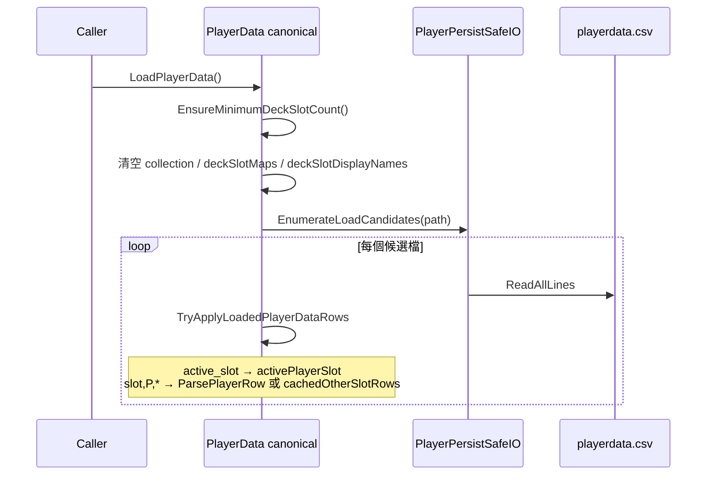
```mermaid
sequenceDiagram
    participant Caller
    participant PD as PlayerData canonical
    participant IO as PlayerPersistSafeIO
    participant CSV as playerdata.csv

    Caller->>PD: LoadPlayerData()
    PD->>PD: EnsureMinimumDeckSlotCount()
    PD->>PD: 清空 collection / deckSlotMaps / deckSlotDisplayNames
    PD->>IO: EnumerateLoadCandidates(path)
    loop 每個候選檔
        IO->>CSV: ReadAllLines
        PD->>PD: TryApplyLoadedPlayerDataRows
        Note over PD: active_slot → activePlayerSlot<br/>slot,P,* → ParsePlayerRow 或 cachedOtherSlotRows
    end
```

**`TryApplyLoadedPlayerDataRows` 要點：**

1. 讀 `active_slot` 決定 `activePlayerSlot`
2. `slot,{其他玩家},...` → 加入 `cachedOtherSlotRows`，不解析進記憶體
3. `slot,{activePlayerSlot},{key},...` → 去掉前兩欄後 `ParsePlayerRow`
4. `deck_slot_name` → 寫入 `deckSlotDisplayNames[deckSlotIdx]`（會 clamp 到 `0..deckSlotCount-1`）
5. `deckslot` → 寫入對應 `deckSlotMaps[slot]`

**常見呼叫時機：**

| 時機 | 檔案 | 注意 |
|------|------|------|
| 遊戲啟動 | `PlayerData.Awake`（canonical） | 先 `EnsureMinimumDeckSlotCount` 再載入 |
| 進入 Buildbeck | `DeckManager.CoReloadBuildbeckDeckUiAfterSceneLoad` | 重綁 UI 後從磁碟重載 |
| 大廳資源列 | `HallSceneFeatureBinder.RefreshResourceDisplay` | 會重載 |
| 進入戰鬥預覽 | `SceneLoader.EnterBattle` | 總是重載 |
| 改名／存牌組後 | 應**避免**立刻重載 | 見 `RefreshEnterBattleState(false)` |

---

#### 6. 存檔流程 `SavePlayerData()`

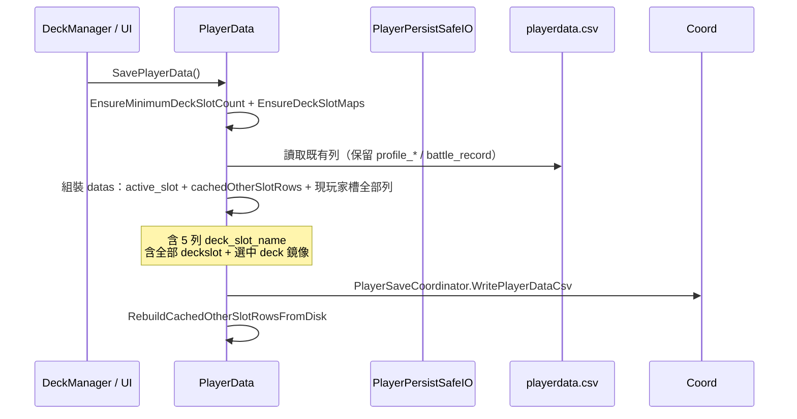
```mermaid
sequenceDiagram
    participant DM as DeckManager / UI
    participant PD as PlayerData
    participant IO as PlayerPersistSafeIO
    participant CSV as playerdata.csv

    DM->>PD: SavePlayerData()
    PD->>PD: EnsureMinimumDeckSlotCount + EnsureDeckSlotMaps
    PD->>CSV: 讀取既有列（保留 profile_* / battle_record）
    PD->>PD: 組裝 datas：active_slot + cachedOtherSlotRows + 現玩家槽全部列
    Note over PD: 含 5 列 deck_slot_name<br/>含全部 deckslot + 選中 deck 鏡像
    PD->>Coord: PlayerSaveCoordinator.WritePlayerDataCsv
    PD->>PD: RebuildCachedOtherSlotRowsFromDisk
```

**組裝順序（現玩家槽 `current` 列表）：**

1. `coins`, `selected_deck_slot`, `slot_name`
2. **五筆** `deck_slot_name,0..4`（**僅寫 raw 自訂名**；未自訂時為**空白**，UI fallback「牌組n」）
3. `card`（收藏）
4. `deckslot`（每槽所有卡牌）
5. `deck`（僅 `selectedDeckSlot`）
6. `proficiency`（若有）
7. 合併後附加既有的 `profile_*`、`battle_record`、教學／港灣旗標等 **preserve** 列（避免洗掉戰績與進度）
8. `ValuablesVaultState.AppendAllSlotsSerializedRows`：三個角色槽的 `valuable` 列（記憶體快取為準）

寫入經 `PlayerSaveCoordinator` → `PlayerPersistSafeIO.WriteAllLinesWithAtomicRotateBackups`，降低寫到一半損檔與多模組互相覆蓋的風險。

**新功能約定：** 請勿對 `playerdata.csv` 直接呼叫 `PlayerPersistSafeIO.Write…`；旗標類小改可用 `PlayerSaveCoordinator.UpsertSlotKeyedRow`。

---

#### 7. 牌組名稱：UI 到磁碟

##### 7.1 編輯與確認

| 步驟 | 方法 | 說明 |
|------|------|------|
| 開啟編輯 | `DeckManager.ShowDeckNameEditDialog` | 讀取 `GetDeckSlotDisplayName(selectedDeckSlot)` 填入輸入框 |
| 確認 | `DeckManager.ConfirmDeckNameEdit` | `PlayerDeckSlotNameStorage.ConfirmBuildbeckRename` → 記憶體 + 存檔 + profile 摘要 |
| 解散牌組 | `DeckManager.PerformResetDeckForRebuild` | 清空卡牌 + `ResetSelectedDeckSlotNameToDefault` |
| 刷新 UI | `RefreshDeckSlotTabVisual` | 更新五個分頁按鈕文字與中央牌組名稱 TMP |

`SetDeckSlotDisplayName` 僅改記憶體陣列；**必須**再呼叫 `SavePlayerData()` 才會進 CSV。

##### 7.2 顯示

- 分頁按鈕：`SetSlotButtonLabel(button, indexOneBased)` → `GetDeckSlotDisplayName(slot0)`
- 中央標題：`RefreshCurrentDeckDisplayName` → 目前 `selectedDeckSlot` 的名稱

---

#### 8. 牌組卡牌：編輯與保存

##### 8.1 執行期修改

在 Buildbeck 拖放／點擊卡牌時，經 `DeckDataController` / `DeckManager` 更新：

- `PlayerData.SetDeckCount(selectedDeckSlot, cardId, count)` 或 `AddDeckCount` 等

此時資料只在記憶體，**尚未**寫入磁碟。

##### 8.2 寫入磁碟的時機

| 操作 | 存檔 API | 說明 |
|------|----------|------|
| 拖放／點擊調整牌組 | `SavePlayerDataDebounced()` | 約 0.75s 內合併多次寫入 |
| 切換牌組分頁 | `SavePlayerDataDebounced()` | 同上 |
| 按「保存牌組」 | `SavePlayerData()` | 立即寫入 |
| 確認改名 | `SavePlayerData()` | 立即寫入 |
| 解散牌組 | `SavePlayerData()` + profile sync | 立即寫入；名稱還原預設 |
| 離開 Buildbeck 場景 | `FlushDebouncedThenSavePlayerData()` | 先取消延遲再完整存檔 |
| 進入戰鬥預覽 | `FlushDebouncedThenSavePlayerData()` + `LoadPlayerData()` | 避免延遲存檔尚未落盤 |
| **開啟玩家資訊浮層** | `LoadProfileForPlayerInfoDisplay()` | **僅讀** runtime 摘要，不寫主檔 |
| **關閉玩家資訊（Buildbeck）** | `RefreshBuildbeckDeckNameDisplayFromMemory()` | 只刷新 UI |
| 需寫入 profile 戰績等 | `RefreshProfileFromRuntime()` | 完整存檔 + `SyncProfileIntoActiveSlotRows` |

##### 8.3 進入戰鬥

`SceneLoader.EnterBattle()` 會先 `FlushDebouncedThenSavePlayerData()`，再 `LoadPlayerData()`，確保使用磁碟上最新牌組；與 Buildbeck 內剛編輯、僅記憶體尚未延遲落盤的流程不同。

---

#### 9. 玩家資訊與 `PlayerProfileCsvService`

**開啟** GlobalNav「玩家資訊」（2026-06 定案）：

```
RefreshPlayerInfoOverlayContent()
  → LoadProfileForPlayerInfoDisplay()   // 不 SavePlayerData
  → 更新浮層 UI
  → RefreshBuildbeckDeckNameDisplayFromMemory()（Buildbeck）
```

**需持久化 profile** 時才用 `RefreshProfileFromRuntime()` → `SavePlayerData()` → `SyncProfileIntoActiveSlotRows()`（merge 內**不** `LoadPlayerData`）。

關閉玩家資訊且仍在 Buildbeck 時，`GlobalNavRuntime` 呼叫 `RefreshBuildbeckDeckNameDisplayFromMemory()`。

---

#### 10. Buildbeck 場景生命週期

`DeckManager` 掛在 **DataManager**（跨場景存活），Buildbeck 場景內的 UI 物件每場重新載入，需重新綁定引用。

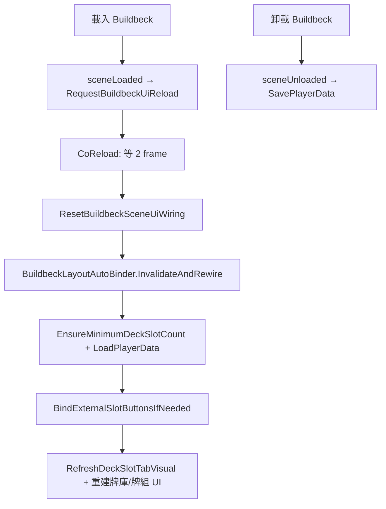
```mermaid
flowchart TD
    A[載入 Buildbeck] --> B[sceneLoaded → RequestBuildbeckUiReload]
    B --> C[CoReload: 等 2 frame]
    C --> D[ResetBuildbeckSceneUiWiring]
    D --> E[BuildbeckLayoutAutoBinder.InvalidateAndRewire]
    E --> F[EnsureMinimumDeckSlotCount + LoadPlayerData]
    F --> G[BindExternalSlotButtonsIfNeeded]
    G --> H[RefreshDeckSlotTabVisual + 重建牌庫/牌組 UI]

    I[卸載 Buildbeck] --> J[sceneUnloaded → SavePlayerData]
```

**注意：**

- 僅 **canonical** `DeckManager`（DataManager 上）註冊 `sceneLoaded` / `sceneUnloaded`；場景內重複元件被 `DestroyImmediate` 時不得解除訂閱（`IsCanonicalDeckManagerInstance()`）。
- `externalSlotButtonsBound` 在重綁前會被清空，避免指向已銷毀的按鈕卻以為已綁定。

---

#### 11. 避免覆蓋記憶體的約定

剛在 Buildbeck 執行 `SavePlayerData()` 後，若立刻 `LoadPlayerData()`，可能從**備份候選檔**讀到略舊內容而蓋掉剛改的名稱。

**做法：** `SceneLoader.RefreshEnterBattleState(reloadFromDisk: false)`

已在以下流程使用 `false`：

- `ConfirmDeckNameEdit`
- `OnClickSaveDeckButton`
- `SelectDeckSlot`
- `CoReloadBuildbeckDeckUiAfterSceneLoad` 結尾

需要與磁碟強一致時（進戰鬥、大廳刷新）才使用 `true` 或預設重載。

---

#### 12. 已知風險與除錯

| 現象 | 可能原因 | 檢查方式 |
|------|----------|----------|
| 第 4、5 槽無法改名 | `deckSlotCount < 5` 導致 clamp | 確認 prefab、`EnsureMinimumDeckSlotCount`、CSV 是否有 `deck_slot_name,3` / `,4` |
| 改名後切場景又變回預設 | 離開 Buildbeck 未存檔；或開玩家資訊曾用 `RefreshProfileFromRuntime` | 查 CSV；§9 只讀路徑；`P0_MANUAL_REGRESSION` §C |
| 開玩家資訊後名稱回溯 | 面板開啟觸發 Save+Load | 應為 `LoadProfileForPlayerInfoDisplay` |
| CSV 亂碼／污染 | 舊版錯誤寫入 | `RepairPersistedDeckSlotNamePollutionIfNeeded`；見 `Docs/DECK_SLOT_NAME_BUG_CHECKLIST.md` |
| UI 顯示牌組1～5 但資料是別的名 | UI 未重綁，仍顯示場景預設文字 | 進 Buildbeck 後是否執行 `RefreshDeckSlotTabVisual` |
| 存檔有名稱但進戰鬥是舊牌 | 進戰鬥前未按保存／未切槽觸發存檔 | `EnterBattle` 會 `LoadPlayerData` 讀磁碟 |

**建議除錯路徑：**

1. 執行期：`%USERPROFILE%\AppData\LocalLow\<CompanyName>\<ProductName>\playerdata.csv`
2. 搜尋 `deck_slot_name` 與 `deckslot` 是否對應正確玩家槽、牌組槽索引
3. Unity Console：`Save path:` / `Load from persistent:` 日誌

---

#### 13. 相關程式進入點速查

| 需求 | 方法 |
|------|------|
| 讀檔 | `PlayerData.LoadPlayerData()` |
| 存檔 | `PlayerData.SavePlayerData()` |
| 改某槽名稱 | `PlayerDeckSlotNameStorage.ConfirmRenameAndPersist` 或 `SetCustomName` + `SavePlayerData()` |
| 讀某槽 raw 名稱 | `GetRawName` / `GetDeckSlotDisplayNameRaw` |
| 讀某槽顯示名稱 | `GetDeckSlotDisplayName(slot)` |
| 選中槽 | `PlayerData.SetSelectedDeckSlot` / `DeckManager.SelectDeckSlot` |
| 改某槽卡牌 | `PlayerData.SetDeckCount(slot, id, count)` 等 |
| 取得 canonical | `PlayerData.ResolveCanonical()` |

---

#### 14. 版本與維護備註

- 牌組槽數以 **`PlayerData.MinDeckSlotCount = 5`** 為準；`DataManager.prefab` 的 `deckSlotCount` 應為 5。
- 舊存檔若僅 3 槽資料，升級後會在載入／存檔時擴充為 5 槽；第 4、5 槽名稱需使用者重新命名一次以寫入正確索引。
- 本文對應程式約 2025～2026 年 Buildbeck 存檔修正後行為；若調整 CSV 欄位請同步更新 `ParsePlayerRow` / `SavePlayerData` 與本文件。

#### 15. 貴重品庫與協調器（2026-05）

- **`valuable` 列**（6 欄）不再由各功能各自整檔覆寫；`ValuablesVaultState` 僅更新記憶體快取，`SavePlayerData` 結尾呼叫 `AppendAllSlotsSerializedRows` 一次寫入三槽。
- **教學／港灣旗標** 的即時小改走 `PlayerSaveCoordinator.UpsertSlotKeyedRow`；完整存檔仍透過 `ShouldPreserveActiveSlotRowOnPlayerSave` 保留未重建的 4 欄旗標列。
- **`player_profile.csv`** 仍可直接使用 `PlayerPersistSafeIO`（與主檔分離）。

#### 16. 手機／切背景落盤（2026-05）

`PlayerData`（canonical / `DataManager`）在 **`OnApplicationPause(true)`** 與 **`OnApplicationQuit`** 呼叫 `PlayerSaveCoordinator.FlushPendingPlayerDataIfNeeded()`：

- 僅在 **延遲存檔尚未執行**（`PlayerSaveDebouncer.HasPendingDebouncedSave`）或 **貴重品庫有未寫入變更** 時才 `SavePlayerData`，避免每次切 App 都整檔重寫。
- Android / iOS 與 Editor 行為一致；正式路徑仍為 `Application.persistentDataPath`。

**建置啟動**：`EditorBuildSettings` 第 0 場景為 `login`（非 `hall`），與 APK 首次安裝流程一致。

<div class="page-break"></div>

# 第四章　關卡設計

> 本章為各關卡的流程、獎勵與解鎖設計。

## 4.1　關卡設計 GDD（1-1 港灣）

<div class="source-note">來源文件：<code>LEVEL_DESIGN_GDD.md</code></div>

### 關卡設計企劃：1-1 港灣訓練場

> **狀態**：定案（2026-05-30）  
> **用途**：企劃／程式／文案對照用——關卡目標、流程、獎勵、地圖解鎖與難度設計。  
> **世界觀**：見 `STORY_PROGRESS_WORLDVIEW.md`（空間與敘事分層，本文件不重複圓法）。  
> **相關文件**：[`PLANNING_DOCS_INDEX.md`](PLANNING_DOCS_INDEX.md) · [`PLANNING_MASTER_TABLE.md`](PLANNING_MASTER_TABLE.md) · [`PLANNING_OPEN_ITEMS.md`](PLANNING_OPEN_ITEMS.md) · [`STORY_PROGRESS_WORLDVIEW.md`](STORY_PROGRESS_WORLDVIEW.md) · [`TUTORIAL_PLOT_SCRIPT.md`](TUTORIAL_PLOT_SCRIPT.md) · [`BATTLE_PREVIEW_PUZZLE_INDEX.md`](BATTLE_PREVIEW_PUZZLE_INDEX.md) · [`DIFFICULTY_AND_AI_DESIGN.md`](DIFFICULTY_AND_AI_DESIGN.md) · `Assets/Resources/StoryProgressNodeDatabase.json`

---

#### 一、關卡定位

| 項目 | 內容 |
|------|------|
| **章節代碼** | 1-1 |
| **顯示名稱** | 港灣訓練場 |
| **大地圖節點** | `M-1-1`（`Harbor Training Yard` / `southwest_port`） |
| **關卡類型** | 教學章節 ＋ 畢業後自主實戰練習場 |
| **預估時間** | 入門流程約 5～8 分鐘；港灣單局約 5～10 分鐘（依難度） |

**設計目標**

1. 讓新玩家在學院內**學會規則**（劇情、選項、入門對戰、基礎牌組）。
2. 入門畢業後，在同一章節節點上提供**可重複的實戰練習**（簡單／普通／困難），練習防守與法術應對快攻。
3. 以**首次實戰通關**推進大地圖（解鎖 `M-1-2`），以**困難首通**發放象徵性畢業獎勵。

---

#### 二、流程分為兩階段（不可混為一談）

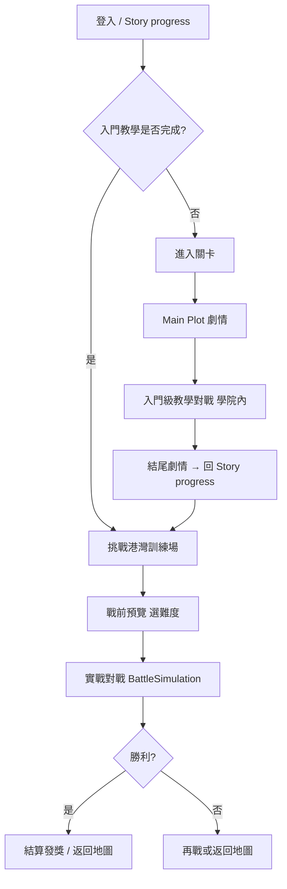
```mermaid
flowchart TD
    A[登入 / Story progress] --> B{入門教學是否完成?}
    B -->|否| C[進入關卡]
    C --> D[Main Plot 劇情]
    D --> E[入門級教學對戰 學院內]
    E --> F[結尾劇情 → 回 Story progress]
    B -->|是| G[挑戰港灣訓練場]
    G --> H[戰前預覽 選難度]
    H --> I[實戰對戰 BattleSimulation]
    I --> J{勝利?}
    J -->|是| K[結算發獎 / 返回地圖]
    J -->|否| L[再戰或返回地圖]
    F --> G
```

##### 2.1 階段 A：學院入門（教師帶領）

| 項目 | 設計 |
|------|------|
| **入口** | Story progress「進入關卡」 |
| **場景** | Main Plot → 學院舊校舍對戰館 |
| **對戰** | 入門級；**無天氣**；林可姐教學教練 UI |
| **牌組** | 劇情至「基礎牌組」步驟後發放 30 張入門牌組（牌組槽為空時才寫入；**僅首次**彈「獲得基礎牌組」） |
| **通關條件** | 完成入門劇情 ＋ 贏得入門教學戰 |
| **通關獎勵** | 收藏各 +1：**UR 國王、SR 王后、N 民兵**（僅**首次**入門戰勝利；**重溫入門課**再勝不重複發） |
| **地圖節點** | **不**因入門 alone 將 `M-1-1` 標為實戰 Clear；節點狀態為 **實戰區**（可挑戰港灣） |

詳細劇情步數見 `TUTORIAL_PLOT_SCRIPT.md`。

##### 2.2 階段 B：港灣訓練場實戰（自主練習）

| 項目 | 設計 |
|------|------|
| **解鎖條件** | 入門劇情與入門教學戰皆完成（`TutorialProgressState` 雙旗標） |
| **入口** | Story progress「挑戰港灣訓練場」→ 戰前預覽 |
| **難度** | 簡單級、普通級、困難級（三選一，可重複挑戰） |
| **敵方 AI** | 快攻型（`EnemyAiPlayStyle.FastAttack`） |
| **練習目標** | 運用**防守牌**與**法術**擊敗對手；應對早出怪與直傷壓迫 |
| **對戰場景** | `BattleSimulation`（與 Buildbeck 一般對戰相同結算 UI） |
| **結束後** | 「返回地圖」回 Story progress |
| **對戰 BGM** | `Ziv Moran - Shades - Mysterious`（簡單／普通／困難共用）；`TutorialBattleBackgroundMusicPlayer` · `Assets/Resources/Music/` |
| **對戰背景** | `bay.png`（港灣黃昏訓練場）；美術 `Assets/UI/Level background/bay.png` · 執行時 `Assets/Resources/UI/Level background/bay.png` · `HarborTrainingBattleBackground` 套用至場景 `戰鬥背景` |
| **Story progress BGM** | `Master Minded - Amazonian Grounding`；`StoryProgressBackgroundMusicPlayer` · `Assets/Resources/Music/` |

戰前預覽文案見 `HarborTrainingBattleCopy.cs`；版面見 `BATTLE_PREVIEW_PUZZLE_INDEX.md`（`HARBOR_M11`）。  
港灣實戰**戰術教練**（關鍵時刻提示，非入門全程帶做）見 [`HARBOR_COMBAT_COACH_GDD.md`](HARBOR_COMBAT_COACH_GDD.md)。

---

#### 三、通關獎勵與進度（定案）

##### 3.1 獎勵總表

| 觸發條件 | 獎勵內容 | 是否可重複 | 備註 |
|----------|----------|------------|------|
| 入門教學戰**首次勝利** | UR 國王、SR 王后、N 民兵 各 1 | 否 | `tutorial_intro_trio_reward` · `TutorialBattleRewardService.TryGrantIntroTrioReward` |
| 重溫入門課再勝 | 無卡牌；結算僅提示已於首次通關發放 | — | 同上旗標 |
| 港灣**任一難度首次勝利** | 大地圖 **M-1-1 實戰 Clear**；解鎖 **M-1-2 海牆巡邏**（**不**發修女／主教／城堡） | 否 | `harbor_combat_clear` |
| **M-1-2 段考首通** | 修女、主教、城堡 各 +1 收藏；戰技熟練度 **B** | 否 | `m12_religious_line_reward` · 見 [`LEVEL_DESIGN_M-1-2.md`](LEVEL_DESIGN_M-1-2.md) |
| 港灣**困難級首次勝利** | **SR 聖院騎士** ×1（港灣畢業證） | 否 | `harbor_hard_reward`；CardList id `18` |
| 港灣任一難度**再次勝利** | 無額外卡牌／解鎖 | — | 僅熟練度與戰績 |
| 港灣戰敗 | 無懲罰性扣資源 | — | 可再戰 |

##### 3.2 與入門獎勵的關係

- 入門三張（國王／王后／民兵）＝ **畢業禮**，在學院內發放。
- 港灣畢業證（聖院騎士）＝ **實戰畢業**，僅困難首通一次。
- 兩者**互不取代**；Story progress「通關獎勵」區文案會依進度切換（見 §五）。

##### 3.3 結算介面提示（港灣勝利）

| 情況 | 副標題範例 |
|------|------------|
| 首次通關任一難度 | 港灣實戰通關 · 海牆巡邏已解鎖 |
| 首次通關困難（含上列） | 同上 ＋ 港灣畢業證 聖院騎士 已入收藏 |
| 僅重複通關 | 熟練度與戰績已記錄 |

---

#### 四、難度設計（港灣訓練場）

| 難度 | 顯示名 | 企劃定位 | 敵方 AI | 備註 |
|------|--------|----------|---------|------|
| 簡單 | 簡單級 | 熟悉快攻節奏、容錯較高 | 快攻型（前段減壓） | 建議首次實戰優先；**KPI 首通約 70%、平均約 10 回合** |
| 普通 | 普通級 | 標準實戰壓力；**可練可過** | 快攻型 | **KPI 首通約 60%**（入門預設牌組）；回合數不限；見 `HarborTrainingNormalBattleRules` |
| 困難 | 困難級 | 畢業門檻；發放畢業證 | 快攻型 | **僅首次勝利**發 SR |

**簡單檔專用規則**（`HarborTrainingEasyBattleRules.cs`，與 Buildbeck 一般 `Easy` 分離）：

| 項目 | 簡單實戰 |
|------|----------|
| 局長 | 第 10 回合後下一輪推進時判定玩家獲勝（與入門限時類似，拉齊平均局長） |
| 敵起始 HP | 17 |
| 敵傷害倍率 | 0.78 |
| 敵抽牌 | 第 1～4 回合每回合 1 張，之後 2 張 |
| 快攻 AI | 前 4 回合出怪評分 +6（之後 +16）；法術評分略降 |
| 敵牌組 | 固定弱牌組（入門基礎 + 1 張火球），非通用 Easy 隨機構築 |

**普通檔專用規則**（`HarborTrainingNormalBattleRules.cs`，與 Buildbeck 一般 `Normal` 分離）：

| 項目 | 普通實戰 |
|------|----------|
| 局長 | **不限回合**（無第 10 回合強制勝利） |
| 敵起始 HP | 15 |
| 敵傷害倍率 | 0.66（簡單 0.78；無第 10 回合必勝故更寬鬆） |
| 敵抽牌 | 第 1～5 回合每回合 1 張，之後 2 張 |
| 快攻 AI | 前 5 回合出怪 +3、之後 +6 |
| 敵牌組 | 簡單弱牌組 + 主教／騎兵，**無 SSR**；超牌容許 2 |
| KPI 驗證 | **真人**首通約 60%；`Tools/Harbor/Win Rate Sim` 自動 AI 僅作回歸（約 15～25%，不可直接當 KPI） |

**困難檔專用規則**（`HarborTrainingHardBattleRules.cs`，與 Buildbeck 一般 `Hard` 分離）：

| 項目 | 困難實戰 |
|------|----------|
| 局長 | 不限回合 |
| 敵起始 HP | 18 |
| 敵傷害倍率 | 0.74 |
| 敵抽牌 | 第 1～3 回合 1 張／回合，之後 2 張 |
| 快攻 AI | 前 3 回合 +5、之後 +12 |
| 敵牌組 | 普通池加強（雙主教／雙騎兵／審判官／雙火球），**無 SSR 四騎**；超牌容許 3 |

三檔開戰設定統一由 `HarborTrainingDifficultyRuntime`／`HarborTrainingTierConfig` 提供；`BattleSimulationManager.HarborTraining.cs` 負責簡單回合上限勝利。細節見 [`HARBOR_1-1_VS_TRAINING_GROUND_DIFFICULTY.md`](HARBOR_1-1_VS_TRAINING_GROUND_DIFFICULTY.md)。

**不包含**：魔王級、戰前謎題解鎖（PZ01／PZ02 僅 Buildbeck 隨機預覽用）。

---

#### 五、UI 與文案錨點

##### 5.1 Story progress 右側面板

| 區塊 | 入門中 | 入門畢業後 |
|------|--------|------------|
| 關卡說明 | 學院、對戰館、今日入門試煉 | 港灣已解鎖、三難度、快攻與防守提示 |
| 通關獎勵 | UR 國王、SR 王后、N 民兵（入門試煉首通） | **實戰區**：首通任一難度解鎖海牆巡邏 ＋ 困難首通 SR 聖院騎士；**已實戰 Clear**：僅剩困難畢業證；**已領畢業證**：標示已取得（`StoryProgressLevelCopy.BuildScenarioRewards`） |
| 底欄佈告 | 今日學院入門 · 按進入關卡 | 港灣訓練場已解鎖 · 按挑戰港灣訓練場 |
| 按鈕列 | 進入關卡（單顆，右下） | 重溫入門課、前往大廳、挑戰港灣訓練場 |

文案來源：`StoryProgressLevelCopy.cs`。

##### 5.2 大地圖節點 M-1-1

| 狀態 | 顯示 | 條件 |
|------|------|------|
| NEW | NEW | 入門未完成 |
| 進行中 | 進行中 | 僅完成部分入門 |
| 實戰區 | 實戰區 | 入門畢業，尚未港灣實戰通關 |
| Clear | Clear | `harbor_combat_clear` |

副標（節點下）：入門中「入門課 · 學院內」；畢業後「簡單・普通・困難」。

##### 5.2.1 節點 Icon 尺寸（地圖本地 UI 單位）

| 類型 | 邊長 | 美術 @2× 出圖 | 程式常數 |
|------|------|---------------|----------|
| 入門主節點（M-1-1） | 48 | 96×96 | `TutorialNodeSize` |
| 一般實戰節點 | 40 | 80×80 | `NodeSize` |
| 魔王節點 | 44 | 88×88 | `BossNodeSize` |

錨點：`StoryProgressWorldMapRuntime.cs`。地圖底圖 `大地圖.png` 1672×941；節點座標見 `StoryProgressNodeDatabase.json` 之 `x` / `y`（0～1）。

**預設視野**：進入／聚焦模式對焦時套用 **`[` 最小縮放**（`minZoom`，預設 0.75）；可用 `[` `]` 在 `minZoom`～`maxZoom` 間調整。

##### 5.3 地圖連線

| 節點 | 解鎖條件（資料庫） |
|------|-------------------|
| M-1-1 | 預設可見（教程起點） |
| M-1-2 海牆巡邏 | `unlockRequiresAllOf: ["M-1-1"]` → 需 **港灣實戰 Clear**（非僅入門畢業） |

---

#### 六、程式實作對照（供驗收）

| 企劃項 | 程式位置 |
|--------|----------|
| 入門雙旗標 | `TutorialProgressState`（`tutorial_plot`、`tutorial_battle`） |
| 入門御三家僅一次 | `tutorial_intro_trio_reward`（舊存檔：已完成 `tutorial_battle` 視為已領） |
| 港灣實戰 Clear | `HarborTrainingProgressState` → `harbor_combat_clear` |
| 困難畢業證 | `HarborTrainingProgressState` → `harbor_hard_reward` |
| 發獎邏輯 | `HarborTrainingRewardService.ProcessVictory` |
| 地圖 Clear / M-1-2 | `StoryProgressWorldMapRuntime.LoadClearedNodeProgress` |
| M-1-2 宗教三張 B | `M12ReligiousLineRewardService` · `m12_religious_line_reward` |
| M-1-2 段考戰技追蹤 | `M12TrioMasteryBattleTracker` · `BattleLaunchContext.IsM12TrioMasteryBattle` |
| 戰前預覽 | `SceneLoader.HarborTraining.cs`、`HarborTrainingBattleCopy.cs` |
| 結算副標題 | `BattleSimulationDebugUI.Settlement` |
| 基礎牌組僅首次通知 | `tutorial_starter_deck_notify` + `MainPlotSceneController` |

存檔格式：`playerdata.csv` 內 `slot,{槽位},{旗標名},{0|1}` 列。

---

#### 七、體驗檢查清單（企劃驗收）

- [ ] 新帳號：入門完成前看不到「挑戰港灣訓練場」三按鈕列。
- [ ] 入門完成後：可開戰前預覽，三難度拱門與「開始對戰」正常。
- [ ] 首次贏簡單或普通：地圖 M-1-1 變 Clear，M-1-2 可點（Available）。
- [ ] 首次贏困難：收藏多出 1 張 SR 聖院騎士；再贏困難不再增加。
- [ ] 入門獎勵三張與港灣畢業證不互相覆蓋、不重複發放入門牌組彈窗（重溫入門課）。
- [ ] 重溫入門課再勝：不增加御三家收藏；結算無三卡展示。
- [ ] 戰敗可再戰；返回地圖不誤發首次通關獎勵。

---

#### 八、後續擴充備註（非本次範圍）

| 方向 | 說明 |
|------|------|
| M-1-1 二階段 | 港灣碼頭外景、獨立 BG 與副本規則（見世界觀文件 §八） |
| M-1-2 內容 | 已定案：見 [`LEVEL_DESIGN_M-1-2.md`](LEVEL_DESIGN_M-1-2.md)（雙戰鬥、御三家觸發、宗教三張 B） |
| 經濟獎勵 | 港灣重複通關金幣／熟練度加成尚未實裝 |
| 困難以上 | 魔王級、天氣等留待後續章節 |

---

#### 九、修訂紀錄

| 日期 | 變更 |
|------|------|
| 2026-05-30 | 初版：釐清入門／港灣兩階段；定案實戰 Clear → M-1-2、困難首通 SR 聖院騎士畢業證；對照現行程式。 |
| 2026-05-30 | 入門御三家改為僅首次發放；重溫入門不可重複領（`tutorial_intro_trio_reward`）。 |
| 2026-05-31 | 大地圖節點 icon 小幅調整：入門 48、一般 40、魔王 44（§5.2.1）。 |
| 2026-05-31 | 地圖預設視野改為 `minZoom`（與 `[` 縮到最小相同）。 |
| 2026-05-30 | M-1-2 定案：港灣首通僅解鎖；段考發修女／主教／城堡 **B**（`LEVEL_DESIGN_M-1-2.md`）。 |

## 4.2　關卡設計（1-2 海牆巡邏）

<div class="source-note">來源文件：<code>LEVEL_DESIGN_M-1-2.md</code></div>

### 關卡設計企劃：1-2 海牆巡邏（M-1-2）

> **狀態**：定案（2026-05-30）  
> **用途**：M-1-2 流程、雙戰鬥、御三家戰技段考、宗教線畢業獎勵。  
> **關聯**：[`LEVEL_DESIGN_GDD.md`](LEVEL_DESIGN_GDD.md)（M-1-1 港灣）· [`CARD_PROFICIENCY_GDD.md`](CARD_PROFICIENCY_GDD.md) · [`卡牌技能階段式揭露.md`](卡牌技能階段式揭露.md) · [`HARBOR_COMBAT_COACH_GDD.md`](HARBOR_COMBAT_COACH_GDD.md) · `StoryProgressNodeDatabase.json`（`M-1-2`）

---

#### 一、關卡定位

| 項目 | 內容 |
|------|------|
| **章節代碼** | 1-2 |
| **大地圖節點** | `M-1-2`（Seawall Patrol / 海牆巡邏） |
| **解鎖條件** | **M-1-1 港灣實戰首通**（`harbor_combat_clear`）；**不**在港灣首通發宗教三張 |
| **關卡類型** | 劇情 ＋ **獨立教學戰** ＋ **中段喘息（散策／點物件）** ＋ **帶教練實戰**（無戰鬥中場） |

**設計目標**

1. 在玩家已用過 30 張入門牌組、港灣實戰過後，**集中教御三家戰技**（國王／王后／民兵）。
2. 通關條件強調**觸發過**戰技，**不必**打得漂亮或限回合必勝。
3. 首通發放 **修女、主教、城堡** 各 1 張收藏，戰技熟練度 **B 階**（非 C）；重溫不重發。
4. 與 M-1-1 獎勵梯次區隔：入門 **御三家 C** → 港灣 **解鎖地圖** → 1-2 **宗教／防守線 B** → 港灣困難 **SR 聖院騎士**。

---

#### 二、與 M-1-1 的獎勵分界（定案）

| 時機 | 發什麼 | 不發什麼 |
|------|--------|----------|
| **M-1-1 入門教學戰勝** | 御三家各 +1 收藏，熟練度視為 **C** | — |
| **M-1-1 港灣任一難度首通** | `harbor_combat_clear`、**解鎖 M-1-2** | **修女／主教／城堡**（明確不發） |
| **M-1-1 港灣困難首通** | SR 聖院騎士 ×1（畢業證） | 宗教三張 |
| **M-1-2 段考首通** | 修女、主教、城堡各 +1；熟練度 **B** | 御三家（已在入門發過） |

---

#### 三、流程（兩段戰鬥）

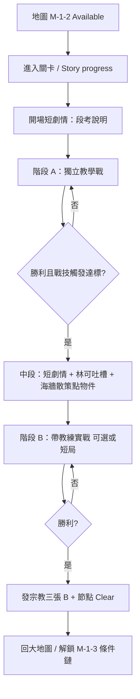
```mermaid
flowchart TD
    A[地圖 M-1-2 Available] --> B[進入關卡 / Story progress]
    B --> C[開場短劇情：段考說明]
    C --> D[階段 A：獨立教學戰]
    D --> E{勝利且戰技觸發達標?}
    E -->|否| D
    E -->|是| M[中段：短劇情 + 林可吐槽 + 海牆散策點物件]
    M --> F[階段 B：帶教練實戰 可選或短局]
    F --> G{勝利?}
    G -->|否| F
    G -->|是| H[發宗教三張 B + 節點 Clear]
    H --> I[回大地圖 / 解鎖 M-1-3 條件鏈]
```

> **節奏定案**：中段**無戰鬥**，用來降低「連打兩場」的疲勞；不另開 PZ 解謎或小遊戲系統。

##### 3.1 階段 A：獨立教學戰（`IsM12TrioTutorialBattle`）

| 項目 | 設計 |
|------|------|
| **類比** | 入門教學戰（學院內、無天氣、專用規則） |
| **牌組** | 入門 30 張或段考專用子集（企劃可再縮：必含御三家各至少 1 張） |
| **敵方** | 溫和 AI；壓力低於港灣普通 |
| **教練** | **全程**提示：何時上國王／王后／民兵、何時會觸發戰技（可沿用 `TutorialBattleCoachUi` 擴充或專用 `M12` 台詞表） |
| **勝利** | 打贏 **且** 本局御三家戰技各至少觸發 1 次（見 §四） |

##### 3.2 階段 B：帶教練的實戰（`IsM12CoachPracticeBattle`）

| 項目 | 設計 |
|------|------|
| **類比** | 港灣實戰 + **戰術教練**（`HarborCombatCoach` 或 M-1-2 專用提示表） |
| **難度** | 建議固定 **簡單** 或專用 `M12Practice` 規則（敵 HP／傷害略低於港灣簡單） |
| **背景／BGM** | 可沿用港灣 `bay.png` 或 1-2 專用美術（待美術） |
| **勝利** | 打贏 **且** 再次確認御三家戰技觸發（可與階段 A 共用本節對局計數，或要求階段 B 至少再觸發各 1 次——**定案：兩階段合計各觸發 ≥1 即可**，避免重複折磨） |

**備註**：若工期緊，可先上「階段 A 必過 ＋ 階段 B 只須勝利」，戰技觸發僅在 A 強制；文件保留 B 亦建議觸發供驗收升級。

##### 3.3 中段喘息：短劇情 + 林可吐槽 + 海牆散策（無戰鬥）

| 項目 | 定案 |
|------|------|
| **位置** | 階段 A 勝利且戰技達標後 → 階段 B 開戰前 |
| **目的** | 節奏換氣；呼應節點名「海牆巡邏」；用林可人設緩衝段考壓力 |
| **不做** | 戰鬥、PZ01／PZ02 式解謎、新規則小遊戲 |

###### 3.3.1 短劇情 + 林可台詞（約 30～60 秒）

| 要素 | 說明 |
|------|------|
| **形式** | 沿用 **Main Plot** 逐句／選項（或 Story progress 全屏對話框）；可 1～2 屏 |
| **內容** | 肯定段考結果（列陣／庇護／庭訓已觸發）；預告「接下來是加練，也可先回港灣」 |
| **林可吐槽** | 輕鬆、不破壞世界觀：例如「剛剛那場比入門試煉還像考試」「海風比館內悶」「別在堤防上睡著」——**吐槽對象是流程／天氣，不嘲諷玩家操作** |
| **語氣** | 與入門劇情一致：帶教、嘴硬心軟；**不**強迫玩家記新規則 |

**建議不寫進戰鬥規則**：此段僅敘事，不發牌、不改 HP。

###### 3.3.2 海牆散策：走點／點物件拿台詞（約 2～3 分鐘）

| 要素 | 說明 |
|------|------|
| **形式** | 單屏或短卷軸**海牆場景**（可疊 `bay.png` 變體／堤防前景）；**3 個熱區**（建議固定，免隨機） |
| **操作** | 點選熱區 → 彈 1 段旁白或林可語音字幕；全部點過後解鎖「繼續加練」按鈕 |
| **戰鬥** | **無**；不進 `BattleSimulation` |

**建議熱區（企劃占位）**

| 熱區 | 物件 | 台詞方向 |
|------|------|----------|
| 1 | 海牆燈塔／號燈 | 巡邏任務、遠望港灣訓練場 |
| 2 | 纜繩／系船柱 | 林可吐槽學生別把繩結當卡牌打出 |
| 3 | 木樁／假人 | 呼應御三家段考；可選連到「宗教線畢業禮在加練後」 |

| 驗收 | 玩家可不點滿 3 個也繼續（**建議**：點滿 1 個即可繼續，其餘獎勵式台詞）——避免變成拖時間的收集 |
| 與獎勵 | **中段不發**修女／主教／城堡；發獎仍在 B 勝利後（或另議 A 後發，見 §五備註） |

###### 3.3.3 為何合理（設計對照）

| 對照 | 說明 |
|------|------|
| **世界觀** | 1-1 在學院；1-2 在**西南海岸／海牆**——散策比再開一場卡戰更像「巡邏」 |
| **認知負荷** | 段考後大腦需要**低專注**區間；點物件 = 探索，不是新系統教學 |
| **現有資產** | Main Plot、點擊繼續、港灣 BG；不必先做 PZ 拱門級謎題 |
| **林可定位** | 港灣教練／戰術提示與劇情導師同一角色；中段吐槽銜接 B 的教練語氣 |

###### 3.3.4 程式占位（待實裝）

| 項目 | 方向 |
|------|------|
| 場景 | `M12SeawallPatrolScene` 或 Main Plot 子流程 `BuildM12PatrolSteps()` |
| 旗標 | `m12_patrol_beat_seen`（可選，防重播強制看） |
| 跳過 | 提供「前往加練」；散策**非**全收集硬門檻 |

---

#### 四、關卡目標：御三家戰技「觸發過」

| 戰技 | 觸發判定（程式） | 教練／劇情提示 |
|------|------------------|----------------|
| **民兵·列陣** | 本局 `playerMilitiaFormationUsed` 曾為 true | 首次上場民兵 |
| **王后·王室庇護** | 本局 `playerQueenShelterUsed` 曾觸發減傷 | 王后第一次挨打 |
| **國王·庭訓號令** | 本局 `playerKingTrainingCharges` 由 3 減少至少 1 | 直擊英雄或國王在場減傷 |

**通關邏輯（定案）**

- **不必**剩餘 HP 門檻、不必回合上限內絢麗擊殺。
- **必須**：階段 A 或 B 的合計對局中，上表三項**皆至少觸發 1 次**（玩家側；敵方不計）。
- 落敗可重試；重試不消耗獎勵次數（獎勵仍僅首通一次）。

**建議旗標**

| 旗標 | 說明 |
|------|------|
| `m12_trio_mastery_cleared` | 段考兩階段完成且戰技達標 |
| `m12_religious_line_reward` | 宗教三張已發放（重溫不重發） |

---

#### 五、通關獎勵（定案）

| 卡名 | id | 收藏 | 熟練度 |
|------|-----|------|--------|
| 修女 | 17 | +1 | **B**（`progressAny = 2.0`，`winsNormal = 0`） |
| 主教 | 14 | +1 | **B** |
| 城堡 | 7 | +1 | **B**（**堅城駐守**；見 `卡牌技能階段式揭露.md` §9） |

**與御三家差異**

| 群組 | 熟練度 | 戰技 UI |
|------|--------|---------|
| 御三家（入門） | **C**（`IsStarterTrio`） | 全文 + 全效果 |
| 宗教／防守線（1-2） | **B** | 一行摘要 + **效果生效**；C 仍須 toward-C 勝場 |

**重溫**：已完成 `m12_trio_mastery_cleared` 後再玩，**不**重發三張、不補 B 進度。

---

#### 六、UI／文案錨點（待接）

| 位置 | 文案方向 |
|------|----------|
| Story progress · M-1-2 | 御三家戰技段考；通關獎勵：修女、主教、城堡（戰技基礎解放） |
| 地圖節點 | 需 `harbor_combat_clear` 後 Available |
| 結算 | 首通三卡展示（類入門御三家）；副標「海牆巡邏段考通過」 |

---

#### 七、程式對照（實作／待接）

| 企劃項 | 程式 |
|--------|------|
| 港灣首通不發宗教三張 | `HarborTrainingRewardService`（僅 Clear + 困難 SR） |
| 1-2 宗教三張 + B | `M12ReligiousLineRewardService.TryGrantReligiousLineReward` |
| 熟練度 B | `PlayerData.SetCardProficiencyWins(id, 2f, 0)` |
| 開戰類型 | `BattleLaunchContext.BeginM12TrioTutorialBattleLaunch` / `BeginM12CoachPracticeBattleLaunch` |
| 戰技觸發達標 | `M12TrioMasteryBattleTracker`（對局結束查詢） |
| 旗標 | `TutorialProgressState` · `m12_religious_line_reward`、`m12_trio_mastery_cleared` |

**未實裝（本定案後開發）**：Main Plot 1-2 劇情、地圖點擊進關、兩場戰鬥場景串接、結算三卡展示 UI。

---

#### 八、體驗檢查清單

- [ ] 僅港灣首通：M-1-2 可進，**收藏無**修女／主教／城堡新增（若入門牌組已有不算收藏則以收藏計數為準）。
- [ ] 1-2 首通：三張入收藏，背包戰技為 **B**（修女／主教／城堡戰技可對戰觸發）。
- [ ] 1-2 重溫：無三卡、旗標不重設。
- [ ] 段考落敗：不發獎、不 Clear。
- [ ] 段考勝利但未觸發三戰技：不發獎（或提示「再試一次以觸發戰技」）。
- [ ] A 與 B 之間：可完成散策（至少 1 熱區）且無戰鬥；林可台詞可跳過或快轉。
- [ ] 散策不發宗教三張、不替代 B 勝利條件。

---

#### 九、修訂紀錄

| 日期 | 變更 |
|------|------|
| 2026-05-30 | 初版：港灣首通只解鎖；1-2 雙戰鬥 + 宗教三張 B + 御三家戰技觸發通關 |
| 2026-05-30 | §3.3 中段定案：短劇情 + 林可吐槽 + 海牆點物件散策（無戰鬥、無 PZ） |

<div class="page-break"></div>

# 第五章　美術、UI 與視覺規格

> 本章彙整視覺風格、配色 Token 與美術資源盤點。

## 5.1　對戰 UI 配色規格

<div class="source-note">來源文件：<code>BATTLE_UI_COLOR_SPEC.md</code></div>

### 對戰場景 UI 配色規格（Battle Simulation）

| 項目 | 內容 |
|------|------|
| **狀態** | 已定案，待程式／場景實作 |
| **場景** | `BattleSimulation`（及 `BattleSimulationDebugUI` 動態建立之 UI） |
| **世界觀** | 學院魔法訓練廳（練習場對戰） |
| **方案** | 書稿 **#DIABLO**（骨幹）+ **#HEARTY**（紙感）+ **#DANGEROUS**（敵我點綴，淡化）+ **動物森友會 A 克制**（奶油面板、軟木按鈕、鈴錢金強調） |
| **目標感受** | 專注、可讀、偏暖；不過度柔和、不過度緊張 |
| **參考來源** | 見 **§2**（三本配色書 + 動物森友會 UI；量化比例與圖表） |
| **實作範圍** | 見 **§1**（玩家向 HUD／面板；**不含**除錯、卡牌區、特效） |
| **實作參考** | `Assets/Scripts/BattleSimulationDebugUI*.cs`、`Assets/Scenes/BattleSimulation.unity` |

---

#### 1. 範圍說明

##### 1.1 範圍原則（定案）

本規格書**只規範「學院練習場」對戰中、玩家會看到的 UI chrome 配色**。下列三大類**一律不列入**本書範圍，實作時**勿依本規格修改**其顏色：

| 類別 | 定義 | 代表內容 |
|------|------|----------|
| **A. 卡牌區** | 手牌、場上、牌背、與卡牌本體貼合的 UI | 見 §1.2 |
| **B. 特效** | 非穩態 UI 的動畫、粒子、閃爍、飛行、全螢幕色偏 | 見 §1.2 |
| **C. 除錯／批次模擬** | 開發者工具、F3 除錯面板、勝率批次模擬進度 UI | 見 §1.2 |

> `ShowBattleToast` 等訊息若僅顯示於除錯面板內文字，屬 **C 類**，不在本規格實作範圍。

##### 1.2 明確排除（不適用本規格）

###### A. 卡牌區

| 排除項目 | 說明 |
|----------|------|
| 玩家手牌區 | `HandArea`、`BattleSimulationDebugUI.PlayerHand.cs`（`CardDisplay`、底圖、邊框、標籤） |
| 敵方手牌區 | `EnemyHandArea` 內卡牌視覺 |
| 場地牌區 | `PlayerFieldArea` / `EnemyFieldArea` / Spell 場區；含場上 HP／傷害色、`FieldCards.cs` 選取光暈 |
| 卡牌上互動 | `BattleHandDiscardDrag` 長按進度 Fill、拖曳高亮等 |
| 抽牌／出牌幽靈 | 飛行中的牌背、暫態 `Image`（`PlayDrawAnimation` 等） |

###### B. 特效

| 排除項目 | 說明 |
|----------|------|
| 天氣全螢幕 FX | `CreateWeatherScreenFx` 各層 tint、粒子、船／葉／雨等 → 見 **`BATTLE_FX_COLOR_SPEC.md`** |
| 英雄受傷回饋 FX | `HeroDamageVignette`、`HeroDamageMonochromeFlash`、HP 閃爍 lerp → 見 **`BATTLE_FX_COLOR_SPEC.md`**（UI 內 `HURT_FLASH` 為語意錨點） |
| 法術／攻擊演出 | 出牌飛行、燃燒、震動、法術 dim 等 → 見 **`BATTLE_FX_COLOR_SPEC.md`** |
| 場景背景圖 | `戰鬥背景` 等 Sprite 美術本身（非 UI 色票） |

###### C. 除錯／批次模擬

| 排除項目 | 說明 |
|----------|------|
| 除錯面板全區 | `DebugBattlePanel`、`BattleDebugUIRoot`：`RoundText`、`FieldText`、`DeckText`、`StateText`、`BattleResultText`（除錯用小字）、`CloseDebugPanelButton` 等 |
| 除錯專用 Rich Text | `fieldText` 內 Toast／AI 行（`#AAFFCC`、`#FFD580` 等） |
| 批次勝率模擬 | `BattleAutoSimPlugin` 嵌入進度條、Win-rate 按鈕、批次結果面板 |
| 除錯可見性邏輯 | 開啟除錯時的 UI 顯色**維持現狀**，除非另開開發用規格 |

##### 1.3 本次配色包含（在範圍內）

| 區塊 | 元件（摘要） |
|------|----------------|
| 英雄 HUD | `EnemyHeroHpHud`、`PlayerHeroHpHud` |
| 回合提示 | `BattleTurnBanner` |
| 主操作 | `結束回合`／`QuickEndTurnButton`、`PauseToggleButton`、`ActiveWeatherEffectButton` |
| 暫停 | `PausePanel`、`PauseCard`、Resume／Restart／Give up |
| 牌庫視覺 | `PlayerDeckPile`、`EnemyDeckPile`（右側堆疊，非卡牌本體） |
| 開場 | `OpeningRollPanel`、骰子文字（骰子 **點陣** Image 屬 §1.2-B 特效／裝飾，不實作） |
| 天氣 UI | 預報遮罩／卡片、進行中 `ActiveWeatherEffectPanel` |
| 棄牌流程 chrome | `DiscardDropZone`、`DiscardPromptPanel`（**不含**手牌本體） |
| 敵棄牌提示面板 | `EnemyDiscardToast` 底與文字（面板 chrome，**不含** mount 內卡牌） |
| 結算／戰報 | `EndBattlePanel`、對戰歷史對話框（`BattleHistoryOverlay`） |
| 場景靜態 UI | `結束回合` 等已列於 §4 者（待場景清查補齊） |

##### 1.4 預設未在「1+A」細談之決策

| 項目 | 定案 |
|------|------|
| **結束回合按鈕** | **實心軟木褐**（`BTN_PRIMARY`），非奶油底描邊式 |
| **森友會程度** | **A 克制**：奶油面板 + 軟木主按鈕 + 鈴錢金回合字；我方 HP 用**壓暗綠**而非亮 `#88C9A0` |

---

#### 2. 色票參考來源、量化比例與圖表

##### 2.1 參考來源總覽

本規格之色票**不是單一作品複製**，而是以下四類來源加權融合，服務「學院練習場」：暖木背景上可讀、專注、不殺氣。

| 來源類別 | 書名／作品 | 擔當角色 | 取用原則 |
|----------|------------|----------|----------|
| **A** | 配色書 **#DIABLO**（金屬／機械／龐克／頹廢） | 結構骨幹 | 深藍灰、古銅、遮罩、牌堆陰影；提供「訓練廳庄重感」 |
| **B** | 配色書 **#HEARTY**（爽快／純真／輕鬆／舒暢） | 紙感與清新點綴 | 薄荷青標籤、淡金提示；**避免**整片高飽和黃粉 |
| **C** | 配色書 **#DANGEROUS**（恐怖／昏暗／危險／陰森） | 敵我與墨色（淡化） | 赭石敵方、深綠語意、軟墨副文；**禁用**血紅 9／12／15 作主色 |
| **D** | **動物森友會**（主要參考 *New Horizons* Nook 介面） | 練習場 UX 質感（A 克制） | 奶油面板、巧克力字、軟木按鈕、鈴錢金強調；**不**用亮果綠 `#88C9A0` 當 HP 主色 |
| **E** | **原創／專案混合** | 可讀性與銜接 | Hover／Pressed 運算色、除錯深褐底、與大廳一致之 `HALL_WINE`、α 與對比調整 |

> **動物森友會**色值為社群／官方 UI 常見參考（非任天堂資產）；實作僅借用**配色與層級**（紙感、圓潤、低壓迫），不複製介面圖形。

---

##### 2.2 三本配色書：採用色票對照表

以下為本規格**有明確對應**之書稿色票（每本 20 色中擇用；未列出者代表本次**刻意不採**）。

###### #DIABLO（6 色）

| 書內分類 | 色票# | 書稿 RGB | 對應本規格代號 | 調整說明 |
|----------|-------|----------|----------------|----------|
| 金屬 | 1 | 206, 185, 143 | `BELL_GOLD`／`AI_HINT_GOLD` 鄰近 | 強調色以動森鈴金為準，書稿作暖金參考 |
| 金屬 | 3 | 13, 30, 53 | `DECK_TOP`（50%） | 與動森天空灰藍混合為 `#4A6B7C` |
| 機械 | 7 | 30, 44, 59 | `BTN_SECONDARY`（50%） | 與動森 `#7EA9BF` 混合為 `#5A7A8F` |
| 機械 | 10 | 137, 113, 73 | `BTN_PRIMARY`（40%） | 與動森軟木褐混合為 `#9A7A55` |
| 龐克 | 15 | 37, 35, 42 | `DECK_SHADOW` | 略提亮為 `#2E3542` 以配夜景背景 |
| 頹廢 | 20 | 10, 3, 5 | `DIM`／`DIM_HEAVY` | 僅調整 alpha（50%／66%） |

###### #HEARTY（5 色）

| 書內分類 | 色票# | 書稿 RGB | 對應本規格代號 | 調整說明 |
|----------|-------|----------|----------------|----------|
| 爽快 | 1 | 232, 187, 106 | `AI_HINT_GOLD` | 定案 `#E8BB6A`，略降飽和 |
| 爽快 | 2 | 244, 219, 214 | `PANEL_MILK`（30%） | 主體改動森對話米白 `#FFF8E7` |
| 純真 | 7 | 168, 206, 198 | `ALLY_LABEL`／`WeatherRemain` | **直接採用** |
| 純真 | 8 | 210, 229, 229 | `TOAST_MINT` | 定案 `#D2E5E5` |
| 舒暢 | 19 | 234, 215, 198 | `PANEL_CREAM` 鄰近 | 動森奶油 `#F5E6C8` 優先 |

###### #DANGEROUS（5 色；皆淡化）

| 書內分類 | 色票# | 書稿 RGB | 對應本規格代號 | 調整說明 |
|----------|-------|----------|----------------|----------|
| 危險 | 11 | 140, 118, 93 | `FOE_HP` 語意參考 | 定案偏暖 `#B8846E`，避免灰褐過冷 |
| 昏暗 | 8 | 138, 92, 93 | `TURN_ENEMY` 語意參考 | 定案改動森珊瑚 `#E0AA90` |
| 危險 | 13 | 56, 75, 56 | `ALLY_HP` 語意參考 | 定案用動森綠壓暗 `#5F8F72` |
| 陰森 | 19 | 73, 63, 59 | `INK_SOFT` | **直接採用** |
| 恐怖 | 5 | 23, 22, 43 | `DECK_TOP` 語意參考 | 併入 DIABLO 深藍系 |

**刻意不採用之書稿色（例）**：DANGEROUS 鮮紅 12 `139,32,54`、深血 9 `79,19,13`；HEARTY 純白 12、高飽和黃 9；DIABLO 頹廢血紅 17——避免「決鬥賽／恐怖副本」語意。

---

##### 2.3 動物森友會 UI：採用對照表（A 克制）

| 動森 UI 元素 | 常見參考 RGB | Hex | 本規格代號 | 克制調整 |
|--------------|--------------|-----|------------|----------|
| Nook 介面奶油底 | 245, 230, 200 | `#F5E6C8` | `PANEL_CREAM` | 直接用於面板／暫停卡 |
| 對話框／確認鈕字 | 255, 248, 231 | `#FFF8E7` | `PANEL_MILK`、`BTN_PRIMARY_TEXT` | 取代純白按鈕 |
| 巧克力主文字 | 92, 64, 51 | `#5C4033` | `INK` | 主標題、天氣標題 |
| 軟木／木質按鈕 | 166, 124, 82 | `#A67C52` | `BTN_PRIMARY` | 與 DIABLO 10 混合為 `#9A7A55` |
| 鈴錢金強調 | 248, 216, 120 | `#F8D878` | `BELL_GOLD`、`TURN_PLAYER` | 回合提示，不用成功綠 |
| 柔和按鈕綠 | 136, 201, 160 | `#88C9A0` | `ALLY_HP` | **壓暗 30%** → `#5F8F72`，避免幼幼感 |
| 天空／次要藍 | 126, 169, 191 | `#7EA9BF` | `BTN_SECONDARY` | 與 DIABLO 7 混合為 `#5A7A8F` |
| 珊瑚褐（次要暖） | 224, 170, 144 | `#E0AA90` | `FOE_LABEL`、`TURN_ENEMY` | 敵方標籤，非警示紅 |

---

##### 2.4 量化方法說明

| 項目 | 定義 |
|------|------|
| **統計單位** | §3 之 **38 個 Design Token**（`INK`～`HALL_WINE`） |
| **量化範圍** | 僅描述 Token **設計來源**；**不含** §1.2 排除之除錯／卡牌／特效實際像素面積 |
| **僅除錯用 Token** | `DEBUG_PANEL_BG`、`INK_MUTED`、`TOAST_MINT`、`AI_HINT_GOLD` 等保留定義，但標註 **§1.2-C 不實作** |
| **單色加權** | 每個 Token 將「創作貢獻」拆成五類比例，加總 **= 100%** |
| **五類** | DIABLO（A）、HEARTY（B）、DANGEROUS（C）、動物森友會（D）、原創／混合（E） |
| **原創／混合（E）** | 含：Hover／Pressed 推算色、專案大廳 `HALL_WINE`、除錯深褐底、陰影黑、受傷閃爍、多色線性混合、alpha 與對比調校 |
| **彙總** | 38 個 Token 之加權平均 → 全案比例（見 §2.5） |
| **「外部參考」** | A + B + C + D（三本書 + 動森） |
| **「原創」** | E |

**混合色範例**（歸屬拆分寫入 §2.6）：

- `BTN_PRIMARY` `#9A7A55` = 動森軟木 60% + DIABLO 機械 10 號 40%  
- `DECK_TOP` `#4A6B7C` = 動森天空灰藍 50% + DIABLO 金屬 3 號 50%  
- `FOE_HP` `#B8846E` = DANGEROUS 危險 11 號 50% + 動森珊瑚語意 30% + 原創暖化 20%  

---

##### 2.5 量化結果（加權平均）

###### 圓餅圖：五類來源佔比

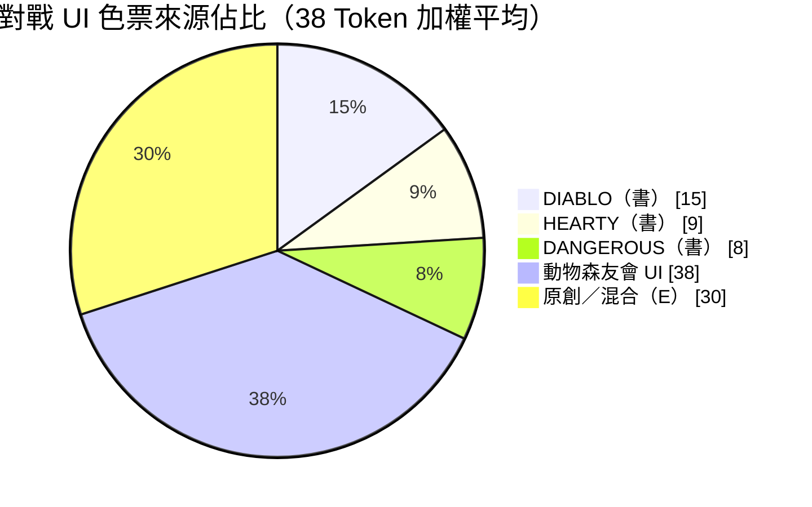
```mermaid
pie showData
    title 對戰 UI 色票來源佔比（38 Token 加權平均）
    "DIABLO（書）" : 15
    "HEARTY（書）" : 9
    "DANGEROUS（書）" : 8
    "動物森友會 UI" : 38
    "原創／混合（E）" : 30
```

###### 圓餅圖：外部參考 vs 原創

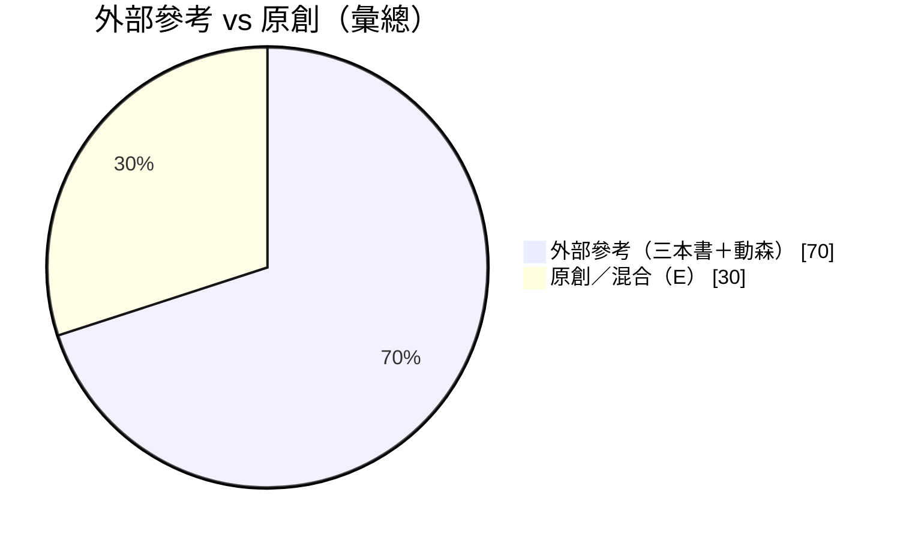
```mermaid
pie showData
    title 外部參考 vs 原創（彙總）
    "外部參考（三本書＋動森）" : 70
    "原創／混合（E）" : 30
```

| 彙總類別 | 佔比 | 說明 |
|----------|------|------|
| **三本書合計**（A+B+C） | **32%** | 結構、紙感、敵我語意之「書法」基礎 |
| **動物森友會 UI**（D） | **38%** | 練習場性格主來源（A 克制後） |
| **原創／混合**（E） | **30%** | 可讀性、狀態色、專案銜接、運算色 |
| **外部參考合計**（A+B+C+D） | **70%** | 皆有可追蹤之書稿或動森對照 |
| **原創合計**（E） | **30%** | 仍受學院場景與 WCAG 可讀性約束 |

###### 長條圖：五類來源佔比

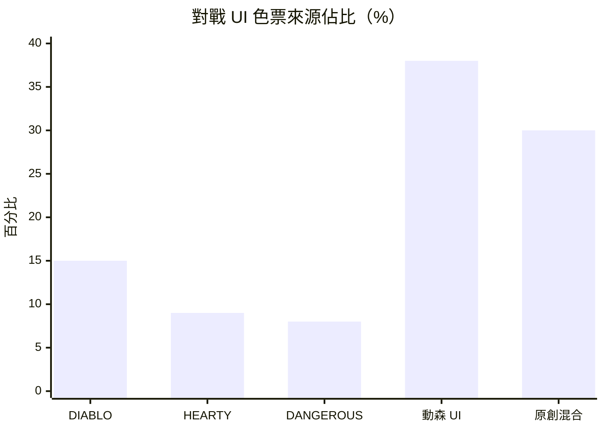
```mermaid
xychart-beta
    title "對戰 UI 色票來源佔比（%）"
    x-axis ["DIABLO", "HEARTY", "DANGEROUS", "動森 UI", "原創混合"]
    y-axis "百分比" 0 --> 40
    bar [15, 9, 8, 38, 30]
```

###### 長條圖：三本書 vs 動森 vs 原創（三欄）

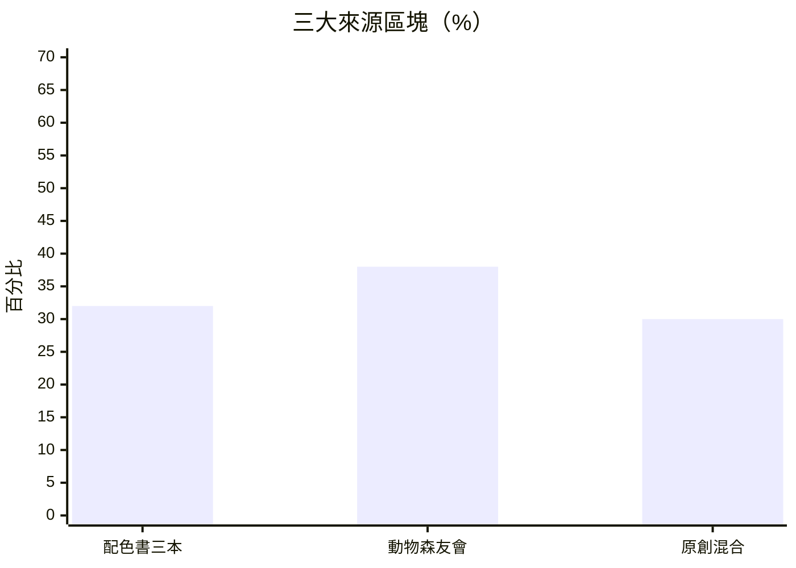
```mermaid
xychart-beta
    title "三大來源區塊（%）"
    x-axis ["配色書三本", "動物森友會", "原創混合"]
    y-axis "百分比" 0 --> 70
    bar [32, 38, 30]
```

> 若 Markdown 預覽不支援 `xychart-beta`，請以 **§2.5 表格** 與 **圓餅圖** 為準；或於 [Mermaid Live Editor](https://mermaid.live) 貼上程式碼檢視。

---

##### 2.6 各 Design Token 來源加權明細表

| 代號 | DIABLO | HEARTY | DANGEROUS | 動森 | 原創／混合 | 主要書稿／動森錨點 |
|------|--------|--------|-----------|------|------------|-------------------|
| INK | — | — | — | 100% | — | 巧克力字 |
| INK_SOFT | — | — | 100% | — | — | 陰森 19 |
| INK_MUTED | — | — | — | — | 100% | 除錯 meta |
| PANEL_CREAM | — | — | — | 100% | — | Nook 奶油 |
| PANEL_MILK | — | 30% | — | 70% | — | 動森米白 + 爽快 2 |
| PANEL_EDGE | 30% | — | 20% | 30% | 20% | 混合描邊 |
| BTN_PRIMARY | 40% | — | — | 60% | — | 機械 10 + 軟木褐 |
| BTN_PRIMARY_H | — | — | — | 20% | 80% | 提亮運算 |
| BTN_PRIMARY_P | 70% | — | — | — | 30% | 機械 10 加深 |
| BTN_PRIMARY_TEXT | — | — | — | 100% | — | 對話米白 |
| BTN_SECONDARY | 50% | — | — | 50% | — | 機械 7 + 天空藍 |
| BTN_SECONDARY_H | 15% | — | — | 15% | 70% | Hover 運算 |
| BTN_SECONDARY_P | 30% | — | — | — | 70% | Pressed 運算 |
| BTN_SECONDARY_TEXT | — | — | — | 40% | 60% | 冷色淺字 |
| BTN_DISABLED_BG | — | — | — | 100% | — | 同 PANEL_CREAM |
| BTN_DISABLED_TEXT | — | — | — | — | 100% | 同 INK_MUTED |
| ALLY_HP | — | — | — | 80% | 20% | 按鈕綠壓暗 |
| ALLY_LABEL | — | 100% | — | — | — | 純真 7 |
| FOE_HP | — | — | 50% | 30% | 20% | 危險 11 暖化 |
| FOE_LABEL | — | — | — | 100% | — | 珊瑚褐 |
| OUTLINE_HP | — | — | 40% | — | 60% | 陰森 19 + α |
| TURN_BG | — | — | 20% | — | 80% | 暖灰褐自訂 |
| TURN_PLAYER | — | 15% | — | 85% | — | 鈴金 + 爽快 1 |
| TURN_ENEMY | — | — | — | 100% | — | 珊瑚褐 |
| TURN_BANNER_TEXT | — | — | — | 100% | — | 對話米白 |
| BELL_GOLD | — | 15% | — | 85% | — | 鈴金 |
| DECK_TOP | 50% | — | — | 50% | — | 金屬 3 + 天空藍 |
| DECK_SHADOW | 90% | — | — | — | 10% | 龐克 15 |
| DIM | 100% | — | — | — | — | 頹廢 20（α 自訂） |
| DIM_HEAVY | 85% | — | — | — | 15% | 頹廢 20（α 自訂） |
| DEBUG_PANEL_BG | — | — | 30% | — | 70% | 除錯深褐 |
| SHADOW_UI | — | — | — | — | 100% | 通用陰影 |
| TOAST_MINT | — | 90% | — | 10% | — | 純真 8 |
| AI_HINT_GOLD | — | 85% | — | 15% | — | 爽快 1 |
| WARN_GOLD | — | 10% | — | 90% | — | 鈴金 |
| HURT_FLASH | — | — | 50% | — | 50% | 昏暗 8 語意 + 自訂 |
| VIGNETTE | — | — | — | — | 100% | 受傷暗角 |
| HALL_WINE | — | — | — | — | 100% | 專案大廳 `SceneLoader` |

**加權平均驗算**（38 Token）：DIABLO **15%** · HEARTY **9%** · DANGEROUS **8%** · 動森 **38%** · 原創 **30%**（合計 100%）。

---

#### 3. 色票代號定義（Design Tokens）

##### 3.1 主色票一覽

| 代號 | 名稱 | Hex | RGB | Unity `Color` (R,G,B,A) | 來源／語意 |
|------|------|-----|-----|------------------------|------------|
| **INK** | 巧克力字 | `#5C4033` | 92, 64, 51 | `(0.361, 0.251, 0.200, 1)` | 森友會主文字 |
| **INK_SOFT** | 軟墨字 | `#493F3B` | 73, 63, 59 | `(0.286, 0.247, 0.231, 1)` | 書 DANGEROUS 陰森 19、副文 |
| **INK_MUTED** | 淡墨字 | `#6B5F58` | 107, 95, 88 | `(0.420, 0.373, 0.345, 1)` | 除錯 meta；**§1.2-C 不實作** |
| **PANEL_CREAM** | Nook 奶油面板 | `#F5E6C8` | 245, 230, 200 | `(0.961, 0.902, 0.784, 1)` | 森友會面板底 |
| **PANEL_MILK** | 對話框米白 | `#FFF8E7` | 255, 248, 231 | `(1.000, 0.973, 0.906, 1)` | 天氣卡、開場骰子卡（可選更亮面板） |
| **PANEL_EDGE** | 軟木描邊 | `#8B7355` | 139, 115, 85 | `(0.545, 0.451, 0.333, 1)` | Outline／分隔線（常用 **40% alpha**） |
| **BTN_PRIMARY** | 軟木褐主按鈕 | `#9A7A55` | 154, 122, 85 | `(0.604, 0.478, 0.333, 1)` | 森軟木 + DIABLO 機械 10 |
| **BTN_PRIMARY_H** | 主按鈕 Hover | `#AE8E66` | 174, 142, 102 | `(0.682, 0.557, 0.400, 1)` | 略提亮 |
| **BTN_PRIMARY_P** | 主按鈕 Pressed | `#6F5A3A` | 111, 90, 58 | `(0.435, 0.353, 0.227, 1)` | DIABLO 加深 |
| **BTN_PRIMARY_TEXT** | 主按鈕字 | `#FFF8E7` | 255, 248, 231 | `(1.000, 0.973, 0.906, 1)` | 森對話框米白 |
| **BTN_SECONDARY** | 天空灰藍次按鈕 | `#5A7A8F` | 90, 122, 143 | `(0.353, 0.478, 0.561, 1)` | 森 + DIABLO 7 |
| **BTN_SECONDARY_H** | 次按鈕 Hover | `#6B8FA3` | 107, 143, 163 | `(0.420, 0.561, 0.639, 1)` | |
| **BTN_SECONDARY_P** | 次按鈕 Pressed | `#465F6F` | 70, 95, 111 | `(0.275, 0.373, 0.435, 1)` | |
| **BTN_SECONDARY_TEXT** | 次按鈕字 | `#E8F2F6` | 232, 242, 246 | `(0.910, 0.949, 0.965, 1)` | |
| **BTN_DISABLED_BG** | 停用按鈕底 | `#F5E6C8` | 245, 230, 200 | `(0.961, 0.902, 0.784, 0.5)` | alpha **0.5** |
| **BTN_DISABLED_TEXT** | 停用按鈕字 | `#6B5F58` | 107, 95, 88 | `(0.420, 0.373, 0.345, 0.7)` | alpha **0.7** |
| **ALLY_HP** | 我方 HP 數字 | `#5F8F72` | 95, 143, 114 | `(0.373, 0.561, 0.447, 1)` | 森綠壓暗（非 `#88C9A0`） |
| **ALLY_LABEL** | 我方標籤 | `#A8CEC6` | 168, 206, 198 | `(0.659, 0.808, 0.776, 1)` | 森／HEARTY 7 |
| **FOE_HP** | 敵方 HP 數字 | `#B8846E` | 184, 132, 110 | `(0.722, 0.518, 0.431, 1)` | 參考 DANGEROUS 11 + 暖化（§2.2） |
| **FOE_LABEL** | 敵方標籤 | `#E0AA90` | 224, 170, 144 | `(0.878, 0.667, 0.565, 1)` | 森珊瑚褐 |
| **OUTLINE_HP** | HP 描邊 | `#382624` | 56, 38, 36 | `(0.220, 0.149, 0.141, 0.55)` | alpha **0.55**，取代純黑 92% |
| **TURN_BG** | 回合橫幅底 | `#3D3835` | 61, 56, 53 | `(0.239, 0.220, 0.208, 0.85)` | alpha **0.85** |
| **TURN_PLAYER** | 你的回合字 | `#F8D878` | 248, 216, 120 | `(0.973, 0.847, 0.471, 1)` | 森鈴錢金 |
| **TURN_ENEMY** | 敵方操作字 | `#E0AA90` | 224, 170, 144 | `(0.878, 0.667, 0.565, 1)` | 同 FOE_LABEL |
| **TURN_BANNER_TEXT** | 橫幅預設字 | `#FFF8E7` | 255, 248, 231 | `(1.000, 0.973, 0.906, 1)` | 橫幅靜態底字（若需） |
| **BELL_GOLD** | 鈴錢金強調 | `#F8D878` | 248, 216, 120 | `(0.973, 0.847, 0.471, 1)` | 回合橫幅、開場先手（§1.3） |
| **DECK_TOP** | 牌堆上層 | `#4A6B7C` | 74, 107, 124 | `(0.290, 0.420, 0.486, 1)` | 森藍灰 + DIABLO 3 |
| **DECK_SHADOW** | 牌堆下層 | `#2E3542` | 46, 53, 66 | `(0.180, 0.208, 0.259, 0.92)` | 書 DIABLO 龐克 15 |
| **DIM** | 全螢幕遮罩 | `#0A0305` | 10, 3, 5 | `(0.039, 0.012, 0.020, 0.50)` | alpha **0.50**；暫停／天氣預報 |
| **DIM_HEAVY** | 深遮罩 | `#0A0305` | 10, 3, 5 | `(0.039, 0.012, 0.020, 0.66)` | 結算凍結、戰報對話 |
| **DEBUG_PANEL_BG** | 除錯面板底 | `#322C26` | 50, 44, 38 | `(0.196, 0.173, 0.149, 0.85)` | **§1.2-C 不實作**（保留定義供日後） |
| **SHADOW_UI** | UI 陰影 | `#000000` | 0, 0, 0 | `(0, 0, 0, 0.45)` | Shadow effectColor |
| **TOAST_MINT** | Toast／提示 | `#D2E5E5` | 210, 229, 229 | `(0.824, 0.898, 0.898, 1)` | **§1.2-C 不實作** |
| **AI_HINT_GOLD** | AI 量化提示 | `#E8BB6A` | 232, 187, 106 | `(0.910, 0.733, 0.416, 1)` | **§1.2-C 不實作** |
| **WARN_GOLD** | 鈴錢金強調 | `#F8D878` | 248, 216, 120 | `(0.973, 0.847, 0.471, 1)` | 開場先手、戰報標題強調（非除錯 `BattleResultText`） |
| **HURT_FLASH** | 受傷閃爍 | `#C07060` | 192, 112, 96 | `(0.753, 0.439, 0.376, 1)` | **§1.2-B 不實作**（語意參考） |
| **VIGNETTE** | 受傷暗角 | `#000000` | 0, 0, 0 | `(0, 0, 0, 0.75)` | **§1.2-B 不實作** |
| **HALL_WINE** | 大廳酒紅按鈕 | `#714847` | 113, 72, 71 | `(0.443, 0.282, 0.247, 0.96)` | 結算關閉、戰報（與 Buildbeck 一致） |

##### 3.2 TMP Rich Text 用 Hex（程式內嵌字串）

**§1 範圍內**（實作）：

| 用途 | Rich Text |
|------|-----------|
| 我方英雄標籤（`RefreshHeroHpHud`） | `<color=#A8CEC6>我方英雄</color>` |
| 敵方英雄標籤 | `<color=#E0AA90>敵方英雄</color>` |

**§1.2 範圍外**（本規格不修改）：`fieldText` Toast／AI 行等除錯用色。

##### 3.3 面板底色選用（`PANEL_CREAM` vs `PANEL_MILK`）

| 用途 | 定案 Token |
|------|------------|
| 大張說明／預報卡、戰報對話、開場骰子面板 | `PANEL_MILK` |
| 暫停卡、結算 `EndBattlePanel`、棄牌提示、進行中天氣側欄 | `PANEL_CREAM` |

---

#### 4. UI 元件配色總表（實作對照）

> **僅列 §1.3 範圍內元件**（共 **63** 列）。除錯／卡牌／特效見 §1.2，不在此表實作。  
> **欄位**：元件 → 屬性 → 色票（§3）→ Hex  

| # | 分類 | 元件 | 屬性 | 色票 | Hex | 備註 |
|---|------|------|------|------|-----|------|
| **英雄 HP HUD** |
| 1 | 英雄 | `EnemyHeroHpHud` | TMP 主體（數字 `<b>`） | FOE_HP | `#B8846E` | `enemyHeroHpText.color` |
| 2 | 英雄 | `EnemyHeroHpHud` | Rich Text「敵方英雄」 | FOE_LABEL | `#E0AA90` | 見 §3.2 |
| 3 | 英雄 | `EnemyHeroHpHud` | Outline | OUTLINE_HP | `#382624` @55% | `effectDistance` 建議 `(2, -2)` |
| 4 | 英雄 | `PlayerHeroHpHud` | TMP 主體（數字） | ALLY_HP | `#5F8F72` | `playerHeroHpText.color` |
| 5 | 英雄 | `PlayerHeroHpHud` | Rich Text「我方英雄」 | ALLY_LABEL | `#A8CEC6` | |
| 6 | 英雄 | `PlayerHeroHpHud` | Outline | OUTLINE_HP | `#382624` @55% | |
| **回合橫幅** |
| 7 | 回合 | `BattleTurnBanner` | Image 底 | TURN_BG | `#3D3835` @85% | `bg.color` |
| 8 | 回合 | `BattleTurnBanner` | Shadow | SHADOW_UI | `#000` @45% | |
| 9 | 回合 | `TurnBannerText` | 預設／靜態 | TURN_BANNER_TEXT | `#FFF8E7` | 建立時 |
| 10 | 回合 | `TurnBannerText` | 你的回合 | TURN_PLAYER | `#F8D878` | `ShowTurnBanner(PlayerTurn)` |
| 11 | 回合 | `TurnBannerText` | 敵方操作中 | TURN_ENEMY | `#E0AA90` | `ShowTurnBanner(EnemyTurn)` |
| 12 | 回合 | `TurnBannerText` | Outline | OUTLINE_HP | `#382624` @55% | |
| **主操作按鈕** |
| 13 | 按鈕 | `結束回合`（場景） | Image 底 | BTN_PRIMARY | `#9A7A55` | `BattleSimulation.unity` + `sceneEndTurnButton` |
| 14 | 按鈕 | `結束回合` | Label TMP/Text | BTN_PRIMARY_TEXT | `#FFF8E7` | 子物件 Label |
| 15 | 按鈕 | `結束回合` | ColorBlock Normal | BTN_PRIMARY | | |
| 16 | 按鈕 | `結束回合` | Highlighted | BTN_PRIMARY_H | | |
| 17 | 按鈕 | `結束回合` | Pressed | BTN_PRIMARY_P | | |
| 18 | 按鈕 | `結束回合` | Disabled | BTN_DISABLED_BG / TEXT | | |
| 19 | 按鈕 | `QuickEndTurnButton`（fallback） | 同 #13–18 | 同上 | | `CreateButton` 若場景無按鈕 |
| 20 | 按鈕 | `PauseToggleButton` | Image 底 | BTN_SECONDARY | `#5A7A8F` | `CreatePauseUI` |
| 21 | 按鈕 | `PauseToggleButton` | Label | BTN_SECONDARY_TEXT | `#E8F2F6` | Legacy `Text` |
| 22 | 按鈕 | `ActiveWeatherEffectButton` | 同 #20–21 | BTN_SECONDARY | | 顯示時；TMP 標籤同色 |
| 23 | 按鈕 | `CreateButton`（範圍內） | 依 name 分流 | 主／次 | | `EndTurn`／`結束`／`Resume`→Primary；Pause／場地效果→Secondary |
| **暫停選單** |
| 24 | 暫停 | `PausePanel` | Image 遮罩 | DIM | `#0A0305` @50% | |
| 25 | 暫停 | `PauseCard` | Image 底 | PANEL_CREAM | `#F5E6C8` @96% | |
| 26 | 暫停 | `PauseTitle` | TMP | INK | `#5C4033` | |
| 27 | 暫停 | `ResumeButton` | Image | BTN_PRIMARY | | |
| 28 | 暫停 | `ResumeButton` | Label | BTN_PRIMARY_TEXT | | |
| 29 | 暫停 | `PauseRestartButton` | Image | BTN_SECONDARY | | |
| 30 | 暫停 | `PauseGiveUpButton` | Image | BTN_SECONDARY | | |
| 31 | 暫停 | Restart / Give up | Label | BTN_SECONDARY_TEXT | | |
| **牌庫視覺** |
| 32 | 牌堆 | `PlayerDeckPile` / `EnemyDeckPile` `PileLayer_2` | Image | DECK_TOP | `#4A6B7C` | 最上層 |
| 33 | 牌堆 | `PileLayer_0/1` | Image | DECK_SHADOW | `#2E3542` @92% | |
| **開場骰子** |
| 34 | 開場 | `OpeningRollPanel` | Image 底 | PANEL_MILK | `#FFF8E7` | §3.3 |
| 35 | 開場 | `OpeningRollDiceText` | TMP | INK | `#5C4033` | |
| 36 | 開場 | `OpeningRollFirstText` | TMP | BELL_GOLD | `#F8D878` | 先手提示 |
| **天氣** |
| 37 | 天氣 | `WeatherForecastOverlay` | Image 遮罩 | DIM | `#0A0305` @50% | |
| 38 | 天氣 | `WeatherForecastCard` | Image 底 | PANEL_MILK | `#FFF8E7` @98.5% | |
| 39 | 天氣 | `WeatherForecastTitle` | TMP | INK | `#5C4033` | |
| 40 | 天氣 | `WeatherForecastBody` | TMP | INK_SOFT | `#493F3B` | |
| 41 | 天氣 | `ActiveWeatherEffectPanel` | Image 底 | PANEL_CREAM | `#F5E6C8` @96% | |
| 42 | 天氣 | `ActiveWeatherEffectPanel` | Outline | PANEL_EDGE | `#8B7355` @35% | |
| 43 | 天氣 | `ActiveWeatherDivider` | Image | PANEL_EDGE | `#8B7355` @35% | |
| 44 | 天氣 | `ActiveWeatherSummaryText` | TMP | INK_SOFT | `#493F3B` | |
| 45 | 天氣 | `ActiveWeatherEffectPanelText` | TMP | INK_SOFT | `#493F3B` | |
| **棄牌流程 UI（非手牌本體）** |
| 46 | 棄牌 | `DiscardDropZone` | Image 底 | BTN_PRIMARY_P | `#6F5A3A` @90% | 左側棄牌區 |
| 47 | 棄牌 | `DiscardDropZone` Label | TMP | BTN_PRIMARY_TEXT | `#FFF8E7` | |
| 48 | 棄牌 | `DiscardPromptPanel` | Image | PANEL_CREAM | `#F5E6C8` @96% | |
| 49 | 棄牌 | `DiscardPromptPanel` Text | TMP | INK | `#5C4033` | |
| 50 | 棄牌 | `EnemyDiscardToast` | Image 底 | PANEL_CREAM | `#F5E6C8` @96% | 不含 mount 內卡牌 |
| 51 | 棄牌 | `EnemyDiscardToast` Title | TMP | INK | `#5C4033` | |
| 52 | 棄牌 | `EnemyDiscardToast` Meta / Skill | TMP | INK_SOFT | `#493F3B` | |
| **結算／戰報** |
| 53 | 結算 | `EndBattlePanel` | Image 底 | PANEL_CREAM | `#F5E6C8` @96% | |
| 54 | 結算 | `EndBattleTitleText` | Text | INK | `#5C4033` | Victory／Defeat 等 |
| 55 | 結算 | `BattleHistoryButton` 等三鈕 | Image | HALL_WINE | `#714847` @96% | `CreateEndBattleButton` |
| 56 | 結算 | 三鈕 Label | Text | BTN_PRIMARY_TEXT | `#FFF8E7` | |
| 57 | 結算 | `SettlementFreeze` dim | Image | DIM_HEAVY | `#0A0305` @66% | |
| 58 | 結算 | 戰報 `rootDim` | Image | DIM_HEAVY | | |
| 59 | 結算 | 戰報 `dlgBg` | Image | PANEL_MILK | `#FFF8E7` | |
| 60 | 結算 | 戰報 `titleTmp` | TMP | INK | `#5C4033` | |
| 61 | 結算 | 戰報 `closeBtn` | Image | HALL_WINE | `#714847` @96% | |
| 62 | 結算 | 戰報 `closeTxt` | TMP/Text | BTN_PRIMARY_TEXT | `#FFF8E7` | |
| 63 | 結算 | 戰報 scroll 底 | Image | `PANEL_SCROLL` | `#E0D4C4` | `PANEL_CREAM`×0.92；建議實作時升格 Token |
| 64 | 結算 | 戰報歷史行 TMP | TMP | INK_SOFT | `#493F3B` | 內文預設色 |
| 65 | 結算 | 戰報天氣行底 | Image | HALL_WINE | `#714847` @28% | |

---

#### 5. 依腳本檔案之修改索引（僅 §1.3 範圍）

| 檔案 | 主要方法／區塊 | 對應 §4 列 # | 備註 |
|------|----------------|-------------|------|
| `BattleSimulationDebugUI.cs` | `CreateHeroHpHud`, `RefreshHeroHpHud` | 1–6 | |
| | `CreateBattleTurnBanner`, `ShowTurnBanner` | 7–12 | |
| | `CreateButton`, `BindSceneEndTurnButton` | 13–23 | **勿**改 `CloseDebugPanelButton` |
| | `CreatePauseUI` | 24–31 | |
| | `CreateDeckPileVisual` | 32–33 | |
| | `OpeningRollPanel` 區塊 | 34–36 | 骰子 **點陣** Image 屬 §1.2-B，可不改 |
| | `WeatherForecastOverlay`, `ActiveWeatherEffectPanel` | 37–45 | |
| `BattleSimulationDebugUI.Settlement.cs` | `EnsureEndBattlePanel`, `CreateEndBattleButton` | 53–56 | |
| | `EnsureBattleHistoryOverlay`, `BuildBattleHistoryRows` | 57–65 | 歷史 Rich 語意色另見 §6 備註 |
| `BattleSimulationDebugUI.Discard.cs` | `EnsureDiscardSelectionUi` | 46–49 | |
| `BattleSimulationDebugUI.DiscardPopup.cs` | `EnsureEnemyDiscardToastUi` | 50–52 | |
| `Assets/Scenes/BattleSimulation.unity` | `結束回合` Button | 13–18 | |
| **不修改** | `CreateDebugPanel` 全區 | — | §1.2-C |
| **不修改** | `BattleAutoSimPlugin` | — | §1.2-C |
| **不修改** | `PlayerHand` / `FieldCards` / `BattleHandDiscardDrag` | — | §1.2-A |
| **不修改** | `CreateWeatherScreenFx`、受傷 Vignette／Flash | — | §1.2-B |

---

#### 6. 實作備註（定案共識）

1. **集中常數**：`static class BattleUiColors`（或 partial）僅供 **§1.3** 元件引用 §3 代號。  
2. **`CreateButton` 分流**（範圍內）：`EndTurn`／`結束`／`Resume` → Primary；`Pause`／`場地效果` → Secondary；**除錯 Close 鈕不在此列**。  
3. **禁止使用**（範圍內）：大面積純白按鈕、螢光紅 HP、高飽和成功綠回合字、DANGEROUS 血紅作主色。  
4. **質感（Phase 2）**：圓角、`PANEL_EDGE` 描邊、按鈕陰影；Phase 1 只做顏色。  
5. **戰報 Rich 語意色**：`FormatBattleHistoryRichText` 內怪物／法術／傷害／治療／勝敗五色**尚未**納入本規格 Token；實作 v1 可維持現行 hex，或另開 §3.4 擴充。  
6. **驗收**（關閉除錯面板下）：英雄 HP、回合橫幅、結束回合、Pause、牌堆、暫停、天氣 UI、棄牌提示、結算／戰報；確認**手牌／場牌／FX 顏色與改版前相同**。  

---

#### 7. 版本紀錄

| 日期 | 版本 | 說明 |
|------|------|------|
| 2026-05-16 | 1.0 | 初版：融合書稿 + 森友會 A 克制；§4 總表 79 列 |
| 2026-05-16 | 1.1 | 新增 §2：三本書／動森對照表、38 Token 加權量化、圓餅圖／長條圖 |
| 2026-05-16 | 1.2 | §1 重訂：明確排除卡牌區、特效、除錯／批次模擬；§4 縮為 65 列實作範圍 |
| 2026-05-16 | 1.2.1 | 新增 §8 列印說明；`tools/Export-BattleUiColorSpecPrint.ps1` → `Docs/BATTLE_UI_COLOR_SPEC.print.html` |
| 2026-05-16 | 1.2.2 | §1.2-B 交叉引用姊妹文件 **`BATTLE_FX_COLOR_SPEC.md`**（特效配色） |

---

#### 8. 列印本規格書

##### 方式 A：瀏覽器列印（建議，含完整表格）

1. 在專案根目錄以 PowerShell 執行：
   ```powershell
   .\tools\Export-BattleUiColorSpecPrint.ps1
   ```
2. 開啟產生的 `Docs\BATTLE_UI_COLOR_SPEC.print.html`（雙擊或用 Chrome / Edge）。
3. `Ctrl+P` → 目的地選印表機或 **另存為 PDF**。
4. 建議：**A4**、直向、邊界預設；勾選 **背景圖形**（表格底色較完整）。
5. §2 的 Mermaid 圖在列印版會改為**數字表格**（內容同 §2.5）。

##### 方式 B：Cursor / VS Code 預覽

1. 開啟 `BATTLE_UI_COLOR_SPEC.md` → `Ctrl+Shift+V` 預覽。
2. `Ctrl+P` 列印。  
   **注意**：Mermaid 圖表可能無法顯示；§4 大表可能換頁較難讀 → 優先用法 A。

##### 方式 C：另存 PDF 後列印

用法 A 步驟 3 選「Microsoft Print to PDF」或「另存 PDF」，再將 PDF 送去列印或裝訂。

---

*確認本文件後，下一階段依 §5 索引進行程式與 `BattleSimulation.unity` 實作（**不含** §1.2）。*

## 5.2　對戰 FX 配色規格

<div class="source-note">來源文件：<code>BATTLE_FX_COLOR_SPEC.md</code></div>

### 對戰場景特效配色規格（Battle Simulation FX）

| 項目 | 內容 |
|------|------|
| **狀態** | 已定案；**§3～§4** 所列 FX 均已實作（`BattleFxColors.cs`） |
| **場景** | `BattleSimulation`（`BattleSimulationDebugUI` 動態建立之全螢幕／暫態視覺） |
| **世界觀** | 學院魔法訓練廳（練習場對戰）— 與 `BATTLE_UI_COLOR_SPEC.md` 一致 |
| **關聯文件** | [`BATTLE_UI_COLOR_SPEC.md`](BATTLE_UI_COLOR_SPEC.md)（UI chrome，**已實作**） |
| **目標感受** | 特效「住在」暖木訓練廳裡：可感知魔法與天氣，但**不搶**背景、**不**像恐怖副本或霓虹街機 |
| **實作參考** | `BattleWeatherLabels.cs`、`BattleFxColors.cs`、`BattleSimulationDebugUI.cs`（`CreateWeatherScreenFx`） |

---

#### 1. 範圍說明

##### 1.1 為何另立特效規格

UI 規格（§1.2-B）刻意**排除**特效，以避免與面板改版互相牽制。實作 UI 後，全螢幕天氣 tint、純黑受傷暗角、螢光紅傷害閃光等**仍沿用舊調性**，與訓練廳暖背景與奶油 UI **色溫不一致**，造成「出戲」。

本規格專責：**動態、半透明、全螢幕或短暫覆蓋層**的配色與 alpha 預算。

##### 1.2 背景錨點（與美術的關係）

| 項目 | 定案 |
|------|------|
| **場景背景 Sprite** | `戰鬥背景` 等美術資產**不在**本規格改色範圍 |
| **色溫錨點** | 以場景實際感受為準：**暖褐木質訓練廳、中低對比、偏黃環境光** |
| **程式錨點** | 特效 tint／暗角／閃光應向 UI 已採用之 **`DIM`（`#0A0305`）**、**`PANEL_MILK`**、**`DECK_TOP`**、**`BELL_GOLD`** 族靠拢，**禁止**預設 `RGB(0,0,0)` 或 `RGB(255,0,0)` 作大面積主色 |

##### 1.3 本次包含（在範圍內）

| 類別 | 代表元件／方法 |
|------|----------------|
| **天氣全螢幕 FX** | `CreateWeatherScreenFx`、`CreateWeatherFxLayer`、`CreateHolyLightEdge`、`AddFogEdgeLayer`、`AddGaleNightLayer` 與各層粒子 Image |
| **英雄受傷回饋** | `EnsureHeroDamageMonochromeFlashOverlay`、`CoPlayHeroDamageMonochromeFlash`、`PlayDamageFlash`、`CoPlayPlayerHeroDamagedFeedback`、結算 `hurtColor` lerp |
| **法術演出遮罩** | `EnsureSpellCastOverlay` 全螢幕 dim（**面板字色**仍依 UI 規格，dim 屬 FX） |
| **開場骰子裝飾** | `CreateDicePipGrid`（點陣與骰面；**不含** `OpeningRollPanel` 面板底—屬 UI 規格） |
| **抽牌飛行** | `PlayDrawAnimationOnRight` 牌背幽靈 `Image` |
| **治療浮字** | 英雄治療 `+N` 浮動 TMP |
| **敵方凝視演出** | `GazeGlare`、眼球相關動態色（`BattleSimulationDebugUI` 內 gaze 區塊） |
| **場上戰鬥回饋（FX 層）** | `PlayDamageFlash` 用於場牌／英雄；**場牌 HP 數字變色**見 §1.4 |

##### 1.4 邊界：與「卡牌區」的切分

| 項目 | 歸本規格 | 歸 UI 規格 | 備註 |
|------|----------|------------|------|
| 手牌／場牌 **本體** 美術、邊框、稀有度 | — | §1.2-A | 不改卡面插圖 |
| 場牌 **選取光暈**（`FieldCards.cs` halo） | **是** | — | 屬互動 FX，非靜態卡面 |
| 場牌 **HP 受傷數字色** | **是**（語意色） | — | 僅數字／閃爍，不改卡框 |
| 手牌 **長按棄牌 Fill** | — | §1.2-A | |
| `SpellCastPanel` 奶油底與標題字 | — | §1.3 | 面板 chrome 已用 `BattleUiColors` |
| `SpellCastOverlay` **全螢幕 dim** | **是** | — | 目前純黑，需改 |

##### 1.5 明確排除（不適用本規格）

| 排除項目 | 說明 |
|----------|------|
| UI chrome | `BATTLE_UI_COLOR_SPEC.md` §1.3 已全部涵蓋 |
| 除錯／批次模擬 | `DebugBattlePanel`、`BattleAutoSimPlugin`、`fieldText` Rich 色 |
| 卡牌 prefab 預設 | `CardDisplay`、`battleCardPrefab` 靜態配色 |
| 場景背景圖 | 訓練廳 Sprite 本體 |
| 物理粒子系統 | 若未來改用 ParticleSystem，另開附錄 |

---

#### 2. 設計原則（訓練廳融合）

##### 2.1 三條硬規則

1. **暖色暗部取代純黑**  
   全螢幕暗角、受傷 vignette、法術 dim 使用 **`VIGNETTE_WARM` / `FX_DIM`**（基於 `#0A0305` 或 `#3D3835`），**不**使用 `alpha ≥ 0.75` 的 `(0,0,0)` 大面積色塊。

2. **低飽和、低 alpha 的天氣底**  
   全螢幕 weather base tint 維持 **α 0.03～0.11**；粒子／邊緣在 **α 0.08～0.22** 區間，**禁止**回到高飽和霓虹（現行火雨橘 `RGB(255,92,66)`、冷霧 `RGB(97,158,204)` 等）。

3. **傷害語意用「赭／珊瑚」不用「血紅」**  
   沿用 UI 規格 **`HURT_FLASH` `#C07060`** 與 **`FOE_HP` 語意**；**禁止** `RGB(255,38,38)`、`RGB(255,15,15)` 作 0.9 alpha 覆蓋層。

##### 2.2 與 UI 色票共享

| 用途 | 優先引用 |
|------|----------|
| 奶油／金光 | `PANEL_MILK`、`BELL_GOLD`（`BattleUiColors`） |
| 我方／治療 | `ALLY_HP`、`ALLY_LABEL` |
| 敵方／警示語意 | `FOE_HP`、`FOE_LABEL`、`HURT_FLASH` |
| 冷色天氣／水霧 | `DECK_TOP`、`BTN_SECONDARY`、`BTN_SECONDARY_TEXT` |
| 深影／夜風 | `DECK_SHADOW`、`TURN_BG` |
| 全螢幕遮罩 | `DIM`、`DIM_HEAVY` |

程式實作時：`BattleFxColors` **可讀取** `BattleUiColors` 常數，僅為 FX 定義 **alpha 變體** 與 **混合色**，避免重複 hex。

##### 2.3 天氣與 UI 的語意對齊

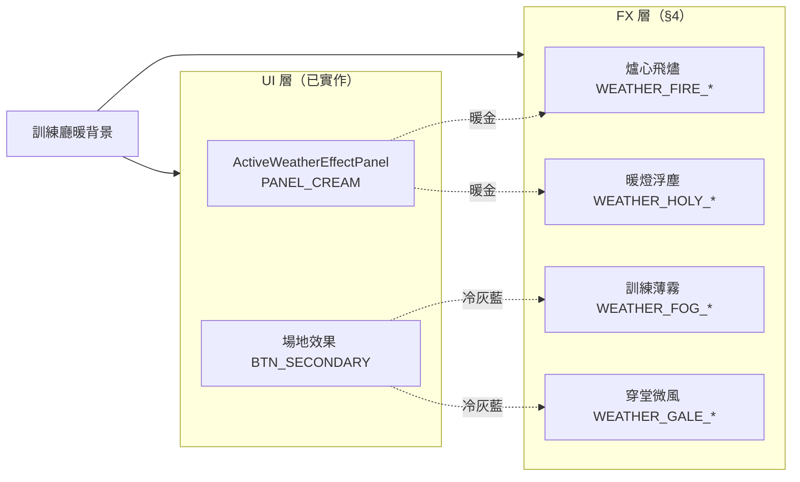
```mermaid
flowchart LR
  subgraph UI["UI 層（已實作）"]
    WPanel["ActiveWeatherEffectPanel\nPANEL_CREAM"]
    WBtn["場地效果 BTN_SECONDARY"]
  end
  subgraph FX["FX 層（§4）"]
    Fire["爐心飛燼 WEATHER_FIRE_*"]
    Lamp["暖燈浮塵 WEATHER_HOLY_*"]
    Mist["訓練薄霧 WEATHER_FOG_*"]
    Draft["穿堂微風 WEATHER_GALE_*"]
  end
  Bg["訓練廳暖背景"]
  Bg --> UI
  Bg --> FX
  WPanel -.暖金.-> Lamp
  WPanel -.暖金.-> Fire
  WBtn -.冷灰藍.-> Mist
  WBtn -.冷灰藍.-> Draft
```

---

#### 3. 特效 Design Tokens

> **命名**：`FX_` 前綴或 `WEATHER_` 前綴；實作類別建議 `BattleFxColors`。  
> **Unity**：表中 `Color` 為 **1.0 = 255** 之浮點 RGBA。

##### 3.1 全域／受傷／遮罩

| 代號 | 名稱 | Hex（RGB） | 典型 Alpha | 語意 | 對應 UI Token |
|------|------|------------|------------|------|----------------|
| **FX_DIM** | 特效暖遮罩 | `#0A0305` | **0.50～0.55** | 法術全螢幕 dim 底色 | `DIM` |
| **VIGNETTE_WARM** | 暖色暗角 | `#1A1412` | **0.72～0.85** | 取代純黑 vignette 邊緣 | `DIM` 提亮 |
| **VIGNETTE_WARM_SOFT** | 暖角（側） | `#2A221E` | **0.65～0.78** | 左右暗角略淺 | 原創 |
| **HURT_FLASH** | 受傷閃色 | `#C07060` | **0.35～0.55** | HP 脈衝、短閃 | UI `HURT_FLASH` |
| **HURT_FLASH_PEAK** | 受傷覆蓋峰 | `#C07060` | **0.75～0.90** | `DamageFlashOverlay` 峰值 | 同上 |
| **HURT_MONO_PEAK** | 受傷去色閃 | `#3D3835` | **0.88～0.92** | 全螢幕「頓一下」；**非**純黑 | `TURN_BG` |
| **HEAL_FLOAT** | 治療浮字 | `#5F8F72` | **1.0**（字） | `+N` 浮動字 | `ALLY_HP` |
| **HEAL_GLOW_OUTER** | 治療外光暈 | `#5F8F72` | **0.18** | 初級治療場牌 FX | `HealGlowOuter` |
| **HEAL_GLOW_INNER** | 治療內光暈 | `#5F8F72` | **0.28** | 同上 | `HealGlowInner` |
| **FX_SHADOW** | 特效軟影 | `#000000` | **0.25～0.40** | 僅小元件；**不用**於全螢幕 | 低於 `SHADOW_UI` |

##### 3.2 天氣全螢幕（base tint）

> **完整名稱、實作、色票對照表見 §4。** 下列為 Token 速查；程式 enum 仍為 `FireRain` 等，**規則不變**。

| 代號 | 室內名稱 | `BattleFxColors` 欄位 | Hex（RGB） | 程式 Base α |
|------|----------|----------------------|------------|-------------|
| **WEATHER_FIRE_BASE** | 爐心飛燼 | `WeatherFireBase` | `#E8BB6A` | **0.03** |
| **WEATHER_HOLY_BASE** | 暖燈浮塵 | `WeatherHolyBase` | `#FFF8E7`（`PANEL_MILK`） | **0.04** |
| **WEATHER_FOG_BASE** | 訓練薄霧 | `WeatherFogBase` | `#4A6B7C`（`DECK_TOP`） | **0.10** |
| **WEATHER_GALE_BASE** | 穿堂微風 | `WeatherGaleBase` | `#2E3542` | **0.09** |

##### 3.3 天氣邊緣與粒子（Token 速查）

| 代號 | 用途 | Hex（RGB） | `BattleFxColors` | α 範圍 |
|------|------|------------|------------------|--------|
| **WEATHER_FIRE_DROP** | 飛燼粒 | `#D49458` | `WeatherFireDropRgb` → `RandomFireDrop()` | 0.17～0.32 |
| **WEATHER_HOLY_EDGE** | 暖燈邊緣帶 | `#FFF8E7` | `WeatherHolyEdgeRgb` → `HolyEdge(α)` | 0.015～0.11 |
| **WEATHER_HOLY_DUST** | 浮塵粒 | `#F8D878` / `#FFF8E7` | `RandomHolyDust()`（金 82%／米 18%） | 0.04～0.095 |
| **WEATHER_FOG_EDGE** | 薄霧邊緣 | `#5A7A8F` | `WeatherFogEdgeRgb` → `FogEdge(α)` | 0.075～0.18 |
| **WEATHER_FOG_WAVE** | 霧帶 | `#4A6B7C` | `RandomFogWave()` | 0.08～0.14 |
| **WEATHER_FOG_FOAM** | 霧點 | `#E8F2F6` | `RandomFogFoam()` | 0.08～0.16 |
| **WEATHER_FOG_SILHOUETTE** | 柱影 | `#2E3542` | `WeatherFogSilhouetteRgb` | **0.16～0.26**（靜態柱） |
| **WEATHER_GALE_NIGHT** | 穿堂暗角 | `#1F2824` | `WeatherGaleNightRgb` → `GaleNightEdge(α)` | 0.08～0.16 |
| **WEATHER_GALE_PAPER** | 紙屑 | 見 §4.4 | `RandomHallDraftPaper()` | 0.16～0.38 |
| **WEATHER_GALE_WIND** | 風線 | `#E8F2F6` | `RandomGaleWind()` | 0.08～0.16 |
| ~~WEATHER_FOG_SILHOUETTE（船）~~ | — | — | **已移除** | — |
| ~~WEATHER_GALE_LEAF_*~~ | — | — | **已廢**；勿用 `RandomGaleLeaf()` | — |

##### 3.4 開場、抽牌、場上、凝視

| 代號 | 用途 | Hex | 備註 |
|------|------|-----|------|
| **DICE_FACE** | 骰面底 | `#FFF8E7` | `PANEL_MILK` |
| **DICE_PIP_OFF** | 點 off | `#8B7355` @ 0.35 | 軟木描邊色 |
| **DICE_PIP_ON** | 點 on | `#5C4033` | `INK` |
| **DRAW_GHOST_BACK** | 抽牌牌背 | `#4A6B7C` | `DECK_TOP` |
| **FIELD_HALO_OUTER** | 選取外光暈 | `#5A7A8F` | α **0.14～0.18** |
| **FIELD_HALO_INNER** | 選取內光暈 | `#A8CEC6` | α **0.20～0.26** |
| **FIELD_HALO_CORE** | 選取核心 | `#E8F2F6` | α **0.05～0.08** |
| **FIELD_HP_HURT** | 場牌 HP 受傷 | `#C07060` | 取代 `RGB(255,71,71)` |
| **GAZE_GLARE** | 凝視光暈 | `#8A7A9E` | 暖紫灰；峰值 α ≤ **0.45** |
| **GAZE_SCLERA** | 凝視眼白 | `#FFF8E7` | 峰值 α ≤ **0.96** |
| **GAZE_PUPIL** | 凝視瞳孔 | `#382624` | `OUTLINE_HP` 系 |

---

#### 4. 四種場地效果完整規格（室內訓練廳）

本節為**單一權威來源**：對外名稱、遊戲規則、視覺語意、程式實作方式、色票與元件清單。名稱常數定義於 `Assets/Scripts/BattleWeatherLabels.cs`；FX 開關比對使用 `BattleWeatherKind`（與 `BattleSimulationManager` 內 `BattleWeatherType` 順序一致）。

##### 4.0 總覽對照表

| 室內顯示名稱 | `BattleWeatherLabels` | 程式 enum / `BattleWeatherKind` | 根節點 GameObject | 遊戲規則（不變） |
|--------------|----------------------|--------------------------------|-------------------|------------------|
| **爐心飛燼** | `EmberHearth` | `FireRain` / `1` | `WeatherEmberHearthFx` | 回合結束：雙方場上怪獸各受 **5** 點傷害 |
| **暖燈浮塵** | `WarmLamplight` | `HolyLight` / `2` | `WeatherWarmLamplightFx` | 本回合所有**治療 +10** |
| **訓練薄霧** | `TrainingMist` | `Fog` / `3` | `WeatherTrainingMistFx` | 本回合**直接攻擊英雄**傷害 **−50%** |
| **穿堂微風** | `HallDraft` | `Gale` / `4` | `WeatherHallDraftFx` | 本回合**首張法術**效果 **+20%** |

**實作技術（四系共通）**

| 項目 | 定案 |
|------|------|
| 渲染方式 | **UI `Image` + `GetUnitWhiteSprite()`** 單色塊；**不使用** `ParticleSystem` |
| 建立時機 | `BattleSimulationDebugUI.CreateWeatherScreenFx()`，於對戰 UI 初始化時**建立一次** |
| 顯示開關 | 每幀 `UpdateWeatherScreenEffects()`：`battleManager.IsCurrentWeatherFxActive(BattleWeatherKind.*)` + 剩餘回合 > 0 |
| 動畫時間 | `Time.unscaledDeltaTime` / `Time.unscaledTime`（暫停時 FX 仍可動） |
| 父節點 | `WeatherScreenFxRoot`（全螢幕 `RectTransform`，`CanvasGroup.blocksRaycasts = false`） |
| 圖層結構 | 每系一個**全螢幕 tint 子層**（`CreateWeatherFxLayer`）+ 其下邊緣帶／粒子子物件 |

---

##### 4.1 爐心飛燼（`FireRain`）

###### 名稱與語意

| 項目 | 內容 |
|------|------|
| **顯示名稱** | 爐心飛燼 |
| **室內語意** | 訓練廳壁爐或暖爐餘燼，短粒、慢速飄落；**非**戶外「火雨」長條暴雨 |
| **舊戶外名稱（廢）** | 緋焰時雨 |

###### 特效實現方式

| 層級 | GameObject 前綴 | 數量 | 幾何／動畫 | 方法 |
|------|-----------------|------|------------|------|
| Base tint | `WeatherEmberHearthFx` | 1 | 全螢幕 `Image`，固定色 | `CreateWeatherFxLayer(..., WeatherFireBase)` |
| 飛燼粒 | `HearthEmber_{i}` | **22** | 短矩形 **3～7 × 10～24 px**，旋轉 ±18°；速度 **95～185**；位移 **左 0.18×、下 0.72×** 速度 + 輕微 Sin 橫擺；出界自頂部重生 | `AnimateFireRainFx(dt)` |

###### 色票

| Token | Hex（RGB） | Alpha | `BattleFxColors` | UI 對應 |
|-------|------------|-------|------------------|---------|
| **WEATHER_FIRE_BASE** | `#E8BB6A` | **0.03** | `WeatherFireBase` | 暖金薄霧 |
| **WEATHER_FIRE_DROP** | `#D49458` | **0.17～0.32**（`RandomFireDrop`）；動畫中 α 脈動約 **0.12～0.28** | `WeatherFireDropRgb` | 暖琥珀燼粒 |

---

##### 4.2 暖燈浮塵（`HolyLight`）

###### 名稱與語意

| 項目 | 內容 |
|------|------|
| **顯示名稱** | 暖燈浮塵 |
| **室內語意** | 枝形燈／暖色吊燈在畫面四邊的柔光帶 + 金米浮塵；**無**冷紫聖光塵 |
| **舊戶外名稱（廢）** | 月華聖祈 |

###### 特效實現方式

| 層級 | GameObject 前綴 | 數量 | 幾何／動畫 | 方法 |
|------|-----------------|------|------------|------|
| Base tint | `WeatherWarmLamplightFx` | 1 | 全螢幕暖白薄霧 | `WeatherHolyBase` |
| 邊緣帶 | `HolyLight*Edge*`（Outer/Mid/Inner × 四向） | **12** | 錨定四邊的細長 `Image`；α 隨 `edgePulseFactor` 脈動 | `CreateHolyLightEdge` + `AddHolyLightEdgeLayer`；`HolyEdge(α)` |
| 浮塵 | `LamplightMote_{i}` | **16** | 圓點 **4.5～10 px**；**向上**飄（13～25 px/s）+ Sin 橫擺；頂部重生；金米 shimmer + 縮放脈動 | `AnimateHolyLightFx()` |

邊緣帶預設 α（由內而外遞減）：外圈 Top **0.11**、Bottom **0.09**、左右 **0.08**；中圈 **0.06／0.05／0.043**；內圈 **0.02～0.016／0.015**。

###### 色票

| Token | Hex（RGB） | Alpha | `BattleFxColors` | UI 對應 |
|-------|------------|-------|------------------|---------|
| **WEATHER_HOLY_BASE** | `#FFF8E7` | **0.04** | `WeatherHolyBase` | `PANEL_MILK` |
| **WEATHER_HOLY_EDGE** | `#FFF8E7` | 見上表 × 脈動 **0.84～0.98** | `HolyEdge(α)` | `PANEL_MILK` |
| **WEATHER_HOLY_DUST·金** | `#F8D878` | **0.04～0.095** | `RandomHolyDust()` **82%** | `TURN_PLAYER` |
| **WEATHER_HOLY_DUST·米** | `#FFF8E7` | 同上 **18%** | 同上 | `PANEL_MILK` |
| Shimmer 疊色 | `#F8D878` | 疊加約 **14%** lerp | `WeatherHolyDustGoldRgb` | 動畫專用 |

---

##### 4.3 訓練薄霧（`Fog`）

###### 名稱與語意

| 項目 | 內容 |
|------|------|
| **顯示名稱** | 訓練薄霧 |
| **室內語意** | 薰香／練習場薄霧帶、地面柱影；**已移除**戶外海啸船隻（`weatherFogBoatRt` 恆為 `null`） |
| **舊戶外名稱（廢）** | 蒼潮夜湧 |

###### 特效實現方式

| 層級 | GameObject 前綴 | 數量 | 幾何／動畫 | 方法 |
|------|-----------------|------|------------|------|
| Base tint | `WeatherTrainingMistFx` | 1 | 全螢幕藍灰薄霧 | `WeatherFogBase` |
| 邊緣帶 | `MistTopOuter`、`MistBottomOuter`… | **7** | 四向 + 底／側內層；`FogEdge(α)` + 脈動 | `AddFogEdgeLayer`（共用 `CreateHolyLightEdge` 排版） |
| 霧帶 | `TrainingMistWisp_{i}` | **7** | 寬帶 **560～980 × 70～140 px**；**向左** 30～56 px/s + 輕微上下 Sin | `AnimateFogFx` |
| 霧點 | `TrainingMistSpeck_{i}` | **18** | 小點 **3.5～8 px**；左移 36～78 px/s | 同上 |
| 柱影 | `TrainingHallPillar_{i}` | **5** | 細柱 **12～22 × 100～180 px**，錨點底中；**靜態**（無動畫） | 建立時 `WithAlpha(WeatherFogSilhouetteRgb, 0.16～0.26)` |

底邊外層 α **0.18** 略強，模擬地面濃霧。

###### 色票

| Token | Hex（RGB） | Alpha | `BattleFxColors` | UI 對應 |
|-------|------------|-------|------------------|---------|
| **WEATHER_FOG_BASE** | `#4A6B7C` | **0.10** | `WeatherFogBase` | `DECK_TOP` |
| **WEATHER_FOG_EDGE** | `#5A7A8F` | **0.075～0.18** × 脈動 | `FogEdge(α)` | `BTN_SECONDARY` |
| **WEATHER_FOG_WAVE** | `#4A6B7C` | **0.08～0.14**（帶上動畫約 **0.05～0.13**） | `RandomFogWave()` | `DECK_TOP` |
| **WEATHER_FOG_FOAM** | `#E8F2F6` | **0.08～0.16**（動畫約 **0.05～0.15**） | `RandomFogFoam()` | `BTN_SECONDARY_TEXT` |
| **WEATHER_FOG_SILHOUETTE** | `#2E3542` | **0.16～0.26**（柱） | `WeatherFogSilhouetteRgb` | `DECK_SHADOW` 系 |

---

##### 4.4 穿堂微風（`Gale`）

###### 名稱與語意

| 項目 | 內容 |
|------|------|
| **顯示名稱** | 穿堂微風 |
| **室內語意** | 訓練廳穿堂風：迴廊暗角 + 橫向風線 + **紙屑／卷軸碎屑**；**無**戶外落葉（`RandomGaleLeaf()` 已廢止不用） |
| **舊戶外名稱（廢）** | 朔風森詠 |

###### 特效實現方式

| 層級 | GameObject 前綴 | 數量 | 幾何／動畫 | 方法 |
|------|-----------------|------|------------|------|
| Base tint | `WeatherHallDraftFx` | 1 | 全螢幕深藍灰薄暗 | `WeatherGaleBase` |
| 暗角帶 | `GaleNight*` | **8** | 四向 + 中層 + 左右 vignette；`GaleNightEdge(α)` + 脈動 | `AddGaleNightLayer` |
| 紙屑 | `HallDraftPaper_{i}` | **14** | 扁矩形 **(6～11)×1.85 × 0.5**；左移 **90～180** px/s + Sin 上下 + 旋轉 ±30° | `AnimateGaleFx` |
| 風線 | `HallDraftBreeze_{i}` | **11** | 細線 **90～170 × 2.4～4.2 px**，傾角 **−8°～6°**；左移 **130～240** px/s | 同上 |

###### 色票

| Token | Hex（RGB） | Alpha | `BattleFxColors` | 權重 |
|-------|------------|-------|------------------|------|
| **WEATHER_GALE_BASE** | `#2E3542` | **0.09** | `WeatherGaleBase` | — |
| **WEATHER_GALE_NIGHT** | `#1F2824` | **0.08～0.16** × 脈動 | `GaleNightEdge(α)` | — |
| **WEATHER_GALE_WIND** | `#E8F2F6` | **0.08～0.16** | `RandomGaleWind()` | `BTN_SECONDARY_TEXT` |
| **WEATHER_GALE_PAPER·奶** | `#FFF8E7` | **0.20～0.38** | `RandomHallDraftPaper()` | **45%** |
| **WEATHER_GALE_PAPER·奶油** | `#F5E6C8` | **0.18～0.34** | 同上 | **33%** |
| **WEATHER_GALE_PAPER·淺字** | `#FFF8E7` | **0.16～0.30** | 同上（`BtnPrimaryText`） | **22%** |

紙屑動畫中 α 約 **0.16～0.40**（Sin 脈動）。

---

##### 4.5 程式索引（維護用）

| 職責 | 檔案 | 符號 |
|------|------|------|
| 顯示名稱 | `BattleWeatherLabels.cs` | `EmberHearth`、`WarmLamplight`、`TrainingMist`、`HallDraft` |
| FX 種類常數 | `BattleWeatherLabels.cs` | `BattleWeatherKind.FireRain` … `Gale` |
| 色票與隨機色 | `BattleFxColors.cs` | §3.2～3.3 欄位與 `Random*` |
| 建立／動畫 | `BattleSimulationDebugUI.cs` | `CreateWeatherScreenFx`、`UpdateWeatherScreenEffects`、`Animate*Fx` |
| 規則與標籤 | `BattleSimulationManager.cs` | `GetWeatherLabel`、`IsCurrentWeatherFxActive` |
| UI 說明面板 | `BattleSimulationDebugUI.cs` | `FormatWeatherLine` + `BattleWeatherLabels.*` |

**驗收**：修改 `CreateWeatherScreenFx` 後須**停止並重新 Play**（特效子物件僅建立一次）。四系應可從「場地效果」面板辨識名稱，且畫面不出現船、血紅葉、長條火雨。

---

#### 5. 現況問題與定案對照（摘要）

> 下列「現況」為 2026-05 程式掃描；實作本規格後應消除「出戲」項。

| 系統 | 現況（問題） | 定案 Token | 出戲原因 |
|------|----------------|------------|----------|
| 受傷 Vignette 四邊 | `(0,0,0)` @ **0.78～0.85** | `VIGNETTE_WARM` / `VIGNETTE_WARM_SOFT` | 冷黑框壓住暖背景 |
| 受傷全螢幕閃 | `CanvasGroup` 峰值 **0.92** 黑 vignette | `HURT_MONO_PEAK` @ ≤0.92 | 與 UI `DIM` 不一致 |
| `PlayDamageFlash` | `(255,38,38)` @ **0.9** | `HURT_FLASH_PEAK` | 血紅高飽和 |
| 結算 HP 脈衝 | `(255,66,66)` lerp | `HURT_FLASH` | 同上 |
| 法術 dim | `(0,0,0)` + CG alpha | `FX_DIM` 暖色 Image | 死黑遮罩 |
| 火雨 base | 亮橘 tint | `WEATHER_FIRE_BASE` | 街機感 |
| 火雨條 | `(255,143,66)` | `WEATHER_FIRE_DROP` | 同上 |
| 海霧波 | `(97,158,204)` 高飽和 | `WEATHER_FOG_WAVE` | 與 `DECK_TOP` UI 脫節 |
| 烈風葉·紅 | `(142,51,51)` | `WEATHER_GALE_LEAF_RUST` | DANGEROUS 血紅語意 |
| 聖光塵·紫 | 薰衣草 `(235,230,250)` | `WEATHER_HOLY_DUST` 金米 | 冷紫跳色 |
| ~~治療浮字~~ | ~~螢光綠~~ | `HEAL_FLOAT` | **已實作** |
| ~~選取光暈~~ | ~~青藍霓虹~~ | `FIELD_HALO_*` | **已實作**（`FieldSelectHaloRoot`） |
| ~~抽牌牌背~~ | ~~舊藍~~ | `DRAW_GHOST_BACK` | **已實作** |
| ~~骰面／點~~ | ~~灰白底~~ | `DICE_FACE` / `DICE_PIP_*` | **已實作** |

---

#### 6. 元件配色總表（實作對照）

> **欄位**：GameObject／方法 → 屬性 → 定案 Token → 備註  
> **α**：若為區間，程式內 `Random.Range` 須落在區間內。

##### 6.1 英雄受傷

| 元件 | 屬性 | Token | α／備註 |
|------|------|-------|---------|
| `HeroDamageVignette` Top/Bottom | `Image.color` | `VIGNETTE_WARM` | 0.80～0.85 |
| `HeroDamageVignette` Left/Right | `Image.color` | `VIGNETTE_WARM_SOFT` | 0.72～0.78 |
| `HeroDamageVignetteFlash` | `CanvasGroup.alpha` 峰值 | `HURT_MONO_PEAK` | 峰值 ≤ **0.90**；恢復 0.12～0.4s |
| `DamageFlashOverlay` | `Image.color` | `HURT_FLASH_PEAK` | 覆蓋峰值 α **0.75**（現 0.9 須降） |
| `playerHeroHpText` 脈衝 | `Color.Lerp` | `ALLY_HP` → `HURT_FLASH` | 結算／受傷共用 |

##### 6.2 天氣（`CreateWeatherScreenFx`）

> **完整規格見 §4。** 下表為 GameObject → Token 速查（現行室內命名）。

| 場地名稱 | 根 Layer | 子物件前綴 | Token |
|----------|----------|------------|-------|
| 爐心飛燼 | `WeatherEmberHearthFx` | `HearthEmber_*` | `WEATHER_FIRE_BASE`、`WEATHER_FIRE_DROP` |
| 暖燈浮塵 | `WeatherWarmLamplightFx` | `HolyLight*Edge*`、`LamplightMote_*` | `WEATHER_HOLY_BASE`、`WEATHER_HOLY_EDGE`、`WEATHER_HOLY_DUST` |
| 訓練薄霧 | `WeatherTrainingMistFx` | `Mist*`、`TrainingMistWisp_*`、`TrainingMistSpeck_*`、`TrainingHallPillar_*` | `WEATHER_FOG_*` |
| 穿堂微風 | `WeatherHallDraftFx` | `GaleNight*`、`HallDraftPaper_*`、`HallDraftBreeze_*` | `WEATHER_GALE_*`、`WEATHER_GALE_PAPER` |

##### 6.3 其他戰鬥 FX

| 元件 | 屬性 | Token |
|------|------|-------|
| `SpellCastOverlay` | `Image.color` | `FX_DIM`（`CanvasGroup` 做淡入淡出） |
| `SpellCastPanel` | — | **不改**（UI 規格） |
| `Opening*Dice*` 面 | `Image.color` | `DICE_FACE` |
| `Pip_*` on | `Image.color` | `DICE_PIP_ON` |
| `Pip_*` off | enabled false | — |
| `*DrawGhostCard` | 牌背 `Image` | `DRAW_GHOST_BACK` |
| 治療 `floatTmp` | `TMP.color` | `HEAL_FLOAT` |
| `GazeGlare` | `Image.color` | `GAZE_GLARE` |
| `FieldCards` halo 三層 | `Image.color` | `FIELD_HALO_OUTER/INNER/CORE` |
| 場牌 `healthText` 受傷 | `color` | `FIELD_HP_HURT` |
| `FieldRestrictionBadge` | 徽章／邊框／字 | `RestrictionBadge*`（見 `FIELD_CARD_STATUS_INDEX.md` §3） |
| `FloatingDamageLabel` | 主標／邊框 | `DamageLabel*`、`CounterDamageLabel*` |
| `CounterAttackLabel` | 主標／邊框 | `CounterLabel*` |

---

#### 7. 實作索引

| 檔案 | 方法／區塊 | 規格章節 |
|------|------------|----------|
| `BattleWeatherLabels.cs` | 四系顯示名稱、`ForecastRollPool` | **§4.0** |
| `BattleFxColors.cs` | 所有 §3 Token + `Random*` | **§3、§4** |
| `FIELD_CARD_STATUS_INDEX.md` | 場地狀態 S01～S12、徽章優先序 | 全文 |
| `FieldCardStatusIndex.cs` | 狀態 ID、徽章文案、UI 物件名 | 同上 |
| `BattleSimulationDebugUI.cs` | `CreateWeatherScreenFx`、`Animate*Fx`、`UpdateWeatherScreenEffects` | **§4** |
| | `EnsureHeroDamageMonochromeFlashOverlay`、`PlayDamageFlash` | §6.1 |
| | `EnsureSpellCastOverlay`（dim） | §6.3 |
| | `PlayDrawAnimationOnRight`、gaze、治療浮字 | §6.3 |
| `BattleSimulationDebugUI.OpeningRoll.cs` | `CreateDicePipGrid` | §6.3 |
| `BattleSimulationDebugUI.FieldCards.cs` | halo、`healthText` | §6.3 |
| `BattleSimulationDebugUI.Settlement.cs` | `hurtColor` lerp | §6.1 |
| `BattleSimulationManager.cs` | `GetWeatherLabel`、`IsCurrentWeatherFxActive` | **§4.0、§4.5** |

**§3.4 實作對照（已完成）**

| Token | 程式位置 |
|-------|----------|
| `DICE_*` | `CreateDicePipGrid` / `SetDicePips` |
| `DRAW_GHOST_BACK` | `PlayDrawAnimationOnRight` 牌背 `Image` |
| `FIELD_HALO_*` | `AttachFieldSelectHalo`；林可凝視盾 `AttachLinGazeShieldFieldVisual` 同色票 |
| `FIELD_HP_HURT` | `ApplyFieldDamageHealthColor`、`ApplyPreviewDamageToFieldCard` |
| `GAZE_*` | `PlayLinGazePeriodicEyeStrikeRoutine` |
| `HEAL_FLOAT` / 光暈 | `PlayLesserHealFieldFxRoutine`（`HealGlowOuter/Inner`） |

---

#### 8. 驗收清單

在 **關閉 F3 除錯面板**、使用現行訓練廳背景下：

- [ ] 受傷時畫面**略暖暗**，無「相機蓋黑布」感  
- [ ] 傷害閃光為**赭珊瑚**，非血紅塊  
- [ ] 四種天氣啟動時，背景仍辨識為**同一間訓練廳**（色溫連續）  
- [ ] **爐心飛燼**為短粒慢飄，無長條火雨暴雨感  
- [ ] **穿堂微風**為紙屑＋風線，無血紅落葉  
- [ ] **暖燈浮塵**為金白薄霧，無冷紫塵  
- [ ] **訓練薄霧**有霧帶／柱影，**無船隻**  
- [ ] UI 與 §4.0 名稱一致（爐心飛燼／暖燈浮塵／訓練薄霧／穿堂微風）  
- [ ] 法術說明 dim 與 Pause／天氣預報遮罩**同系**（`DIM` 族）  
- [ ] UI chrome（`BattleUiColors`）**未被**本階段改動  

---

#### 9. 與 UI 規格文件分工

| 文件 | 負責 |
|------|------|
| `BATTLE_UI_COLOR_SPEC.md` | 穩態 HUD、面板、按鈕（§1.3） |
| **`BATTLE_FX_COLOR_SPEC.md`（本文件）** | 動態 FX、全螢幕天氣、受傷、戰鬥演出遮罩 |

實作完成後，建議將 UI 規格 §1.2-B 表格加註：「見 `BATTLE_FX_COLOR_SPEC.md`」。

---

#### 10. 版本紀錄

| 日期 | 版本 | 說明 |
|------|------|------|
| 2026-05-16 | 1.0 | 初版：訓練廳融合原則、§3 FX Token、現況對照、§6 元件表、實作索引 |
| 2026-05-16 | 1.1 | 四系場地效果改為室內名稱與視覺（`BattleWeatherLabels`）；薄霧去船、微風改紙屑、飛燼改短粒 |
| 2026-05-16 | 1.2 | 新增 **§4 四種場地效果完整規格**（名稱、實作方式、色票、元件表）；§3.2～3.3、§6.2 與程式對齊 |
| 2026-05-16 | 1.3 | §3.4 全數實作：骰子、抽牌幽靈、場上 halo、凝視、治療字／光暈 |

---

*天氣四系以 **§4** 為準；其餘 FX 依 §3.4、§6.3、§7 逐項替換硬編碼（**不**回改 UI 規格已交付之 chrome）。*

## 5.3　背包檢視 UI 配色

<div class="source-note">來源文件：<code>BACKPACK_INSPECT_UI_COLOR_SPEC.md</code></div>

### 背包卡牌詳情 UI 配色規格（Buildbeck Inspect）

| 項目 | 內容 |
|------|------|
| **狀態** | v2 整合紙面（程式 token） |
| **場景** | `Buildbeck` 背包模式、`BackpackCardInspectPanel` 浮動詳情 |
| **世界觀** | 館藏／圖鑑：一張暖色紙上閱讀，天藍只點綴立繪井 |
| **方案** | **動森紙面（主）**＋巧克力字＋鈴錢金主標；冷灰／深灰藍大色塊**停用** |
| **關聯文件** | [`BATTLE_UI_COLOR_SPEC.md`](BATTLE_UI_COLOR_SPEC.md)（對照用，勿混用為背包主色） |
| **程式** | `BackpackInspectUiColors.cs`、`BackpackInspectVisualStyle.cs`、`BackpackCardInspectPanel.cs` |

---

#### 1. 整合原則（v2）

| 原則 | 說明 |
|------|------|
| **一張紙** | 全頁與右欄主底皆 `PAGE_PAPER`，不再天藍底＋亞麻半透明疊加 |
| **凹區用暖色** | 數值列、戰技、熟練度用 `PAGE_PAPER_INSET` / `PAGE_PAPER_MUTED`，不用冷灰 |
| **天藍只留左井** | `ART_WELL_WASH` 僅立繪區淡洗，呼應館藏但不搶右欄 |
| **字色收斂** | 正文 `INK`；副標 `INK_SOFT`；主標 `MAIN_TITLE`；戰技欄不再白字＋深藍底 |
| **薄荷停用** | `MINT_LABEL` 改指向 `INK_SOFT`（戰技副標不再薄荷綠） |

---

#### 2. Design Tokens（`BackpackInspectUiColors`）

##### 2.1 紙面與立繪

| 代號 | Hex | 用途 |
|------|-----|------|
| **PAGE_PAPER** | `#FFF8E7` | 全頁面板、資訊區、數值晶片 |
| **PAGE_PAPER_INSET** | `#F5E6C8` | 數值列底、戰技區、凹層 |
| **PAGE_PAPER_MUTED** | `#E8DCC8` | 熟練度條底、分頁未選 |
| **PAGE_DIVIDER** | `#E0D4C4` | 分隔、返回鈕、分頁邊界 |
| **ART_WELL_WASH** | `#C5DCE8` @ **42%** | 立繪井淡天藍 |
| **ART_FRAME** | `#A8B5A8` | 立繪框（灰綠褐，貼紙面） |
| **DIM** | `#4A4038` @ **45%** | 遮罩 |

##### 2.2 文字

| 代號 | Hex | 用途 |
|------|-----|------|
| **INK** | `#5C4033` | 內文、戰技正文、熟練度、按鈕字 |
| **INK_SOFT** | `#493F3B` | 副標 Rich Text、英文副標 |
| **INK_MUTED** | `#6B5F58` | 類型、提示、熟練度狀態 |
| **MAIN_TITLE** | `#F8D878` | 卡名 |

##### 2.3 熟練度（暖紙上）

| 代號 | Hex | 用途 |
|------|-----|------|
| **PROFICIENCY_BG** | `#E8DCC8` | 條底 |
| **PROFICIENCY_TRACK** | `INK` @ **14%** | 軌道 |
| **PROFICIENCY_FILL** | `#D4A04A` | 進度（UR 金琥珀） |
| **PROFICIENCY_LABEL** | `INK` | 標題 |
| **PROFICIENCY_STATUS** | `INK_MUTED` | `C · 完整` |

##### 2.4 戰技階段色（略降飽和，紙上可讀）

| 階段 | Hex |
|------|-----|
| A | `#6A9A82` |
| B | `#6A8FA8` |
| C | `#C49A4A` |

##### 2.5 稀有度

| 稀有度 | Hex |
|--------|-----|
| N | `#8A939C` |
| R | `#6FA878` |
| SR | `#5A8FB8` |
| SSR | `#9A7AB8` |
| UR | `#D4A04A` |

---

#### 3. 元件對照

| 元件 | 色票 |
|------|------|
| `Panel` / `InfoRegion` | `PAGE_PAPER` |
| `ArtWell` | `ART_WELL_WASH` |
| `ArtFrame` | `ART_FRAME` |
| `BackButton` | `PAGE_DIVIDER` / `INK` |
| `Title` | `MAIN_TITLE` |
| `Subtitle`（Rich） | `INK_SOFT` |
| `StatsStrip` / `StatChip` | `PAGE_PAPER_INSET` / `PAGE_PAPER` |
| `MasteryBar` | `PROFICIENCY_*`（暖紙系） |
| `SkillBg` / `Skill` | `PAGE_PAPER_INSET` / `INK` |
| `StageTab` | `PAGE_PAPER` / `PAGE_PAPER_MUTED` |

---

#### 4. 字型（`BackpackInspectVisualStyle.Typography`）

| 層級 | 字級 | 用途 |
|------|------|------|
| 主標 | **68** | 卡名 |
| 副標 | **40** | 戰技名（Rich Text） |
| 內文 | **34** | 類型、數值晶片、戰技正文 |
| 提示 | **26** | 頁碼、返回、底部提示 |

---

#### 5. 變更紀錄

| 日期 | 說明 |
|------|------|
| 2026-05-20 | 初版：背包詳情分冊 |
| 2026-05-20 | v2 **配色整合**：暖紙單面、冷灰數值列／深藍戰技欄移除；`UiBuildGeneration` **17** |

## 5.4　美術資源盤點

<div class="source-note">來源文件：<code>ART_RESOURCE_AUDIT.md</code></div>

### Art Resource Audit (Code-Reachable)

This report audits art assets that are reachable from runtime code paths in this project, focused on:

- `UiSpriteLibrary` (`Assets/Resources/UiSpriteLibrary.asset`)
- `CardArtLibrary` (`Assets/Resources/CardArtLibrary.asset`)
- Direct fallback sprite load in `TutorialPlotScriptFactory` (`Resources.Load("CardArt/林可的凝視")`)

Sortable dataset:

- `ART_RESOURCE_AUDIT_SORTABLE.csv`

#### How To Sort

Open the CSV in Excel / Google Sheets and sort by:

1. `est_rgba32_mib` (desc) to find memory-heavy textures first.
2. `risk_level` to prioritize tuning order.
3. `library_ref_count` to find shared assets with broad impact.

#### Top Priority Findings

1. `Assets/Resources/UI/Level background/bay.png`  
   - 1844x853, estimated RGBA32 6.00 MiB, currently `maxTextureSize=2048`.
2. `Assets/Resources/UI/pre-war preview.png`  
   - 1524x883, estimated RGBA32 5.13 MiB, currently `maxTextureSize=2048`.
3. `Assets/UI/CardArt/林可的凝視.jpg` and fallback `Assets/Resources/CardArt/林可的凝視.jpg`  
   - both 1009x1675, estimated RGBA32 6.45 MiB, currently `maxTextureSize=2048`.
4. `Assets/UI/CardArt/e9a50f70-f02c-4e03-9b51-ff34a0de2dec.png`  
   - 1038x1516, estimated RGBA32 6.00 MiB, currently `maxTextureSize=2048`.

#### Suggested First Pass (Mobile)

- Set Android/iOS `maxTextureSize` to `1024` for the four top-priority large textures above.
- Set Android/iOS `maxTextureSize` to `512` for difficulty badges and rarity frames.
- Set Android/iOS `maxTextureSize` to `256` for deck thumbnails.

#### Notes

- `CardArtLibrary` has 26 entries, but 24 entries currently point to one shared art texture (`Card preset images.png`).
- `CardArtLibrary` deck thumbnails are mostly unassigned (`fileID: 0`) except one entry.
- `UiSpriteLibrary` coach expression sprites are currently unassigned (all 4 fields null).
- `est_rgba32_mib` is an upper-bound estimate from sprite rect size (`width * height * 4` bytes), not final GPU compressed size.

<div class="page-break"></div>

# 第六章　技術與效能

> 本章涵蓋系統架構、效能優化與資源讀取分析。

## 6.1　架構總覽

<div class="source-note">來源文件：<code>ARCHITECTURE_OVERVIEW.md</code></div>

### Project Architecture Overview

> **DataManager / PlayerData / scene flow** (single-page overview)  
> Implementation anchors: `PlayerData.ResolveCanonical()`, canonical `DeckManager`, `SceneLoader`, `GlobalNavRuntime`, `HallSceneFeatureBinder`

```mermaid
flowchart TB
    subgraph PERSIST["Disk persistence (Application.persistentDataPath)"]
        PD_CSV["playerdata.csv<br/>active_slot · player slots slot,1..3<br/>deck_slot_name · deckslot · card · profile_*"]
        PROF_CSV["player_profile.csv<br/>match summary · uuid · role"]
    end

    subgraph DDOL["DontDestroyOnLoad — cross-scene singletons"]
        direction TB
        DM["DataManager<br/>(Prefab / scene instance)"]
        PD["PlayerData<br/>★ ResolveCanonical — sole read/write"]
        DMGR["DeckManager<br/>★ canonical sceneLoaded/Unloaded hooks"]
        CS["CardStore<br/>CardList.csv"]
        GNR["GlobalNavRuntime<br/>≡ menu · player info overlay"]

        DM --> PD
        DM --> DMGR
        DM --> CS
    end

    subgraph SCENES["Scenes (UI recreated on each LoadScene)"]
        LOGIN["login<br/>sign-in · pick/create player slot"]
        HALL["hall<br/>home hub"]
        BUILD["Buildbeck<br/>deck build · rename · save deck"]
        PERS["Persistent<br/>backpack / hub"]
        STORE["CardStore<br/>pack open · shop"]
        SET["Settings<br/>battle UI scale · quality"]
        BATTLE["BattleSimulation<br/>turn battle · weather · AI"]
        PLOT["MainPlot<br/>story (if enabled)"]
    end

    subgraph HELPERS["Per-scene helpers (spawned with scene)"]
        SL["SceneLoader<br/>EnterBattle · EnterPersistent"]
        BINDER["HallSceneFeatureBinder<br/>hall buttons → scenes"]
        BBB["BuildbeckLayoutAutoBinder<br/>rewire deck tabs/buttons"]
        BSM["BattleSimulationManager<br/>reads selectedDeckSlot deck"]
    end

    %% --- Data flow ---
    PD <-->|"LoadPlayerData / SavePlayerData"| PD_CSV
    GNR -->|"LoadProfileForPlayerInfoDisplay<br/>(read-only deck summary)"| PD
    GNR -->|"RefreshProfileFromRuntime<br/>(stats persist only)"| PD
    GNR --> PROF_CSV

    CS -->|"GetCardById / LoadCardData"| PD
    DMGR -->|"EnsureCoreRefs → PlayerData"| PD
    BSM -->|"LoadPlayerData → GetDeckMap(selectedDeckSlot)"| PD

    %% --- Boot & navigation ---
    LOGIN -->|"set active_slot"| PD
    LOGIN --> HALL

    HALL --> BINDER
    BINDER -->|"Deck"| BUILD
    BINDER -->|"Backpack"| PERS
    BINDER -->|"Shop"| STORE

    GNR -->|"Home"| HALL
    GNR -->|"Backpack"| PERS
    GNR -->|"Settings"| SET
    GNR -->|"Login"| LOGIN
    GNR -.->|"Player info overlay<br/>(no scene change)"| PD

    BUILD --> SL
    BUILD --> BBB
    BBB --> DMGR
    SL -->|"return / EnterPersistent"| PERS
    SL -->|"ready → preview → EnterBattle"| BATTLE

    PERS --> HALL
    PERS --> BUILD
    STORE --> PD

    %% --- Buildbeck lifecycle ---
    DMGR -->|"unload Buildbeck<br/>sceneUnloaded → SavePlayerData"| PD
    DMGR -->|"load Buildbeck<br/>rewire UI → LoadPlayerData → refresh labels"| BUILD

    %% Styles
    classDef core fill:#2d5016,stroke:#1a3009,color:#fff
    classDef scene fill:#1e3a5f,stroke:#0f1f33,color:#fff
    classDef disk fill:#5c4a1f,stroke:#3d3014,color:#fff
    classDef nav fill:#4a2c5c,stroke:#2e1a3a,color:#fff

    class PD,DM,DMGR core
    class LOGIN,HALL,BUILD,PERS,STORE,SET,BATTLE,PLOT scene
    class PD_CSV,PROF_CSV disk
    class GNR nav
```

---

#### Legend

| Block | Meaning |
|-------|---------|
| **DDOL** | `DataManager` survives scene loads; `PlayerData` owns save data; only the canonical `DeckManager` registers global scene callbacks |
| **Scenes** | Scene UI is destroyed on switch; entering Buildbeck requires `BuildbeckLayoutAutoBinder` + `CoReloadBuildbeckDeckUi` to rebind controls |
| **playerdata.csv** | Deck display names (`deck_slot_name`), five deck slots (`deckslot`), coins, collection, etc. See [DECK_SAVE_IMPLEMENTATION.md](./DECK_SAVE_IMPLEMENTATION.md) |

#### Main scene routes

| From | Action | To |
|------|--------|-----|
| login | Sign-in success | hall |
| hall | Deck | Buildbeck |
| hall | Backpack | Persistent |
| hall | Shop | CardStore |
| Buildbeck | Back | Persistent (`SceneLoader.EnterPersistent`) |
| Buildbeck | Battle ready | BattleSimulation (via preview modal) |
| Any (≡ menu) | Home / Settings / Login | hall / Settings / login |
| Any (≡ menu) | Player info | **Overlay** (same scene); **read-only** `LoadProfileForPlayerInfoDisplay` |

#### Save / load timing (summary)

- **Write**: save deck, switch deck slot, confirm rename (`PlayerDeckSlotNameStorage`), leave Buildbeck, profile stats via `RefreshProfileFromRuntime`
- **Read-only UI**: open player info → `LoadProfileForPlayerInfoDisplay`
- **Read**: `PlayerData.Awake`, Buildbeck UI reload, hall resource bar, `EnterBattle` (forces disk read before battle)
- **Avoid stale overwrite**: after rename / save deck, call `SceneLoader.RefreshEnterBattleState(false)`

#### Related docs

- [PLANNING_DOCS_INDEX.md](./PLANNING_DOCS_INDEX.md) — planning / GDD index (Chinese)
- [PLANNING_MASTER_TABLE.md](./PLANNING_MASTER_TABLE.md) — planning overview by domain
- [PLANNING_OPEN_ITEMS.md](./PLANNING_OPEN_ITEMS.md) — open design questions
- [LEVEL_DESIGN_GDD.md](./LEVEL_DESIGN_GDD.md) — level design (chapter 1-1)
- [DIFFICULTY_AND_AI_DESIGN.md](./DIFFICULTY_AND_AI_DESIGN.md) — battle difficulty tiers and enemy AI (report chapter)
- [ENEMY_AI_DECISION_TREE.md](./ENEMY_AI_DECISION_TREE.md) — detailed play decision tree

## 6.2　效能優化索引

<div class="source-note">來源文件：<code>PERFORMANCE_OPTIMIZATION_INDEX.md</code></div>

### 效能優化索引（FPS 60 落地指南）

> 目標：專案在桌機與行動裝置運行時穩定維持 **60 FPS**。
> 本文件是「之後要再做同一件事，照表索引即可」的速查表：每個因素都列出**症狀 → 原因 → 解法 → 本專案實作位置 → 如何驗證**。
>
> 最後更新：2026-06-06

---

#### 0. 心法（先讀）

- **先量測再優化**：用 Unity Profiler（Window ▸ Analysis ▸ Profiler）看是 CPU bound 還是 GPU bound。
  - CPU 高：腳本 `Update`、UI Canvas rebuild、GC、實例化。
  - GPU 高：overdraw（半透明堆疊）、解析度、shader 複雜度、batch 過多。
- **手機要看 frame time，不只看 FPS**：16.6ms = 60fps、33.3ms = 30fps。盯著各區塊的 ms 找最肥的。
- **每幀都跑的東西最貴**：`Update()`、`LateUpdate()` 內任何 `Find*`、字串組合、`ForceRebuildLayout`、`SetAsLastSibling` 都要盡量移除或節流。
- 參考來源：Unity 官方〈Optimizing Unity UI〉、〈Optimize your mobile game performance〉、〈Fixing performance problems〉等最佳實踐。

---

#### 拖累 FPS 的 5 個主因（本次已實作）

##### 因素 1｜沒有全平台鎖定目標 FPS
- **症狀**：手機預設 `Application.targetFrameRate = 30`，桌機被 vSync 綁在螢幕更新率，不是穩定 60。
- **原因**：Unity 行動平台預設 30fps；vSync 開啟時 `targetFrameRate` 被忽略。
- **解法**：啟動時 `QualitySettings.vSyncCount = 0` + `Application.targetFrameRate = 60`（或玩家設定值），且**所有平台**都套用。
- **實作位置**：
  - `Assets/Scripts/MobileRuntimePerformanceBootstrap.cs`（`BeforeSceneLoad` 對全平台套用 FPS，行動平台再加上 GPU/CPU 省電開關）
  - `Assets/Scripts/BattleCardTuningUserSettings.cs`（`SetTargetFps` / `ApplySavedTargetFps`，PlayerPrefs 記住 30/60）
  - Settings 場景提供 30/60 切換。
- **驗證**：Settings 切 60 → 進任一場景，Stats 面板（Game 視窗右上）FPS 應接近 60；切 30 應掉到 30。

##### 因素 2｜非互動 UI 開著 raycastTarget
- **症狀**：場景內大量裝飾文字／圖示開著 `Raycast Target`，每次指標事件都被 `GraphicRaycaster` 逐一測試，浪費 CPU 並可能擋住真正的按鈕。
- **原因**：Unity 的 Text/Image 預設 `raycastTarget = true`，但標題、說明、背板、圖示根本不需要被點。
- **解法**：把不在任何 `Selectable`（Button/Toggle/Slider…）底下的 Graphic 關閉 `raycastTarget`。
- **實作位置**：`Assets/Scripts/UiRaycastTargetOptimizer.cs`
  - `AfterSceneLoad` + `sceneLoaded` 每次場景載入掃描一次。
  - 只關「祖先沒有 `Selectable`」的 `TMP_Text` / `Text`，互動元件與其子物件一律保留，**不會破壞點擊**。
- **驗證**：執行後看 Console 的 `UiRaycastTargetOptimizer: 關閉 N 個…`；按鈕、捲動、輸入框仍可正常操作。
- **延伸（手動）**：純裝飾的 `Image`（背景、邊框）也可在 Inspector 取消勾選 Raycast Target；但若是 Button 背板或 ScrollRect 區域請保留。

##### 因素 3｜每幀重建 UI 字串 / TMP 文字
- **症狀**：對戰 HUD 每次刷新都重組字串並寫入 TMP，即使內容沒變也觸發 mesh 重建與 GC。
- **原因**：`tmp.text = "..."` 會重算文字網格；字串串接會配置暫時記憶體 → GC spike → 卡頓。
- **解法**：(1) 刷新節流（桌機 0.2s / 手機 0.33s）；(2) 內容**變更偵測**，相同就跳過賦值。
- **實作位置**：`Assets/Scripts/BattleSimulationDebugUI.cs`
  - `DesktopRefreshInterval` / `MobileRefreshInterval` 節流。
  - `lastStatusStr` / `lastDeckStr` / `lastFieldStr` 快取，內容相同則不寫入 TMP。
- **驗證**：對戰中 Profiler 的 UI/GC 區塊在「沒有狀態變化」的幀應明顯下降。

##### 因素 4｜`Update`/`LateUpdate` 內每幀做階層操作或掃描
- **症狀**：每幀 `SetAsLastSibling()`、`FindObjectsByType`、同步 I/O，造成持續 CPU 開銷。
- **原因**：階層改動會使 Canvas dirty 觸發 rebuild；`Find*` 是線性掃描；磁碟讀取會 stall。
- **解法**：先判斷「需要才做」、把結果快取、把一次性讀取移出每幀。
- **實作位置**：
  - `Assets/Scripts/StoryProgressWorldMapRuntime.cs`（`LateUpdate` 只在不是最後一個 sibling 時才 `SetAsLastSibling`；log 改 `GameDevLog`）。
  - `Assets/Scripts/HallSceneFeatureBinder.cs`（資源顯示改用記憶體資料，移除進場同步 `LoadPlayerData()`）。
- **驗證**：Hall 進場無磁碟 stall；Story progress 滑動順暢、Console 不再每幀刷 log。

##### 因素 5｜Canvas rebuild 過大 + 半透明 overdraw
- **症狀**：一個元素變動就讓整張大 Canvas 重建；多層全螢幕半透明圖造成 GPU overdraw。
- **原因**：同一 Canvas 內任一元件 dirty，整個 Canvas 的 batch 都會重算；overdraw 在手機 fill-rate 受限時特別痛。
- **解法**：
  - **拆分 Canvas**：把「會頻繁變動」（HUD、計時、血量）與「幾乎不動」（背景、邊框）分到不同 Canvas，縮小 rebuild 範圍。
  - **動態解析度**：GPU 吃緊時降算繪解析度撐住 60fps。
  - **降 overdraw**：減少全螢幕半透明堆疊；不需要的全螢幕 `Image` 關掉或縮小。
- **實作位置**：`Assets/Scripts/MobileAdaptiveResolutionController.cs`（依即時 FPS 用 `ScalableBufferManager.ResizeBuffers` 在 0.72~1.0 間調整算繪解析度，`DontDestroyOnLoad`）。
- **待手動處理（成本較高，建議 demo 前依時間取捨）**：
  - 把對戰 HUD 與靜態背景拆成不同 Canvas。
  - 用 Scene 視窗的 **Overdraw** 繪製模式找最紅的區域，刪掉不必要的半透明層。
- **驗證**：Profiler GPU 區塊在低階機降解析度後回到 16ms 內；Overdraw 視圖紅區減少。

---

#### 通用檢查清單（之後照表套用）

- [ ] 啟動有 `vSyncCount = 0` 且 `targetFrameRate = 60`（或玩家設定）。
- [ ] 新場景的裝飾文字/圖片沒必要的 `Raycast Target` 已關（或交給 `UiRaycastTargetOptimizer`）。
- [ ] `Update/LateUpdate` 內沒有 `Find*`、沒有無條件 `SetAsLastSibling`、沒有同步 I/O。
- [ ] 每幀更新的文字有節流 + 變更偵測。
- [ ] 大 Canvas 已依「動/靜」拆分；全螢幕半透明層數量受控。
- [ ] 量測：Profiler 確認 frame time < 16.6ms；CPU/GPU 哪邊肥就針對哪邊。

#### 相關檔案速查
| 主題 | 檔案 |
| --- | --- |
| 啟動 FPS / 品質預設 | `Assets/Scripts/MobileRuntimePerformanceBootstrap.cs` |
| FPS 設定（30/60、PlayerPrefs） | `Assets/Scripts/BattleCardTuningUserSettings.cs` |
| raycastTarget 自動最佳化 | `Assets/Scripts/UiRaycastTargetOptimizer.cs` |
| 動態解析度 | `Assets/Scripts/MobileAdaptiveResolutionController.cs` |
| 對戰 HUD 節流/快取 | `Assets/Scripts/BattleSimulationDebugUI.cs` |
| Story progress 階層/log | `Assets/Scripts/StoryProgressWorldMapRuntime.cs` |
| Hall 進場 I/O | `Assets/Scripts/HallSceneFeatureBinder.cs` |

## 6.3　資源讀取報告

<div class="source-note">來源文件：<code>Docs/ResourceUsageReport.md</code></div>

# 資源讀取清單（自動產生）

> 由 `Tools/Resources/Generate Resource Usage Report` 產生於 2026-06-05 05:25。
> 請勿手動編輯；重跑選單即可更新。

#### 摘要

- 掃描腳本數：188
- 讀取點總數：53
- 路徑可解析但磁碟找不到：1（潛在錯誤，建議檢查）
- 路徑含變數無法靜態解析：17（需看程式邏輯）

| 分類 | 數量 |
|---|---|
| UI（Prefab） | 8 |
| UI（圖像） | 8 |
| UI（字型/材質） | 1 |
| 美術 | 14 |
| 資料設定 | 5 |
| 音頻 | 17 |

#### 美術（14）

| 型別 | 載入方式 | Key / 路徑 | 磁碟位置 | 狀態 | 來源 |
|---|---|---|---|---|---|
| Sprite | Resources.Load | `CardArt/{id}` | `—` | 變數 | Assets/Scripts/TutorialBattleRewardService.cs:214 |
| Sprite | Resources.Load | `{$"CardArt/{card.id}"}` | `—` | 變數 | Assets/Scripts/BackpackCardInspectPanel.cs:520 |
| Sprite | AssetDatabase.LoadAssetAtPath | `{assetPath}` | `—` | 變數 | Assets/Editor/CardArtworkAutoBinder.cs:203 |
| Sprite | Resources.Load | `{card.artworkResourcePath.Trim(}` | `—` | 變數 | Assets/Scripts/BackpackCardInspectPanel.cs:511 |
| Sprite | Resources.Load | `{card.artworkResourcePath.Trim(}` | `—` | 變數 | Assets/Scripts/TutorialBattleRewardService.cs:188 |
| Sprite | Resources.Load | `{card.deckThumbResourcePath.Trim(}` | `—` | 變數 | Assets/Scripts/BackpackCardInspectPanel.cs:516 |
| Sprite | Resources.Load | `{card.deckThumbResourcePath.Trim(}` | `—` | 變數 | Assets/Scripts/TutorialBattleRewardService.cs:198 |
| Sprite | Resources.Load | `{path.Trim(}` | `—` | 變數 | Assets/Scripts/CardStore.cs:188 |
| Sprite | Resources.Load | `{path}` | `—` | 變數 | Assets/Scripts/SceneLoader.BattlePreview.cs:872 |
| Sprite | Resources.LoadAll | `{path}` | `—` | 變數 | Assets/Scripts/SceneLoader.BattlePreview.cs:875 |
| Sprite | Resources.Load | `{resourcePath}` | `—` | 變數 | Assets/Scripts/TutorialPlotScriptFactory.cs:190 |
| Sprite | Resources.LoadAll | `{resourcePath}` | `—` | 變數 | Assets/Scripts/TutorialPlotScriptFactory.cs:193 |
| Sprite | Resources.Load | `{resourcesPath}` | `—` | 變數 | Assets/Scripts/CardDisplay.cs:227 |
| Sprite | Resources.LoadAll | `{resourcesPath}` | `—` | 變數 | Assets/Scripts/CardDisplay.cs:230 |

#### UI（圖像）（8）

| 型別 | 載入方式 | Key / 路徑 | 磁碟位置 | 狀態 | 來源 |
|---|---|---|---|---|---|
| Sprite | AssetDatabase.LoadAssetAtPath | `Assets/UI/Card preset images.png` | `Assets/UI/Card preset images.png` | 缺檔! | Assets/Editor/CardArtworkAutoBinder.cs:905 |
| Sprite | AssetDatabase.LoadAssetAtPath | `Assets/UI/Level background/bay.png` | `Assets/UI/Level background/bay.png` | OK | Assets/Scripts/HarborTrainingBattleBackground.cs:99 |
| Sprite | Resources.Load | `UI/Level background/bay` | `Assets/Resources/UI/Level background/bay.png` | OK | Assets/Scripts/HarborTrainingBattleBackground.cs:96 |
| Sprite | Resources.Load | `UI/LinKeCoach/linke_{fileName}` | `—` | 變數 | Assets/Scripts/HarborCombatCoachExpressionCatalog.cs:74 |
| Sprite | Resources.Load | `UI/pre-war preview` | `Assets/Resources/UI/pre-war preview.png` | OK | Assets/Scripts/SceneLoader.BattlePreview.cs:916 |
| Sprite | Resources.LoadAll | `UI/pre-war preview` | `Assets/Resources/UI/pre-war preview.png` | OK | Assets/Scripts/SceneLoader.BattlePreview.cs:920 |
| Sprite | Resources.Load | `UI/return` | `Assets/Resources/UI/return.png` | OK | Assets/Scripts/StoryProgressUiSprites.cs:15 |
| Sprite | Resources.LoadAll | `UI/return` | `Assets/Resources/UI/return.png` | OK | Assets/Scripts/StoryProgressUiSprites.cs:19 |

#### UI（Prefab）（8）

| 型別 | 載入方式 | Key / 路徑 | 磁碟位置 | 狀態 | 來源 |
|---|---|---|---|---|---|
| GameObject | AssetDatabase.LoadAssetAtPath | `Assets/prefabs/DataManager.prefab` | `Assets/prefabs/DataManager.prefab` | OK | Assets/Editor/CardArtworkAutoBinder.cs:480 |
| GameObject | AssetDatabase.LoadAssetAtPath | `Assets/prefabs/DataManager.prefab` | `Assets/prefabs/DataManager.prefab` | OK | Assets/Editor/CardArtworkAutoBinder.cs:506 |
| GameObject | AssetDatabase.LoadAssetAtPath | `Assets/prefabs/DataManager.prefab` | `Assets/prefabs/DataManager.prefab` | OK | Assets/Editor/CardArtworkAutoBinder.cs:530 |
| GameObject | Resources.Load | `Buildbeck/UI/BuildbeckScrollGrid` | `Assets/Resources/Buildbeck/UI/BuildbeckScrollGrid.prefab` | OK | Assets/Scripts/BuildbeckSceneAutoScaffold.cs:141 |
| GameObject | Resources.Load | `Buildbeck/UI/DeckSlotGuideDot` | `Assets/Resources/Buildbeck/UI/DeckSlotGuideDot.prefab` | OK | Assets/Scripts/DeckManager.cs:2319 |
| GameObject | Resources.Load | `Buildbeck/UI/DeckSlotGuideDotsRoot` | `Assets/Resources/Buildbeck/UI/DeckSlotGuideDotsRoot.prefab` | OK | Assets/Scripts/DeckManager.cs:2290 |
| GameObject | Resources.Load | `Buildbeck/UI/DeckSlotGuideNavButton` | `Assets/Resources/Buildbeck/UI/DeckSlotGuideNavButton.prefab` | OK | Assets/Scripts/DeckManager.cs:2370 |
| GameObject | AssetDatabase.LoadAssetAtPath | `{PrefabPath}` | `—` | 變數 | Assets/Editor/GlobalNavPrefabBuilder.cs:14 |

#### UI（字型/材質）（1）

| 型別 | 載入方式 | Key / 路徑 | 磁碟位置 | 狀態 | 來源 |
|---|---|---|---|---|---|
| TMP_FontAsset | Resources.Load | `Fonts & Materials/LiberationSans SDF` | `Assets/TextMesh Pro/Resources/Fonts & Materials/LiberationSans SDF.asset` | OK | Assets/Scripts/BuildbeckProficiencyDebugUi.cs:156 |

#### 音頻（17）

| 型別 | 載入方式 | Key / 路徑 | 磁碟位置 | 狀態 | 來源 |
|---|---|---|---|---|---|
| AudioClip | AssetDatabase.LoadAssetAtPath | `Assets/Music/Battle failed.mp3` | `Assets/Music/Battle failed.mp3` | OK | Assets/Scripts/TutorialBattleDefeatSfx.cs:131 |
| AudioClip | AssetDatabase.LoadAssetAtPath | `Assets/Music/Battle victory.mp3` | `Assets/Music/Battle victory.mp3` | OK | Assets/Scripts/TutorialBattleVictorySfx.cs:131 |
| AudioClip | AssetDatabase.LoadAssetAtPath | `Assets/Music/lhzrw-t5u2p.mp3` | `Assets/Music/lhzrw-t5u2p.mp3` | OK | Assets/Scripts/PlotMenuClickSfx.cs:109 |
| AudioClip | AssetDatabase.LoadAssetAtPath | `Assets/Music/Master Minded - Amazonian Grounding.mp3` | `Assets/Music/Master Minded - Amazonian Grounding.mp3` | OK | Assets/Scripts/StoryProgressBackgroundMusicPlayer.cs:242 |
| AudioClip | AssetDatabase.LoadAssetAtPath | `Assets/Music/Roie Shpigler - Enchanted Valley.mp3` | `Assets/Music/Roie Shpigler - Enchanted Valley.mp3` | OK | Assets/Scripts/PlotBackgroundMusicPlayer.cs:227 |
| AudioClip | AssetDatabase.LoadAssetAtPath | `Assets/Music/typewriter-typing-.mp3` | `Assets/Music/typewriter-typing-.mp3` | OK | Assets/Scripts/PlotDialogueTypewriterSfx.cs:123 |
| AudioClip | AssetDatabase.LoadAssetAtPath | `Assets/Music/Ziv Moran - Shades - Mysterious.mp3` | `Assets/Music/Ziv Moran - Shades - Mysterious.mp3` | OK | Assets/Scripts/TutorialBattleBackgroundMusicPlayer.cs:291 |
| AudioClip | AssetDatabase.LoadAssetAtPath | `Assets/Resources/Music/Aves - Forgotten Dreams.mp3` | `Assets/Resources/Music/Aves - Forgotten Dreams.mp3` | OK | Assets/Scripts/TutorialBattleBackgroundMusicPlayer.cs:279 |
| AudioClip | Resources.Load | `Music/Aves - Forgotten Dreams` | `Assets/Resources/Music/Aves - Forgotten Dreams.mp3` | OK | Assets/Scripts/TutorialBattleBackgroundMusicPlayer.cs:276 |
| AudioClip | Resources.Load | `Music/Battle failed` | `Assets/Resources/Music/Battle failed.mp3` | OK | Assets/Scripts/TutorialBattleDefeatSfx.cs:128 |
| AudioClip | Resources.Load | `Music/Battle victory` | `Assets/Resources/Music/Battle victory.mp3` | OK | Assets/Scripts/TutorialBattleVictorySfx.cs:128 |
| AudioClip | Resources.Load | `Music/lhzrw-t5u2p` | `Assets/Resources/Music/lhzrw-t5u2p.mp3` | OK | Assets/Scripts/PlotMenuClickSfx.cs:106 |
| AudioClip | Resources.Load | `Music/Master Minded - Amazonian Grounding` | `Assets/Resources/Music/Master Minded - Amazonian Grounding.mp3` | OK | Assets/Scripts/StoryProgressBackgroundMusicPlayer.cs:239 |
| AudioClip | Resources.Load | `Music/Roie Shpigler - Enchanted Valley` | `Assets/Resources/Music/Roie Shpigler - Enchanted Valley.mp3` | OK | Assets/Scripts/PlotBackgroundMusicPlayer.cs:224 |
| AudioClip | Resources.Load | `Music/typewriter-typing-` | `Assets/Resources/Music/typewriter-typing-.mp3` | OK | Assets/Scripts/PlotDialogueTypewriterSfx.cs:120 |
| AudioClip | Resources.Load | `Music/Ziv Moran - Shades - Mysterious` | `Assets/Resources/Music/Ziv Moran - Shades - Mysterious.mp3` | OK | Assets/Scripts/TutorialBattleBackgroundMusicPlayer.cs:288 |
| AudioClip | Resources.Load | `{path}` | `—` | 變數 | Assets/Scripts/PlotNpcVoicePlayer.cs:107 |

#### 資料設定（5）

| 型別 | 載入方式 | Key / 路徑 | 磁碟位置 | 狀態 | 來源 |
|---|---|---|---|---|---|
| TextAsset | AssetDatabase.LoadAssetAtPath | `Assets/Assets/Datas/CardList.csv` | `Assets/Assets/Datas/CardList.csv` | OK | Assets/Editor/CardArtworkAutoBinder.cs:358 |
| TextAsset | AssetDatabase.LoadAssetAtPath | `Assets/Assets/Datas/CardList.csv` | `Assets/Assets/Datas/CardList.csv` | OK | Assets/Editor/CardArtworkAutoBinder.cs:417 |
| TextAsset | Resources.Load | `GlobalNavConfig` | `Assets/Resources/GlobalNavConfig.json` | OK | Assets/Scripts/GlobalNavRuntime.cs:122 |
| TextAsset | Resources.Load | `StoryProgressNodeDatabase` | `Assets/Resources/StoryProgressNodeDatabase.json` | OK | Assets/Scripts/BattleCardTuningPreset.cs:92 |
| TextAsset | Resources.Load | `StoryProgressNodeDatabase` | `Assets/Resources/StoryProgressNodeDatabase.json` | OK | Assets/Scripts/StoryProgressNodeDatabase.cs:53 |

#### 已偵測到的路徑常數（命名慣例參考）

| 常數名 | 值 |
|---|---|
| IntroPlotVoiceIdPrefix | `1-1` |
| colorClose | `</color>` |
| PreviewRightTitleRich | `<b>敵方特色</b>` |
| PreviewLeftTitleRich | `<b>訓練提示</b>` |
| Pz02PuzzleTitleLockedRich | `<b>謎題</b> <color=#8A6B3A>#找出困難級</color>` |
| Pz01PuzzleTitleLockedRich | `<b>謎題</b> <color=#8A6B3A>#訓練場</color>` |
| PreviewRightDetailRich | `<color=#43573A><b>快攻型</b> 傾向早出場怪與直傷 壓迫感強 需善用防守與法術化解</color>` |
| PreviewLeftDetailRich | `<color=#43573A>簡單級前段較緩 約 10 回合內收尾 普通級可練可過、節奏略升 仍宜保留治療與拆場法術 穩血線再反擊</color>` |
| PreviewGoalRich | `<color=#6C533D>練習目標 運用<color=#43573A><b>防守牌</b></color>與<color=#43573A><b>法術</b></color>擊敗對手</color>` |
| Pz02PuzzleTitleUnlockedRich | `<size=110%><b>困難級</b></size>` |
| Pz01PuzzleTitleUnlockedRich | `<size=110%><b>魔王級</b></size>` |
| PreviewHeaderRich | `<size=115%><b>港灣訓練場 選擇難易度</b></size>` |
| HeaderSelectDifficultyRich | `<size=115%><b>選擇難易度</b></size>` |
| CardCsvPath | `Assets/Assets/Datas/CardList.csv` |
| DefeatClipAssetPath | `Assets/Music/Battle failed.mp3` |
| VictoryClipAssetPath | `Assets/Music/Battle victory.mp3` |
| MenuClickClipAssetPath | `Assets/Music/lhzrw-t5u2p.mp3` |
| AmazonianGroundingAssetPath | `Assets/Music/Master Minded - Amazonian Grounding.mp3` |
| EnchantedValleyAssetPath | `Assets/Music/Roie Shpigler - Enchanted Valley.mp3` |
| TypingClipAssetPath | `Assets/Music/typewriter-typing-.mp3` |
| HarborTrainingBgmAssetPath | `Assets/Music/Ziv Moran - Shades - Mysterious.mp3` |
| DataManagerPrefabPath | `Assets/prefabs/DataManager.prefab` |
| JsonAssetPath | `Assets/Resources/BattleCardTuningPresets.json` |
| UiFolder | `Assets/Resources/Buildbeck/UI` |
| ForgottenDreamsAssetPath | `Assets/Resources/Music/Aves - Forgotten Dreams.mp3` |
| PrefabFolder | `Assets/Resources/prefabs` |
| BattleScenePath | `Assets/Scenes/BattleSimulation.unity` |
| CardStoreScenePath | `Assets/Scenes/CardStore.unity` |
| UiFolderPrefix | `Assets/UI/` |
| DefaultFallbackArtPath | `Assets/UI/Card preset images.png` |
| CardArtFolderPrefix | `Assets/UI/CardArt/` |
| DeckThumbFolderPrefix | `Assets/UI/DeckThumb/` |
| HarborBayAssetPath | `Assets/UI/Level background/bay.png` |
| ScrollGrid | `Buildbeck/UI/BuildbeckScrollGrid` |
| GuideDot | `Buildbeck/UI/DeckSlotGuideDot` |
| GuideDotsRoot | `Buildbeck/UI/DeckSlotGuideDotsRoot` |
| GuideNavButton | `Buildbeck/UI/DeckSlotGuideNavButton` |
| LogPrefix | `CardArt AutoBinder` |
| LinKeGazeCardArtResourcePath | `CardArt/林可的凝視` |
| ConfigResourcePath | `GlobalNavConfig` |
| ForgottenDreamsResourcesPath | `Music/Aves - Forgotten Dreams` |
| DefeatClipResourcesPath | `Music/Battle failed` |
| VictoryClipResourcesPath | `Music/Battle victory` |
| MenuClickClipResourcesPath | `Music/lhzrw-t5u2p` |
| AmazonianGroundingResourcesPath | `Music/Master Minded - Amazonian Grounding` |
| EnchantedValleyResourcesPath | `Music/Roie Shpigler - Enchanted Valley` |
| TypingClipResourcesPath | `Music/typewriter-typing-` |
| HarborTrainingBgmResourcesPath | `Music/Ziv Moran - Shades - Mysterious` |
| VoiceResourcesFolder | `NPC voice` |
| ResourcePath | `StoryProgressNodeDatabase` |
| BattleDonePrefix | `tutorial_battle_done_v1_slot_` |
| PlotDonePrefix | `tutorial_plot_done_v1_slot_` |
| DifficultyLevelResourceRoot | `UI/Difficulty level` |
| HarborBayResourcesPath | `UI/Level background/bay` |
| ResourcePrefix | `UI/LinKeCoach/linke_` |
| DefaultBattlePreviewPanelResourcePath | `UI/pre-war preview` |
| ReturnButtonResourcesPath | `UI/return` |
| FooterHint | `左側上下捲動瀏覽 / 右側顯示物品資訊` |


## 6.4　戰鬥教練實作

<div class="source-note">來源文件：<code>Assets/Scripts/HARBOR_COMBAT_COACH_IMPLEMENTATION.md</code></div>

### 港灣實戰戰術教練 — 程式實作說明

> 企劃規格：[HARBOR_COMBAT_COACH_GDD.md](../../HARBOR_COMBAT_COACH_GDD.md)  
> 索引：[PROJECT_CODE_INDEX_v2.md](PROJECT_CODE_INDEX_v2.md) §G

#### 啟用條件

| 旗標 | 說明 |
|------|------|
| `BattleLaunchContext.IsHarborTrainingGroundBattle` | 港灣訓練場開戰時為 true；與入門教學戰互斥 |
| `HarborCombatCoachPrefs.AreTacticalHintsEnabled()` | PlayerPrefs `harbor_coach_tactical_hints`，預設開 |
| `HarborCombatCoachPrefs.IsHandHighlightEnabled()` | PlayerPrefs `harbor_coach_hand_highlight`，預設開；**困難**仍由程式強制關閉 |

開戰掛點：`BattleSimulationDebugUI` 初始化時 `EnsureHarborCombatCoach(canvas2)`。

#### 類別職責

| 類別 | 職責 |
|------|------|
| `HarborCombatCoachUi` | 林可姐面板 UI（鏡像入門教練版面）；**僅脈動 + 點擊展開**；訂閱 `BattleSimulationManager` 玩家回合事件 |
| `HarborCombatCoachAdvisor` | P0/P1 觸發評估、冷卻、`HarborCombatCoachHint` 文案 |
| `HarborCombatCoachAdvisorSession` | 單局冷卻狀態（每局／每回合窗口／天氣／每 N 回合） |
| `HarborCombatLethalThreatEstimator` | 致死預警傷害上界（§4.4）；唯讀 |
| `HarborCombatCoachExpressionCatalog` | `hintKey` → 立繪表情；`Resources/UI/LinKeCoach/linke_*.png` |
| `HarborCombatHandHighlightAdvisor` | 依 hint 回傳手牌索引 |
| `HarborCombatCoachPrefs` | 玩家設定 PlayerPrefs |

#### 與入門教練的邊界

- **勿**改 `TutorialBattleCoachUi` 觸發表。
- 手牌高亮共用 `BattleSimulationDebugUI.TutorialHandHighlight` 的視覺元件，港灣走 `RequestHarborHandPlayHighlights` / `ClearHarborHandPlayHighlights`。
- 入門：`TutorialHandPlayAdvisor`；港灣：`HarborCombatHandHighlightAdvisor`。

#### 評估時機

與入門相同窗口：

- `Update` 內玩家回合、非 `IsTurnSequenceInProgress`、非法術演出
- `PlayerTurnActionWindowOpenedForPromptUi` 後 `ScheduleEvaluate`
- 週期重評：`ReEvaluateIntervalSeconds`（1.25s）

同幀只採用 **優先級最高且冷卻通過** 的一則（見 `HarborCombatCoachAdvisor.TryEvaluate`）。

**棄牌階段獨佔**：`IsPlayerInDiscardSelection()` 或 `GetPlayerPendingDiscardCount() > 0` 時僅評估 `discard_required`，不與致死／出牌提示並存；進入棄牌時清除出牌高亮與舊提示鍵。

#### 難度

`HarborCombatCoachAdvisor.ResolveHarborTier()` ← `HarborTrainingBattleCopy.TierFromLabelZh(BattleLaunchContext.ResolveForBattleRecord())`。

| 難度 | P1 | 手牌高亮 |
|------|-----|----------|
| 簡單 | `harbor_pressure`、`heal_before_end` | 允許（可關 prefs） |
| 普通 | P1 全開 | 允許 |
| 困難 | 無 P1 | `ShouldAllowHandHighlight()` 恆 false |

#### 致死估算 API（`BattleSimulationManager`）

港灣教練專用唯讀方法（`#region Harbor combat coach`）：

- `PeekPendingEnemyDirectAttackUnlockForCoach()`
- `EstimateHarborCoachEnemyFireballRawDamage()`
- `EstimateHarborCoachDamageToPlayerMonsterFromRaw(int)`
- `EstimateHarborCoachDirectDamageToPlayerHeroFromRaw(int)`
- `EstimateHarborCoachScaledEnemyAttackToPlayerHero(int)`

`HarborCombatLethalThreatEstimator` 另呼叫 `ChooseEnemyHandCardToPlayIndex()` 推測敵方出牌，**不**執行真實出牌。

#### 立繪資源

路徑：`Assets/Resources/UI/LinKeCoach/`

| 檔名 | 表情 |
|------|------|
| `linke_neutral.png` | 平常 |
| `linke_alert.png` | 警示 |
| `linke_serious.png` | 嚴肅 |
| `linke_encourage.png` | 鼓勵 |

建議 **512×512** 1:1。缺檔 → neutral → `TutorialPlotScriptFactory.GetLinKePortraitSprite()`。

#### 擴充提示鍵

1. `HarborCombatCoachAdvisor` 增加條件與 `HarborCombatCoachHintCooldown`
2. `HarborCombatCoachExpressionCatalog.HintToExpression` 增加對照
3. `HarborCombatHandHighlightAdvisor`（若需高亮）
4. GDD §5 文案

#### 驗收對照

見 GDD §八；程式自測建議：港灣簡單開局、敵手火球 + 我方空場 → 致死脈動；困難 → 無手牌高亮；入門戰不出現 `HarborCombatCoach` 物件。

<div class="page-break"></div>

# 第七章　測試與平衡

> 本章為手動回歸清單、模擬數據與平衡設計參考。

## 7.1　P0 手動回歸測試

<div class="source-note">來源文件：<code>P0_MANUAL_REGRESSION.md</code></div>

### P0 手動回歸清單

> 對應 [OPTIMIZATION_CHECKLIST.md](./OPTIMIZATION_CHECKLIST.md) P0「結算與熟練度回歸驗證」。  
> 每次發版或改動結算／熟練度／存檔前跑一輪；通過後在清單打勾。

**建議環境**：與評審/demo 相同解析度（或專案目標長寬比）。

---

#### A. 對戰結算 — 熟練度區


| #   | 步驟                            | 預期                                      | 通過  |
| --- | ----------------------------- | --------------------------------------- | --- |
| A1  | 使用含 **≥1 張怪物牌** 的牌組完成一場勝利     | 結算面板中央出現 **5 欄** 熟練度卡牌列                 | [√] |
| A2  | 選一張 **進度為 0** 的怪物（新卡或未累積）結束對戰 | 該卡熟練度條 **僅灰色軌道、無綠色填色**                  | [√] |
| A3  | 勝利且熟練度有變化                     | 橫幅顯示「卡牌熟練度已更新」與「牌組內怪物進度已同步至存檔」，字不與其他區重疊 | [√] |
| A4  | 平手或戰敗各打一場                     | 結算仍可開啟；無例外洗版；熟練度區依牌組顯示或空狀態提示            | [√] |


---

#### B. 背包詳情 — 熟練度列


| #   | 步驟                  | 預期                                   | 通過  |
| --- | ------------------- | ------------------------------------ | --- |
| B1  | Buildbeck 開啟任一怪物牌詳情 | 右側「B · 基礎 x/x 普通勝」等狀態字 **不與 ? 按鈕重疊** | [√] |


---

#### C. 牌組名稱與存檔


| #   | 步驟                              | 預期                   | 通過  |
| --- | ------------------------------- | -------------------- | --- |
| C1  | Buildbeck 將某槽改名（例：教會隊）          | 標題立即顯示新名稱            | [√] |
| C2  | 切換至 Hall／CardStore 再回 Buildbeck | 名稱仍為教會隊              | [√] |
| C3  | 開全域玩家資訊再關閉                      | 牌組列表名稱與 Buildbeck 一致 | [√] |
| C4  | 重啟 Play 模式                      | 名稱與牌組內容仍正確           | [√] |


---

#### D. PlayerData 單一來源（煙霧測）


| #   | 步驟                                                 | 預期                | 通過  |
| --- | -------------------------------------------------- | ----------------- | --- |
| D1  | Hierarchy 僅保留一個 **DataManager**（DontDestroyOnLoad） | 對戰、結算、背包讀到相同金幣／牌組 | [√] |


---

---

#### 附錄：熟練度清零（測試）

1. **Buildbeck Play 模式**：左下角 **「清空熟練度（測試）」** 按鈕（一鍵清空並存檔）
2. Unity 選單：**Card Game → Testing → Reset All Card Proficiency (Keep Starter Trio)**

- 清除執行期 `PlayerData`、本機 `playerdata.csv` 內所有非御三家熟練度
- 御三家（民兵 id=4、皇后 id=12、國王 id=13）仍為完整戰技；其餘卡牌進度條應為空

---

**執行者**：________　**日期**：________

## 7.2　港灣教學牌組勝率模擬

<div class="source-note">來源文件：<code>Assets/SimResults/harbor_normal_tutorial_deck_winrate.md</code></div>

### Harbor Normal Win Rate (Tutorial default deck)

#### 企劃 KPI

- **目標**：入門預設 30 張牌組，港灣 **普通** 首通約 **60%**
- **回合**：不限（無簡單檔第 10 回合必勝）

#### 程式定案（`HarborTrainingNormalBattleRules.cs`）

| 項目 | 普通實戰 |
|------|----------|
| 敵 HP | 15 |
| 敵傷害倍率 | 0.66 |
| 敵抽牌 | 第 1～5 回合 1 張／回合，之後 2 張 |
| 快攻 | 前 5 回合 +3，之後 +6 |
| 敵牌組 | 簡單弱牌 + 主教、騎兵（無 SSR） |

#### 批次模擬校準（自動出牌 AI）

| 版本 | 勝率 (200 局) | 備註 |
|------|---------------|------|
| 舊 Buildbeck Normal 池 | 0% | 含 SSR 四騎 |
| 首版港灣專用規則 | 7～10% | 仍偏難 |
| **定案數值 (0.66 / 15 HP)** | **~15.5%** | 種子 20260531 |

自動 AI 不會保留治療／拆場時機，**顯著低於真人**。請以 5～10 局真人試玩調整 `EnemyDamageMultiplier`（建議區間 0.62～0.70）。

#### 重跑模擬

`Tools/Harbor/Win Rate Sim (Normal, Tutorial Deck, 200 games)`

## 7.3　平衡與 AI 參考書目

<div class="source-note">來源文件：<code>BALANCE_AND_AI_BIBLIOGRAPHY.md</code></div>

### 遊戲數值設計與 AI／難度強度 — 參考文獻與網路資源目錄

| 項目 | 內容 |
|------|------|
| **用途** | 畢業專題報告「文獻探討／相關研究／設計依據」之**可查證外部來源**清單 |
| **本專案對照** | [`DIFFICULTY_AND_AI_DESIGN.md`](DIFFICULTY_AND_AI_DESIGN.md)（本遊戲實作）· [`ENEMY_AI_DECISION_TREE.md`](ENEMY_AI_DECISION_TREE.md) |
| **收錄原則** | 公開網頁或學術 PDF；與**數值平衡、難度曲線、敵方 AI、動態難度**相關；附簡述與本專題關聯 |
| **最後更新** | 2026-05-20 |

> **免責**：連結為檢索當下可達之公開資源；GDC Vault 多為付費會員完整影片，表中仍列標題供正式引用。引用前請自行確認學校引用格式（APA／IEEE 等）。

---

#### 1. 建議閱讀順序（給報告執筆）

| 順序 | 類別 | 目的 |
|:----:|------|------|
| 1 | §3 難度設計觀念 | 界定「困難 vs 不公平」「挑戰 vs 懲罰」 |
| 2 | §2 數值／平衡方法 | 支撐「設計指數 + 公式映射」非隨機調參 |
| 3 | §4 卡牌／TCG | 對標組牌、曲線、稀有度 |
| 4 | §5 AI 與難度強度 | 對標 Greedy／囤牌、DDA、敵 AI 設計 |
| 5 | §6 學術與百科 | 文獻回顧一節的英文來源 |

---

#### 2. 數值設計與遊戲平衡（通用）

| 標題 | 作者／來源 | 類型 | 重點摘要 | 與本專題關聯 |
|------|------------|------|----------|--------------|
| [Balancing Your Game: A Formula-Driven Approach](https://gdcvault.com/play/1023865/Balancing-Your-Game-A-Formula) | GDC Vault | 演講 | 用公式處理任務長度、物價、敵人血量等，減少盲目試錯 | 呼應 `BuildDifficultyConfig` 的 Lerp 映射 |
| [Fun or Frustration: Game Balance Pitfalls and Recipes](https://gdcvault.com/play/1021413/Fun-or-Frustration-Game-Balance) | GDC Vault | 演講 | 難度、節奏、成長曲線常見陷阱與解法 | 報告「設計限制」可對照 |
| [Slay the Spire: Metrics Driven Design and Balance](https://gdcvault.com/play/1026309/-Slay-the-Spire-Metrics) | GDC Vault | 演講 | 早期即用指標驅動平衡，EA 期持續數據迭代 | 未實作 DDA；可作未來工作對照 |
| [Design Tips: Power Curves](https://www.cloudfallstudios.com/blog/2018/5/14/design-tips-power-curves-i) | Cloudfall Studios | 部落格 | 資源—效益曲線；獨立強度 vs 情境強度 | 稀有度加權 + 牌組協同 |
| [筆記：基礎遊戲設計 - 遊戲平衡](https://nagachiang.github.io/notes-design-101-balancing-games-chinese) | Nagachiang（中譯筆記） | 中文筆記 | 強度曲線、費米估計、三連擊法（overshoot） | 實務調參方法論 |
| [直接設計體驗的數值平衡](https://blog.chosenconcept.dev/tw/posts/2022/12/0016-direct-balancing) | Chosen Concept | 中文部落格 | 以**擊殺時間 K** 等體感指標反推 HP／攻擊／間隔 | 怪物 ATK／HP 設計可引用 |
| [Game balance (Wikipedia)](https://en.wikipedia.org/wiki/Game_balance) | Wikipedia | 百科 | 平衡定義、PvE／PvP、雪崩效應概論 | 文獻回顧入門 |

---

#### 3. 難度設計與玩家體感（非純調數值）

| 標題 | 作者／來源 | 類型 | 重點摘要 | 與本專題關聯 |
|------|------------|------|----------|--------------|
| [Difficulty Curves](https://www.gamedeveloper.com/design/difficulty-curves) | Toby Schadt, *Game Developer* | 文章 | 線性／波浪／對數等難度曲線類型與取捨 | 五檔離散難度可畫成階梯曲線 |
| [UX Summit: Difficult Games by Data and Design](https://www.gdcvault.com/play/1034838/UX-Summit-Difficult-Games-by) | GDC Vault | 演講 | 測試、分析、用研綜合找「剛剛好」難度 | 口試：目前缺玩家實證 |
| [1000 Hours of Difficulty: How Destiny Builds Systemic Challenge](https://www.gdcvault.com/play/1028239/1000-Hours-of-Difficulty-How) | GDC Vault | 演講 | 多類別難度、系統性挑戰、長期調校 | 長期營運遊戲對照 |
| [遊戲誌 LV33｜難度設計：讓玩家痛苦但又不放棄](https://madefrom.hk/%e9%81%8a%e6%88%b2%e8%aa%8c-lv33%ef%bd%9c%e9%9b%a3%e5%ba%a6%e8%a8%ad%e8%a8%88%ef%bc%9a%e8%ae%93%e7%8e%a9%e5%ae%b6%e7%97%9b%e8%8b%a6%e4%bd%86%e5%8f%88%e4%b8%8d%e6%94%be%e6%a3%84-difficulty-design-ma/) | 遊戲誌／madefrom.hk | 中文專欄 | 可學習性、回饋、短循環、隱性輔助 | 報告「體驗目標」 |
| [游戏难度设计深度解析：为何“困难”不等于“不公平”](https://indiegamed.com/indiegame-news/game-difficulty-design-fairness-analysis) | indiegamed.com | 中文文章 | 反對純堆血量；應改機制與 AI | 呼應 Scheming AI 與斬殺規則 |
| [When Difficult Is Fun（Extra Credits）](https://www.youtube.com/watch?v=ea6UuRTjkKs) | Extra Credits | 影片 | **Challenging vs Punishing** 區分 | 口試好用的一頁概念 |
| [《游戏难度评估进阶指南…》](https://juejin.cn/post/7583933107689193535) | 掘金社群 | 中文長文 | 通關率以外：策略多樣性、容錯、難度—沉浸協同 | 若做問卷／實驗可參考指標 |

---

#### 4. 卡牌／TCG 數值與牌組強度

| 標題 | 作者／來源 | 類型 | 重點摘要 | 與本專題關聯 |
|------|------------|------|----------|--------------|
| [Hearthstone Card Balance Philosophy](https://www.engadget.com/2014-01-20-hearthstone-card-balance-philosophy.html) | Engadget（訪談 Blizzard） | 新聞／訪談 | 互動性、OTK、環境多樣性 | 產業對照（非獨立） |
| [The Importance of Mana Curve in Arena](https://dotesports.com/hearthstone/news/importance-mana-curve-arena-29855) | Dot Esports | 文章 | 法力曲線與構築 | 本專題 30 張牌組上限 |
| [HearthMath: Making Curves](https://dotesports.com/hearthstone/news/hearthmath-making-curves-29955) | Dot Esports | 文章 | 曲線與數學直觀 | 數值章節附錄 |
| [Proposed Balance Model for Card Deck Measurement in Hearthstone](https://link.springer.com/article/10.1007/s40869-018-0072-9) | *The Computer Games Journal* (Springer) | **學術論文** | 牌組強度量化模型 | 碩士論文可引英文期刊 |
| [GAMEPLAY_AND_RULES.md](./GAMEPLAY_AND_RULES.md) | 本專題 | 內部文件 | CSV 卡牌、組牌規則、天氣 | 實作依據 |

---

#### 5. 敵方 AI、強度與動態難度（DDA）

| 標題 | 作者／來源 | 類型 | 重點摘要 | 與本專題關聯 |
|------|------------|------|----------|--------------|
| [Enemy design and enemy AI for melee combat systems](https://www.gamedeveloper.com/design/enemy-design-and-enemy-ai-for-melee-combat-systems) | *Game Developer* | 文章 | 敵人設計與近戰 AI 行為、可讀性 | 回合制 TCG 可類比「可讀意圖」 |
| [How to Balance Enemy AI…?](https://gamedev.stackexchange.com/questions/213036/how-to-balance-enemy-ai-to-provide-a-challenge-without-frustrating-the-player) | Game Development SE | 問答 | 挑戰但不挫折；預告（tell）與公平感 | 斬殺／囤牌需可理解 |
| [Dynamic game difficulty balancing (Wikipedia)](https://en.wikipedia.org/wiki/Dynamic_game_difficulty_balancing) | Wikipedia | 百科 | DDA 定義、啟發式指標、參數調整、橡皮筋效應 | 本專題**非**即時 DDA |
| [AI for Dynamic Difficulty Adjustment in Games (Hamlet)](https://users.cs.northwestern.edu/~hunicke/pubs/Hamlet.pdf) | Robin Hunicke | **學術 PDF** | 經典 DDA／玩家建模思路 | 文獻回顧：與本專題五檔靜態對比 |
| [DIFFICULTY_AND_AI_DESIGN.md](./DIFFICULTY_AND_AI_DESIGN.md) | 本專題 | 內部文件 | 五檔難度、Greedy／Scheming、回合制決策 | **本系統實作說明** |
| [ENEMY_AI_DECISION_TREE.md](./ENEMY_AI_DECISION_TREE.md) | 本專題 | 內部文件 | `ChooseEnemyHandCardToPlayIndex` 決策樹 | 附錄／實作細節 |

##### 5.1 檢索用關鍵字（自行擴充）

**英文**：`game balance formula`, `difficulty curve design`, `dynamic difficulty adjustment`, `enemy AI heuristic`, `card game power curve`, `metrics driven balance`  

**中文**：`遊戲數值平衡`, `難度曲線`, `動態難度`, `敵人 AI 設計`, `卡牌遊戲 平衡`

---

#### 6. 學術檢索建議（圖書館／Google Scholar）

| 資料庫 | 建議查詢式 |
|--------|------------|
| Google Scholar | `"dynamic difficulty adjustment" video game` |
| Google Scholar | `"game balance" "card game" OR TCG` |
| IEEE Xplore | `NPC difficulty scaling game AI` |
| 華藝／Airiti | `遊戲 難度 調整 人工智慧` |

可與已收錄之 Springer 爐石牌組模型、Hamlet PDF 一併列入參考文獻。

---

#### 7. 報告引用範例（APA 7 示意，請依系所格式修改）

**GDC 演講（影片）**

> GDC Vault. (n.d.). *Balancing your game: A formula-driven approach* [Video]. Game Developers Conference. https://gdcvault.com/play/1023865/Balancing-Your-Game-A-Formula

**期刊論文**

> Author. (2018). Proposed balance model for card deck measurement in Hearthstone. *The Computer Games Journal*. https://doi.org/10.1007/s40869-018-0072-9

**技術部落格**

> Chosen Concept. (2022, December). 直接設計體驗的數值平衡. https://blog.chosenconcept.dev/tw/posts/2022/12/0016-direct-balancing

**本專題實作（建議標為「系統文件」或「未出版技術報告」）**

> [Your Team]. (2026). *Difficulty and enemy AI design* (Internal technical report). Graduation project repository.

---

#### 8. 與本專題定位的對照表（寫討論章用）

| 外部常見做法 | 本專題現況 | 文獻依據方向 |
|--------------|------------|--------------|
| 動態難度（DDA）依勝率調參 | 開戰前五檔手選 | Hamlet；Wikipedia DDA |
| 數據驅動長期調平衡 | 設計指數 + 固定 Profile | Slay the Spire GDC |
| 深度搜尋／學習型 AI | 啟發式決策樹 + 評分 | Game Developer 敵 AI 文 |
| 卡牌強度模型 | CSV + 稀有度加權 | Springer 爐石模型；Power Curves |
| 體感指標（TTK 等） | 部分（斬殺、血線門檻） | Chosen Concept 擊殺時間 |

---

#### 9. 相關專題文件

| 文件 | 說明 |
|------|------|
| [PLANNING_DOCS_INDEX.md](./PLANNING_DOCS_INDEX.md) | 企劃文件索引 |
| [PLANNING_MASTER_TABLE.md](./PLANNING_MASTER_TABLE.md) | 企劃總表 |
| [PLANNING_OPEN_ITEMS.md](./PLANNING_OPEN_ITEMS.md) | 待定與未定義項 |
| [MARKET_ANALYSIS_SOURCES.md](./MARKET_ANALYSIS_SOURCES.md) | 商業化獨立卡牌遊戲作品來源 |
| [MARKET_ANALYSIS_FIVE_GAMES.md](./MARKET_ANALYSIS_FIVE_GAMES.md) | 五款遊戲分析（若有） |
| [CARD_PROFICIENCY_GDD.md](./CARD_PROFICIENCY_GDD.md) | 熟練度／技能揭露 GDD |

<div class="page-break"></div>

# 第八章　體驗企劃（發想）

> 本章為不更動規則前提下的體驗強化與主動探索感發想。

## 8.1　體驗發想

<div class="source-note">來源文件：<code>企劃發想.md</code></div>

### 企劃發想

> **用途**：集中記錄尚未進入正式 GDD 的體驗方向、靈感與可落地改造點。  
> **原則**：優先不更動核心戰鬥規則；先透過回饋、節奏、場景互動與資訊呈現提升遊戲感。  
> **最後更新**：2026-06-07

---

#### 一、不改規則讓遊戲更爽

核心想法：規則負責深度，回饋負責爽感。  
在不改卡牌數值、AI、抽牌、勝負條件的前提下，讓玩家每次「出牌、攻擊、扣血、獲勝」都得到清楚、快速、漂亮的回應。

##### 1. 出牌回饋要更有重量

- 卡牌被點選時微放大、發光。
- 出牌時從手牌飛到場上。
- 法術牌打出時有短暫閃光、音效、震動。
- 怪獸上場時有落地感，例如卡面微震、影子擴散。
- 不合法出牌時不要只沒反應，要抖一下並顯示原因。

##### 2. 攻擊與受傷要有打擊感

- 攻擊者向目標小衝刺。
- 目標受擊震動。
- 扣血數字跳出，例如 `-3`。
- 英雄受傷時血條閃紅。
- 怪獸死亡時有消散或破碎特效。
- 重要擊殺給更明顯音效。

特別是「打到英雄」要比打怪更有感，因為英雄生命是勝負核心。

##### 3. 讓玩家看得懂自己做對了什麼

- 本回合第一次成功攻擊：顯示「攻擊成功」。
- 清掉對手怪後能直攻：顯示「防線已破」。
- 讓對手英雄生命下降：顯示「英雄受創」。
- 結束回合前若已攻擊：顯示「節奏穩住了」。
- 勝利結算列出 2～3 個亮點，例如「你清掉了 3 隻怪獸」「你造成了 18 點英雄傷害」。

##### 4. 減少等待與空白時間

- AI 思考顯示縮短或加「快速播放」選項。
- 抽牌、棄牌、結算動畫可略過。
- 重複提示不要每次完整播。
- 對戰開始少等 1～2 秒。
- 戰敗後「再試一次」更快回到戰鬥。

玩家通常不是討厭失敗，而是討厭失敗後又等很久。

##### 5. 把下一步能做什麼做得更明顯

- 可出牌的卡輕微發光。
- 可攻擊的怪獸外框閃一下。
- 可被攻擊的目標顯示紅色描邊。
- 結束回合按鈕在沒有其他明顯動作時跳動一下。
- 手牌滿時棄牌區更明顯。

這會讓遊戲更順，不代表變簡單，只是降低誤解成本。

##### 6. 勝利結算要更像獎勵時刻

- 勝利音效更明確。
- 獎勵卡依序翻開。
- 新卡進背包時顯示「已加入收藏」。
- 勝利畫面顯示本局亮點。
- 點「繼續」前給玩家短暫欣賞成果的時間。

---

#### 二、任天堂式主動探索感

核心想法：不是把遊戲改成開放世界，而是讓玩家覺得自己在場景裡發現東西，而不是只被清單推著走。

> 目標體驗：我不是在按功能選單，我是在逛一間舊校舍對戰館。

##### 1. Hall 變成可探索基地

Hall 不只是一組按鈕，而是玩家的基地。功能入口可以包裝成場景物件：

- 書架 / 卡盒：進入 Buildbeck。
- 櫃台 / 抽卡機：進入商店。
- 牆上的地圖：進入 Story progress。
- 戰況簿：查看任務、最近戰績或港灣筆記。
- 獎盃櫃：查看已解鎖卡牌、成就或收藏。
- 角落 NPC：觸發短台詞。

玩家不是按 UI，而是在探索舊校舍。

##### 2. 場景物件有輕微反應

探索感最重要的是「我點看看，遊戲有回應」。不一定每個物件都要有功能，但應該有回饋：

- hover / 點擊時微微放大。
- 發光描邊。
- 小音效。
- 一句短提示。
- 第一次點擊有林可姐吐槽。
- 無功能物件也可以顯示世界觀小句子。

範例短文：

- 黑板：「今天的對戰紀錄還沒擦掉」
- 窗邊：「風把幾張空白卡吹得翻起來」
- 卡盒：「裡面塞滿還沒整理的練習牌」
- 櫃台：「店員不在 但抽卡機還醒著」

##### 3. Story progress 改成地圖探索感

目前已有世界地圖，適合強化為主動探索：

- 未解鎖節點用霧、問號、剪影呈現，而不是只有鎖住。
- 點未解鎖節點也有線索，而不是沒有反應。
- 已通關節點有小旗、印章、星星。
- 滑動地圖時有輕微視差。
- 第一次看到新區域時有短提示。
- 不同節點有不同小標語。

範例線索：

- 「這條路還被潮霧蓋著 先完成港灣訓練場再回來」
- 「海牆那邊有巡邏紀錄 但戰況簿還沒翻到那一頁」

##### 4. 把解鎖提示做成發現事件

不要只跳系統通知，而是包裝成場景事件。

例：

- 不要只顯示「已解鎖 Buildbeck」。
- 改成「書架旁的卡盒打開了 你現在可以整理自己的牌組」。

例：

- 不要只顯示「港灣訓練場已開放」。
- 改成「戰況簿翻到新的一頁 港灣訓練場已開放」。

##### 5. 增加不影響規則的收集

不改戰鬥平衡，也能增加探索動機：

- 場景短文。
- NPC 小對話。
- 卡牌背景故事。
- 對戰館傳聞。
- 林可姐的戰況筆記。
- 校舍地圖碎片。
- 已聽過的 BGM / 語音回放。
- 稀有卡美術鑑賞。

##### 6. NPC 引導用暗示，不用命令

任天堂式引導常像提示，而不是命令：

- 「那邊的書架好像有人動過」
- 「櫃台的抽卡機今天亮著」
- 「戰況簿剛剛翻到新頁了」
- 「如果你想換打法 可以看看右邊那排卡盒」

玩家會感覺是自己發現，其實設計已經溫柔地指路。

---

#### 三、建議實作順序

##### 第一階段：Hall 熱點探索化

目標：讓 Hall 從功能選單變成可逛的舊校舍基地。

- 建立 3～5 個可點熱點。
- 每個熱點有發光 / 放大 / 點擊音效 / 一句提示。
- 主要功能入口先包裝為場景物件：Buildbeck、商店、Story progress、戰況簿。

##### 第二階段：Story progress 未解鎖節點也有反應

目標：把「不能進」改成「得到線索」。

- 點未解鎖節點顯示短線索。
- 已通關節點加印章 / 小旗。
- 新節點出現時用短事件包裝。

##### 第三階段：場景小物短文

目標：讓場景像有生活痕跡，而不是純 UI。

- Hall / Buildbeck / 商店各放 3～5 個小物件。
- 不給戰鬥獎勵，只給世界觀短文。
- 可加入林可姐吐槽或戰況筆記。

##### 第四階段：對戰手感強化

目標：不改規則，先做最有感的操作回饋。

- 攻擊 / 受傷 / 死亡回饋。
- 可出牌 / 可攻擊 / 可選目標高亮。
- 不合法操作提示。
- 勝利結算亮點。

---

#### 四、一句話定調

這款遊戲要有主動探索感，不必先做大地圖冒險；可以先把現有功能選單包進一間會回應玩家好奇心的舊校舍。  
玩家每次亂點都有小反應，每次前進都像自己發現了下一個地方，探索感就會出來。

<div class="page-break"></div>

# 附錄　修訂紀錄

| 日期 | 版本 | 變更 |
|------|------|------|
| 2026-06-07 | v1.0 | 首次彙整：依標準遊戲企劃書大綱跨層整合各設計文件成單一企劃書。 |


> 本書為**彙整輸出**，各章內容以對應的原始 `.md` 維護檔為準；原始檔更新後，重新執行彙整即可同步。
