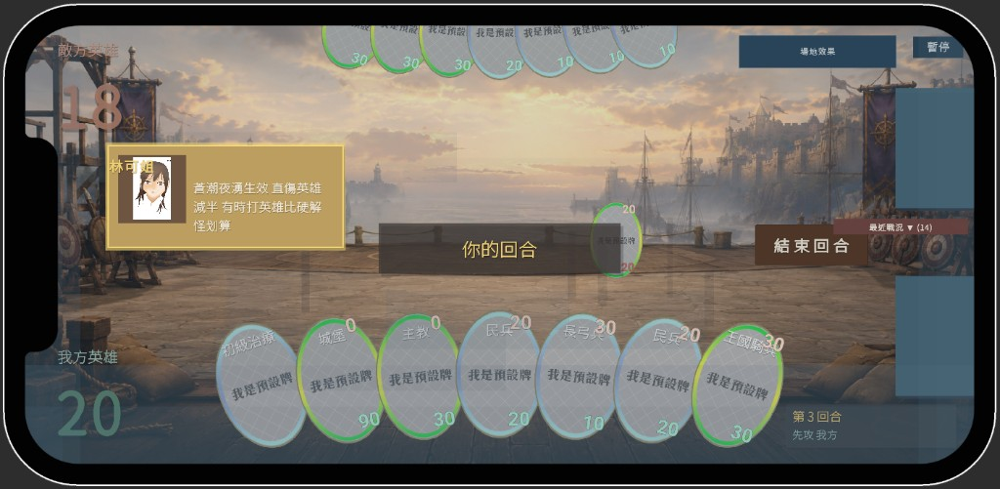
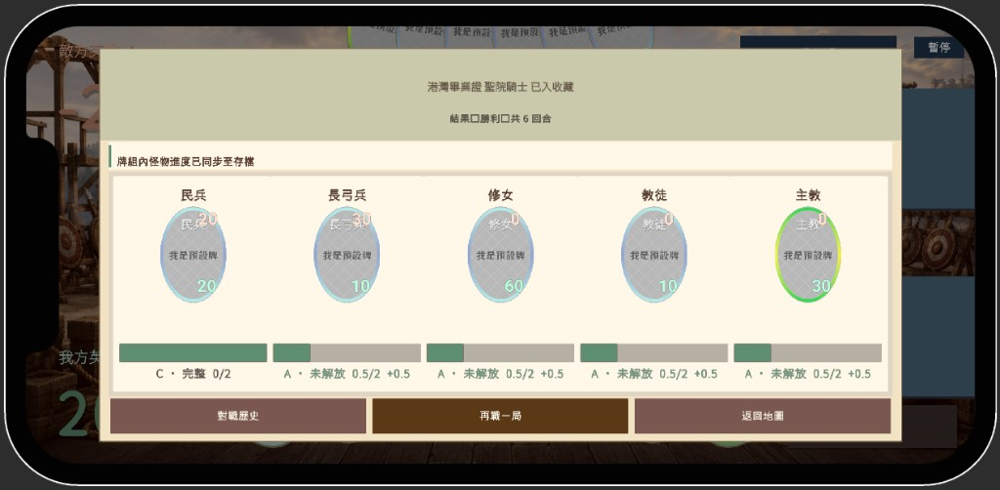
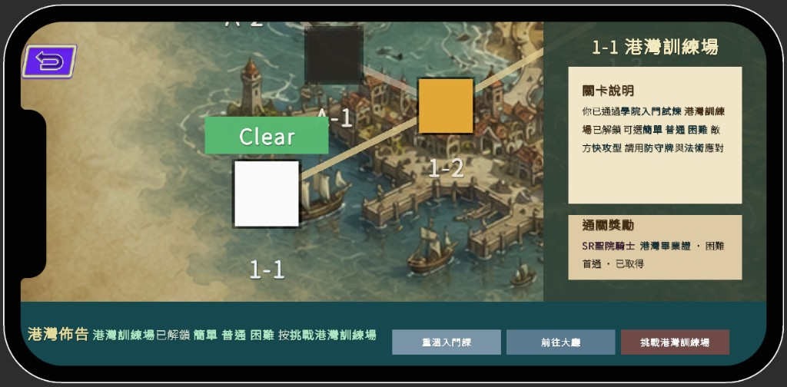

GAME PITCH · ONE-PAGE MINDSET

<h1 class="cover-title">遊戲企劃書</h1>

港灣訓練場 — 從學院入門到港灣實戰的回合制卡牌

提案版　·　版本 v1.2　·　日期：2026-06-07 Unity 專題　·　詳細規格請見《詳細設計文件》

不是在<strong>背規則</strong>，是在跟一個<strong>會教你的對手</strong>學打牌。 
第一場<strong>零技能門檻</strong>就能上手；越打越熟的卡會<strong>自己解鎖戰技</strong>； 而且你永遠<strong>看得懂對手下一步想做什麼</strong>。

# 決策摘要（給管理層）

> 本節用**非卡牌術語**說明：我們解決什麼問題、對公司有什麼幫助、如何證明目標受眾想玩。  
> **驗證狀態**：競品市場為二手歸納（已整理）；**本模式對目標受眾的意願，待試玩驗證**（計畫見下一章）。

## 我們在解決什麼問題

| 現象 | 對公司的意味 |
|------|-------------|
| 許多想玩「策略卡牌」的人，**第一場就放棄**（規則太多、輸了不知道為什麼） | 同一套關卡／美術，**有效受眾面偏窄**，獲客與留存成本高 |
| 熱門作品（Pokémon TCG Pocket、Balatro 等）證明：**敢讓新手進場** 比 **規則堆多深** 更影響能不能被接受 | 賽道存在，但**入門體驗**是勝負手，不是「再做更多卡」 |

## 我們的解法（一句話）

**像手機遊戲一樣好上手，像策略遊戲一樣有深度**：第一場只學出牌與攻擊；越玩越懂；對手下一步會主動告訴你——**不是在背規則，是在跟會教你的對手學**。

## 對公司的四項幫助（設計 → 商業語意）

| 設計做法（白話） | 對公司的價值 |
|----------------|-------------|
| 對手意圖可見 + 教練致死提醒 | **降低首局流失**：少「莫名其妙就輸了」的挫折離開 |
| 同一張牌越用越強、能力分階解鎖 | **拉長留存**：同一套卡有「還沒解鎖」動機，**不必狂做新卡** |
| 導師帶打入門關、第一場關掉複雜天氣 | **降低教學成本**：少說明書、少社群／客服教學 |
| 中盤天氣改變盤面 | **提高重玩價值**：同一關多局體驗不同，**內容性價比高** |

## 市場已驗證什麼 · 我們多做了什麼

| 市場現象（競品歸納） | 本作額外押注 |
|---------------------|-------------|
| 簡化首局（Pocket、Balatro）→ 敢進場 | ✓ 首局怪物**零異能**，只學 ATK/HP |
| 資訊透明（殺戮尖塔、月圓之夜）→ 願意多局 | ✓ 對手意圖量化 + 分階揭露戰技（先摘要、後全文） |
| Mastery 綁課金換皮（Snap 爭議）→ 玩家反感 | ✓ 熟練度綁**對戰行為**，非抽卡外觀 |
| **同構先例：同一張卡隨使用解鎖規則** | **幾乎無** → 若試玩通過，可作**差異化賣點** |

## 本作刻意不做（控制風險）

不做 PvP 即時對戰、不做首局塞滿異能、不做課金解鎖規則。**範圍**：單機 PVE 主線 + 教學，驗證「低門檻策略卡牌」賽道是否成立。

## Go / No-Go 判準（試玩後填結果）

| 判準 | 及格線 | 試玩結果（待填） |
|------|--------|------------------|
| 首局（1-1 教學戰）完成率 | ≥ 80% | — |
| 首局後「願意再玩一局」 | 7 點量表平均 ≥ 5 | — |
| 「知道剛才為什麼輸／贏」 | ≥ 70% 答是 | — |
| 願意為解鎖戰技多打幾局 | 多數同意 | — |

# 目標受眾驗證計畫

> **目的**：向決策者證明——不是「我們覺得新手會喜歡」，而是**可量測**目標受眾是否有意願玩、是否理解差異化。  
> 詳細競品對照與問卷設計背景見 `MARKET_ANALYSIS_FIVE_GAMES.md` §6。

## 1. 誰是目標受眾（可操作定義）

| 族群 | 操作定義 | 招募目標人數 |
|------|----------|-------------|
| **主軸** | 有玩手遊經驗；**沒玩過或玩不久**傳統卡牌對戰 | 15～30 人 |
| **對照 A** | 玩過 Pokémon TCG Pocket 或類似簡化卡牌 | 5～10 人 |
| **對照 B** | 玩過殺戮尖塔／月圓之夜等 Roguelike 卡牌 | 5～10 人 |

**排除**：現職卡牌對戰重度玩家（避免只測到核心粉絲）。

## 2. 試玩流程（用現有 Build，無需新功能）

| 階段 | 內容 | 量測重點 |
|------|------|----------|
| **前測** | 是否玩過卡牌對戰？最近常玩哪類手遊？ | 分群 |
| **Task 1** | 完整跑 1-1：Story progress → 劇情 → **入門教學戰** | 能否打完、是否中途放棄 |
| **Task 2** | 自選再玩 1 局（入門或一般難度） | 首局後意願 |
| **Task 3**（可選） | 同一張怪獸卡 **A / B / C** 三版卡面各看 30 秒 | 分階揭露 vs 一次給全文 |
| **後測** | 問卷 + 1 句原話（見下表） | KPI |

## 3. 核心 KPI 與及格線

| KPI | 怎麼量 | 及格線 | 結果欄 |
|-----|--------|--------|--------|
| **首局完成率** | 開始教學戰 → 打完比例 | ≥ 80% | 待填 |
| **再玩意願** | 「願不願意再玩一局？」1～7 | 平均 ≥ 5 | 待填 |
| **理解度** | 「你知道剛才為什麼輸／贏嗎？」 | ≥ 70% 是 | 待填 |
| **差異化認知** | 開放題：「和最一般卡牌遊戲最不一樣？」 | 多人提教學／看得懂對手／牌變強 | 待填 |
| **熟練度接受度** | 哪版卡面願意玩超過 10 場？A/B/C | A→B 或 B 優於一開始 C | 待填 |

## 4. 問卷題目（精簡版）

1. 哪版卡面你最願意**第一場**就玩？（A 無技能 / B 一行 / C 全文）  
2. 哪版你最願意**玩超過 10 場**後還用？  
3. 「鎖著不說清楚」會不會降低信任感？（1～7）  
4. 「一行摘要」是否足夠做決策？（1～7）  
5. 你是否願意為「解鎖完整說明」**多打幾局**？（1～7）  
6. 試玩後，這款和你玩過的遊戲最接近？（Pocket / 月圓 / Snap / StS / Balatro / 都不像）  
7. **開放題**：用一句話描述，這款「卡牌／對戰」給你的感覺。

## 5. 時程與交付物

| 項目 | 說明 |
|------|------|
| **試玩執行** | 集中 1～2 場，每場 5～8 人，單人約 25～40 分鐘 |
| **交付給決策者** | **一頁驗證結論**：N、完成率、平均分、2～3 句原話引用、Go/No-Go 建議 |
| **寫回企劃書** | 試玩後將本章「結果欄」與決策摘要 Go/No-Go 表填寫完成 → 升版 v1.3 |
| **現場紀錄表** | 每位受試者一張：[`Docs/試玩紀錄空白表.md`](Docs/試玩紀錄空白表.md)／[`Docs/試玩紀錄空白表.pdf`](Docs/試玩紀錄空白表.pdf) |

試玩完成前，對外簡報應誠實表述：「方向依競品歸納；**對目標受眾的意願，以 ○○ 日前試玩結果為準**。」

# 一、這是什麼遊戲

| 項目 | 內容 |
|------|------|
| **暫定名** | 港灣訓練場（大地圖章節名；完整商品名待定） |
| **類型** | 回合制卡牌對戰（單機 PVE 主線 + 教學引導） |
| **平台 / 引擎** | Android 橫向；Unity 2023.1.22f1（1920×1080 UI 基準） |
| **一句話比喻** | 「**寶可夢 TCG Pocket 的低門檻** × **殺戮尖塔的透明對局**」——但深度是**隨你與每張卡的默契長出來**，不是一開始就全文砸臉 |
| **目標受眾** | 對卡牌有興趣、卻被傳統 TCG 複雜規則勸退的**新手 / 輕策略玩家** |
| **核心情緒** | 看得懂 → 學得會 → 越打越強的**踏實成就感** |

玩家幻想（Player Fantasy）

你是<strong>學院新生</strong>。第一場對戰像被學姊帶打——規則少、對手透明、輸了也看得懂原因。 
隨著對同一張牌越打越熟，它會「<strong>長出</strong>」戰技；畢業後，大地圖上的<strong>港灣訓練場</strong>才是你真正要自己去的地方。 
現在：老師在學院裡帶你學會　→　之後：自主前往港灣實戰

> **設計命題**：傳統 TCG 的痛點是「首局就要同時讀懂出牌、場面互動、單卡異能、全域效果」。本作把學習曲線**攤平再往上疊**——先用最少規則打完一場，再用熟練度把深度慢慢交到你手上。

# 二、設計支柱（Design Pillars）

> 四根支柱是所有設計決策的判準；任何新功能若不服務其中一根，就先擱置。

01

看得懂的對手

敵方 AI 出牌意圖<strong>量化顯示</strong>，戰鬥教練做<strong>致死預警</strong>（含法術／火球模擬）。輸得明白、贏得有理。

02

越打越強的卡

怪物牌<strong>首局無技能</strong>，熟練度分階解鎖：<strong>A → B 一行 → C 完整</strong>。有「這張牌還有東西沒解放」的發現感。

03

教得會的第一場

林可姐帶<strong>入門教學戰</strong>：入門級<strong>關閉天氣</strong>，專注出牌與攻擊，搭配教練提示。

04

會變的盤面

<strong>天氣四系</strong>在中盤介入，用全域規則製造每局變數，避免一招打天下。

# 三、前 30 分鐘旅程 × 核心循環

## 3.1　新手怎麼走進遊戲

登入

選槽／建檔

→

大廳

落點・導航

→

Story progress

看 1-1 說明 港灣節點

→

Main Plot

林可姐劇情 舊校舍對戰館

→

入門教學戰

無天氣・教練 <strong>第一場可玩</strong>

→

結算

熟練度條 金幣・新卡

→

Buildbeck

看牌・組牌 回大廳

前 30 分鐘目標：玩家<strong>不靠說明書</strong>就能打完第一場，並帶走「我有一張牌在變強」的感覺。

## 3.2　長期怎麼留下來（Core Loop）

組牌

Buildbeck 30 張・多槽位

→

進關卡

Story progress 劇情帶入

→

對戰

出牌・攻擊 天氣・AI 意圖

→

結算

勝負・金幣 熟練度動畫

→

解鎖

戰技 B/C 新卡・開包

↺

| 時間尺度 | 玩家帶走什麼 |
|----------|-------------|
| **單局** | 勝負、金幣、一點熟練度進度、「這步我讀對了」 |
| **中期** | 某張卡升到 B、新卡入組、教學關通關 |
| **長期** | C 階完整戰技、港灣實地戰、圖鑑與牌組精通 |

# 四、一張卡的故事 × 一場對戰長怎樣

## 4.1　以「國王」為例：熟練度不是數字，是發現

| 階段 | 玩家看到什麼 | 玩家感受 | 約略時機 |
|------|-------------|----------|----------|
| **A** | 只有 ATK／HP，無技能區 | 「先學會出牌就好」 | 第 1 場 |
| **B** | 一行戰技摘要（且**已生效**） | 「原來這張牌還有招！」 | toward-B 進度滿 2.0（約 10 場勝） |
| **C** | 完整規則可查（圖鑑／長按） | 「我真正懂這張牌了」 | 普通以上難度 10 勝 |

> 御三家（國王／王后／民兵）預設 C，作為「完整規則長什麼樣」的參照；其餘怪物牌走 A→B→C 成長線。

## 4.2　一場對戰的五個瞬間

1 <strong>開場</strong>：骰子定先手，英雄 20 血、起手 5 張（手牌上限 7）。

2 <strong>鋪場</strong>：打出怪獸（單怪主場）、視條件施法（火球／治療／凝視）。

3 <strong>讀心</strong>：HUD 顯示回合與先攻；AI 意圖量化；教練<strong>致死預警</strong>。

4 <strong>變天</strong>：中盤天氣預報→生效（入門關關閉；一般對戰首回合不觸發）。

5 <strong>收尾</strong>：英雄歸零 → 結算浮層播<strong>熟練度條動畫</strong>。

# 五、獨特賣點、競品差異與非目標

## 5.1　我們和競品差在哪

| 軸線 | 寶可夢 Pocket | 殺戮尖塔 | Marvel Snap | **本作** |
|------|:---:|:---:|:---:|:---:|
| 新手低門檻 | ◎ | △ | ◎ | **◎ 首局零技能** |
| 資訊透明 / 可查 | ○ | ◎ | ○ | **◎ B→C 分階** |
| 個人成長解鎖**規則** | ✕ | ✕ | ✕（只換皮） | **◎ 熟練度 A/B/C** |
| 看得懂對手下一步 | ✕ | △ | △ | **◎ AI 意圖＋預警** |

USP 1
同一張卡<strong>先無技能、再分階解鎖</strong>——競品幾乎無同構先例。

USP 2
<strong>把對手攤開</strong>：意圖量化 + 致死預警，化解「莫名其妙就輸了」。

USP 3
<strong>第一場教得會</strong>：導師帶打 + 無天氣入門 + 教練提示。

## 5.2　本作刻意不做（Non-Goals）

| 不做什麼 | 為什麼 |
|----------|--------|
| **PvP 即時對戰** | 專題範圍 + 教學／PVE 主軸 |
| **首局塞滿關鍵字異能** | 學習曲線：先 ATK/HP，再熟練度解鎖 |
| **課金解鎖規則**（Snap 式 Mastery） | 熟練度綁<strong>對戰行為</strong>，非抽卡外觀 |
| **把全部規格寫進提案** | 詳規留《詳細設計文件》；提案只傳達概念 |

# 六、世界觀、內容藍圖與視覺證據

## 6.1　世界觀與角色

| 元素 | 設定 |
|------|------|
| **港灣訓練場** | 大地圖目標戰區——**學成後**自主前往 |
| **學院舊校舍對戰館** | **現在**上課處；林可姐帶入門試煉 |
| **林可姐** | 1-1 導師，已配音；領進門、記錄戰況 |

## 6.2　內容藍圖

1-1　學院入門

教學戰・無天氣 <strong>現行可玩</strong>

→

1-2　海牆巡邏

段考雙戰 宗教線・御三家

→

港灣實地戰

自主實戰 天氣全開

## 6.3　視覺證據（提案用截圖位）

<strong>支柱 01</strong>：林可姐教練提示（蒼潮夜湧戰術建議）+ 回合／先攻 HUD——「讀得懂對手、看得懂盤面」

<strong>支柱 02</strong>：勝利結算同步牌組怪物進度——民兵 C・完整、其餘 A 未解放 +0.5——「這張牌在變強」

<strong>支柱 03</strong>：1-1 港灣訓練場（Clear）+ 關卡說明／獎勵面板——「重溫入門課」可回教學、大地圖標目標戰區

| 面向 | 方向 |
|------|------|
| **美術** | DeckThumb 縮圖 / CardArt 立繪分工；UI 溫暖低出戲 Token |
| **音樂** | 大廳、Buildbeck、商店各場景 BGM；劇情語音與打字音效 |
| **體驗發想** | 不改規則的爽感與探索感（見《企劃發想》） |

# 七、風險與驗證

| 風險 | 我們怎麼應對 / 驗證 |
|------|---------------------|
| A 階段「無技能」太無聊 | 入門關短局 + 教練提示 + 法術／場地當「元件」 |
| B 只改文案、不生效 → 玩家反感 | **已定案**：B 即生效（見 `CARD_PROFICIENCY_GDD.md`） |
| 熟練度無競品同構先例 | 五款競品深讀 + 試玩問卷（A/B/C 三版卡面對照） |
| 提案變成無人讀的規格磚 | **分層**：本書傳達概念，《詳細設計文件》存紀錄 |

---

# 附錄　延伸文件索引

| 主題 | 文件 |
|------|------|
| **全部詳規** | 《詳細設計文件》（`詳細設計文件.pdf`） |
| 玩法與規則 | `GAMEPLAY_AND_RULES.md` |
| 卡牌熟練度 | `CARD_PROFICIENCY_GDD.md` |
| 敵方 AI / 難度 | `DIFFICULTY_AND_AI_DESIGN.md`、`ENEMY_AI_DECISION_TREE.md` |
| 戰鬥教練 | `HARBOR_COMBAT_COACH_GDD.md` |
| 世界觀 / 關卡 | `STORY_PROGRESS_WORLDVIEW.md`、`LEVEL_DESIGN_GDD.md` |
| 競品分析 | `MARKET_ANALYSIS_FIVE_GAMES.md` |

提案版 v1.2＝傳達層；v1.2 新增決策摘要與驗證計畫。試玩後填寫 KPI 結果欄並升版 v1.3。規格以原始 .md 與《詳細設計文件》為準。

